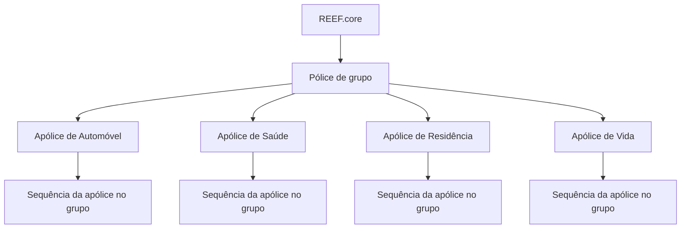

# Definição de Pólice de Grupo no REEF.core

## 1. Metadados do Documento
- **Arquivo de Origem:** `Não identificado no conteúdo bruto`
- **Tipo de Documento:** `Especificação Funcional`
- **Domínio / Sistema:** `REEF.core / MAPFRE — gestão de apólices de grupo`
- **Público-Alvo:** `Não identificado explicitamente`
- **Data/Versão Identificada:** `Não identificada`

---

## 2. Resumo Executivo & Contexto de Negócio

O documento descreve a funcionalidade de **pólice de grupo** no sistema **REEF.core**. Uma pólice de grupo é uma chave que permite agrupar várias apólices, inclusive apólices de ramos distintos ou do mesmo ramo de negócio, sob um identificador comum.

O agrupamento pode representar diferentes cenários de negócio. Um exemplo é uma pessoa física com apólices de automóvel, residência, saúde e vida na MAPFRE, todas relacionadas à mesma pólice de grupo. Outro exemplo é uma pessoa jurídica que possui uma frota de automóveis, na qual cada veículo corresponde a uma apólice de automóvel agrupada sob uma única pólice de grupo.

A definição da pólice de grupo possui propriedades de identificação, descrição, obrigatoriedade de contrato, sequência e situação operacional. A sequência identifica a posição de cada apólice dentro do agrupamento e possui semântica semelhante ao número de risco dentro de uma apólice.

O documento também diferencia propriedades de definição das propriedades de ramo. Entre as propriedades de ramo estão contrato, tipo de pólice de grupo, classificação como coletiva ou grupo, indicação de apólices V.I.P., possibilidade de mais de um risco e vencimento unificado.

A criação do número de pólice de grupo é manual. O número não segue uma estrutura predefinida, diferentemente do que pode ocorrer com números de apólice ou de sinistro.

---

## 3. Arquitetura, Componentes & Tecnologias Envolvidas

O documento cita o sistema **REEF.core** como responsável por permitir o agrupamento de apólices. Não há detalhamento de microsserviços, APIs, contratos HTTP, bancos de dados, tecnologias de implementação, ambientes ou mecanismos de persistência.

### Componentes e conceitos identificados

| Componente / Conceito | Papel descrito |
| :--- | :--- |
| REEF.core | Sistema que permite agrupar várias apólices sob uma chave denominada pólice de grupo. |
| Pólice de grupo | Chave identificadora que reúne múltiplas apólices. |
| Pólice individual | Apólice associada a uma pólice de grupo. |
| Ramo | Classificação da apólice, como Automóvel, Saúde ou Residência. |
| Contrato | Elemento cuja existência pode ser exigida quando uma apólice é emitida usando determinada pólice de grupo. |
| Sequência | Identificador da posição de uma apólice dentro de uma pólice de grupo. |
| Risco | Elemento de uma apólice que possui identificador próprio, usado como analogia para explicar a sequência da pólice de grupo. |



> **Nota de Análise:** O documento descreve relações funcionais entre REEF.core, pólices de grupo, apólices, ramos, contratos e riscos, mas não detalha arquitetura de software, integrações, APIs, fluxos técnicos de persistência ou contratos JSON.

---

## 4. Regras de Negócio, Especificações Funcionais & Processos

### Agrupamento de apólices

1. O REEF.core permite agrupar várias apólices sob uma chave.
2. Essa chave é denominada **pólice de grupo**.
3. Uma pólice de grupo pode agrupar:
   - Apólices de diferentes tipos de negócio.
   - Apólices do mesmo tipo de negócio.
4. Um agrupamento de diferentes ramos pode representar, por exemplo, uma pessoa física com apólices de automóvel, residência, saúde e vida.
5. Um agrupamento de apólices do mesmo ramo pode representar, por exemplo, uma pessoa jurídica com vários automóveis, em que cada automóvel é uma apólice.

### Identificação da pólice de grupo

1. O número da pólice de grupo é o identificador da pólice de grupo.
2. O número da pólice de grupo aceita qualquer valor.
3. A numeração de uma pólice de grupo não atende a uma estrutura predefinida.
4. O número da pólice de grupo não é criado automaticamente.
5. A criação do número da pólice de grupo é realizada manualmente.

### Sequência de apólices dentro do grupo

1. Toda apólice associada a uma pólice de grupo possui um valor de sequência.
2. A sequência informa o número de apólices independentes que fazem parte da mesma pólice de grupo.
3. A sequência possui sentido equivalente ao número de risco em uma apólice.
4. Cada risco dentro de uma apólice possui identificador próprio, denominado número de risco.
5. Cada apólice participante de uma pólice de grupo também possui identificador próprio, representado pela sequência.
6. A propriedade de sequência informa qual é o último identificador associado à pólice de grupo.

### Operação e inabilitação

1. A propriedade **Inabilitada** informa se a pólice de grupo está operativa no sistema.
2. Quando uma pólice de grupo não está operativa, ela não pode ser atribuída a uma nova apólice.

### Contrato

1. A propriedade **Obriga a existência de contrato** informa se o uso da pólice de grupo obrigará o uso de um contrato durante a emissão de uma apólice.
2. A seção de propriedades de ramo cita a propriedade **Contrato**.

### Classificação de tipo de pólice de grupo

1. O documento apresenta o campo **Tipo de pólice de grupo**.
2. O conteúdo informa os valores:
   - `g = grupo`
   - `c = coletivo`
3. O documento também apresenta as classificações **Coletiva** e **Grupo**.
4. O conteúdo cita **Pólices V.I.P.**, sem fornecer definição funcional adicional.
5. O conteúdo informa que é permitido que as apólices tenham mais de um risco.
6. O conteúdo cita **Vencimento unificado** como vencimento da apólice, indicando que o vencimento muda a cada renovação.

---

## 5. Tabelas de Parâmetros, Ambientes e Estruturas de Dados

### Propriedades de definição

| Item / Parâmetro | Descrição / Função | Tipo / Valores / Formato | Ambiente / Observações |
| :--- | :--- | :--- | :--- |
| Nº de pólice de grupo | Identificador da pólice de grupo. | Aceita qualquer valor. | Não possui estrutura de numeração predefinida; criação manual. |
| Descrição | Nome associado à pólice de grupo. | Texto. | Não há formato ou tamanho especificado. |
| Descrição curta | Nome curto associado à pólice de grupo. | Texto. | Não há formato ou tamanho especificado. |
| Obriga a existência de contrato | Indica se o uso da pólice de grupo obriga o uso de contrato ao emitir uma apólice. | Indicador não detalhado no documento. | Refere-se à emissão de apólice. |
| Sequência | Indica a posição ou identificador de cada apólice dentro da pólice de grupo. | Valor sequencial. | Semântica semelhante ao número de risco de uma apólice. |
| Inabilitada | Especifica se a pólice de grupo está operativa no sistema. | Indicador não detalhado no documento. | Quando não operativa, não pode ser atribuída a nova apólice. |

### Propriedades de ramo

| Item / Parâmetro | Descrição / Função | Tipo / Valores / Formato | Ambiente / Observações |
| :--- | :--- | :--- | :--- |
| Contrato | Propriedade de ramo denominada contrato. | Não detalhado. | Relacionada à obrigatoriedade de contrato durante emissão. |
| Tipo de pólice de grupo | Classifica a pólice de grupo como grupo ou coletivo. | `g = grupo`; `c = coletivo`. | O documento também apresenta os termos Coletiva e Grupo. |
| Pólices V.I.P. | Propriedade ou classificação citada no documento. | Não detalhado. | Não há explicação adicional. |
| Mais de um risco | Indica que as apólices podem possuir mais de um risco. | Permitido. | Não há critérios adicionais. |
| Vencimento unificado | Vencimento da apólice. | Muda a cada renovação. | Não há detalhamento de regras de sincronização. |

### Exemplo de riscos dentro de apólices

| Nº de pólice | Ramo | Nº de risco | Risco |
| :--- | :--- | :--- | :--- |
| 1111111111111 | Automóvel | 1 | Volkswagen Golf |
| 1111111111111 | Automóvel | 2 | Seat Toledo |
| 1111111111111 | Automóvel | 3 | Audi A4 |
| 2222222222222 | Saúde | 1 | María Martín Gómez |
| 3333333333333 | Residência | 1 | Calle Oceanía, 24 |

### Exemplo de apólices associadas a uma pólice de grupo

| Pólice de grupo | Sequência | Nº de pólice | Ramo |
| :--- | :--- | :--- | :--- |
| AAAAAAAAAAAAA | 1 | 1111111111111 | Automóvel |
| AAAAAAAAAAAAA | 2 | 2222222222222 | Saúde |
| AAAAAAAAAAAAA | 3 | 3333333333333 | Residência |

---

## 6. Bateria de Perguntas & Respostas para RAG (FAQ Sintético)

### P1: O que é uma pólice de grupo no REEF.core?
**R:** Uma pólice de grupo é uma chave utilizada no REEF.core para agrupar várias apólices. As apólices agrupadas podem ser de diferentes tipos de negócio ou do mesmo tipo de negócio.

### P2: Uma pólice de grupo pode reunir apólices de ramos diferentes?
**R:** Sim. O documento apresenta como exemplo uma pessoa física com apólices de automóvel, residência, saúde e vida na MAPFRE, todas associadas à mesma pólice de grupo.

### P3: Qual exemplo representa uma pólice de grupo formada por apólices do mesmo ramo?
**R:** O documento apresenta o caso de uma pessoa jurídica com uma frota de automóveis. Cada automóvel corresponde a uma apólice de automóvel, e todas as apólices podem ser associadas à mesma pólice de grupo.

### P4: O número da pólice de grupo possui estrutura predefinida?
**R:** Não. O documento afirma que a numeração de uma pólice de grupo não atende a uma estrutura, diferentemente do que pode ocorrer com o número de apólice e o número de sinistro.

### P5: O REEF.core cria automaticamente o número da pólice de grupo?
**R:** Não. A criação do número da pólice de grupo é realizada manualmente na situação descrita pelo documento.

### P6: O que significa a propriedade Sequência de uma pólice de grupo?
**R:** A sequência identifica cada apólice associada a uma pólice de grupo e indica o número de apólices independentes que formam o agrupamento. A semântica é equivalente ao número de risco de uma apólice.

### P7: Como a sequência de uma pólice de grupo se relaciona ao número de risco?
**R:** Em uma apólice com vários riscos, cada risco possui um identificador, chamado número de risco. Em uma pólice de grupo, cada apólice integrante também recebe um identificador, chamado sequência. A propriedade de sequência informa qual é o último identificador associado à pólice de grupo.

### P8: O que acontece quando uma pólice de grupo está inabilitada?
**R:** Quando uma pólice de grupo não está operativa no sistema, ela não poderá ser atribuída a uma nova apólice.

### P9: Para que serve a propriedade “Obriga a existência de contrato”?
**R:** A propriedade informa se o uso de determinada pólice de grupo obrigará o uso de um contrato durante a emissão de uma apólice.

### P10: Quais valores são citados para o tipo de pólice de grupo?
**R:** O documento indica `g` para grupo e `c` para coletivo. Também apresenta as classificações textuais Grupo e Coletiva.

### P11: Uma apólice pertencente a uma pólice de grupo pode ter mais de um risco?
**R:** Sim. O documento informa que é permitido que as apólices tenham mais de um risco.

### P12: Como funciona o vencimento unificado?
**R:** O documento descreve vencimento unificado como o vencimento da apólice e informa que esse vencimento muda a cada renovação. Não há detalhamento adicional sobre regras de cálculo, sincronização ou exceções.

---

## 7. Glossário de Termos, Siglas & Conceitos-Chave

- **REEF.core:** Sistema citado como responsável por permitir o agrupamento de várias apólices sob uma pólice de grupo.
- **Pólice de grupo:** Chave que agrupa várias apólices, de um mesmo tipo de negócio ou de tipos distintos.
- **Apólice:** Entidade individual associável a uma pólice de grupo.
- **Ramo:** Classificação da apólice, como Automóvel, Saúde ou Residência.
- **Risco:** Elemento identificado dentro de uma apólice; o documento usa o número de risco como analogia para a sequência de apólices em uma pólice de grupo.
- **Sequência:** Identificador de uma apólice dentro de uma pólice de grupo.
- **Contrato:** Elemento que pode ser obrigatório na emissão de uma apólice conforme a configuração da pólice de grupo.
- **Grupo (`g`):** Valor citado para o tipo de pólice de grupo.
- **Coletivo (`c`):** Valor citado para o tipo de pólice de grupo.
- **V.I.P.:** Termo citado em “Pólices V.I.P.”, sem expansão ou definição no documento.
- **Vencimento unificado:** Vencimento da apólice que muda a cada renovação, conforme descrito.

---

## 8. Notas Críticas, Riscos & Limitações

- O documento não informa APIs, métodos HTTP, contratos JSON, bancos de dados, serviços, integrações, tecnologias de implementação ou URLs de ambientes.
- O documento não detalha validações, tamanhos, formatos ou restrições de entrada para número, descrição e descrição curta da pólice de grupo.
- O documento afirma que o número da pólice de grupo aceita qualquer valor, mas não especifica regras de unicidade, duplicidade ou validação.
- A criação manual do número da pólice de grupo pode exigir controles operacionais adicionais, porém tais controles não são descritos no conteúdo.
- O documento cita **Pólices V.I.P.**, mas não apresenta definição, regras de elegibilidade ou impacto funcional.
- O documento cita vencimento unificado, mas não detalha como esse vencimento é calculado, propagado ou tratado em casos de renovação.
- **Nota de Análise:** O documento lista propriedades de ramo, porém não detalha quais ramos suportam cada configuração, nem apresenta combinações permitidas entre tipo de pólice de grupo, contrato, riscos e vencimento unificado.

---

## 9. Conteúdo Bruto Estruturado (Referência Fiel)

```text
--- [PÁGINA 1 DE 4] ---

DEFINICIÓN de póliza grupo
Objetivo
Reef.core permite agrupar varias pólizas (es decir, cualquier póliza de cualquier tipo de negocio o del
mismo tipo de negocio) bajo una clave. A esta clave se la denomina póliza grupo.
Un ejemplo de agrupación de pólizas de distintos tipos de negocio a una póliza grupo podría ser:
Póliza
grupo
Póliza
de
automóvil
Póliza
de
hogar
Póliza
de
salud
Póliza
de
vida
El gráfico anterior podría corresponder a un cliente que es una persona física con distintas pólizas en
MAPFRE y todas ellas se encuentran bajo una póliza grupo.
Otro ejemplo podría ser el que se muestra a continuación:
 / 
 RS
Inicio Soluciones APIs Documentación Zeus
ES

--- [PÁGINA 2 DE 4] ---

Póliza
grupo
Póliza
de
automóvil
Póliza
de
automóvil
Póliza
de
automóvil
Póliza
de
automóvil
Este ejemplo podría corresponder a un cliente que es una persona jurídica con una flota de
automóviles (cada automóvil es una póliza) se encuentran bajo una póliza grupo.
Propiedades de definición
Propiedades de ramo
Propiedades de definición
Nº de póliza grupo
Identificador de la póliza grupo. Acepta cualquier valor.
Descripción
Nombre que se va a asociar a la póliza grupo.
Descripción corta
Nombre corto que se asociará a la póliza grupo.
Obliga a existencia de contrato
Indica si el uso de esta póliza grupo obligará al uso de un [contrato][Nolink] cuando se emita una
póliza.
Secuencia
Toda póliza que es asociada a una póliza grupo dispone de un valor que indica el número de pólizas
independientes que forman parte de una póliza grupo. El sentido es el mismo de un riesgo en una
póliza. Cada riesgo tiene un identificador (nº de riesgo) y en este caso cada póliza que forma parte
de una póliza grupo también tiene un identificador. Esta propiedad informa de cual es el último
identificador asociado a una póliza grupo.
Como ejemplo, cuando una póliza tiene varios riesgos, cada riesgo tiene un identificador (nº de
riesgo). Esto quiere decir que una póliza con varios riesgos atiende a:

--- [PÁGINA 3 DE 4] ---

Nº de póliza Ramo Nº de riesgo Riesgo
1111111111111 Automóvil 1 Volkswagen Golf
1111111111111 Automóvil 2 Seat Toledo
1111111111111 Automóvil 3 Audi A4
2222222222222 Salud 1 María Martín Gómez
3333333333333 Hogar 1 Calle Oceanía, 24
Si todas las pólizas anteriores se asocian a una misma póliza grupo con número
'AAAAAAAAAAAAA', quedaría de la forma que se muestra a continuación. Nótese que no se muestra
la información desglosada por riesgo ya que carece de sentido para el ejemplo.
Póliza grupo Secuencia Nº de póliza Ramo
AAAAAAAAAAAAA 1 1111111111111 Automóvil
AAAAAAAAAAAAA 2 2222222222222 Salud
AAAAAAAAAAAAA 3 3333333333333 Hogar
Inhabilitada
Especifica si la póliza grupo se encuentra operativa o no en el sistema. Cuando se encuentra no
operativa no podrá ser asignada a una nueva póliza.
Propiedades de ramo
Contrato
contrato
Tipo de póliza grupo
tipo de poliza g= grupo, c= colectivo
Colectiva
Grupo

--- [PÁGINA 4 DE 4] ---

Pólizas V.I.P.
Colectiva
Grupo
Pólizas V.I.P.
Más de un riesgo
se permite que las polizas tengan mas de un riesgo
Vencimiento unificado
vencimiento de la poliza (cambia cada renovación)
Preguntas frecuentes
¿Existe una estructura del número de póliza grupo como ocurren con el número de póliza y el
número de siniestro?
No, la numeración de una póliza grupo no atiende a una estructura.
¿Se puede crear un número de póliza grupo de forma automática?
No, la creación de un número de póliza grupo en la actualidad se realiza de forma manual.
```
