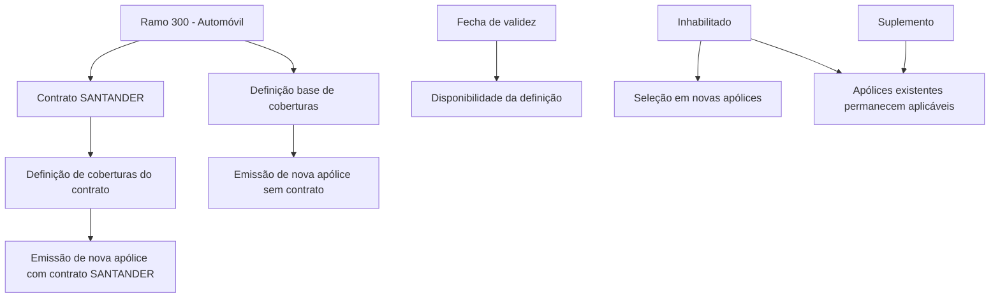

# Definição de Contrato para Alteração de Coberturas de Ramos de Seguro

## 1. Metadados do Documento
- **Arquivo de Origem:** Não identificado no conteúdo fornecido
- **Tipo de Documento:** Especificação Funcional
- **Domínio / Sistema:** Definição de contratos, ramos, coberturas e emissão de apólices
- **Público-Alvo:** Negócio, analistas funcionais e operação de seguros
- **Data/Versão Identificada:** Não identificada

---

## 2. Resumo Executivo & Contexto de Negócio

O documento descreve o conceito de **contrato** como um mecanismo para alterar conceitos de negócio previamente definidos em um **ramo** de seguro. Essas alterações não precisam afetar todos os conceitos do ramo; o exemplo apresentado concentra-se especificamente na disponibilidade de coberturas durante a emissão de novas apólices.

O ramo utilizado como exemplo é o **300 - Automóvil**. No nível do ramo, determinadas coberturas são apresentadas com um estado de inabilitação. O documento afirma que uma cobertura inabilitada não é oferecida na emissão de uma nova apólice.

Um contrato pode possuir uma definição própria para as coberturas do ramo afetado. Dessa forma, o documento apresenta o contrato **SANTANDER** como uma definição associada ao ramo 300 - Automóvil, com regras de disponibilidade de cobertura potencialmente distintas das regras sem contrato.

A definição possui propriedades para identificação do contrato, associação ao ramo, vigência e inabilitação. A data de validade permite manter histórico das mudanças feitas na definição. A inabilitação impede a seleção em novas apólices, mas não altera automaticamente apólices existentes: a cobertura continua sendo aplicada até que um suplemento a modifique.

---

## 3. Arquitetura, Componentes & Tecnologias Envolvidas

O conteúdo não descreve arquitetura de software, microsserviços, APIs, tecnologias, ambientes técnicos, bancos de dados ou integrações. O documento descreve um modelo funcional formado pelos seguintes elementos:

- **Ramo:** definição base à qual a regra se aplica.
- **Contrato:** identificador de uma definição que altera conceitos de negócio de um ramo.
- **Cobertura:** conceito de negócio usado como exemplo de alteração.
- **Apólice:** entidade emitida com ou sem contrato.
- **Suplemento:** mecanismo mencionado para alterar uma apólice existente.
- **Data de validade:** atributo que controla a disponibilidade temporal de uma definição.
- **Inabilitado:** estado que controla a inclusão de uma definição em novas apólices.



> **Nota de Análise:** O documento não detalha a implementação técnica das regras, nem especifica telas, APIs, métodos HTTP, contratos JSON, banco de dados ou mecanismos de persistência.

---

## 4. Regras de Negócio, Especificações Funcionais & Processos

### 4.1 Conceito de contrato

- Um contrato permite realizar alterações em um ramo previamente definido.
- As alterações realizadas por um contrato afetam um número de conceitos de negócio, mas não necessariamente todos os conceitos do ramo.
- Coberturas são apresentadas como exemplo de conceito de negócio que pode ser alterado por uma definição de contrato.
- A definição de um ramo estabelece quais coberturas são oferecidas ou deixam de ser oferecidas.

### 4.2 Disponibilidade de coberturas

- O documento relaciona o estado de inabilitação de uma cobertura à oferta dessa cobertura na emissão de novas apólices.
- Conforme o texto, uma cobertura inabilitada não é oferecida durante a emissão de uma nova apólice.
- Uma definição de contrato pode alterar a disponibilidade de cobertura definida no ramo.
- No exemplo narrativo, a cobertura **Accidentes** não seria oferecida na emissão sem contrato e seria oferecida na emissão com o contrato **SANTANDER**.

### 4.3 Vigência da definição

- A propriedade **Fecha de validez** determina quando uma definição estará disponível para uso.
- O uso correto da data de validade permite manter um registro histórico das alterações feitas na definição.
- O documento não informa o formato da data, regras de precedência entre definições, critérios de expiração ou comportamento em sobreposição de períodos de validade.

### 4.4 Regra de inabilitação

- A propriedade **Inhabilitado** determina se uma definição está ativa ou se não pode mais ser incluída em uma nova apólice.
- Quando uma definição é inabilitada, ela não pode ser selecionada para uma nova apólice.
- A inabilitação não remove automaticamente a aplicação da definição em apólices existentes.
- Apólices existentes que já possuam a definição continuam aplicando-a até que um suplemento seja utilizado para alterá-las.
- Quando um suplemento altera uma apólice e a definição já está inabilitada, essa definição não poderá mais ser selecionada.

### 4.5 Processo funcional de emissão e alteração

1. Uma definição é associada a um ramo.
2. A definição de ramo estabelece o estado das coberturas.
3. Uma nova apólice pode ser emitida sem contrato ou com um contrato associado.
4. Na emissão sem contrato, aplica-se a definição do ramo.
5. Na emissão com contrato, aplica-se a definição específica do contrato para os conceitos de negócio afetados.
6. A disponibilidade de uma definição depende da sua data de validade.
7. Uma definição inabilitada deixa de estar disponível para novas apólices.
8. Uma apólice existente permanece com sua definição até ocorrer alteração por suplemento.
9. Após um suplemento, uma definição inabilitada não pode ser novamente selecionada.

### 4.6 Exemplo funcional apresentado

O documento utiliza as seguintes coberturas no ramo **300 - Automóvil**:

- **100 Responsabilidad civil**
- **200 Daños propios**
- **300 Accidentes**

O documento compara o comportamento de emissão de uma nova apólice:

- **Sem contrato:** o texto afirma que a cobertura de Accidentes não é oferecida.
- **Com contrato SANTANDER:** o texto afirma que a cobertura de Accidentes é oferecida.

> **Nota de Análise:** Existe uma inconsistência entre as tabelas reproduzidas e a explicação textual do exemplo. As tabelas exibem valores `SI` e `NO` para a coluna **INHABILITADA**, enquanto o texto interpreta esses valores de forma aparentemente inversa em determinados trechos. O documento não esclarece formalmente se `SI` significa “inabilitada” ou “habilitada”; a interpretação funcional acima reproduz a narrativa literal do documento.

---

## 5. Tabelas de Parâmetros, Ambientes e Estruturas de Dados

| Item / Parâmetro | Descrição / Função | Tipo / Valores / Formato | Ambiente / Observações |
| :--- | :--- | :--- | :--- |
| Contrato | Chave pela qual a definição de contrato será identificada. | Não detalhado | Propriedade de definição |
| Nombre | Descrição pela qual a definição será identificada. | Não detalhado | Propriedade de definição |
| Ramo | Aponta para o ramo afetado pela definição. | Exemplo: `300 - Automóvil` | Propriedade de ramo |
| Fecha de validez | Determina quando a definição estará disponível para utilização. | Data; formato não detalhado | Permite histórico de alterações |
| Inhabilitado | Determina se a definição está ativa ou se não pode mais ser incluída em nova apólice. | Estado lógico; valores formais não detalhados | Não remove automaticamente a aplicação em apólices existentes |
| Suplemento | Mecanismo citado para alterar uma apólice existente. | Não detalhado | Após alteração, uma definição inabilitada não pode ser selecionada |
| Cobertura 100 | Responsabilidad civil. | Código `100` | Apresentada no ramo 300 e no contrato SANTANDER |
| Cobertura 200 | Daños propios. | Código `200` | Apresentada no ramo 300 e no contrato SANTANDER |
| Cobertura 300 | Accidentes. | Código `300` | Exemplo central de alteração entre ramo e contrato |
| Ramo de exemplo | Automóvil. | Código `300` | Associado à definição sem contrato e ao contrato SANTANDER |
| Contrato de exemplo | SANTANDER. | Nome do contrato | Associado ao ramo `300 - Automóvil` |

### Estados apresentados para as coberturas

| Cobertura | Código | Sem contrato — valor exibido em “Inhabilitada” | Contrato SANTANDER — valor exibido em “Inhabilitada” | Observação |
| :--- | :--- | :--- | :--- | :--- |
| Responsabilidad civil | 100 | `NO` | `NO` | O documento não descreve impacto adicional. |
| Daños propios | 200 | `NO` | `NO` | O documento não descreve impacto adicional. |
| Accidentes | 300 | `SI` | `NO` | O texto narrativo afirma que sem contrato não é oferecida e, com SANTANDER, é oferecida. |

> **Nota de Análise:** A semântica dos valores `SI` e `NO` na coluna “Inhabilitada” deve ser validada com a fonte funcional responsável, pois a narrativa e a tabela podem ser interpretadas de maneira conflitante.

---

## 6. Bateria de Perguntas & Respostas para RAG (FAQ Sintético)

### P1: O que é um contrato no contexto de definição de ramos de seguro?
**R:** Um contrato é um mecanismo que permite alterar conceitos de negócio já definidos em um ramo. Essas alterações não precisam afetar todos os conceitos do ramo. O documento utiliza as coberturas como exemplo de conceito que pode receber uma definição específica por contrato.

### P2: Um contrato pode alterar todas as regras de um ramo?
**R:** O documento afirma que as alterações feitas por contrato afetam um número de conceitos de negócio, mas não necessariamente todos os conceitos definidos no ramo. Não há detalhamento sobre quais conceitos, além das coberturas exemplificadas, podem ser alterados.

### P3: Qual ramo é usado como exemplo no documento?
**R:** O ramo usado como exemplo é o **300 - Automóvil**. Esse ramo possui coberturas como Responsabilidad civil, Daños propios e Accidentes.

### P4: Quais coberturas são citadas para o ramo 300 - Automóvil?
**R:** O documento cita três coberturas: **100 Responsabilidad civil**, **200 Daños propios** e **300 Accidentes**. Essas coberturas aparecem tanto na definição sem contrato quanto na definição do contrato SANTANDER.

### P5: O que a data de validade controla em uma definição?
**R:** A propriedade **Fecha de validez** determina quando uma definição estará disponível para ser utilizada. Segundo o documento, o uso correto dessa propriedade permite manter um registro histórico das alterações efetuadas na definição.

### P6: O que acontece quando uma definição é inabilitada?
**R:** Uma definição inabilitada não pode ser incluída em uma nova apólice. Entretanto, as apólices existentes que já possuam essa definição continuam aplicando-a até que sejam modificadas por meio de um suplemento.

### P7: Uma cobertura inabilitada é removida das apólices existentes?
**R:** Não. O documento afirma que, mesmo quando uma definição é inabilitada, todas as apólices que já dispõem dela continuam aplicando-a. A alteração ocorre somente quando um suplemento modifica a apólice.

### P8: O que ocorre se um suplemento alterar uma apólice que utilizava uma definição inabilitada?
**R:** No momento da alteração por suplemento, a definição que já estiver inabilitada não poderá mais ser selecionada. O documento não detalha qual definição alternativa deve ser aplicada nesse caso.

### P9: Como o contrato SANTANDER afeta a cobertura Accidentes segundo a narrativa?
**R:** A narrativa do documento afirma que, em uma nova apólice sem contrato, a cobertura Accidentes não é oferecida. Em uma nova apólice com o contrato SANTANDER, a mesma cobertura Accidentes é oferecida.

### P10: Há consistência entre a tabela de inabilitação e a explicação sobre a cobertura Accidentes?
**R:** Não de forma inequívoca. As tabelas apresentam `SI` para Accidentes sem contrato e `NO` para Accidentes no contrato SANTANDER na coluna “Inhabilitada”, enquanto a narrativa afirma que a cobertura não é oferecida sem contrato e é oferecida com SANTANDER. O documento não define explicitamente a semântica operacional de `SI` e `NO`.

### P11: O documento define APIs, URLs, métodos HTTP ou contratos de integração?
**R:** Não. O conteúdo fornecido é funcional e não apresenta APIs, métodos HTTP, URLs, contratos JSON, servidores, tecnologias de implementação ou detalhes de integração.

### P12: Qual é a função da propriedade Nombre?
**R:** A propriedade **Nombre** é descrita como a descrição pela qual a definição será identificada. O documento não informa formato, tamanho, obrigatoriedade ou regras de unicidade para esse campo.

---

## 7. Glossário de Termos, Siglas & Conceitos-Chave

- **Apólice:** Entidade de seguro mencionada no contexto de emissão de novas apólices e manutenção de apólices existentes.
- **Cobertura:** Conceito de negócio de um ramo de seguro que pode ser oferecido, não oferecido ou alterado por uma definição de contrato.
- **Contrato:** Definição identificada por uma chave, associada a um ramo, capaz de alterar determinados conceitos de negócio.
- **Fecha de validez:** Propriedade que determina quando uma definição está disponível para uso.
- **Inhabilitado:** Estado que indica que uma definição não pode mais ser incluída em uma nova apólice.
- **Ramo:** Estrutura de negócio à qual uma definição e suas coberturas estão associadas.
- **Ramo 300 - Automóvil:** Ramo usado como exemplo no documento.
- **SANTANDER:** Nome do contrato usado como exemplo de definição associada ao ramo 300 - Automóvil.
- **Suplemento:** Mecanismo mencionado para modificar uma apólice existente.

---

## 8. Notas Críticas, Riscos & Limitações

- O documento não identifica o nome do arquivo de origem, autoria, data, versão ou sistema responsável.
- O documento não detalha a implementação técnica de contratos, ramos, coberturas, apólices ou suplementos.
- Não há definição de APIs, serviços, persistência, interfaces de usuário, integrações, perfis de acesso ou ambientes.
- Não são fornecidos formatos, regras de obrigatoriedade, validações ou valores permitidos para as propriedades Contrato, Nombre, Ramo, Fecha de validez e Inhabilitado.
- A semântica dos valores `SI` e `NO` na coluna **INHABILITADA** não está explicitamente definida.
- Existe aparente contradição entre a tabela de coberturas e a narrativa sobre a oferta da cobertura **Accidentes** com e sem o contrato SANTANDER.
- O documento não esclarece prioridade entre a definição do ramo e a definição do contrato quando existirem regras conflitantes.
- O documento não descreve o comportamento operacional quando uma apólice é alterada por suplemento e a definição anteriormente utilizada está inabilitada.

---

## 9. Conteúdo Bruto Estruturado (Referência Fiel)

```text
--- [PÁGINA 1 DE 3] ---

DEFINICIÓN de contrato
Objetivo
Bajo este concepto se permite realizar alteraciones de un ramo ya definido. Estas alteraciones
afectan a un número de conceptos de negocio (no a todos). A continuación se muestra un ejemplo:
Uno de los conceptos de negocio que se define en un ramo son las coberturas. En la definición se
establece cuales se van a ofrecer o ya no se ofrecen más. A continuación (como ejemplo), se
muestra las coberturas de un ramo y su estado (habilitada o inhabilitada):
RAMO CONTRATO
300 - Automóvil SIN CONTRATO
COBERTURA INHABILITADA
100 Responsabilidad civil NO
200 Daños propios NO
300 Accidentes SI
 / 
 RS
Inicio Soluciones APIs Documentación Zeus
ES


--- [PÁGINA 2 DE 3] ---

Como se puede observar, la cobertura Accidentes se encuentra inhabilitada lo que quiere decir que
NO se ofrece en la emisión de una nueva póliza.
Cuando se hace referencia a que un contrato permite alterar los conceptos de negocio definidos y,
atendiendo a este ejemplo, es posible que un contrato SI ofrezca la cobertura de Accidentes aunque
el ramo NO la ofrezca. En este ejemplo, se muestra la definición de las coberturas para un contrato:
RAMO CONTRATO
300 - Automóvil SANTANDER
COBERTURA INHABILITADA
100 Responsabilidad civil NO
200 Daños propios NO
300 Accidentes NO
El resumen de la definición sería:
RAMO
300 - Automóvil
COBERTURA INHABILITADA (SIN
CONTRATO)
INHABILITADA (CONTRATO
SANTANDER)
100 Responsabilidad
civil
NO NO
200 Daños propios NO NO
300 Accidentes SI NO
En este ejemplo, cuando se emite una nueva póliza SIN contrato, la cobertura de Accidentes NO se
ofrece. En cambio, cuando se emite una nueva póliza con el contrato SANTANDER, la cobertura de
Accidentes SI se ofrece.
Propiedades de definición


--- [PÁGINA 3 DE 3] ---

Propiedades de definición
Propiedades de definición
Contrato
Clave por el que se identificará.
Nombre
Descripción por el que se identificará.
Propiedades de ramo
Ramo
Apunta al ramo al que afecta esta definición.
Fecha de validez
Determina cuando la definición estará disponible para ser utilizada. Su correcto uso permite tener un
registro histórico de los cambios efectuados en la definición.
Inhabilitado
En este punto se determina si está activo o por el contrario ya no puede ser incluido en una nueva
póliza. Es importante destacar que, aunque se inhabilite, todas las pólizas que dispongan de ello,
seguirá aplicándose hasta que mediante un suplemento se cambie. En ese momento, al estar
inhabilitado ya no será posible seleccionarlo.
```
