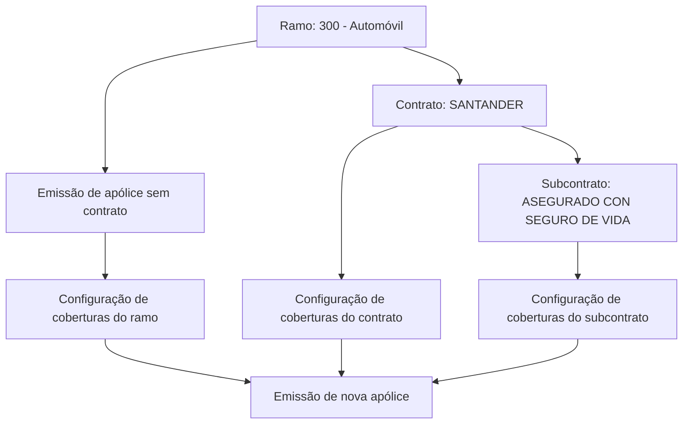

# Definição de Subcontrato para Ramo e Contrato de Apólices

## 1. Metadados do Documento
- **Arquivo de Origem:** Não identificado
- **Tipo de Documento:** Especificação Técnica
- **Domínio / Sistema:** Definição de ramo, contrato, subcontrato, coberturas e emissão de apólices
- **Público-Alvo:** Negócio, analistas funcionais, desenvolvedores e operação
- **Data/Versão Identificada:** Não identificada

---

## 2. Resumo Executivo & Contexto de Negócio

O documento descreve o conceito de **subcontrato** aplicado à configuração de um ramo e contrato já definidos. O objetivo é permitir alterações em conceitos específicos de negócio, especialmente na disponibilidade ou inabilitação de coberturas para emissão de novas apólices.

O exemplo apresentado utiliza o ramo **300 - Automóvil**, com as coberturas Responsabilidad civil, Daños propios, Accidentes e Muerte. A configuração pode variar conforme a apólice seja emitida sem contrato, com um contrato específico ou com a combinação de contrato e subcontrato.

O contrato citado é **SANTANDER**, e o subcontrato associado é **ASEGURADO CON SEGURO DE VIDA**. O documento demonstra que a configuração de coberturas do ramo pode ser alterada em cada nível de definição: ramo, contrato e subcontrato.

Também são apresentadas propriedades para identificação e vigência de contratos e definições de ramo. A data de validade permite preservar o histórico de mudanças, enquanto o atributo **Inhabilitado** impede a seleção em novas apólices sem remover sua aplicação em apólices existentes.

---

## 3. Arquitetura, Componentes & Tecnologias Envolvidas

Os componentes funcionais identificados são:

- **Ramo:** Contexto de negócio afetado pela definição; no exemplo, `300 - Automóvil`.
- **Contrato:** Definição associada a um ramo; no exemplo, `SANTANDER`.
- **Subcontrato:** Especialização vinculada ao contrato; no exemplo, `ASEGURADO CON SEGURO DE VIDA`.
- **Coberturas:** Conceitos configuráveis em cada nível de definição.
- **Nova apólice:** Processo no qual a disponibilidade das coberturas é avaliada.
- **Suplemento:** Mecanismo mencionado para alterar uma apólice existente quando uma definição foi inabilitada.



**Nota de Análise:** O documento não informa sistemas, APIs, tecnologias, bancos de dados, interfaces, métodos HTTP ou contratos JSON relacionados à configuração de ramo, contrato ou subcontrato.

---

## 4. Regras de Negócio, Especificações Funcionais & Processos

1. O conceito de subcontrato permite realizar alterações em um ramo e contrato previamente definidos.
2. As alterações afetam determinados conceitos de negócio, mas o documento esclarece que não necessariamente afetam todos os conceitos.
3. O ramo, o contrato e o subcontrato possuem configurações de coberturas próprias.
4. O ramo do exemplo é `300 - Automóvil`.
5. O contrato do exemplo é `SANTANDER`.
6. O subcontrato do exemplo é `ASEGURADO CON SEGURO DE VIDA`.
7. A propriedade **Ramo** aponta para o ramo impactado pela definição.
8. A propriedade **Contrato** indica o contrato que será associado à definição.
9. A **Fecha de validez** determina quando a definição estará disponível para uso.
10. A utilização correta da data de validade permite manter um histórico das alterações efetuadas na definição.
11. A propriedade **Inhabilitado** determina se uma definição está ativa ou se já não pode ser incluída em uma nova apólice.
12. Quando uma definição é inabilitada, apólices existentes que já a possuem continuam aplicando-a.
13. Para alterar uma apólice existente após a inabilitação, é necessário um suplemento.
14. Após uma definição estar inabilitada, ela não poderá ser selecionada durante a alteração por suplemento.

**Nota Crítica sobre consistência do exemplo:**  
As tabelas de cobertura e a descrição textual possuem aparente inconsistência. A tabela inicial do ramo indica `Muerte = NO`, mas o texto afirma que, em uma nova apólice sem contrato, a cobertura de Muerte com valor `SI` é oferecida. A tabela do contrato SANTANDER indica todas as coberturas como `NO`, enquanto o texto afirma que a cobertura de `Vida SI` é oferecida para uma apólice com contrato SANTANDER e sem subcontrato. O documento não explica essa divergência.

---

## 5. Tabelas de Parâmetros, Ambientes e Estruturas de Dados

| Item / Parâmetro | Descrição / Função | Tipo / Valores / Formato | Ambiente / Observações |
| :--- | :--- | :--- | :--- |
| Ramo | Aponta para o ramo afetado pela definição. | Exemplo: `300 - Automóvil` | Aplicável à definição de ramo. |
| Contrato | Contrato associado à definição. | Exemplo: `SANTANDER` | Aplicável à definição de ramo e contrato. |
| Subcontrato | Especialização definida sob um contrato. | Exemplo: `ASEGURADO CON SEGURO DE VIDA` | Associado ao contrato SANTANDER no exemplo. |
| Clave | Chave pela qual o contrato será identificado. | Não detalhado | Propriedade de definição de contrato. |
| Nombre | Descrição pela qual o contrato será identificado. | Não detalhado | Propriedade de definição de contrato. |
| Nombre corto | Descrição curta pela qual o contrato será identificado. | Não detalhado | Propriedade de definição de contrato. |
| Fecha de validez | Determina quando a definição pode ser utilizada. | Data; formato não informado | Permite registro histórico de alterações. |
| Inhabilitado | Indica se a definição está ativa ou não pode mais ser incluída em nova apólice. | Estado lógico; valores explícitos não detalhados | Não remove a aplicação em apólices existentes. |
| Suplemento | Mecanismo para modificar uma apólice existente. | Processo não detalhado | Não permite selecionar uma definição já inabilitada. |

| Nível de Definição | Ramo | Contrato | Subcontrato | Responsabilidad civil | Daños propios | Accidentes | Muerte |
| :--- | :--- | :--- | :--- | :--- | :--- | :--- | :--- |
| Ramo inicial | 300 - Automóvil | NO DEFINIDO | NO DEFINIDO | NO | NO | SI | NO |
| Contrato | 300 - Automóvil | SANTANDER | NO DEFINIDO | NO | NO | NO | NO |
| Subcontrato | 300 - Automóvil | SANTANDER | ASEGURADO CON SEGURO DE VIDA | NO | NO | NO | SI |

| Cenário de emissão descrito | Resultado textual informado | Observação |
| :--- | :--- | :--- |
| Nova apólice sem contrato | Cobertura de Muerte `SI` é oferecida. | Diverge da tabela inicial, que apresenta Muerte como `NO`. |
| Nova apólice com contrato SANTANDER sem subcontrato | Cobertura de Vida `SI` é oferecida. | A cobertura `Vida` não aparece nas tabelas; a tabela do contrato informa todas as coberturas como `NO`. |
| Apólice com contrato SANTANDER e subcontrato ASEGURADO CON SEGURO DE VIDA | Cobertura de Muerte `NO` não é oferecida. | A redação original apresenta “Muerte NO se ofrece”; a tabela do subcontrato mostra Muerte como `SI`. |

---

## 6. Bateria de Perguntas & Respostas para RAG (FAQ Sintético)

### P1: Qual é o objetivo da definição de subcontrato?
**R:** A definição de subcontrato permite realizar alterações em um ramo e contrato já definidos. As alterações afetam determinados conceitos de negócio, sem que o documento afirme que todos os conceitos do ramo sejam alterados.

### P2: Qual ramo é utilizado no exemplo de definição de subcontrato?
**R:** O exemplo utiliza o ramo `300 - Automóvil`.

### P3: Qual contrato é definido no exemplo do documento?
**R:** O contrato definido no exemplo é `SANTANDER`, associado ao ramo `300 - Automóvil`.

### P4: Qual subcontrato é associado ao contrato SANTANDER?
**R:** O subcontrato associado ao contrato SANTANDER é `ASEGURADO CON SEGURO DE VIDA`.

### P5: Para que serve a data de validade de uma definição?
**R:** A data de validade determina quando uma definição estará disponível para utilização. O documento informa que seu uso correto permite manter um registro histórico das alterações realizadas na definição.

### P6: O que acontece com apólices existentes quando uma definição é inabilitada?
**R:** Mesmo após a inabilitação, todas as apólices que já possuem a definição continuam aplicando-a. A inabilitação afeta a inclusão da definição em novas apólices.

### P7: Uma definição inabilitada pode ser selecionada em um suplemento?
**R:** Não. O documento informa que, quando uma definição está inabilitada, ela já não poderá ser selecionada no momento em que uma alteração for realizada por meio de suplemento.

### P8: Quais são as propriedades de identificação de um contrato?
**R:** As propriedades apresentadas são `Clave`, identificador do contrato; `Nombre`, descrição de identificação; e `Nombre corto`, descrição curta de identificação.

### P9: Quais coberturas são apresentadas no exemplo?
**R:** O documento apresenta as coberturas `Responsabilidad civil`, `Daños propios`, `Accidentes` e `Muerte`.

### P10: O documento detalha como as coberturas são implementadas tecnicamente?
**R:** Não. O documento apresenta configurações de cobertura em tabelas e exemplos de emissão de apólices, mas não detalha APIs, banco de dados, regras de cálculo, interfaces, contratos JSON ou mecanismos técnicos de persistência.

---

## 7. Glossário de Termos, Siglas & Conceitos-Chave

- **Ramo:** Contexto de negócio ao qual a definição se aplica; no exemplo, `300 - Automóvil`.
- **Contrato:** Definição associada a um ramo, identificada por chave, nome e nome curto.
- **Subcontrato:** Definição vinculada a um contrato que permite alterar conceitos de negócio, incluindo coberturas.
- **Cobertura:** Conceito de negócio configurável para uma apólice.
- **Apólice:** Produto ou registro emitido no contexto de um ramo, contrato e, quando aplicável, subcontrato.
- **Suplemento:** Mecanismo citado para realizar alterações em uma apólice existente.
- **Fecha de validez:** Data que determina a disponibilidade de uma definição para utilização.
- **Inhabilitado:** Estado no qual uma definição não pode ser incluída em novas apólices nem selecionada em suplemento.

---

## 8. Notas Críticas, Riscos & Limitações

- O documento não identifica arquivo de origem, autor, versão, data, sistema responsável ou ambiente de execução.
- Não são detalhados contratos de integração, APIs, endpoints, tecnologias, bancos de dados ou mecanismos de autenticação.
- As tabelas de cobertura apresentam divergências aparentes em relação ao texto narrativo sobre emissão de apólices.
- A cobertura `Vida` é citada no texto narrativo, mas não consta nas tabelas de cobertura apresentadas.
- O significado operacional exato dos valores `SI` e `NO` na coluna `INHABILITADA` não é explicitamente definido.
- O processo de suplemento é citado, mas não possui fluxo operacional, critérios de validação ou detalhes de implementação.

---

## 9. Conteúdo Bruto Estruturado (Referência Fiel)

```text
--- [PÁGINA 1 DE 3] ---

DEFINICIÓN de subcontrato
Objetivo
Bajo este concepto se permite realizar alteraciones de un ramo y un contrato ya definido. Estas
alteraciones afectan a un número de conceptos de negocio (no a todos). A continuación se muestra
un ejemplo:
Se parte de la definición de un ramo en que las coberturas se encuentran de la siguiente forma:
RAMO CONTRATO SUBCONTRATO
300 - Automóvil NO DEFINIDO NO DEFINIDO
COBERTURA INHABILITADA
100 Responsabilidad civil NO
200 Daños propios NO
300 Accidentes SI
400 Muerte NO
 /
 RS
Inicio Soluciones APIs Documentación Zeus
ES


--- [PÁGINA 2 DE 3] ---

Para el ramo del ejemplo se define un contrato (SANTANDER) donde se modifica las definición de
coberturas:
RAMO CONTRATO SUBCONTRATO
300 - Automóvil SANTANDER NO DEFINIDO
COBERTURA INHABILITADA
100 Responsabilidad civil NO
200 Daños propios NO
300 Accidentes NO
400 Muerte NO
Bajo el contrato SANTANDER se define un subcontrato (ASEGURADO CON SEGURO DE VIDA):
RAMO CONTRATO SUBCONTRATO
300 - Automóvil SANTANDER ASEGURADO CON SEGURO DE VIDA
COBERTURA INHABILITADA
100 Responsabilidad civil NO
200 Daños propios NO
300 Accidentes NO
400 Muerte SI
En este ejemplo, cuando se emite una nueva póliza SIN contrato, la cobertura de Muerte SI se
ofrece. Cuando se emite una nueva póliza con el contrato SANTANDER SIN subcontrato, la
cobertura de Vida SI se ofrece. En cambio, si se emite una póliza del contrato SANTANDER,
subcontrato ASEGURADO CON SEGURO DE VIDA, la cobertura de Muerte NO se ofrece.


--- [PÁGINA 3 DE 3] ---

Propiedades de definición
Propiedades de definición
Propiedades de definición
Contrato
Clave por el que se identificará.
Nombre
Descripción por el que se identificará.
Nombre corto
Descripción corta por el que se identificará.
Propiedades de ramo
Ramo
Apunta al ramo al que afecta esta definición.
Contrato
Contrato al que se asociará.
Fecha de validez
Determina cuando la definición estará disponible para ser utilizada. Su correcto uso permite tener un
registro histórico de los cambios efectuados en la definición.
Inhabilitado
En este punto se determina si está activo o por el contrario ya no puede ser incluido en una nueva
póliza. Es importante destacar que, aunque se inhabilite, todas las pólizas que dispongan de ello,
seguirá aplicándose hasta que mediante un suplemento se cambie. En ese momento, al estar
inhabilitado ya no será posible seleccionarlo.
```
