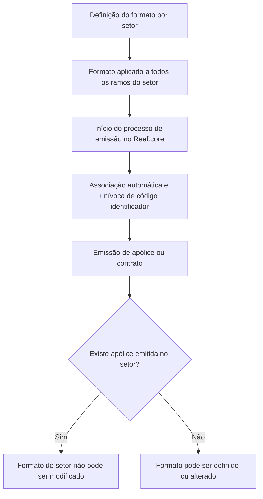

# Definição do Formato do Número de Apólice/Orçamento no Reef.core

## 1. Metadados do Documento
- **Arquivo de Origem:** Não identificado no conteúdo fornecido
- **Tipo de Documento:** Especificação Técnica
- **Domínio / Sistema:** Reef.core — emissão de apólices e contratos
- **Público-Alvo:** Desenvolvedores, analistas funcionais e equipes responsáveis pela configuração de setores e ramos
- **Data/Versão Identificada:** Não identificada

---

## 2. Resumo Executivo & Contexto de Negócio

O documento define regras para a formação do número identificador de apólices e contratos no sistema Reef.core. Durante o processo de emissão, Reef.core associa automática e univocamente um código identificador a cada apólice desde o início da emissão.

A codificação do número de apólice pode ser modificada ao término do processo de emissão, conforme a definição do ramo. A definição do formato é realizada por setor e se aplica a todos os ramos pertencentes ao setor configurado.

O formato possui limitações estruturais: o número da apólice pode ter, no máximo, 13 posições; o elemento de número consecutivo (`N`) é obrigatório; e deve haver pelo menos um elemento adicional além do consecutivo.

Após existir alguma apólice emitida para um setor, o formato daquele setor não pode mais ser modificado. Essa restrição torna a definição inicial do formato uma decisão relevante para a operação e a governança da numeração de apólices.

---

## 3. Arquitetura, Componentes & Tecnologias Envolvidas

| Componente / Conceito | Papel identificado |
| :--- | :--- |
| **Reef.core** | Sistema no qual ocorre a emissão de apólices e contratos. |
| **Processo de emissão** | Processo que associa automaticamente um código identificador às apólices. |
| **Setor** | Escopo onde o formato do número de apólice é definido; a configuração é aplicada a todos os ramos do setor. |
| **Ramo** | Referência usada para eventual modificação da codificação ao final da emissão e possível elemento do formato. |
| **Número de apólice/orçamento** | Identificador formado por elementos configuráveis, limitado a 13 posições. |
| **Número consecutivo (`N`)** | Elemento obrigatório; ocupa as posições restantes até completar o limite de 13 posições. |



**Nota de Análise:** O conteúdo não descreve microsserviços, APIs, tecnologias de infraestrutura, contratos HTTP, bancos de dados ou ambientes de execução.

---

## 4. Regras de Negócio, Especificações Funcionais & Processos

### Processo de identificação durante a emissão

1. O processo de emissão de apólices e contratos no Reef.core associa, de forma automática e unívoca, um código identificador a cada apólice.
2. A associação do código ocorre desde o momento em que o processo de emissão é iniciado.
3. Ao término do processo de emissão, a codificação pode ser modificada de acordo com a definição do ramo.
4. A definição do formato do número de apólice é realizada por setor.
5. Um formato definido para um setor aplica-se a todos os ramos daquele setor.
6. O formato de um setor não pode ser modificado depois que existir qualquer apólice emitida naquele setor.

### Restrições do formato

1. O tamanho máximo do número de apólice é de **13 posições**.
2. O elemento **número consecutivo (`N`) é obrigatório**.
3. A extensão do número consecutivo é calculada pela quantidade de posições restantes até alcançar 13 posições, depois de descontados os demais elementos selecionados para o formato.
4. Deve existir, no mínimo, um elemento de numeração adicional ao número consecutivo.
5. O número consecutivo isolado não atende à regra de composição do formato.

### Elementos disponíveis para compor o formato

Os elementos apresentados no documento são:

- Companhia (`C`)
- Setor (`S`)
- Elemento apresentado de forma incompleta/ambígua na extração: `/` com abreviatura `CF`
- Ramo (`R`)
- Estrutura comercial — primeiro nível (`1`)
- Estrutura comercial — segundo nível (`2`)
- Estrutura comercial — terceiro nível (`3`)
- Ano (`A`)
- Número consecutivo (`N`)

### Exemplos documentados

| Formato | Composição declarada |
| :--- | :--- |
| `RRRAANNNNNNNN` | Numeração formada pelo ramo, ano e consecutivo. |
| `RRRAA222NNNNN` | Numeração formada pelo ramo, ano, segundo nível da estrutura comercial e consecutivo. |

**Nota de Análise:** O documento não detalha a semântica operacional dos valores de Companhia, Setor, Ramo, níveis de Estrutura Comercial ou Ano. Também não esclarece o elemento extraído como `/` e `CF`.

---

## 5. Tabelas de Parâmetros, Ambientes e Estruturas de Dados

| Item / Parâmetro | Descrição / Função | Tipo / Valores / Formato | Ambiente / Observações |
| :--- | :--- | :--- | :--- |
| Número de apólice | Código identificador da apólice. | Máximo de 13 posições. | Associado automaticamente durante a emissão no Reef.core. |
| Número de orçamento | Referido no título do documento. | Não detalhado. | O conteúdo não descreve regras específicas para orçamento. |
| Companhia | Elemento possível no formato da apólice. | Comprimento: 2; abreviatura: `C`. | Significado dos valores não detalhado. |
| Setor | Elemento possível no formato e escopo de configuração. | Comprimento: 2; abreviatura: `S`. | O formato é definido por setor e aplicado a todos os ramos do setor. |
| `/` / `CF` | Elemento registrado na extração bruta. | Não detalhado de forma confiável. | A tabela original apresenta esse trecho de maneira incompleta. |
| Ramo | Elemento possível no formato. | Comprimento: 3; abreviatura: `R`. | A codificação pode ser modificada ao fim da emissão conforme a definição do ramo. |
| Estrutura comercial — primeiro nível | Elemento possível no formato. | Comprimento: 2; abreviatura: `1`. | Não detalhado adicionalmente. |
| Estrutura comercial — segundo nível | Elemento possível no formato. | Comprimento: 3; abreviatura: `2`. | Usado no exemplo `RRRAA222NNNNN`. |
| Estrutura comercial — terceiro nível | Elemento possível no formato. | Comprimento: 3; abreviatura: `3`. | Não detalhado adicionalmente. |
| Ano | Elemento possível no formato. | Comprimento: 2; abreviatura: `A`. | Usado nos exemplos documentados. |
| Número consecutivo | Elemento obrigatório de sequência. | Abreviatura: `N`; comprimento variável. | Preenche as posições restantes até o máximo de 13 posições. |
| Alteração de formato | Regra de governança da configuração. | Não permitido após emissão no setor. | O bloqueio ocorre se houver alguma apólice emitida no setor. |

---

## 6. Bateria de Perguntas & Respostas para RAG (FAQ Sintético)

### P1: Qual é o tamanho máximo permitido para o número de apólice no Reef.core?
**R:** O número de apólice possui tamanho máximo de 13 posições. A seleção dos elementos que formam o identificador, incluindo o número consecutivo, deve respeitar esse limite.

### P2: Em que momento o Reef.core atribui o código identificador da apólice?
**R:** Reef.core associa automática e univocamente um código identificador a cada apólice desde o início do processo de emissão de apólices e contratos.

### P3: O número consecutivo é opcional no formato de número de apólice?
**R:** Não. O número consecutivo, identificado pela abreviatura `N`, é obrigatório em qualquer formato de número de apólice.

### P4: Como é determinada a quantidade de posições do número consecutivo?
**R:** A quantidade de posições do número consecutivo é o valor restante para completar o máximo de 13 posições, depois de descontados os comprimentos dos demais elementos que compõem o número de apólice.

### P5: É permitido configurar um número de apólice composto apenas pelo número consecutivo?
**R:** Não. Além do número consecutivo obrigatório, o formato deve conter pelo menos um elemento adicional de numeração.

### P6: Em qual nível a configuração do formato do número de apólice é definida?
**R:** A configuração do formato é definida por setor. O formato definido é aplicado a todos os ramos pertencentes ao setor configurado.

### P7: É possível modificar o formato de um setor que já possui apólices emitidas?
**R:** Não. O documento estabelece que o formato não pode ser modificado depois que alguma apólice tenha sido emitida para o setor.

### P8: Quais elementos podem participar da formação do número de apólice?
**R:** O documento lista Companhia (`C`), Setor (`S`), um elemento apresentado ambiguamente como `/` e `CF`, Ramo (`R`), Estrutura Comercial de primeiro nível (`1`), segundo nível (`2`), terceiro nível (`3`), Ano (`A`) e Número Consecutivo (`N`).

### P9: O que representa o formato `RRRAANNNNNNNN`?
**R:** O formato `RRRAANNNNNNNN` representa uma numeração formada por Ramo, Ano e Número Consecutivo. O ramo ocupa três posições, o ano ocupa duas posições e o consecutivo ocupa as posições restantes.

### P10: O que representa o formato `RRRAA222NNNNN`?
**R:** O formato `RRRAA222NNNNN` representa uma numeração formada por Ramo, Ano, segundo nível da Estrutura Comercial e Número Consecutivo.

### P11: A codificação da apólice pode ser modificada depois do início da emissão?
**R:** O documento informa que, ao término do processo de emissão, é possível modificar a codificação de acordo com a definição do ramo. Não são detalhados os mecanismos, responsáveis ou condições técnicas dessa modificação.

### P12: O documento especifica APIs, URLs ou ambientes para a configuração do formato?
**R:** Não. O conteúdo fornecido não apresenta APIs, URLs, servidores, ambientes, métodos HTTP ou contratos de integração relacionados à configuração do formato.

---

## 7. Glossário de Termos, Siglas & Conceitos-Chave

- **Reef.core:** Sistema citado como responsável pelo processo de emissão de apólices e contratos.
- **Apólice:** Entidade para a qual Reef.core associa um código identificador durante o processo de emissão.
- **Orçamento:** Termo presente no título “número de póliza/presupuesto”; o conteúdo não fornece detalhamento específico.
- **Setor:** Escopo no qual o formato do número de apólice é definido e aplicado a todos os ramos associados.
- **Ramo:** Elemento disponível para a composição do formato e referência para modificação da codificação ao término da emissão.
- **Estrutura comercial:** Elemento de composição do formato com três níveis identificados: primeiro, segundo e terceiro.
- **Número consecutivo (`N`):** Parte obrigatória da numeração; seu comprimento completa as posições restantes até o máximo de 13.
- **Companhia (`C`):** Elemento de duas posições que pode formar o número de apólice.
- **Setor (`S`):** Elemento de duas posições que pode formar o número de apólice.
- **Ramo (`R`):** Elemento de três posições que pode formar o número de apólice.
- **Ano (`A`):** Elemento de duas posições que pode formar o número de apólice.

---

## 8. Notas Críticas, Riscos & Limitações

- A configuração do formato é irreversível após a emissão de qualquer apólice no setor; uma definição inadequada pode exigir tratamento operacional fora do escopo descrito.
- O documento não informa como Reef.core valida a unicidade do número consecutivo, nem como trata concorrência, reinicialização, faixas ou esgotamento de sequências.
- Não há detalhes sobre a alteração de codificação conforme definição do ramo, apesar de essa possibilidade ser mencionada.
- O trecho referente ao elemento `/` e à abreviatura `CF` está incompleto ou ambíguo na extração fornecida.
- Não são descritos métodos de configuração, telas, permissões, APIs, trilhas de auditoria, logs, URLs ou ambientes.
- O documento usa exemplos de formato, mas não fornece um catálogo completo de combinações permitidas.

---

## 9. Conteúdo Bruto Estruturado (Referência Fiel)

```text
--- [PÁGINA 1 DE 2] ---

DEFINICIÓN del formato del número de
póliza/presupuesto
Objetivo
El proceso de emisión de pólizas y contratos en Reef.core asocia de manera automática y
unívocamente un código identificador a todas y cada una de las pólizas desde el momento que inicia
el proceso de emisión. Si bien y al término del mismo es factible modificar esta codificación de
acuerdo a la definición del ramo.
Existen algunos puntos a tener en cuenta:
Existen unos elementos prefijados que pueden intervenir en el formato del número de póliza.
Esta definición de formato se realiza por sector y aplica a todos los ramos del sector definido
El formato no se puede modificar una vez haya alguna póliza emitida de un sector
El tamaño máximo del número de póliza es de 13 posiciones
Los elementos que pueden intervenir en el formato de póliza son:
ELEMENTO LONGITUD ABREVIATURA
Compañía 2 C
Sector 2 S
 /
 CF
Home Solutions APIs Documentation Zeus
EN


--- [PÁGINA 2 DE 2] ---

ELEMENTO LONGITUD ABREVIATURA
Ramo 3 R
Estructura comercial - primer nivel 2 1
Estructura comercial - segundo nivel 3 2
Estructura comercial - tercer nivel 3 3
Año 2 A
Nº consecutivo ¿? N
Existen unas reglas a cumplir cuando se define la formación del número de póliza:
1. El elemento número consecutivo (N) es obligatorio y la longitud de este elemento es el valor que
falta para llegar a la longitud máxima del número de póliza (13) una vez descontados los
elementos que forman el número
2. Al menos debe existir un elemento que forme parte de la numeración adicional al número
consecutivo
Tomando los valores de las columnas abreviatura y longitud, se muestran ejemplos de formato:
RRRAANNNNNNNN: Numeración formada por el ramo, año y consecutivo
RRRAA222NNNNN: Numeración formada por el ramo, año, segundo nivel de la estructura
comercial y consecutivo
```
