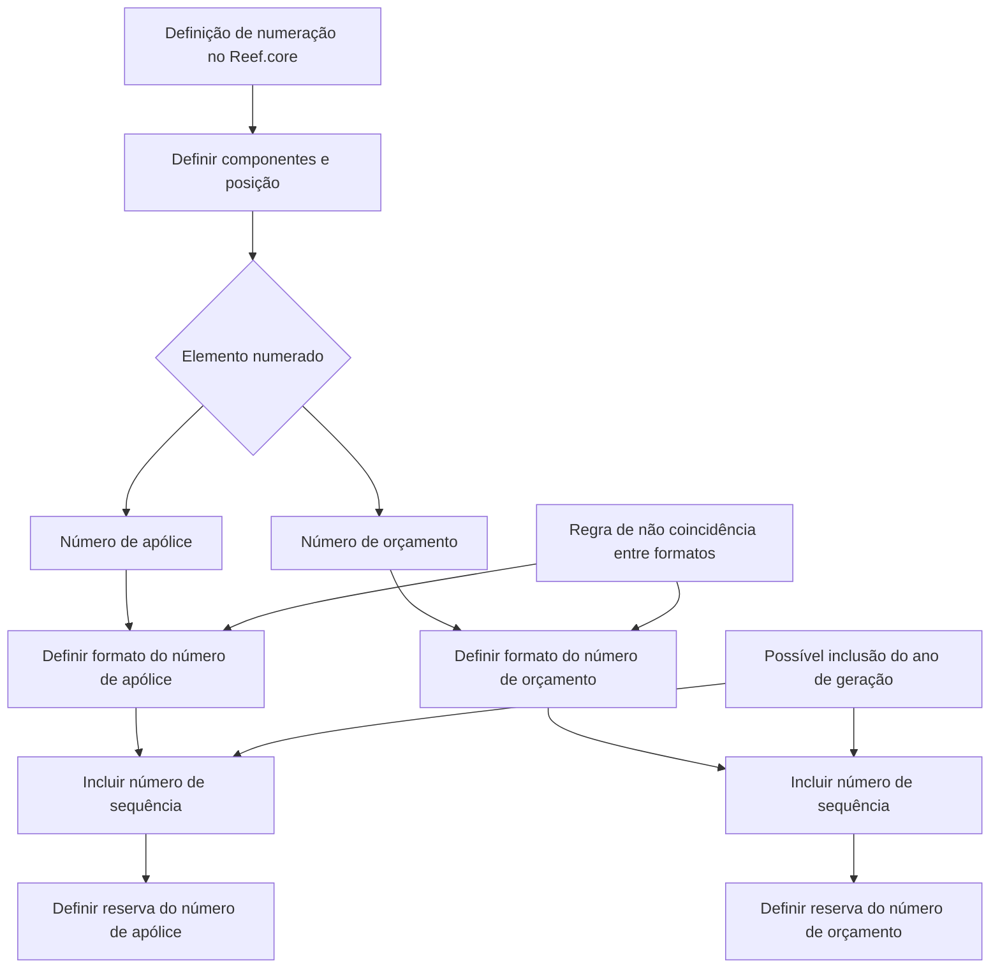
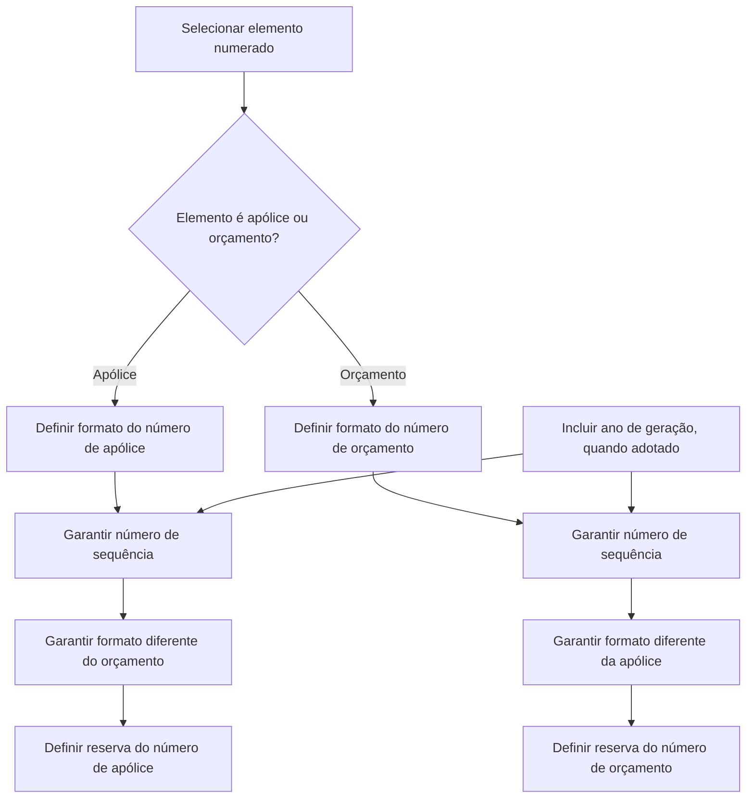

# Definição de Numeração para Apólices e Orçamentos no Reef.core

## 1. Metadados do Documento
- **Arquivo de Origem:** Não identificado no conteúdo fornecido
- **Tipo de Documento:** Especificação Técnica
- **Domínio / Sistema:** Reef.core — definição de numeração de apólices e orçamentos
- **Público-Alvo:** Desenvolvedores, Arquitetos, Analistas Funcionais e Operação
- **Data/Versão Identificada:** Não identificada

---

## 2. Resumo Executivo & Contexto de Negócio

O documento define os princípios para construir numerações de elementos que possuem identificadores numéricos no contexto do Reef.core, com foco explícito no número de apólice e no número de orçamento. O objetivo declarado é determinar como esses diferentes elementos serão formados.

As numerações não são pré-configuradas no Reef.core. Por esse motivo, a organização deve definir como os números serão criados utilizando os componentes disponíveis e considerando o local em que cada componente é aplicado. A combinação desses componentes determina a composição final da numeração.

O documento estabelece que a composição do número deve ser acompanhada da geração de reservas por sequências. Toda numeração precisa conter um número de sequência, pois esse componente é necessário para produzir números distintos.

Há uma restrição central de unicidade entre apólices e orçamentos: os formatos de numeração não podem coincidir. Para evitar que um número de apólice seja idêntico a um número de orçamento, ambos devem conter elementos diferentes e/ou posicionados em locais distintos dentro da composição.

Como estratégia para assegurar disponibilidade de números ao longo do tempo, o documento sugere incluir o ano de geração no número. Nesse modelo, as sequências são formadas por ano, permitindo que uma sequência seja reiniciada em anos distintos sem repetição do identificador completo.

---

## 3. Arquitetura, Componentes & Tecnologias Envolvidas

### Sistema e conceitos identificados

| Componente / Conceito | Descrição sustentada pelo documento |
| :--- | :--- |
| **Reef.core** | Sistema no qual as numerações não estão pré-fixadas e precisam ser definidas. |
| **Número de apólice** | Elemento que deve ter formato próprio e reserva de número específica. |
| **Número de orçamento** | Elemento que deve ter formato próprio e reserva de número específica. |
| **Componentes de numeração** | Elementos disponíveis que, conforme sua utilização e posição, determinam a numeração resultante. |
| **Número de sequência** | Componente obrigatório de toda numeração, usado para obter números distintos. |
| **Reserva por sequência** | Reserva que deve ser gerada após a determinação da composição do número. |
| **Ano de geração** | Elemento que pode ser incluído na numeração para estruturar sequências anuais. |



**Nota de Análise:** O documento menciona componentes para compor a numeração, mas não apresenta uma lista desses componentes, seus formatos, tamanhos, posições ou regras de implementação no Reef.core.

---

## 4. Regras de Negócio, Especificações Funcionais & Processos

### 4.1 Objetivo da definição de numeração

A definição de numeração deve determinar como serão formados os diversos elementos que possuem número, incluindo explicitamente:

- Número de apólice.
- Número de orçamento.

### 4.2 Criação de numerações no Reef.core

1. As numerações não estão pré-fixadas no Reef.core.
2. É necessário determinar como cada número será criado.
3. A criação utiliza uma série de componentes.
4. A composição depende:
   - Dos componentes utilizados.
   - Do local em que cada componente é colocado.
5. Após definir a composição do número, devem ser geradas reservas por sequências.

### 4.3 Regra de diferenciação entre apólice e orçamento

As numerações de apólice e orçamento não podem coincidir em formato.

Para cumprir essa regra, a composição da numeração de apólice e da numeração de orçamento deve apresentar pelo menos uma das seguintes diferenças:

- Elementos distintos.
- Mesmos elementos posicionados em locais distintos.

O objetivo da diferenciação é assegurar que um número de apólice nunca coincida com um número de orçamento.

### 4.4 Regra de sequência obrigatória

Toda numeração deve conter um número de sequência.

O número de sequência deve permitir a obtenção de números distintos. O documento não define:

- Formato da sequência.
- Tamanho da sequência.
- Valor inicial.
- Critério de incremento.
- Estratégia de concorrência para reserva ou consumo da sequência.

### 4.5 Regra de capacidade temporal e sequência anual

A composição da numeração deve garantir que existam números suficientes ao longo do tempo.

O documento apresenta a inclusão do ano de geração no número como recurso amplamente utilizado. Quando o ano é incluído:

1. A sequência passa a ser formada por ano.
2. A numeração pode possuir uma sequência com valor `1` em cada ano.
3. O número completo não se repete porque o ano integra a composição.

Exemplo apresentado pelo documento:

| Ano | Número de sequência possível |
| :--- | :--- |
| 2022 | 1 |
| 2023 | 1 |

### 4.6 Processo para número de apólice

| Ordem | Etapa | Descrição |
| :--- | :--- | :--- |
| 1 | Definir formato do número de apólice | Determinar a composição da numeração de apólice. |
| 2 | Definir reserva do número de apólice | Definir a reserva associada à numeração de apólice. |

### 4.7 Processo para número de orçamento

| Ordem | Etapa | Descrição |
| :--- | :--- | :--- |
| 1 | Definir formato do número de orçamento | Determinar a composição da numeração de orçamento. |
| 2 | Definir reserva do número de orçamento | Definir a reserva associada à numeração de orçamento. |



---

## 5. Tabelas de Parâmetros, Ambientes e Estruturas de Dados

| Item / Parâmetro | Descrição / Função | Tipo / Valores / Formato | Ambiente / Observações |
| :--- | :--- | :--- | :--- |
| Sistema | Contexto no qual a numeração deve ser definida. | Reef.core | As numerações não estão pré-fixadas. |
| Elemento numerado | Elemento para o qual será criada uma numeração. | Número de apólice; número de orçamento | O documento cita explicitamente apólices e orçamentos. |
| Componentes de numeração | Elementos usados para formar um número. | Não detalhado | A posição dos componentes influencia a numeração resultante. |
| Número de sequência | Elemento obrigatório da numeração. | Número sequencial; formato não especificado | Deve permitir gerar números distintos. |
| Ano de geração | Elemento opcional citado para compor a numeração. | Exemplo: 2022, 2023 | Pode formar sequências separadas por ano. |
| Reserva de número de apólice | Reserva associada ao número de apólice. | Não detalhado | Deve ser definida após o formato da numeração de apólice. |
| Reserva de número de orçamento | Reserva associada ao número de orçamento. | Não detalhado | Deve ser definida após o formato da numeração de orçamento. |
| Regra de diferenciação | Impede coincidência entre numeração de apólice e orçamento. | Elementos diferentes e/ou posições diferentes | Obrigatória para evitar o mesmo número nos dois tipos de elemento. |
| Formato de número de apólice | Composição da identificação de apólice. | Não especificado | Não pode coincidir com o formato de orçamento. |
| Formato de número de orçamento | Composição da identificação de orçamento. | Não especificado | Não pode coincidir com o formato de apólice. |

**Nota de Análise:** O documento não fornece URLs, servidores, ambientes, rotas de log, nomes de tabelas, APIs, campos de banco de dados ou contratos de integração.

---

## 6. Bateria de Perguntas & Respostas para RAG (FAQ Sintético)

### P1: Qual é o objetivo da definição de numeração no Reef.core?
**R:** O objetivo é determinar como serão formados os diferentes elementos que possuem um número, incluindo o número de apólice e o número de orçamento.

### P2: As numerações já vêm pré-configuradas no Reef.core?
**R:** Não. O documento afirma que as numerações não estão pré-fixadas no Reef.core. Por isso, é necessário determinar como esses números serão criados.

### P3: Como a composição de uma numeração é determinada?
**R:** A composição é determinada pelos componentes utilizados e pelo local em que esses componentes são posicionados na numeração.

### P4: Toda numeração precisa ter um número de sequência?
**R:** Sim. O documento estabelece que toda numeração deve conter um número de sequência para permitir a obtenção de números distintos.

### P5: Por que o formato do número de apólice deve ser diferente do formato do número de orçamento?
**R:** Os formatos não podem coincidir para assegurar que um número de apólice não seja igual a um número de orçamento. Essa diferenciação pode ser obtida por elementos diferentes e/ou pela posição diferente dos elementos.

### P6: O que deve acontecer depois de definir a composição de um número?
**R:** Depois de determinar a composição do número, devem ser geradas reservas por sequências.

### P7: Como a inclusão do ano ajuda a evitar repetição de numeração?
**R:** Ao incluir o ano de geração no número, as sequências podem ser formadas por ano. Assim, pode existir uma sequência número um em 2022 e outra sequência número um em 2023, sem que o número completo se repita.

### P8: Quais são as etapas para definir um número de apólice?
**R:** O processo possui duas etapas: primeiro, definir o formato do número de apólice; segundo, definir a reserva do número de apólice.

### P9: Quais são as etapas para definir um número de orçamento?
**R:** O processo possui duas etapas: primeiro, definir o formato do número de orçamento; segundo, definir a reserva do número de orçamento.

### P10: O documento define o tamanho ou o padrão textual da sequência?
**R:** Não. O documento informa que a numeração deve conter uma sequência, mas não detalha tamanho, preenchimento, valor inicial, incremento ou formato da sequência.

### P11: O documento especifica quais componentes podem compor uma numeração?
**R:** Não. O documento menciona que há uma série de componentes disponíveis, mas não lista seus nomes, valores, formatos ou regras de posicionamento.

### P12: É possível usar o mesmo valor sequencial para apólice e orçamento?
**R:** O documento exige que apólice e orçamento tenham formatos que não coincidam. Ele não detalha se as sequências são compartilhadas ou independentes; portanto, não é possível concluir essa implementação apenas com o conteúdo fornecido.

---

## 7. Glossário de Termos, Siglas & Conceitos-Chave

- **Reef.core:** Sistema citado como contexto no qual as numerações não estão pré-fixadas.
- **Numeração:** Composição usada para formar identificadores numéricos de elementos, como apólices e orçamentos.
- **Número de apólice:** Número associado a uma apólice; deve possuir formato e reserva próprios.
- **Número de orçamento:** Número associado a um orçamento; deve possuir formato e reserva próprios.
- **Componente de numeração:** Elemento utilizado na composição de uma numeração; sua posição influencia o resultado.
- **Número de sequência:** Componente obrigatório que permite obter números distintos.
- **Reserva por sequência:** Reserva que deve ser gerada após a determinação da composição do número.
- **Sequência anual:** Organização de sequência por ano de geração, possibilitada pela inclusão do ano no número.

---

## 8. Notas Críticas, Riscos & Limitações

- O documento não especifica os componentes concretos disponíveis para formar os números.
- Não há definição de formato, máscara, tamanho, preenchimento, prefixos ou sufixos para números de apólice e orçamento.
- Não há detalhamento sobre como as reservas por sequências são persistidas, consultadas, bloqueadas ou consumidas.
- O documento não define se as sequências de apólices e orçamentos são independentes ou compartilhadas.
- Não são apresentados contratos de API, métodos HTTP, estruturas JSON, banco de dados, tabelas ou integrações externas.
- Não há definição de comportamento para concorrência, falhas na reserva, esgotamento de sequência ou duplicidade por processamento simultâneo.
- A inclusão do ano é apresentada como um recurso muito utilizado, mas o documento não afirma que seu uso seja obrigatório.
- **Nota de Análise:** O documento descreve o processo em nível conceitual e funcional; não fornece detalhamento suficiente para implementar uma solução completa sem definições complementares de formato, componentes e reserva.

---

## 9. Conteúdo Bruto Estruturado (Referência Fiel)

```text
--- [PÁGINA 1 DE 2] ---

EN CONSTRUCCIÓN
DEFINICIÓN de numeración
Objetivo
Determinar como van a estar formados los distintos elementos que disponen de un número (como
puede ser el número de póliza y el número de presupuesto)
¿En qué consiste?
Las numeraciones no están prefijadas en Reef.core por lo que es necesario determinar como se van
a crear estos números. Para ello, se disponen de una serie de componentes que dependiendo de
ellos y del lugar en el que se encuentre determinará como será la numeración.
Además, una vez determinada la composición del número, hay que generar reservas por de
secuencias
Características generales
Las numeraciones de póliza y presupuesto no pueden coincidir en el formato. Es decir, deben
estar compuestas por distintos elementos y/o estar en lugares distintos para asegurar que un
número de póliza y presupuesto no van a coincidir
Siempre una numeración debe contener un número de secuencia que permita obtener números
distintos.
 / 
 CF
Home Solutions APIs Documentation Zeus
EN


--- [PÁGINA 2 DE 2] ---

La composición debe asegurar que existan números suficientes en el tiempo. Un recurso muy
utilizado es incluir en el número, el año en el que se ha generado, por lo que las secuencias se
formarán por año y esto asegurará que el número no se repite (existirá un numero de secuencia
uno para el año 2022, otro número de secuencia uno para el año 2023, y así sucesivamente)
Proceso a seguir
Número de póliza
DEFINIR
formato número
de póliza
(1)
DEFINIR
reserva número
de póliza
(2)
1. DEFINIR formato número de póliza
1. DEFINIR reserva número de póliza
Número de presupuesto
DEFINIR
formato número
de presupuesto
(1)
DEFINIR
reserva número
de presupuesto
(2)
1. DEFINIR formato número de presupuesto
1. DEFINIR reserva número de presupuesto
```
