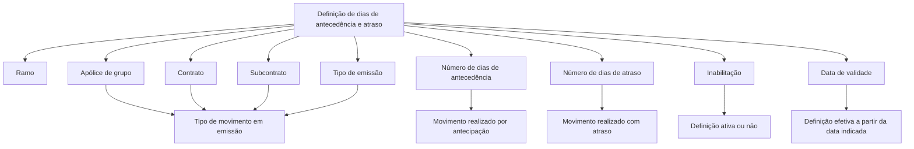
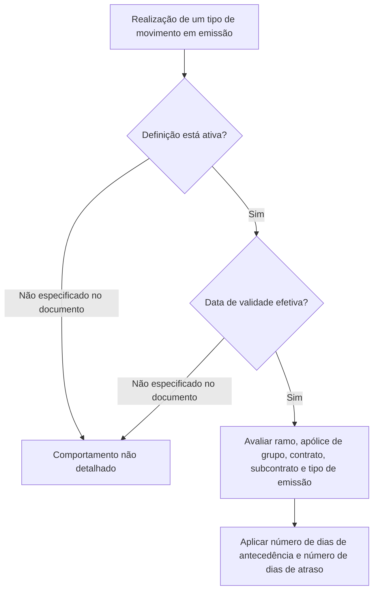

# Definição de Dias de Antecedência e Atraso para Movimentos de Emissão

## 1. Metadados do Documento
- **Arquivo de Origem:** Não identificado
- **Tipo de Documento:** Especificação Técnica
- **Domínio / Sistema:** Emissão / Definições de movimentos
- **Público-Alvo:** Negócio, Operação, Desenvolvedores e Arquitetos
- **Data/Versão Identificada:** Não identificada

---

## 2. Resumo Executivo & Contexto de Negócio

O documento descreve uma definição para controlar a antecedência e o atraso permitidos na realização de tipos de movimento em emissão. O controle é expresso por um número de dias de antecedência e um número de dias de atraso.

A aplicação da definição pode ser delimitada por atributos associados ao movimento: ramo, apólice de grupo, contrato, subcontrato e tipo de emissão. Quando os atributos de apólice de grupo, contrato ou subcontrato são especificados, a definição aplica-se a movimentos que contenham a informação do atributo correspondente.

A definição também possui propriedades operacionais para determinar se está ativa e a partir de quando produz efeito. A propriedade de inabilitação representa o estado ativo ou inativo, enquanto a data de validade indica a data a partir da qual a definição é efetiva.

---

## 3. Arquitetura, Componentes & Tecnologias Envolvidas

O conteúdo apresenta uma configuração funcional de emissão, sem detalhar componentes de software, microsserviços, APIs, contratos JSON, métodos HTTP, bancos de dados, tecnologias, ambientes ou mecanismos de persistência.

Os elementos funcionais identificados são:

- Definição de dias de antecedência e atraso.
- Movimento em emissão.
- Ramo.
- Apólice de grupo.
- Contrato.
- Subcontrato.
- Tipo de emissão.
- Número de dias de antecedência.
- Número de dias de atraso.
- Inabilitação.
- Data de validade.



> **Nota de Análise:** O documento não especifica a lógica de precedência entre múltiplas definições aplicáveis ao mesmo movimento, nem descreve mensagens de erro, comportamento de bloqueio ou regras de cálculo de datas.

---

## 4. Regras de Negócio, Especificações Funcionais & Processos

1. Existe a possibilidade de controlar o número de dias com os quais um tipo de movimento pode ser realizado em emissão de forma antecipada ou com atraso.
2. O campo **Ramo** aponta para o ramo afetado pela definição.
3. Quando a **Apólice de grupo** é especificada, a definição aplica-se quando for realizado um tipo de movimento que contenha a informação desse atributo.
4. Quando o **Contrato** é especificado, a definição aplica-se quando for realizado um tipo de movimento que contenha a informação desse atributo.
5. Quando o **Subcontrato** é especificado, a definição aplica-se quando for realizado um tipo de movimento que contenha a informação desse atributo.
6. O **Tipo de emissão** determina o tipo de movimento afetado pela definição.
7. O **Número de dias de antecedência** especifica quantos dias antes um movimento pode ser realizado.
8. O **Número de dias de atraso** especifica quantos dias depois um movimento pode ser realizado com atraso.
9. A **Inabilitação** especifica se a definição está ativa ou não.
10. A **Data de validade** indica a partir de quando a definição é efetiva.

### Fluxo funcional identificado



> **Nota de Análise:** O documento informa os atributos que condicionam a aplicação da definição, mas não detalha critérios de comparação, valores permitidos, formato de datas, unidades adicionais, prioridades ou tratamento de atributos não preenchidos.

---

## 5. Tabelas de Parâmetros, Ambientes e Estruturas de Dados

| Item / Parâmetro | Descrição / Função | Tipo / Valores / Formato | Ambiente / Observações |
| :--- | :--- | :--- | :--- |
| Definição de dias de antecedência e atraso | Controla o número de dias para realizar um tipo de movimento em emissão de forma antecipada ou com atraso. | Não especificado. | Aplicável ao contexto de emissão. |
| Ramo | Aponta para o ramo afetado pela definição. | Não especificado. | Propriedade geral. |
| Apólice de grupo | Delimita a aplicação da definição quando o tipo de movimento contém a informação desse atributo. | Não especificado. | Propriedade geral; aplicação condicionada ao atributo ser especificado. |
| Contrato | Delimita a aplicação da definição quando o tipo de movimento contém a informação desse atributo. | Não especificado. | Propriedade geral; aplicação condicionada ao atributo ser especificado. |
| Subcontrato | Delimita a aplicação da definição quando o tipo de movimento contém a informação desse atributo. | Não especificado. | Propriedade geral; aplicação condicionada ao atributo ser especificado. |
| Tipo de emissão | Determina o tipo de movimento afetado. | Não especificado. | Propriedade geral. |
| Número de dias de antecedência | Especifica quantos dias antes um movimento pode ser realizado. | Número de dias; formato não especificado. | Propriedade geral. |
| Número de dias de atraso | Especifica quantos dias depois um movimento pode ser realizado com atraso. | Número de dias; formato não especificado. | Propriedade geral. |
| Inabilitação | Especifica se a definição está ativa ou não. | Estado ativo/inativo; representação não especificada. | Outra propriedade. |
| Data de validade | Indica a partir de quando a definição é efetiva. | Data; formato não especificado. | Outra propriedade. |

---

## 6. Bateria de Perguntas & Respostas para RAG (FAQ Sintético)

### P1: Qual é o objetivo da definição de dias de antecedência e atraso?
**R:** A definição permite controlar o número de dias com que um tipo de movimento pode ser realizado em emissão de forma antecipada ou com atraso.

### P2: Qual propriedade identifica o ramo afetado pela definição?
**R:** A propriedade **Ramo** aponta para o ramo afetado pela definição de dias de antecedência e atraso.

### P3: Quando uma definição se aplica a uma apólice de grupo?
**R:** Quando a apólice de grupo é especificada, a definição aplica-se ao realizar um tipo de movimento que contenha a informação do atributo de apólice de grupo.

### P4: Como o contrato influencia a aplicação da definição?
**R:** Quando o contrato é especificado, a definição aplica-se ao realizar um tipo de movimento que contenha a informação do atributo de contrato.

### P5: Como o subcontrato influencia a aplicação da definição?
**R:** Quando o subcontrato é especificado, a definição aplica-se ao realizar um tipo de movimento que contenha a informação do atributo de subcontrato.

### P6: Qual campo determina o tipo de movimento afetado?
**R:** O campo **Tipo de emissão** determina o tipo de movimento afetado pela definição.

### P7: O que representa o número de dias de antecedência?
**R:** O número de dias de antecedência especifica quantos dias antes um movimento pode ser realizado.

### P8: O que representa o número de dias de atraso?
**R:** O número de dias de atraso especifica quantos dias depois um movimento pode ser realizado com atraso.

### P9: Como identificar se uma definição está ativa?
**R:** A propriedade **Inabilitação** especifica se a definição está ativa ou não.

### P10: Qual é a finalidade da data de validade?
**R:** A data de validade indica a partir de quando a definição é efetiva.

### P11: O documento define o formato da data de validade?
**R:** Não. O documento informa que a data de validade indica a partir de quando a definição é efetiva, mas não especifica formato, timezone ou regras de comparação da data.

### P12: O documento descreve APIs ou contratos técnicos para configurar a definição?
**R:** Não. O conteúdo não descreve métodos HTTP, URLs, contratos JSON, APIs, microsserviços, tecnologias ou mecanismos de persistência.

---

## 7. Glossário de Termos, Siglas & Conceitos-Chave

- **Emissão:** Contexto em que um tipo de movimento pode ser realizado antecipadamente ou com atraso.
- **Movimento:** Tipo de operação afetado pela definição de dias de antecedência e atraso.
- **Ramo:** Atributo que aponta para o ramo afetado pela definição.
- **Apólice de grupo:** Atributo que, quando especificado e presente no tipo de movimento, condiciona a aplicação da definição.
- **Contrato:** Atributo que, quando especificado e presente no tipo de movimento, condiciona a aplicação da definição.
- **Subcontrato:** Atributo que, quando especificado e presente no tipo de movimento, condiciona a aplicação da definição.
- **Tipo de emissão:** Propriedade que determina o tipo de movimento afetado.
- **Inabilitação:** Propriedade que especifica se a definição está ativa ou não.
- **Data de validade:** Data a partir da qual a definição é efetiva.

---

## 8. Notas Críticas, Riscos & Limitações

- O documento não identifica o arquivo de origem, versão, data de publicação ou responsável.
- O documento não especifica o formato nem os limites numéricos para os dias de antecedência e atraso.
- O documento não informa o formato da data de validade.
- O documento não descreve a lógica aplicada quando uma definição está inativa.
- O documento não esclarece como proceder quando a data de validade ainda não foi atingida.
- O documento não define a precedência entre múltiplas definições potencialmente aplicáveis ao mesmo movimento.
- O documento não detalha comportamentos para atributos ausentes, divergentes ou inválidos.
- Não há detalhamento de APIs, integrações, persistência, segurança, auditoria, logs, ambientes ou tratamento de erros.

---

## 9. Conteúdo Bruto Estruturado (Referência Fiel)

```text
--- [PÁGINA 1 DE 2] ---

DEFINICIÓN de días de adelanto y atraso
Objetivo
Existe la posibilidad de controlar el número de días con los que se puede realizar un tipo de
movimiento en emisión de forma adelantada o con retraso.
-Propiedades generales
-Otras propiedades
Propiedades generales
Ramo
Apunta al ramo que afecta la definición.
Póliza grupo
Si se especifica, la definición aplicará cuando se realice un tipo de movimiento que contenga la
información del atributo.
Contrato
Si se especifica, la definición aplicará cuando se realice un tipo de movimiento que contenga la
información del atributo.
Ejemplo:
 /
 RS
Inicio Soluciones APIs Documentación Zeus
ES


--- [PÁGINA 2 DE 2] ---

Subcontrato
Si se especifica, la definición aplicará cuando se realice un tipo de movimiento que contenga la
información del atributo.
Tipo de emisión
Determina el tipo de movimiento afectado.
Número de días de adelanto
Especifica cuantos días se puede realizar un movimiento por adelantado.
Número de días de retraso
Especifica cuantos días se puede realizar un movimiento con retraso.
Otras Propiedades
Inhabilitación
Especifica si la definición está activa o no.
Fecha de validez
Indica a partir de cuando la definición es efectiva.
```
