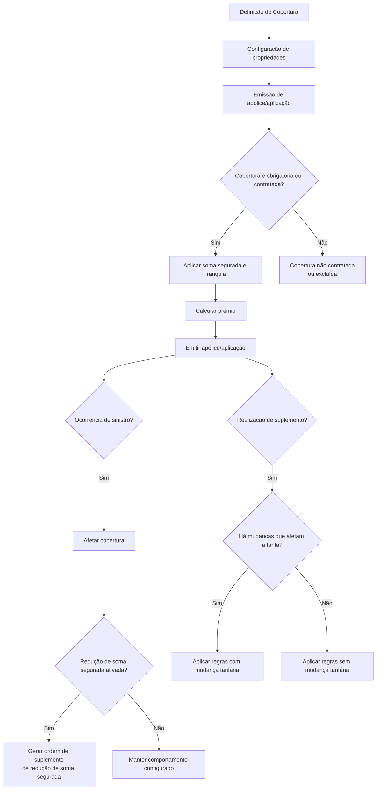

# Definição e Configuração de Coberturas no Reef.core

## 1. Metadados do Documento
- **Arquivo de Origem:** `Não informado — conteúdo bruto fornecido na solicitação`
- **Tipo de Documento:** `Especificação Técnica / Manual Funcional`
- **Domínio / Sistema:** `Seguros — definição de coberturas no Reef.core`
- **Público-Alvo:** `Desenvolvedores, Arquitetos, Configuradores de Produto, Operação e Negócio`
- **Data/Versão Identificada:** `Não identificada`

---

## 2. Resumo Executivo & Contexto de Negócio

O documento descreve a definição de uma **cobertura de seguro** no sistema Reef.core. A cobertura é apresentada como a obrigação principal da seguradora em um contrato de seguro: assumir, até o limite da soma segurada, as consequências econômicas decorrentes de um sinistro. No contexto de uma apólice, a cobertura determina tanto as circunstâncias em que haverá indenização quanto o custo que o cliente deverá suportar para obter essa proteção.

A especificação organiza a configuração de cobertura em grupos de propriedades: definição, ramo, soma segurada, relacionamento com outras coberturas, propriedades gerais, franquia, cálculo de prêmio, revalorização, comportamento em suplementos e validação. Esses grupos concentram regras que definem a disponibilidade da cobertura, sua contratação, capital segurado, precificação, retenções, comissionamento, reseguro, inspeção de risco e validações.

O Reef.core suporta coberturas com diferentes origens e comportamentos para a soma segurada, incluindo valor do veículo, acessórios, limites, intervalo e valor livre. O sistema também permite associar lógica de negócio para decidir contratação, soma segurada, franquia, cálculo de prêmio, revalorização e validações, sem que o documento detalhe os contratos técnicos, métodos ou implementação dessas lógicas.

O documento detalha especialmente o comportamento de uma cobertura durante suplementos. O Reef.core identifica mudanças que afetam a tarifa — tais como alteração de atributos de apólice ou risco, franquia, acessórios ou ocorrências — e, a partir disso, aplica ações diferentes para aumento, redução ou manutenção da soma segurada. As ações previstas incluem tarifa atual, tarifa original, tarifa mista e lógica de negócio por objeto.

---

## 3. Arquitetura, Componentes & Tecnologias Envolvidas

O documento cita explicitamente o sistema **Reef.core** como responsável pelos processos de emissão, contratação, alteração de apólices/aplicações, suplementos, cálculo de prêmio, tratamento de sinistros, retenção por controle técnico e apresentação de condições particulares.

Não são descritos microsserviços, APIs, protocolos, URLs, bancos de dados, versões de tecnologia, servidores, ambientes ou contratos JSON. A referência a “Home Solutions APIs Documentation Zeus” aparece no conteúdo extraído, mas não há detalhamento suficiente para caracterizá-la tecnicamente ou estabelecer uma relação arquitetural com Reef.core.



### Componentes e conceitos identificados

| Componente / Conceito | Função descrita | Observações |
| :--- | :--- | :--- |
| Reef.core | Sistema que utiliza as definições de cobertura durante emissão, contratação, suplementos, sinistros e apresentação de condições particulares. | Não há versão identificada. |
| Cobertura | Elemento da apólice que define indenização, soma segurada, comportamento e custo/prêmio. | Pode ser principal ou conectada a uma cobertura principal. |
| Apólice / Aplicação | Contexto de emissão, contratação, modificação e cálculo de cobertura. | O documento usa ambos os termos. |
| Suplemento | Operação posterior que pode alterar soma segurada e recalcular prêmio conforme regras configuradas. | Pode ser de redução ou restituição da soma segurada. |
| Sinistro | Evento que pode afetar uma cobertura e, quando configurado, reduzir sua soma segurada. | Não há fluxo de trâmite detalhado. |
| Controle técnico | Estado de retenção da apólice quando o risco exige inspeção não realizada ou com resultado negativo. | A retenção só pode ser levantada após inspeção positiva. |
| Lógica de negócio | Mecanismo configurável para determinar ou validar comportamentos de cobertura. | O documento não descreve linguagem, interface ou contrato de implementação. |
| Reasseguro | Destino opcional para cessão da cobertura. | A forma de cessão deve ser definida posteriormente. |

> **Nota de Análise:** O documento menciona lógicas de negócio associadas a soma segurada, franquia, prêmio, revalorização e validação, mas não detalha os métodos, parâmetros de entrada, saídas, tecnologias ou contratos dessas lógicas.

---

## 4. Regras de Negócio, Especificações Funcionais & Processos

### 4.1 Definição de cobertura

Uma cobertura representa a obrigação da seguradora de arcar, até o limite da soma segurada, com as consequências econômicas de um sinistro. A cobertura determina:

1. O valor a indenizar quando ocorrerem determinadas circunstâncias.
2. O comportamento da cobertura após ser afetada por uma prestação.
3. O custo que o cliente deve suportar para obter a cobertura.

A definição é composta pelos seguintes grupos de propriedades:

- Propriedades de definição.
- Propriedades de ramo.
- Propriedades de soma segurada.
- Propriedades de cobertura relacionada.
- Propriedades gerais.
- Propriedades de franquia.
- Propriedades de cálculo.
- Propriedades de revalorização.
- Propriedades de comportamento em suplementos.
- Propriedades de validação.

### 4.2 Propriedades de definição

- **Cobertura:** define o identificador da cobertura.
- **Nome:** define o nome exibido nos diferentes processos do Reef.core.
- **Tipo:** determina o comportamento da cobertura durante o processo de emissão e as características aplicáveis.

> **Nota de Análise:** O documento informa que existe um link com informações sobre o atributo “Tipo”, mas o conteúdo do link não foi fornecido.

### 4.3 Propriedades de ramo

- **Ramo:** indica o ramo ao qual a definição de cobertura se aplica.
- **Modalidade de vida:** define a modalidade aplicável apenas aos ramos com tratamento de vida.
- **Data de validade:** define quando a cobertura estará disponível para uso e permite manter histórico das alterações efetuadas na definição.
- **Ordem:** define a posição em que a cobertura aparecerá quando for solicitada.

### 4.4 Propriedades de soma segurada

A origem da soma segurada pode ser configurada como:

- Valor do veículo.
- Acessórios.
- Valor do veículo mais acessórios.
- Limite.
- Limite duplo.
- Livre.
- Intervalo.

#### Regras por tipo de capital

- **Valor do veículo:** a soma segurada corresponde ao valor do veículo, geralmente armazenado em um atributo.
- **Acessórios:** a soma segurada corresponde à soma dos acessórios declarados no risco.
- **Valor do veículo mais acessórios:** a soma segurada corresponde ao valor do veículo acrescido da soma dos acessórios declarados no risco.
- **Limite:** a soma segurada deve pertencer a uma lista detalhada de somas seguradas permitidas.
- **Limite duplo:** a soma segurada deve pertencer a uma lista detalhada de valores permitidos e possui, adicionalmente, valor máximo indenizável por sinistro.
- **Livre:** a soma segurada pode, inicialmente, ser qualquer valor.
- **Intervalo:** a soma segurada é definida por faixas.

#### Moeda da soma segurada

Quando uma cobertura precisa ter soma segurada em moeda específica, independentemente da moeda de emissão da apólice, essa moeda deve ser informada. Quando a soma segurada estiver expressa na própria moeda da apólice, a propriedade não deve ser preenchida.

#### Soma segurada predefinida

É possível informar uma soma segurada para a cobertura. Durante a emissão de uma nova apólice, a cobertura será apresentada com o valor definido nessa configuração.

#### Lógica de negócio antes da solicitação de informação

A lógica de negócio anterior à solicitação de informação pode:

- Determinar a soma segurada da cobertura.
- Determinar se uma cobertura sem soma segurada será contratada ou não, conforme o tipo de cobertura.

#### Alteração da soma segurada pelo emissor

É possível decidir se a pessoa que cria ou modifica uma apólice/aplicação pode alterar a soma segurada da cobertura. Se a soma segurada for igual a zero e a cobertura possuir soma segurada, a cobertura não será contratada.

#### Redução da soma segurada por sinistro

Quando essa característica estiver ativada, cada sinistro que afete a cobertura reduzirá sua soma segurada. O Reef.core gerará uma ordem para realizar um suplemento de redução de soma segurada por sinistro. Caso o cliente deseje restaurar a soma segurada, deverá realizar um suplemento de restituição de soma segurada.

#### Recálculo da soma segurada em suplementos

Quando existe lógica de negócio que calcula a soma segurada e o usuário pode modificar o valor calculado, deve-se definir o comportamento durante um suplemento:

- Executar novamente a lógica de negócio.
- Respeitar a soma segurada informada pelo usuário na operação anterior.

### 4.5 Propriedades de cobertura relacionada

Uma cobertura pode ser conectada a outra cobertura previamente definida. A cobertura de destino da conexão é considerada a **cobertura principal**.

Regras de dependência:

- Se a cobertura principal não for contratada, a cobertura conectada não poderá ser contratada.
- Se a cobertura principal for excluída, as coberturas conectadas também serão excluídas.
- As mesmas ações aplicadas à cobertura principal são aplicadas à cobertura conectada.

A cobertura conectada também pode participar da soma segurada da cobertura principal. O percentual configurado determina quanto da soma segurada da cobertura principal será atribuído à cobertura conectada.

### 4.6 Propriedades gerais

#### Contratação obrigatória

Quando uma cobertura é definida como obrigatória:

- O processo de emissão a contrata por padrão.
- A cobertura não pode ser excluída.

Quando uma cobertura não é obrigatória:

- Inicialmente, a cobertura não aparece contratada.
- A cobertura pode ser contratada por ação explícita.
- A cobertura pode aparecer contratada se estiver relacionada a uma cobertura principal que tenha sido contratada.

#### Necessidade de acessórios

Essa característica indica que a cobertura exige declaração dos acessórios do veículo. O documento informa que, atualmente, essa característica é aplicável a ramos com tratamento de automóvel. O processo de emissão pode incluir acessórios quando a característica estiver configurada.

#### Cessão ao reasseguro

A configuração determina se a cobertura deve ser cedida ao reasseguro. Caso seja configurada para resseguro, a definição da forma de cessão será realizada posteriormente.

#### Inspeção do risco

Quando a contratação de uma cobertura implica inspeção:

- Se a inspeção não tiver ocorrido, a apólice fica retida por controle técnico.
- Se o resultado da inspeção for negativo, a apólice fica retida por controle técnico.
- O controle técnico só pode ser levantado depois que o risco for inspecionado com resultado positivo.

#### Comissões

A definição pode determinar se haverá:

- Cálculo de comissões de nova produção quando a cobertura for contratada em uma apólice/aplicação.
- Cálculo de comissões de carteira quando a cobertura for contratada em uma apólice/aplicação.

#### Impressão obrigatória

Se a característica estiver ativada, a cobertura poderá aparecer nas condições particulares como excluída mesmo que não esteja contratada. Contudo, essa configuração representa uma intenção, pois a exibição final depende da lógica responsável por mostrar as coberturas.

#### Inabilitação

Quando uma cobertura é inabilitada:

- Não pode ser incluída em novas apólices.
- Continua sendo aplicada às apólices que já a possuem.
- Se um suplemento alterar essa cobertura em uma apólice existente, não será mais possível selecioná-la, pois está inabilitada.

#### Ramo contábil

A cobertura pode ser associada a um ramo contábil. Quando o ramo contábil depender do valor de um atributo, a definição deve ser realizada por essa forma.

### 4.7 Propriedades de franquia

- **Tem franquia:** determina se a cobertura possui franquia.
- **Moeda da franquia:** pode ser a mesma moeda da soma segurada da cobertura ou uma moeda diferente, quando a franquia for um valor monetário.
- **Lógica de negócio de franquia:** pode determinar:
  - Qual franquia será aplicada entre as franquias definidas.
  - Valor mínimo da franquia, quando permitido.
  - Valor máximo da franquia, quando permitido.
  - Se a franquia pode ser modificada pela pessoa que realiza a apólice ou suplemento.

### 4.8 Propriedades de cálculo

#### Moeda da tarifa

A moeda da tarifa pode ser definida explicitamente. Caso a propriedade fique vazia, o Reef.core considera que a tarifa será expressa na moeda de emissão da apólice/aplicação.

#### Formas de cálculo de prêmio

- **Porcentagem:** aplica uma porcentagem sobre a soma segurada; o resultado é o prêmio da cobertura.
- **Por mil:** aplica um valor por mil sobre a soma segurada; o resultado é o prêmio da cobertura.
- **Valor fixo:** um valor fixo é definido como prêmio da cobertura.
- **Lógica de negócio:** uma lógica de negócio determina o prêmio da cobertura.
- **Tarifa standard:** é citada como forma disponível, mas o documento não apresenta explicação adicional.
- **Não calcula:** não há cálculo de prêmio. A cobertura é considerada “gratuita”, sendo usual em coberturas fictícias que armazenam informação econômica sem prêmio e podendo também ser aplicada ao tipo “sinistro”.

> **Nota de Análise:** O documento cita “Tarifa standard”, porém não explica seu comportamento.

### 4.9 Propriedades de revalorização

- **Tipo de revalorização:** define a forma de revalorização.
- **Como se revaloriza:** define como a revalorização será executada.
- **Percentual de revalorização:** quando o tipo de revalorização afeta o capital atual ou inicial, define o percentual aplicável.
- **Índice de revalorização:** quando o tipo de revalorização utiliza outro índice, define qual índice configurado deve ser aplicado.
- **Lógica de negócio que determina o novo capital:** determina a nova soma segurada.

> **Nota de Análise:** O documento menciona links para as opções de tipo e forma de revalorização, mas os respectivos conteúdos não foram fornecidos.

### 4.10 Propriedades de comportamento em suplementos

O comportamento em suplementos depende de dois fatores:

1. Existência ou inexistência de mudanças que afetam a tarifa.
2. Alteração da soma segurada: aumento, redução ou manutenção.

O Reef.core considera que ocorreram mudanças que afetam a tarifa quando:

- Um atributo de nível de apólice definido como impactante no cálculo teve seu conteúdo alterado.
- Um atributo de nível de risco definido como impactante no cálculo teve seu conteúdo alterado.
- A franquia foi incluída ou teve seu conteúdo alterado.
- Um acessório foi criado ou modificado.
- Uma ocorrência teve seu conteúdo alterado.

#### Suplemento sem mudanças que afetam a tarifa

| Alteração na soma segurada | Ações disponíveis | Regra |
| :--- | :--- | :--- |
| Incremento | Tarifa atual | Recalcula o prêmio com a nova soma segurada usando a tarifa vigente. |
| Incremento | Tarifa original | Aplica a tarifa original sobre a nova soma segurada. |
| Incremento | Mista | Aplica a tarifa original sobre a soma segurada anterior e a nova tarifa sobre o incremento da soma segurada. |
| Incremento | Objeto | Uma lógica de negócio calcula o prêmio da cobertura. |
| Redução | Tarifa atual | Recalcula o prêmio com a nova soma segurada usando a tarifa vigente. |
| Redução | Tarifa original | Aplica a tarifa original sobre a nova soma segurada. |
| Redução | Objeto | Uma lógica de negócio calcula o prêmio da cobertura. |
| Manutenção | Tarifa original | Aplica a tarifa original sobre a nova soma segurada. |
| Manutenção | Objeto | Uma lógica de negócio calcula o prêmio da cobertura. |

#### Suplemento com mudanças que afetam a tarifa

| Alteração na soma segurada | Ações disponíveis | Regra |
| :--- | :--- | :--- |
| Incremento | Tarifa atual | Recalcula o prêmio com a nova soma segurada usando a tarifa vigente. |
| Incremento | Objeto | Uma lógica de negócio calcula o prêmio da cobertura. |
| Redução | Tarifa atual | Recalcula o prêmio com a nova soma segurada usando a tarifa vigente. |
| Redução | Objeto | Uma lógica de negócio calcula o prêmio da cobertura. |

> **Nota de Análise:** A página 12 repete “Ação quando se diminui a soma assegurada”, mas descreve a lógica de negócio como cálculo de prêmio quando a soma segurada foi incrementada. Essa inconsistência textual foi preservada na referência bruta; o documento não esclarece se é erro editorial.

### 4.11 Propriedades de validação

- **Lógica de negócio que valida a cobertura:** permite executar a validação completa da cobertura, incluindo qualquer característica informada na cobertura.
- **Lógica de negócio que valida o prêmio:** permite validar o prêmio.

---

## 5. Tabelas de Parâmetros, Ambientes e Estruturas de Dados

### 5.1 Propriedades de configuração de cobertura

| Item / Parâmetro | Descrição / Função | Tipo / Valores / Formato | Ambiente / Observações |
| :--- | :--- | :--- | :--- |
| Cobertura | Define o identificador da cobertura. | Identificador não detalhado. | Reef.core. |
| Nome | Define o nome exibido nos processos do sistema. | Texto não detalhado. | Reef.core. |
| Tipo | Determina comportamento na emissão e características aplicáveis. | Valores não detalhados. | Existe referência a link não fornecido. |
| Ramo | Indica o ramo afetado pela definição. | Valor de ramo não detalhado. | Aplicável à definição. |
| Modalidade de vida | Define modalidade para ramos com tratamento de vida. | Valor não detalhado. | Apenas ramos de vida. |
| Data de validade | Define disponibilidade da cobertura e histórico de alterações. | Data não detalhada. | Aplicável à definição. |
| Ordem | Define posição de apresentação ao solicitar a cobertura. | Ordem numérica não detalhada. | Aplicável à definição. |
| Tipo de capital | Define a origem da soma segurada. | Valor do veículo, acessórios, valor do veículo mais acessórios, limite, limite duplo, livre, intervalo. | Aplicável à soma segurada. |
| Moeda da soma segurada | Define moeda específica da soma segurada. | Moeda não detalhada. | Não preencher quando usar a moeda da apólice. |
| Soma segurada | Define valor inicial da soma segurada da cobertura. | Valor monetário não detalhado. | Exibido na emissão de nova apólice. |
| Lógica prévia à solicitação de informação | Determina soma segurada ou contratação sem soma segurada. | Lógica de negócio. | Relacionada ao tipo de cobertura. |
| Alteração de soma segurada pelo emissor | Permite ou bloqueia alteração da soma segurada pelo usuário. | Sim / Não implícito. | Soma segurada igual a zero implica não contratação quando aplicável. |
| Redução por sinistro | Reduz soma segurada quando sinistro afeta a cobertura. | Sim / Não implícito. | Gera suplemento de redução; restituição exige suplemento próprio. |
| Recálculo da soma segurada | Define se lógica de soma segurada será reexecutada em suplemento. | Reexecutar lógica ou respeitar valor do usuário. | Aplicável se lógica calcula valor e usuário pode alterá-lo. |
| Cobertura relacionada | Liga a cobertura a uma cobertura principal. | Referência a cobertura previamente definida. | Dependência de contratação e exclusão. |
| Percentual de participação | Define participação da cobertura conectada na soma segurada da principal. | Percentual. | Aplicável a cobertura conectada. |
| Contratação obrigatória | Contrata cobertura por padrão e impede exclusão. | Sim / Não implícito. | Processo de emissão. |
| Necessita de acessórios | Permite inclusão e exige declaração de acessórios. | Sim / Não implícito. | Atualmente para ramos de automóvel. |
| Cessão ao reasseguro | Define se cobertura é cedida ao resseguro. | Sim / Não implícito. | Forma de cessão definida posteriormente. |
| Inspeção de risco | Indica necessidade de inspeção do risco. | Sim / Não implícito. | Resultado pendente ou negativo retém apólice por controle técnico. |
| Comissão de nova produção | Habilita cálculo de comissão de nova produção. | Sim / Não implícito. | Quando cobertura é contratada. |
| Comissão de carteira | Habilita cálculo de comissão de carteira. | Sim / Não implícito. | Quando cobertura é contratada. |
| Impressão obrigatória | Indica intenção de mostrar cobertura excluída em condições particulares. | Sim / Não implícito. | Exibição depende da lógica de apresentação. |
| Inabilitado | Impede inclusão em novas apólices. | Sim / Não implícito. | Mantém vigência em apólices existentes até alteração por suplemento. |
| Ramo contábil | Associa cobertura ao ramo contábil. | Referência não detalhada. | Pode depender do valor de atributo. |
| Tem franquia | Indica existência de franquia. | Sim / Não implícito. | Aplicável à cobertura. |
| Moeda da franquia | Define se moeda da franquia é a mesma da soma segurada. | Mesma moeda ou moeda distinta. | Aplicável quando franquia é importe. |
| Lógica de franquia | Define franquia, mínimos, máximos e possibilidade de alteração. | Lógica de negócio. | Aplicável à cobertura. |
| Moeda da tarifa | Define moeda de expressão da tarifa. | Moeda não detalhada. | Vazio significa moeda da apólice/aplicação. |
| Forma de cálculo da prima | Define cálculo do prêmio da cobertura. | Porcentagem, por mil, valor fixo, lógica de negócio, tarifa standard, não calcula. | Reef.core. |
| Tipo de revalorização | Define forma de revalorização. | Valores não detalhados. | Referência a link não fornecido. |
| Como se revaloriza | Define execução da revalorização. | Valores não detalhados. | Referência a link não fornecido. |
| Percentual de revalorização | Define percentual aplicável ao capital atual ou inicial. | Percentual. | Depende do tipo de revalorização. |
| Índice de revalorização | Define índice aplicável. | Índice previamente definido. | Aplicável quando tipo usa outro índice. |
| Lógica de novo capital | Determina a nova soma segurada. | Lógica de negócio. | Revalorização. |
| Validação da cobertura | Valida características informadas na cobertura. | Lógica de negócio. | Validação completa. |
| Validação da prima | Valida o prêmio. | Lógica de negócio. | Validação de prêmio. |

### 5.2 Tipos de capital e origem da soma segurada

| Tipo de capital | Descrição / Função | Tipo / Valores / Formato | Ambiente / Observações |
| :--- | :--- | :--- | :--- |
| Valor do veículo | Utiliza o valor do veículo, normalmente presente em atributo. | Valor monetário. | Soma segurada. |
| Acessórios | Utiliza a soma dos acessórios declarados no risco. | Valor monetário. | Soma segurada. |
| Valor do veículo mais acessórios | Utiliza valor do veículo somado aos acessórios declarados no risco. | Valor monetário. | Soma segurada. |
| Limite | Restringe a soma segurada a lista de valores permitidos. | Lista detalhada. | Soma segurada. |
| Limite duplo | Restringe a soma segurada e define máximo indenizável por sinistro. | Lista detalhada e limite por sinistro. | Soma segurada. |
| Livre | Permite qualquer soma segurada inicialmente. | Valor livre. | Soma segurada. |
| Intervalo | Define soma segurada por faixas. | Intervalos. | Soma segurada. |

### 5.3 Ações de suplemento

| Condição tarifária | Alteração da soma segurada | Ação disponível | Resultado |
| :--- | :--- | :--- | :--- |
| Não há mudanças que afetam a tarifa | Incremento | Tarifa atual | Recalcula prêmio com nova soma segurada e tarifa vigente. |
| Não há mudanças que afetam a tarifa | Incremento | Tarifa original | Aplica tarifa original à nova soma segurada. |
| Não há mudanças que afetam a tarifa | Incremento | Mista | Aplica tarifa original sobre valor anterior e tarifa nova sobre incremento. |
| Não há mudanças que afetam a tarifa | Incremento | Objeto | Lógica de negócio calcula o prêmio. |
| Não há mudanças que afetam a tarifa | Redução | Tarifa atual | Recalcula prêmio com nova soma segurada e tarifa vigente. |
| Não há mudanças que afetam a tarifa | Redução | Tarifa original | Aplica tarifa original à nova soma segurada. |
| Não há mudanças que afetam a tarifa | Redução | Objeto | Lógica de negócio calcula o prêmio. |
| Não há mudanças que afetam a tarifa | Manutenção | Tarifa original | Aplica tarifa original à nova soma segurada. |
| Não há mudanças que afetam a tarifa | Manutenção | Objeto | Lógica de negócio calcula o prêmio. |
| Há mudanças que afetam a tarifa | Incremento | Tarifa atual | Recalcula prêmio com nova soma segurada e tarifa vigente. |
| Há mudanças que afetam a tarifa | Incremento | Objeto | Lógica de negócio calcula o prêmio. |
| Há mudanças que afetam a tarifa | Redução | Tarifa atual | Recalcula prêmio com nova soma segurada e tarifa vigente. |
| Há mudanças que afetam a tarifa | Redução | Objeto | Lógica de negócio calcula o prêmio. |

### 5.4 Ambientes, URLs e rotas

| Item / Parâmetro | Descrição / Função | Tipo / Valores / Formato | Ambiente / Observações |
| :--- | :--- | :--- | :--- |
| Ambientes | Não identificados. | Não aplicável. | O documento não informa DEV, QA, UAT, produção ou equivalentes. |
| URLs | Não identificadas. | Não aplicável. | Não há URLs no conteúdo fornecido. |
| Rotas de log | Não identificadas. | Não aplicável. | O documento não descreve logs, caminhos ou níveis de log. |
| Servidores | Não identificados. | Não aplicável. | O documento não descreve infraestrutura. |

---

## 6. Bateria de Perguntas & Respostas para RAG (FAQ Sintético)

### P1: O que é uma cobertura no contexto do Reef.core?
**R:** Uma cobertura é a obrigação principal da seguradora em um contrato de seguro. Ela define que a seguradora assumirá, até o limite da soma segurada, as consequências econômicas derivadas de um sinistro. A cobertura também estabelece circunstâncias de indenização, comportamento após ser afetada por uma prestação e o custo que o cliente deve assumir para obtê-la.

### P2: Quais são os tipos de capital disponíveis para a soma segurada de uma cobertura?
**R:** O Reef.core permite configurar o tipo de capital como valor do veículo, acessórios, valor do veículo mais acessórios, limite, limite duplo, livre ou intervalo. Cada tipo define a origem ou a restrição aplicável à soma segurada da cobertura.

### P3: O que acontece se a soma segurada de uma cobertura for zero?
**R:** Se a cobertura possuir soma segurada e o valor atribuído for zero, a cobertura é considerada não contratada, pois não é possível contratá-la sem soma segurada.

### P4: Como funciona a relação entre uma cobertura conectada e uma cobertura principal?
**R:** A cobertura conectada depende da cobertura principal. Se a cobertura principal não for contratada, a conectada não poderá ser contratada. Se a cobertura principal for excluída, as coberturas conectadas também serão excluídas. Além disso, as ações aplicadas à cobertura principal também se aplicam à cobertura conectada.

### P5: O que ocorre quando uma cobertura configurada para exigir inspeção é contratada sem inspeção positiva?
**R:** Se o risco exigir inspeção e a inspeção não tiver sido realizada, ou se tiver resultado negativo, a apólice ficará retida por controle técnico. Esse controle só poderá ser levantado depois que o risco tiver sido inspecionado com resultado positivo.

### P6: Quais alterações fazem o Reef.core considerar que um suplemento possui mudanças que afetam a tarifa?
**R:** O Reef.core considera que há mudanças que afetam a tarifa quando um atributo de nível de apólice ou risco marcado como relevante para cálculo é alterado, quando a franquia é incluída ou alterada, quando um acessório é criado ou modificado, ou quando uma ocorrência é modificada.

### P7: Como funciona a ação “Mista” quando a soma segurada aumenta sem mudanças que afetam a tarifa?
**R:** Na ação “Mista”, o Reef.core aplica a tarifa original sobre a soma segurada anterior e aplica a nova tarifa somente sobre o incremento da soma segurada.

### P8: Qual é a diferença entre tarifa atual e tarifa original em um suplemento?
**R:** A tarifa atual recalcula o prêmio da cobertura utilizando a nova soma segurada e a tarifa vigente. A tarifa original aplica a tarifa original sobre a nova soma segurada.

### P9: O que significa configurar uma cobertura como obrigatória?
**R:** Uma cobertura obrigatória é contratada por padrão durante o processo de emissão e não pode ser excluída. Uma cobertura não obrigatória, por outro lado, inicialmente não aparece contratada, salvo quando estiver relacionada a uma cobertura principal já contratada.

### P10: Como o Reef.core trata a redução da soma segurada após um sinistro?
**R:** Quando a configuração de redução por sinistro está ativada, cada sinistro que afeta a cobertura gera uma ordem para realizar um suplemento de redução da soma segurada. Para restaurar a soma segurada posteriormente, o cliente precisa realizar um suplemento de restituição de soma segurada.

### P11: Quais formas de cálculo de prêmio são citadas para uma cobertura?
**R:** As formas citadas são porcentagem, por mil, valor fixo, lógica de negócio, tarifa standard e não calcula. Porcentagem e por mil aplicam um fator sobre a soma segurada; valor fixo define diretamente o prêmio; lógica de negócio determina o prêmio; e não calcula significa que não há cálculo de prêmio.

### P12: O que acontece quando uma cobertura é inabilitada?
**R:** Uma cobertura inabilitada não pode ser incluída em novas apólices. Contudo, continua sendo aplicada às apólices já existentes até que seja alterada por suplemento. No momento em que houver alteração, ela não poderá ser novamente selecionada, porque permanece inabilitada.

---

## 7. Glossário de Termos, Siglas & Conceitos-Chave

- **Apólice:** Contrato de seguro no qual as coberturas podem ser emitidas, contratadas, alteradas ou excluídas.
- **Cobertura:** Obrigação da seguradora de assumir consequências econômicas de sinistro até o limite da soma segurada.
- **Cobertura conectada:** Cobertura dependente de uma cobertura principal.
- **Cobertura principal:** Cobertura da qual uma cobertura conectada depende para contratação e permanência.
- **Controle técnico:** Retenção da apólice em função de inspeção de risco pendente ou negativa.
- **Emissão:** Processo no qual a apólice/aplicação e suas coberturas são configuradas ou contratadas.
- **Franquia:** Valor ou condição associada à cobertura, cuja definição pode incluir valor mínimo, máximo e modificabilidade.
- **Lógica de negócio:** Regra configurável capaz de determinar ou validar soma segurada, contratação, franquia, prêmio, revalorização ou cobertura.
- **Prêmio / Prima:** Valor calculado para a cobertura.
- **Ramo:** Classificação de negócio à qual uma definição de cobertura se aplica.
- **Ramo contábil:** Associação contábil atribuída à cobertura.
- **Reef.core:** Sistema citado como responsável pelos processos de emissão, coberturas, suplementos e regras relacionadas.
- **Reasseguro:** Cessão opcional de cobertura ao resseguro.
- **Revalorização:** Processo de atualização do capital ou soma segurada conforme tipo, percentual, índice ou lógica de negócio.
- **Sinistro:** Evento que pode gerar indenização e afetar a soma segurada da cobertura.
- **Soma segurada:** Limite ou valor de capital associado à cobertura.
- **Suplemento:** Operação posterior à emissão que pode alterar soma segurada, tarifa, franquia, atributos, acessórios ou ocorrências.
- **Tarifa atual:** Tarifa vigente aplicada ao recalcular o prêmio.
- **Tarifa original:** Tarifa originalmente aplicada à cobertura.
- **Tarifa mista:** Combinação de tarifa original sobre valor anterior e nova tarifa sobre incremento da soma segurada.

---

## 8. Notas Críticas, Riscos & Limitações

- O documento não informa nome do arquivo, data, versão, autoria, ambiente, servidores, URLs, endpoints, integrações técnicas ou rotas de log.
- O atributo **Tipo** de cobertura, os tipos de revalorização e as formas de revalorização possuem referência a links externos não incluídos no conteúdo fornecido.
- A forma de cálculo **Tarifa standard** é citada, mas não é explicada.
- As lógicas de negócio são citadas como elementos centrais para cálculo e validação, mas não há especificação de contratos, entradas, saídas, linguagem, execução ou tratamento de erros.
- A configuração de impressão obrigatória não garante a exibição final da cobertura nas condições particulares, pois depende da lógica responsável pela apresentação.
- A configuração de cessão ao reasseguro apenas indica a necessidade de cessão; a forma como essa cessão será definida não está documentada.
- A página 12 possui inconsistências de redação: no contexto de diminuição da soma segurada, repete descrição de lógica referente ao incremento. O conteúdo não permite resolver essa ambiguidade sem fonte adicional.
- O documento menciona exemplos em diversos pontos, mas os exemplos visuais ou valores correspondentes não estão presentes na extração textual fornecida.

---

## 9. Conteúdo Bruto Estruturado (Referência Fiel)

```text
--- [PÁGINA 1 DE 12] ---

DEFINICIÓN de cobertura
Objetivo
Como definición se podría decir que es "La obligación principal del asegurador en un contrato de
seguro, consistente en hacerse cargo, hasta el límite de la suma asegurada, de las consecuencias
económicas que se deriven de un siniestro".
Este es uno de los elementos principales en una póliza ya que determinan la respuesta que dará la
compañía aseguradora en caso que se produzcan determinadas circunstancias. Es decir, el elemento
principal por el que la compañía realiza la indemnización hacia un tercero es la cobertura.
En una cobertura se fija las características que apuntan básicamente a dos acciones:
Cuando ocurren ciertas circunstancias, indica el monto a indemnizar, así como el
comportamiento una vez haya sido afectada por una prestación
Cuanto es el coste que debe afrontar el cliente para obtener lo anteriormente descrito
Las características que permiten la definición quedarían agrupados bajo los siguientes epígrafes:
Propiedades de definición
Propiedades de ramo
Propiedades de suma asegurada
Propiedades de cobertura relacionada
Propiedades generales
Propiedades de franquicia
 / 
 CF
Home Solutions APIs Documentation Zeus
EN


--- [PÁGINA 2 DE 12] ---

Propiedades de cálculo
Propiedades de revalorización
Propiedades de comportamiento en suplementos
Propiedades de validación
Propiedades de definición
Cobertura
En este punto se determina cual será el identificador de la cobertura.
Nombre
Se determina cual es el nombre con el que aparecerá en los distintos procesos de Reef.core.
Tipo
Determina el comportamiento de la cobertura en el proceso de emisión, así como que características
aplicarán. En el siguiente enlace, se encuentra toda la información relativa a este atributo.
Propiedades de ramo
Ramo
Apunta al ramo al que afecta esta definición.
Modalidad de vida
Determina la modalidad (solo para ramos con tratamiento de vida) a la que pertenece el atributo.
Fecha de validez
Determina cuando la definición estará disponible para ser utilizada. Su correcto uso permite tener un
registro histórico de los cambios efectuados en la definición.
Orden
Posición en el que aparecerá a la hora de ser solicitado.
Propiedades de suma asegurada
Tipo de capital
En este punto se ha de decidir cual será el origen de la suma asegurada de la cobertura definida. Los
valores posibles son:


--- [PÁGINA 3 DE 12] ---

Valor del vehículo
Accesorios
Valor vehículo más accesorios
Límite
Límite doble
Libre
Intervalo
Valor vehículo
Es el valor del vehículo que, comunmente se encuentra en un atributo.
Accesorios
Es la suma de los accesorios declarados en el riesgo.
Valor vehículo mas accesorios
Es el valor del vehículo más la suma de los accesorios declarados en el riesgo.
Límite
Consiste en una lista detallada de aquellas sumas aseguradas que son permitidas.
Límite doble
Al igual que límite, consiste en una lista detallada de aquellas sumas aseguradas que son
permitidas, junto con el importe máximo a indemnizar por cada uno de los siniestros.
Libre
La suma asegurada en principio puede ser cualquiera.
Intervalo
La suma asegurada se establece vía rangos.
Moneda de la suma asegurada
Cuando es necesario que una cobertura disponga de una suma asegurada en una moneda
específica, independientemente de la moneda en la que se emita la póliza, se debe indicar en este
punto. Si la moneda de la suma asegurada de la cobertura se especifica en la moneda de la póliza,
no se debe indicar nada en este punto.
Ejemplo:


--- [PÁGINA 4 DE 12] ---

Suma asegurada
Es posible indicar una suma asegurada para la cobertura que se está definiendo. Esto provoca que a
la hora de emitir una nueva póliza, la cobertura aparecerá con la suma asegurada indicada en este
punto.
Lógica de negocio previa a la petición de información
Esta lógica puede determinar cual es la suma asegurada de la cobertura o si la cobertura no dispone
de suma asegurada, determina si se contrata o no (ver tipo de cobertura).
La persona que emite puede modificar la suma asegurada
En este punto se puede decidir si el usuario que realiza el proceso de creación o modificación de
póliza/aplicación puede modificar la suma asegurada que tenga asignada la cobertura. Es posible
que la suma asegurada sea 0 (cero). En este caso se considera que la cobertura no será contratada
ya que sin suma asegurada (si la cobertura dispone de ella), no es posible contratarla.
La suma asegurada se reduce por la ocurrencia de un siniestro
Es posible que la suma asegurada de la cobertura se vaya reduciendo cada vez que la tramitación de
un siniestro la afecte (a la cobertura). Si esta característica está activada, provoca que cuando un
siniestro afecte a la cobertura, se va a generar una orden para realizar un suplemento de reducción
de suma asegurada por siniestro. Posteriormente, si el cliente quiere restaurar su suma asegurada,
deberá realizar un suplemento de restitución de suma asegurada.
Halla de nuevo la suma asegurada
Existen casos en el que Reef.core no puede actuar de forma autónoma atendiendo a la definición
realizada sin algún parámetro que aclare como actuar. Uno de estos casos es cuando la cobertura
tiene una lógica de negocio que halla el suma asegurada y, se puede modificar esa suma asegurada.
Cuando esta circunstancia ocurre hay que decidir que pasará cuando se realice un suplemento. Es
decir, ¿Se lanza de nuevo la lógica de negocio o se respeta aquella suma asegurada que pudo
introducir el usuario que realizó la operación?.
Propiedades de cobertura relacionada
Cobertura con la que se relaciona
Si se desea establecer una conexión con otra cobertura ya definida, es posible mediante esta
característica. Al conectar una cobertura con otra, la cobertura a la que se conecta es considerada
como principal. Esto quiere decir que si la cobertura principal NO se contrata, la conectada no se
podrá contratar. Así como si la cobertura principal se excluye, las conectadas se excluirán también.
Ejemplo:


--- [PÁGINA 5 DE 12] ---

Es decir, una cobertura conectada con otra (principal), se le aplicarán las mismas acciones que a la
principal.
Porcentaje de participación
A parte de conectar una cobertura con otra (principal), es posible que la cobertura conectada tome
parte de la suma asegurada de la cobertura principal. En este punto se indica cual es el porcentaje
que la cobertura conectada tomará de la principal
Propiedades generales
Es obligatorio la contratación
Esta característica hace que la cobertura sea obligatorio realizar su contratación. Si la cobertura es
definida como obligatoria, el proceso de emisión la contratará por defecto y no podrá ser excluida. En
cambio, si no e definida como obligatoria, en principio la cobertura no aparecerá contratada (salvo
que esté relacionada con una cobertura principal y esta ha sido contratada) y se deberá realizar la
acción de contratación si se desea que la cobertura quede incluida en la póliza/aplicación.
Necesita de accesorios
Esta característica indica que la cobertura necesita de la declaración de los accesorios que el
vehículo disponga. En la actualidad es una característica de ramos con tratamiento de automóvil.
Esta característica indica al proceso de emisión que es posible que se incluyan accesorios y permite
la inclusión de estos.
Se cede al reaseguro
Se declara si la cobertura ha de cederse al reaseguro o no. Si el valor dado indica que se
reasegurará, posteriormente se realizará la definición de como se realizarán las cesiones al
reaseguro.
El riesgo necesita de inspección
Se indica si la contratación de la cobertura implicará una inspección del riesgo (o no). Un riesgo que
necesita de inspección y esta no se ha producido o el resultado a sido negativo, provoca que la
póliza quede retenida por control técnico. Ese control técnico no podrá levantarse hasta que el riesgo
halla sido inspeccionado y la inspección haya sido positiva.
Calcula comisiones de nueva producción
Determina en el caso que la cobertura es contratada en una póliza/aplicación se calculará (o no),
comisiones de nueva producción.
Ejemplo:


--- [PÁGINA 6 DE 12] ---

Calcula comisiones de cartera
Determina en el caso que la cobertura es contratada en una póliza/aplicación se calculará (o no),
comisiones de cartera.
Impresión obligatoria
Esta característica indica (si está activada) que, aunque la cobertura no esté contratada, aparecerá
en las condiciones particulares como excluida, aunque en última instancia es potestad de la lógica
que se encargue de mostrar las coberturas. Es decir, esta característica expresa una intención ya
que depende de lo comentado anteriormente.
Inhabilitado
En este punto se determina si está activo o por el contrario ya no puede ser incluido en una nueva
póliza. Es importante destacar que, aunque se inhabilite, todas las pólizas que dispongan de ello,
seguirá aplicándose hasta que mediante un suplemento se cambie. En ese momento, al estar
inhabilitado ya no será posible seleccionarlo.
Ramo contable
En este lugar se asocia a la cobertura el ramo contable. Si el ramo contable de la cobertura
dependiera del valor de un atributo, la definición se realiza de esta forma.
Propiedades de franquicia
Tiene franquicia
Se determina si la cobertura dispone de franquicia.
La moneda de la franquicia es la moneda de la suma asegurada de la cobertura
En este punto se indica si la franquicia va expresada en la misma moneda que la suma asegurada de
la cobertura o por el contrario, la moneda puede ser distinta. Esto, siempre que la franquicia sea un
importe
Lógica de negocio de franquicia
Es posible asociar una lógica de negocio que puede realzar lo siguiente:
Establecer cual será la franquicia de la cobertura (de entre las definidas)
Importe mínimo de la franquicia (si la franquicia lo permite)
Importe máximo de la franquicia (si la franquicia lo permite)
Ejemplo:


--- [PÁGINA 7 DE 12] ---

Determinar si la franquicia es o no modificable por parte de la persona que realiza la
póliza/suplemento
Propiedades de cálculo
Moneda de la tarifa
En este punto se indica en qué moneda estará expresada la tarifa de la cobertura. Es decir, se puede
indicar una moneda concreta o dejar esta propiedad vacía, algo que indica a Reef.core que la tarifa
estará expresada en la moneda en la que se emita la póliza/aplicación.
Forma en la que se calcula la prima
En este punto se decide de qué forma se calculará la prima de la cobertura. Existen las siguientes
formas:
Porcentaje
Tanto por mil
Importe fijo
Lógica de negocio
Tarifa standard
No calcula
Porcentaje
Se indica un porcentaje (%) que se aplicará sobre la suma asegurada de la cobertura. El
resultado será la prima de la cobertura.
Tanto por mil
Se especifica un tanto por mil (‰) que se aplicará sobre la suma asegurada de la cobertura. El
resultado será la prima de la cobertura.
Ejemplo:
Ejemplo:
Ejemplo:


--- [PÁGINA 8 DE 12] ---

Importe fijo
Se determina un valor fijo y este será la prima de la cobertura.
Lógica de negocio
Esta lógica de negoció determinará la prima de la cobertura.
No calcula
En este caso, se entiende que la cobertura se "regala". Es decir, no existe cálculo alguno de
prima. Esto suele utilizarse en tipos de cobertura ficticias, ya que este tipo de cobertura alberga
información económica en la que normalmente no dispone de prima. También aplicaría al tipo
"siniestro".
Propiedades de revalorización
Tipo de revalorización
Se determina de que forma se va a revalorizar. Para ello, existen distintas formas que se pueden
consultar en el siguiente enlace.
Como se revaloriza
Una vez que se determina que se desea revalorizar, hay que decidir como se va a realizar la
revalorización. En el siguiente enlace se encuentran las opciones de las que se dispone.
Porcentaje de revalorización
Si el tipo de revalorización afecta al capital actual o inicial, en este punto se determina el porcentaje
que se aplicará para realizar la revalorización.
Índice de revalorización
Si se indicó que el tipo de revalorización es por otro índice, en este lugar se determina cual de los
distintos índices definidos es el que aplica a esta emisión.
Lógica de negocio que determina el nuevo capital
Lógica que determinará cual es la nueva suma asegurada.
Ejemplo:


--- [PÁGINA 9 DE 12] ---

Propiedades de comportamiento en suplementos
En este punto se ha de decidir como se comportará la cobertura cuando se realice un suplemento y
este comportamiento dependerá de si se ha modificado algo que afecta a la tarifa o no.
Reef.core considera que hubo cambios que afectan a la tarifa cuando:
Algún atributo de nivel póliza definido como que afecta al cálculo varió su contenido.
Algún atributo de nivel riesgo definido como que afecta al cálculo varió su contenido.
La franquicia se incluyó o varió su contenido.
Algún accesorio fue creado o modificado.
Alguna ocurrencia varió su contenido.
Adicionalmente, habrá que decidir el comportamiento en los casos que se aumente la suma
asegurada, se reduzca la suma asegurada o la suma asegurada se mantenga. Es decir, hay que
decidir que hacer según el siguiente diagrama:
HAY CAMBIOS que afectan a la tarifaNO HAY CAMBIOS que afectan a la tarifa
Determinar acción
cuando se INCREMENTA
la suma asegurada
Determinar acción
cuando se DISMINUYE
la suma asegurada
Determinar acción
cuando se MANTIENE
la suma asegurada
Determinar acción
cuando se INCREMENTA
la suma asegurada
Determinar acción
cuando se DISMINUYE
la suma asegurada
Determinar acción
cuando se MANTIENE
la suma asegurada
NO HAY cambios que afectan a la tarifa
Acción cuando se incrementa la suma asegurada
En este punto hay que decidir que acción se tomará al subir la suma asegurada. Las opciones que se
disponen son:
Tarifa actual
Tarifa original
Mixta
Objeto
TARIFA ACTUAL
Se calculará de nuevo la prima de la cobertura (con la nueva suma asegurada) con la tarifa vigente.
TARIFA ORIGINAL
Se aplicará la tarifa original sobre la nueva suma asegurada
MIXTA
¿Cuándo Reef.core considera que hay cambios que afectan a la tarifa en un
suplemento?


--- [PÁGINA 10 DE 12] ---

En este caso, se aplicará la tarifa original sobre la suma asegurada anterior y la nueva tarifa sobre el
incremento de suma asegurada.
OBJETO
En este caso es una lógica de negocio quien se encarga de hallar la prima de la cobertura.
Lógica de negocio
Lógica de negocio que halla la prima cuando se ha incrementado la suma asegurada y no se ha
realizado cambios que afecten a la tarifa.
Acción cuando se disminuye la suma asegurada
En este punto hay que decidir que acción se tomará al reducir la suma asegurada. Las opciones que se
disponen son:
Tarifa actual
Tarifa original
Objeto
TARIFA ACTUAL
Se calculará de nuevo la prima de la cobertura (con la nueva suma asegurada) con la tarifa vigente.
TARIFA ORIGINAL
Se aplicará la tarifa original sobre la nueva suma asegurada
OBJETO
En este caso es una lógica de negocio quien se encarga de hallar la prima de la cobertura.
Lógica de negocio
Lógica de negocio que halla la prima cuando se ha reducido la suma asegurada y no se ha realizado
cambios que afecten a la tarifa.
Acción cuando se mantiene la suma asegurada
En este punto hay que decidir que acción se tomará al mantener la suma asegurada. Las opciones que se
disponen son:
Tarifa original
Objeto
TARIFA ORIGINAL
Ejemplo:


--- [PÁGINA 11 DE 12] ---

Se aplicará la tarifa original sobre la nueva suma asegurada
OBJETO
En este caso es una lógica de negocio quien se encarga de hallar la prima de la cobertura.
Lógica de negocio
Lógica de negocio que halla la prima cuando se ha mantenido la suma asegurada y no se ha
realizado cambios que afecten a la tarifa.
HAY cambios que afectan a la tarifa
Acción cuando se incrementa la suma asegurada
En este punto hay que decidir que acción se tomará al subir la suma asegurada. Las opciones que se
disponen son:
Tarifa actual
Objeto
TARIFA ACTUAL
Se calculará de nuevo la prima de la cobertura (con la nueva suma asegurada) con la tarifa vigente.
OBJETO
En este caso es una lógica de negocio quien se encarga de hallar la prima de la cobertura.
Lógica de negocio
Lógica de negocio que halla la prima cuando se ha incrementado la suma asegurada y no se ha
realizado cambios que afecten a la tarifa.
Acción cuando se disminuye la suma asegurada
En este punto hay que decidir que acción se tomará al reducir la suma asegurada. Las opciones que se
disponen son:
Tarifa actual
Objeto
TARIFA ACTUAL
Se calculará de nuevo la prima de la cobertura (con la nueva suma asegurada) con la tarifa vigente.
OBJETO
En este caso es una lógica de negocio quien se encarga de hallar la prima de la cobertura.
Lógica de negocio


--- [PÁGINA 12 DE 12] ---

Lógica de negocio que halla la prima cuando se ha incrementado la suma asegurada y no se ha
realizado cambios que afecten a la tarifa.
Acción cuando se disminuye la suma asegurada
En este punto hay que decidir que acción se tomará al reducir la suma asegurada. Las opciones que se
disponen son:
Tarifa actual
Objeto
TARIFA ACTUAL
Se calculará de nuevo la prima de la cobertura (con la nueva suma asegurada) con la tarifa vigente.
OBJETO
En este caso es una lógica de negocio quien se encarga de hallar la prima de la cobertura.
Lógica de negocio
Lógica de negocio que halla la prima cuando se ha incrementado la suma asegurada y no se ha
realizado cambios que afecten a la tarifa.
Propiedades de validación
Lógica de negocio que valida la cobertura
Esta lógica de negocio permite realizar la validación completa de la cobertura. Es decir, se puede
validar cualquier característica que se halla informado en la cobertura.
Lógica de negocio que valida la prima
Esta lógica de negocio permite realizar la validación de la prima.
```
