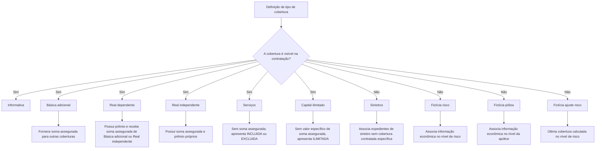
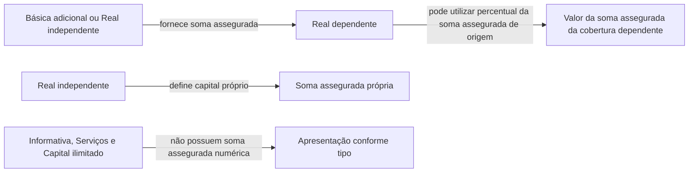

# Definição de Tipos de Cobertura no Reef.core

## 1. Metadados do Documento
- **Arquivo de Origem:** Não identificado no conteúdo fornecido
- **Tipo de Documento:** Especificação Técnica / Manual Funcional
- **Domínio / Sistema:** Reef.core; contratação e emissão de apólices
- **Público-Alvo:** Desenvolvedores, analistas funcionais, arquitetos e equipes de operação de produtos de seguros
- **Data/Versão Identificada:** Não identificada

---

## 2. Resumo Executivo & Contexto de Negócio

O documento especifica o comportamento dos tipos de cobertura utilizados no processo de emissão e contratação de seguros no Reef.core. A classificação de uma cobertura determina se ela aparece na tela de contratação, se possui soma assegurada e se possui prêmio, além de afetar propriedades relacionadas à soma assegurada e ao prêmio.

A especificação define dez tipos de cobertura: Informativa, Básica adicional, Real dependente, Real independente, Serviços, Capital ilimitado, Sinistros, Fictícia risco, Fictícia póliza e Fictícia ajuste risco. Nem todos os tipos representam uma cobertura contratável pelo usuário: alguns são utilizados exclusivamente como estruturas técnicas para agrupamento visual, associação de sinistros ou associação de informações econômicas nos níveis de risco e apólice.

O documento usa como referência um ramo de seguro residencial com as categorias CONTINENTE e CONTENIDO, incluindo coberturas de Roubo, Incêndio e Assistência. Os exemplos demonstram como a soma assegurada pode ser própria, herdada de outra cobertura, calculada como percentual de outra cobertura, inexistente ou apresentada por literais como `INCLUIDA`, `EXCLUIDA` e `ILIMITADA`.

No contexto de negócio, a tipificação permite separar coberturas que impactam o cálculo de prêmio e capital segurado das estruturas usadas apenas para apresentação, cálculo econômico agregado ou processamento de expedientes de sinistros. A definição correta do tipo de cobertura é necessária para que a contratação, a emissão, os cálculos de risco e a exploração de dados de sinistros funcionem no nível apropriado.

---

## 3. Arquitetura, Componentes & Tecnologias Envolvidas

### Sistemas e conceitos identificados

| Componente / Conceito | Papel identificado no documento |
| :--- | :--- |
| **Reef.core** | Sistema que permite apólices com um ou vários riscos e suporta a associação de informações econômicas por risco ou por apólice. |
| **Apólice** | Entidade que pode conter um ou vários riscos. |
| **Risco** | Nível de uma apólice no qual informações econômicas podem ser agregadas mediante uma cobertura Fictícia risco ou Fictícia ajuste risco. |
| **Cobertura** | Entidade que pode possuir visibilidade na contratação, soma assegurada e/ou prêmio, conforme o tipo definido. |
| **Tela de contratação** | Interface em que coberturas visíveis são apresentadas, inclusive com os valores `INCLUIDA`, `EXCLUIDA` ou `ILIMITADA` quando aplicável. |
| **Soma assegurada** | Capital associado a uma cobertura; pode ser inexistente, próprio, fornecido por outra cobertura ou calculado como percentual de outra soma assegurada. |
| **Prêmio** | Valor associado a determinadas coberturas. |
| **Expediente de sinistro** | Registro que pode ser associado à cobertura do tipo Sinistros quando não depende de uma cobertura contratada específica. |
| **Expediente de convênio** | Exemplo de expediente associado ao tipo Sinistros. |

### Relação funcional entre tipos de cobertura



### Fluxo de dependência de soma assegurada



> **Nota de Análise:** O documento não descreve APIs, contratos JSON, métodos HTTP, bancos de dados, servidores, ambientes, pipelines de CI/CD ou integrações externas.

---

## 4. Regras de Negócio, Especificações Funcionais & Processos

### 4.1 Regra geral de classificação

O tipo de cobertura especifica o comportamento da cobertura durante o processo de emissão. A classificação afeta:

1. A presença ou ausência da cobertura na tela de contratação.
2. A existência de soma assegurada.
3. A existência de prêmio.
4. A possibilidade de utilizar, calcular ou referenciar atributos relacionados à soma assegurada.
5. A forma de associação de informações econômicas e de sinistros aos níveis de cobertura, risco ou apólice.

Quando uma cobertura não possui soma assegurada, não é possível determinar atributos que façam referência à soma assegurada, incluindo a forma de revalorização na renovação.

### 4.2 Cobertura Informativa

A cobertura Informativa não é considerada efetivamente uma cobertura. Seu objetivo é atuar como separador visual na tela de contratação.

Regras identificadas:

- É visível na tela de contratação.
- Não possui soma assegurada.
- Não possui prêmio.
- Apresenta somente um texto na tela de contratação.
- Pode ser usada para criar agrupamentos visuais, como `CONTINENTE` e `CONTENIDO`.
- No exemplo documentado, as coberturas de Roubo e Incêndio aparecem abaixo dos separadores CONTINENTE e CONTENIDO.

### 4.3 Cobertura Básica adicional

A cobertura Básica adicional possui soma assegurada, mas não possui prêmio. Seu objetivo é disponibilizar sua soma assegurada para outras coberturas.

Regras identificadas:

- É visível na tela de contratação.
- Possui soma assegurada.
- Não possui prêmio.
- Pode representar, por exemplo, CONTINENTE ou CONTENIDO.
- Outras coberturas, como Roubo e Incêndio, podem tomar a soma assegurada da cobertura Básica adicional correspondente.

### 4.4 Cobertura Real dependente

A cobertura Real dependente possui soma assegurada e prêmio, mas a soma assegurada é fornecida por outra cobertura.

Regras identificadas:

- É visível na tela de contratação.
- Possui soma assegurada.
- Possui prêmio.
- A soma assegurada deve ser fornecida por uma cobertura do tipo Básica adicional ou Real independente.
- Na definição do produto, a soma assegurada da cobertura Real dependente pode ser um percentual da soma assegurada da cobertura da qual depende.
- O documento apresenta o exemplo de uma cobertura de Incêndio que recebe 80% da soma assegurada da cobertura CONTINENTE.
- O documento também apresenta uma cobertura de Incêndio que recebe 100% da soma assegurada da cobertura CONTENIDO.

### 4.5 Cobertura Real independente

A cobertura Real independente possui soma assegurada e prêmio próprios.

Regras identificadas:

- É visível na tela de contratação.
- Possui soma assegurada.
- Possui prêmio.
- A soma assegurada é definida para a própria cobertura.
- Em princípio, a soma assegurada não depende de outra cobertura.
- Pode atuar como origem de soma assegurada para uma cobertura Real dependente.
- No exemplo documentado, as coberturas de Roubo de CONTINENTE e CONTENIDO possuem capital próprio.

### 4.6 Cobertura de Serviços

A cobertura de Serviços não possui soma assegurada, mas possui prêmio.

Regras identificadas:

- É visível na tela de contratação.
- Não possui soma assegurada.
- Possui prêmio.
- A contratação é identificada na tela de contratação pelos valores `INCLUIDA` ou `EXCLUIDA`.
- O exemplo apresenta `Asistencia en viaje` como não contratada, com o literal `EXCLUIDA` e prêmio `0,00`.
- O exemplo apresenta `Asistencia en el hogar` como contratada, com o literal `INCLUIDA` e prêmio `500,00`.

### 4.7 Cobertura de Capital ilimitado

A cobertura de Capital ilimitado possui comportamento funcional semelhante a uma cobertura de Serviços.

Regras identificadas:

- É visível na tela de contratação.
- Não possui soma assegurada numérica.
- Possui prêmio.
- A soma assegurada é ilimitada; portanto, não possui valor específico associado.
- A diferença em relação à cobertura de Serviços é o literal exibido na tela de contratação: `ILIMITADO` ou `ILIMITADA`, conforme exemplificado.
- O exemplo apresenta `Asistencia médica` com literal `ILIMITADA` e prêmio `700,00`.

### 4.8 Cobertura de Sinistros

A cobertura de Sinistros não é considerada uma cobertura contratável e não aparece na tela de contratação.

Regras identificadas:

- Não é visível na tela de contratação.
- Não possui soma assegurada.
- Não possui prêmio.
- É utilizada para associar tipos de expedientes que não exigem uma cobertura contratada específica para realizar uma prestação.
- Expedientes de convênio são apresentados como exemplo de associação a esse tipo de cobertura.
- As informações de sinistros permanecem associadas a essa cobertura, permitindo exploração de informações no nível de cobertura.

### 4.9 Cobertura Fictícia risco

A cobertura Fictícia risco não é uma cobertura contratável e não aparece na tela de contratação.

Regras identificadas:

- Não é visível na tela de contratação.
- Não possui soma assegurada.
- Não possui prêmio.
- É utilizada para associar informação econômica no nível de risco.
- Reef.core permite apólices com um ou vários riscos.
- O tipo deve ser utilizado quando houver necessidade de informação econômica agregada por risco, em vez de por cobertura.
- O documento cita como exemplo o cálculo de direitos de emissão por risco.

### 4.10 Cobertura Fictícia póliza

A cobertura Fictícia póliza tem objetivo semelhante à cobertura Fictícia risco, mas opera no nível completo da apólice.

Regras identificadas:

- Não é visível na tela de contratação.
- Não possui soma assegurada.
- Não possui prêmio.
- A informação econômica associada aplica-se à apólice inteira.
- A aplicação independe da quantidade de riscos existentes na apólice.
- O documento cita como exemplo o cálculo de impostos no nível da apólice.

### 4.11 Cobertura Fictícia ajuste risco

A cobertura Fictícia ajuste risco é semelhante à cobertura Fictícia risco, com uma diferença de ordenação de cálculo.

Regras identificadas:

- Não é visível na tela de contratação.
- Não possui soma assegurada.
- Não possui prêmio.
- É semelhante ao tipo Fictícia risco.
- Deve ser a última cobertura calculada no nível de risco.

---

## 5. Tabelas de Parâmetros, Ambientes e Estruturas de Dados

### 5.1 Matriz consolidada de tipos de cobertura

| Tipo | Código | Visível na contratação | Possui soma assegurada | Possui prêmio | Descrição / função |
| :--- | :--- | :---: | :---: | :---: | :--- |
| Informativa | `1` | Sim | Não | Não | Separador visual e texto na tela de contratação. |
| Básica adicional | `2` | Sim | Sim | Não | Disponibiliza sua soma assegurada a outras coberturas. |
| Real dependente | `3` | Sim | Sim | Sim | Recebe soma assegurada de uma cobertura Básica adicional ou Real independente; pode usar percentual da origem. |
| Real independente | `4` | Sim | Sim | Sim | Possui soma assegurada própria, definida sem dependência de outra cobertura em princípio. |
| Serviços | `5` | Sim | Não | Sim | Cobertura sem soma assegurada; contratação apresentada como `INCLUIDA` ou `EXCLUIDA`. |
| Capital ilimitado | `6` | Sim | Não | Sim | Cobertura sem soma assegurada numérica; apresenta o literal `ILIMITADO` ou `ILIMITADA`. |
| Sinistros | `7` | Não | Não | Não | Associa expedientes que não necessitam de cobertura contratada específica. |
| Fictícia risco | `8` | Não | Não | Não | Associa informação econômica agregada ao nível de risco. |
| Fictícia póliza | `9` | Não | Não | Não | Associa informação econômica no nível completo da apólice. |
| Fictícia ajuste risco | `R` | Não | Não | Não | Tipo semelhante a Fictícia risco, calculado por último no nível de risco. |

### 5.2 Relações de dependência de soma assegurada

| Cobertura de destino | Origem permitida da soma assegurada | Regra de cálculo documentada | Exemplo documentado |
| :--- | :--- | :--- | :--- |
| Real dependente | Básica adicional | Pode utilizar um percentual da soma assegurada da cobertura de origem. | Incêndio recebe 80% da soma assegurada de CONTINENTE. |
| Real dependente | Real independente | Pode utilizar um percentual da soma assegurada da cobertura de origem. | O documento indica Real independente como origem possível, sem exemplo numérico específico dessa relação. |
| Básica adicional | Não aplicável | Possui soma assegurada própria para disponibilização a outras coberturas. | CONTINENTE com `100.000,00`; CONTENIDO com `600.000,00`. |
| Real independente | Não aplicável | Define a própria soma assegurada e, em princípio, não depende de outra cobertura. | Roubo de CONTINENTE com `100.000,00`; Roubo de CONTENIDO com `200.000,00`. |

### 5.3 Exemplos de apresentação na tela de contratação

| Cobertura / agrupamento | Soma assegurada exibida | Prêmio exibido | Tipo ou comportamento associado |
| :--- | :--- | :--- | :--- |
| CONTINENTE | Não exibida no caso Informativa; `100.000,00` no caso Básica adicional | Não aplicável | Informativa ou Básica adicional, conforme a definição. |
| Roubo em CONTINENTE | `100.000,00` | `2.000,00` | Real independente no exemplo final. |
| Incêndio em CONTINENTE | `80.000,00` | `600,00` | Real dependente, com 80% de `100.000,00`. |
| CONTENIDO | Não exibida no caso Informativa; `600.000,00` no caso Básica adicional | Não aplicável | Informativa ou Básica adicional, conforme a definição. |
| Roubo em CONTENIDO | `200.000,00` | `1.000,00` | Real independente no exemplo final. |
| Incêndio em CONTENIDO | `600.000,00` | `3.000,00` | Real dependente, com 100% de `600.000,00`. |
| Asistencia en viaje | `EXCLUIDA` | `0,00` | Serviços não contratada. |
| Asistencia en el hogar | `INCLUIDA` | `500,00` | Serviços contratada. |
| Asistencia médica | `ILIMITADA` | `700,00` | Capital ilimitado. |

### 5.4 Ambientes, servidores, URLs e logs

| Item / Parâmetro | Descrição / Função | Tipo / Valores / Formato | Ambiente / Observações |
| :--- | :--- | :--- | :--- |
| Ambientes | Não detalhados no documento | Não identificado | Não identificado |
| Servidores | Não detalhados no documento | Não identificado | Não identificado |
| URLs | Não detalhadas no documento | Não identificado | Não identificado |
| Rotas de logs | Não detalhadas no documento | Não identificado | Não identificado |
| Variáveis de configuração | Não detalhadas no documento | Não identificado | Não identificado |

---

## 6. Bateria de Perguntas & Respostas para RAG (FAQ Sintético)

### P1: Qual é a finalidade da definição de tipo de cobertura no Reef.core?
**R:** A definição de tipo de cobertura determina o comportamento da cobertura no processo de emissão e contratação. O tipo influencia se a cobertura aparece na tela de contratação, se possui soma assegurada, se possui prêmio e como seus atributos relacionados à soma assegurada podem ser utilizados.

### P2: Quando uma cobertura não possui soma assegurada, quais limitações existem?
**R:** Quando uma cobertura não possui soma assegurada, não é possível determinar atributos que façam referência à soma assegurada. O documento cita como exemplo a impossibilidade de definir a forma de revalorização da soma assegurada na renovação.

### P3: Qual é a diferença entre uma cobertura Informativa e uma cobertura Básica adicional?
**R:** A cobertura Informativa é apenas um separador visual na tela de contratação e não possui soma assegurada nem prêmio. A cobertura Básica adicional é visível, possui soma assegurada e não possui prêmio; sua finalidade é disponibilizar sua soma assegurada para que outras coberturas possam utilizá-la.

### P4: De quais tipos de cobertura uma cobertura Real dependente pode receber sua soma assegurada?
**R:** Uma cobertura Real dependente pode receber sua soma assegurada de uma cobertura Básica adicional ou de uma cobertura Real independente. A soma assegurada recebida pode ser definida como um percentual da soma assegurada da cobertura de origem.

### P5: Como é calculada a soma assegurada da cobertura de Incêndio no exemplo de CONTINENTE?
**R:** No exemplo documentado, a cobertura de Incêndio toma 80% da soma assegurada da cobertura CONTINENTE. Como CONTINENTE possui soma assegurada de `100.000,00`, a cobertura de Incêndio apresenta soma assegurada de `80.000,00` e prêmio de `600,00`.

### P6: O que caracteriza uma cobertura Real independente?
**R:** Uma cobertura Real independente é visível na contratação, possui soma assegurada e possui prêmio. Sua soma assegurada é definida para a própria cobertura e, em princípio, não depende de outra cobertura. No exemplo, as coberturas de Roubo de CONTINENTE e CONTENIDO possuem capital próprio.

### P7: Como a contratação de uma cobertura de Serviços é mostrada na tela?
**R:** Uma cobertura de Serviços não possui soma assegurada, mas possui prêmio. A tela de contratação indica se a cobertura está contratada usando os valores `INCLUIDA` ou `EXCLUIDA`. No exemplo, `Asistencia en viaje` aparece como `EXCLUIDA` com prêmio `0,00`, enquanto `Asistencia en el hogar` aparece como `INCLUIDA` com prêmio `500,00`.

### P8: Qual é a diferença entre o tipo Serviços e o tipo Capital ilimitado?
**R:** Ambos não possuem soma assegurada numérica e possuem prêmio. A diferença é o literal mostrado na tela: uma cobertura de Serviços indica contratação com `INCLUIDA` ou `EXCLUIDA`, enquanto uma cobertura de Capital ilimitado mostra `ILIMITADO` ou `ILIMITADA`, pois a soma assegurada não tem valor específico.

### P9: Para que serve a cobertura do tipo Sinistros?
**R:** A cobertura do tipo Sinistros não é apresentada na tela de contratação e não possui soma assegurada nem prêmio. Ela é usada para associar tipos de expedientes que não precisam de uma cobertura específica contratada para realizar uma prestação, como expedientes de convênio. Dessa forma, as informações de sinistros podem ser exploradas no nível dessa cobertura.

### P10: Quando deve ser utilizada uma cobertura Fictícia risco?
**R:** Uma cobertura Fictícia risco deve ser utilizada quando for necessário associar informação econômica agregada ao nível de risco, em vez de ao nível de cobertura. O documento explica que Reef.core permite apólices com um ou vários riscos e cita o cálculo de direitos de emissão por risco como exemplo.

### P11: Em que nível a cobertura Fictícia póliza associa informações econômicas?
**R:** A cobertura Fictícia póliza associa informações econômicas ao nível completo da apólice, independentemente do número de riscos que a apólice contenha. O documento usa o cálculo de impostos como exemplo de informação econômica calculada nesse nível.

### P12: Qual é a particularidade da cobertura Fictícia ajuste risco?
**R:** A cobertura Fictícia ajuste risco é semelhante à cobertura Fictícia risco, mas possui uma regra adicional de ordenação: ela deve ser a última cobertura calculada no nível de risco.

---

## 7. Glossário de Termos, Siglas & Conceitos-Chave

- **Reef.core:** Sistema citado como capaz de trabalhar com apólices que possuem um ou vários riscos.
- **Apólice:** Entidade de seguro que pode conter um ou vários riscos.
- **Risco:** Nível da apólice ao qual pode ser associada informação econômica agregada.
- **Cobertura:** Elemento de seguro cuja classificação determina visibilidade, soma assegurada, prêmio e comportamento funcional.
- **Soma assegurada:** Valor ou capital associado a uma cobertura; pode ser próprio, derivado de outra cobertura, inexistente ou ilimitado.
- **Prêmio:** Valor associado a uma cobertura quando o tipo prevê prêmio.
- **Cobertura Informativa:** Tipo usado como separador visual, sem soma assegurada e sem prêmio.
- **Cobertura Básica adicional:** Tipo com soma assegurada e sem prêmio, usado como origem de soma assegurada para outras coberturas.
- **Cobertura Real dependente:** Tipo com soma assegurada e prêmio cuja soma assegurada provém de outra cobertura.
- **Cobertura Real independente:** Tipo com soma assegurada e prêmio próprios.
- **Cobertura de Serviços:** Tipo sem soma assegurada e com prêmio, exibido como `INCLUIDA` ou `EXCLUIDA`.
- **Capital ilimitado:** Tipo sem soma assegurada numérica e com prêmio, exibido como `ILIMITADO` ou `ILIMITADA`.
- **Sinistros:** Tipo técnico para associação de expedientes sem necessidade de cobertura contratada específica.
- **Fictícia risco:** Tipo técnico para associação de informação econômica no nível de risco.
- **Fictícia póliza:** Tipo técnico para associação de informação econômica no nível da apólice.
- **Fictícia ajuste risco:** Tipo técnico semelhante à Fictícia risco, calculado por último no nível de risco.
- **Expediente de convênio:** Exemplo de expediente de sinistro associado a uma cobertura do tipo Sinistros.
- **CONTINENTE:** Exemplo de agrupamento ou cobertura base usado no documento.
- **CONTENIDO:** Exemplo de agrupamento ou cobertura base usado no documento.
- **INCLUIDA / EXCLUIDA:** Literais usados na tela de contratação para indicar a contratação ou não de uma cobertura de Serviços.
- **ILIMITADA:** Literal usado na tela de contratação para indicar cobertura de Capital ilimitado.

---

## 8. Notas Críticas, Riscos & Limitações

- O documento não identifica nome do arquivo de origem, versão, data, autor ou responsável pelo conteúdo.
- O documento não detalha regras de implementação, APIs, contratos JSON, métodos HTTP, banco de dados, filas, integrações externas, rotas de log, URLs, servidores ou ambientes.
- A frase sobre a cobertura Básica adicional informa que as coberturas de Roubo e Incêndio “tomarão” a soma assegurada de CONTINENTE e CONTENIDO, mas não define mecanismos técnicos, atributos de configuração ou validações de consistência.
- A cobertura Real dependente pode usar percentual da soma assegurada de origem, mas o documento não informa formatos de percentual, regras de arredondamento, tratamento de valores nulos, limites mínimos ou máximos, nem comportamento de recálculo.
- A cobertura Real independente é descrita como não dependente “em princípio”, sem detalhamento de eventuais exceções.
- A cobertura Fictícia ajuste risco deve ser a última calculada no nível de risco, mas o documento não especifica como a ordem de cálculo é configurada ou validada.
- O documento cita “derechos de emisión” e “impuestos” apenas como exemplos de informações econômicas; não são descritas fórmulas, alíquotas, bases de cálculo ou regras tributárias.
- Há erros tipográficos no conteúdo original, incluindo `Básica adiciional`, `sininiestros` e `los la información`. Esses erros foram preservados na referência bruta por fidelidade documental.

---

## 9. Conteúdo Bruto Estruturado (Referência Fiel)

```text
--- [PÁGINA 1 DE 7] ---

DEFINICIÓN de tipo de cobertura
Objetivo
Especifica el comportamiento de la cobertura en el proceso de emisión. Básicamente afecta a si
aparece en el momento de la contratación, la suma asegurada y el cálculo de la prima, así como
aquellas propiedades que afectan a la definición relacionadas con suma asegurada y prima.
Así por ejemplo, una cobertura puede que no disponga de suma asegurada. Esto implica que no será
posible determinar ningún atributo que haga referencia a la suma asegurada, forma en la que
revaloriza en la renovación, etc.
Los tipos que existen son:
TIPO DESCRIPCIÓN
1 INFORMATIVA
2 BÁSICA ADICIONAL
3 REAL DEPENDIENTE
4 REAL INDEPENDIENTE
5 SERVICIOS
 /
 CF
Home Solutions APIs Documentation Zeus
EN


--- [PÁGINA 2 DE 7] ---

TIPO DESCRIPCIÓN
6 CAPITAL ILIMITADO
7 SINIESTROS
8 FICTICIA RIESGO
9 FICTICIA PÓLIZA
R FICTICIA AJUSTE RIESGO
Tipos
Informativa
Este tipo realmente no se la considera cobertura, se utiliza como "separador" en la pantalla de
contratación. Es simplemente un texto que aparecerá en la pantalla, por lo que cuando se defina en
un ramo, no dispondrá de suma asegurada ni de prima.
Por ejemplo, si se tiene un ramo de hogar en el que existen coberturas que cubren el robo y el
incendio** tanto para el continente como para el contenido, se puede utilizar este tipo de cobertura
para crear una cobertura llamada CONTINENTE y otra cobertura llamada CONTENIDO. En una
hipotética pantalla, y atendiendo al este ejemplo, quedaría de la siguiente forma (marcado en negrita
e itálica):
COBERTURA SUMA ASEGURADA PRIMA
CONTINENTE
Robo 100.000,00 2.000,00
Incendio 80.000,00 600,00
CONTENIDO
Robo 200.000,00 1.000,00
Incendio 600.000,00 3.000,00


--- [PÁGINA 3 DE 7] ---

Básica adicional
Es una cobertura que dispone de suma asegurada pero no dispone de prima. Está pensada para
ofrecer su suma asegurada a otras coberturas.
Variando el ejemplo del tipo de cobertura anterior (Informativa, se puede realizar una definición de
cobertura como CONTINENTE y otra como CONTENIDO que disponen de suma asegurada y,
posteriormente las coberturas de Robo e Incendio tomarán la suma asegurada de la cobertura
CONTINENTE y CONTENIDO respectivamente. El ejemplo (marcado en negrita e itálica) a
continuación:
COBERTURA SUMA ASEGURADA PRIMA
CONTINENTE 100.000,00
Robo 100.000,00 2.000,00
Incendio 80.000,00 600,00
CONTENIDO 600.000,00
Robo 200.000,00 1.000,00
Incendio 600.000,00 3.000,00
Real dependiente
Una cobertura de este tipo, dispone de suma asegurada y de prima, pero la suma asegurada lo
proporciona otra cobertura como debe ser Básica adiciional o Real independiente. En la definición de
producto, se verá que la suma asegurada que toma este tipo de cobertura puede ser un porcentaje
de la cobertura de la cual dependa. Es decir, puede (por ejemplo), tomar un 80% de la suma
asegurada de la cobertura de la que toma la suma asegurada.
Siguiendo con el ejemplo anterior, se va a suponer que la cobertura de Incendio toma la suma
asegurada de la cobertura de CONTINENTE en un 80%, y la otra cobertura de Incendio toma la
suma asegurada de la cobertura de CONTENIDO en un 100%. A continuación se muestra el
resultado (en negrita e itálica):
COBERTURA SUMA ASEGURADA PRIMA
CONTINENTE 100.000,00


--- [PÁGINA 4 DE 7] ---

COBERTURA SUMA ASEGURADA PRIMA
Robo 100.000,00 2.000,00
Incendio 80.000,00 600,00
CONTENIDO 600.000,00
Robo 200.000,00 1.000,00
Incendio 600.000,00 3.000,00
Real independiente
Es una cobertura que dispone tanto de suma asegurada como de prima. La suma asegurada se
define y en principio no depende de ninguna otra cobertura.
Siguiendo el ejemplo, se va a suponer que la cobertura de Robo (tanto de CONTINENTE como de
CONTENIDO), disponen de su propio capital. A continuación se muestra el resultado (en negrita e
itálica)
COBERTURA SUMA ASEGURADA PRIMA
CONTINENTE 100.000,00
Robo 100.000,00 2.000,00
Incendio 80.000,00 600,00
CONTENIDO 600.000,00
Robo 200.000,00 1.000,00
Incendio 600.000,00 3.000,00
Servicios
Este tipo NO dispone de suma asegurada, pero dispone de prima. La contratación o no de este tipo
de cobertura se conoce si aparece el valor "INCLUIDA" o "EXCLUIDA" en la pantalla de
contratación. Para mostrar un ejemplo, se supone que existe una cobertura llamada Asistencia en


--- [PÁGINA 5 DE 7] ---

viaje que estaría NO contratada y otra cobertura de Asistencia en el hogar que SI estaría contratada
(en negrita e itálica)
COBERTURA SUMA ASEGURADA PRIMA
CONTINENTE 100.000,00
Robo 100.000,00 2.000,00
Incendio 80.000,00 600,00
CONTENIDO 600.000,00
Robo 200.000,00 1.000,00
Incendio 600.000,00 3.000,00
Asistencia en viaje EXCLUIDA 0,00
Asistencia en el hogar INCLUIDA 500,00
Capital ilimitado
Al tener una suma asegurada ilimitada, realmente no lleva asociado un valor específico por lo que en
realidad es una cobertura tipo servicio. Es decir, sin suma asegurada, pero con prima. La diferencia
radica en el literal que aparece en pantalla que muestra el valor "ILIMITADO". Por ejemplo, existe
una cobertura llamada Asistencia médica que es de este tipo, la pantalla mostraría la información que
se detalla a continuación (en negrita e itálica):
COBERTURA SUMA ASEGURADA PRIMA
CONTINENTE 100.000,00
Robo 100.000,00 2.000,00
Incendio 80.000,00 600,00
CONTENIDO 600.000,00


--- [PÁGINA 6 DE 7] ---

COBERTURA SUMA ASEGURADA PRIMA
Robo 200.000,00 1.000,00
Incendio 600.000,00 3.000,00
Asistencia en viaje EXCLUIDA 0,00
Asistencia en el hogar INCLUIDA 500,00
Asistencia médica ILIMITADA 700,00
Siniestros
Este tipo, realmente no es una cobertura, por lo que no se muestra en la pantalla de contratación. Se
utiliza con el fin de asociar tipos de expedientes que no necesitan de una cobertura en particular
contratada para realizar una prestación. Esto ocurre por ejemplo con los expedientes de convenio.
Este tipo de expedientes se suelen asociar a este tipo de cobertura ya que toda la información de
sininiestros queda asociado a esta cobertura pudiendo explotar información a este nivel (de
cobertura).
Ficticia riesgo
Otro tipo que no es una cobertura y, que tampoco aparecerá en la pantalla de contratación. La
utilidad de este tipo de cobertura es la de poder asociar información económica a nivel de riesgo. Hay
que recordar que Reef.core permite disponer de pólizas con uno o varios riesgos. Hay ocasiones
donde es necesario disponer de información económica agregada por riesgo (en vez de cobertura
que es la asociación más natural). Cuando esto ocurre, los la información económica puede
asociarse al riesgo mediante este tipo de cobertura. Un ejemplo podría ser cuando es necesario que
los derechos de emisión se calculen por riesgo.
Ficticia póliza
Este tipo de cobertura es parecido al tipo ficticia riesgo, pero el ámbito de la información económica
aplica a la póliza completa independientemente del número de riesgos que contenga la póliza. Un
ejemplo podría ser que los impuestos se calculen a este nivel.
Ficticia ajuste riesgo
Otro tipo de cobertura muy parecida a ficticia riesgo con la diferencia que esta cobertura va a ser la
última que se calcule en el nivel riesgo.


--- [PÁGINA 7 DE 7] ---

Resumen
Como compendio se muestra la siguiente tabla que refleja lo visto anteriormente
TIPO VISIBLE CON SUMA ASEGURADA CON PRIMA
INFORMATIVA SI NO NO
BÁSICA ADICIONAL SI SI NO
REAL DEPENDIENTE SI SI SI
REAL INDEPENDIENTE SI SI SI
SERVICIOS SI NO SI
CAPITAL ILIMITADO SI NO SI
SINIESTROS NO NO NO
FICTICIA RIESGO NO NO NO
FICTICIA PÓLIZA NO NO NO
FICTICIA AJUSTE RIESGO NO NO NO
```
