# Definição de Suplemento — Propriedades Funcionais, Vigência, Prorrateio e Vida

## 1. Metadados do Documento
- **Arquivo de Origem:** Não identificado no conteúdo fornecido
- **Tipo de Documento:** Especificação Técnica / Manual Funcional
- **Domínio / Sistema:** Definição de suplementos de apólice; Home Solutions APIs Documentation Zeus
- **Público-Alvo:** Analistas funcionais, desenvolvedores, arquitetos e operação de seguros
- **Data/Versão Identificada:** Não identificada

---

## 2. Resumo Executivo & Contexto de Negócio

O documento descreve a configuração funcional de um **suplemento** aplicado a apólices, aplicações ou a ambos. Um suplemento possui um tipo, nome, âmbito de utilização, estado de inabilitação e um conjunto de propriedades que determina os seus efeitos sobre atributos de apólice, vigência, recibos, cláusulas, textos, inspeção, cancelamento, reabilitação, mudança de agente e operações de vida.

A definição apresenta uma taxonomia de tipos de suplemento, incluindo anulação, reabilitação, mudança de forma de pagamento, mudança de agente, extensão de vigência, renovação, regularização, emissão, resgate, redução e operações específicas de vida e fundos. Essa taxonomia é identificada por códigos como `AT`, `RE`, `CV`, `CA`, `MV`, `RF`, `RS`, `RD` e `SM`.

As propriedades gerais controlam comportamentos como modificação de atributos, tratamento de cláusulas, inclusão de textos anexos, obrigatoriedade de observações, geração de suplemento público, geração de novos recibos, validação do plano de pagamento e retarificação de riscos. Determinadas propriedades apontam para procedimentos de lógica de negócio responsáveis por decidir ou calcular comportamentos específicos.

O documento também organiza propriedades por domínio funcional: vigência, prorrateio, número de apólice, inspeção, anulação de apólice, reabilitação, alteração de agente, anulação de suplemento e vida. Não são detalhados contratos de API, métodos HTTP, estruturas JSON, nomes concretos de procedimentos ou implementações técnicas das lógicas de negócio mencionadas.

---

## 3. Arquitetura, Componentes & Tecnologias Envolvidas

O conteúdo fornecido não descreve uma arquitetura de infraestrutura, microsserviços, bancos de dados, protocolos ou integrações técnicas. A única referência de contexto é **Home Solutions APIs Documentation Zeus**.

A estrutura funcional extraída organiza a entidade **Suplemento** e as suas propriedades de configuração:

```mermaid
graph TD
  S[Suplemento] --> D[Propriedades de definição]
  S --> G[Propriedades gerais]
  S --> V[Propriedades de vigência]
  S --> P[Propriedades de prorrateio]
  S --> N[Propriedades de número de póliza]
  S --> I[Propriedades de inspeção]
  S --> AP[Propriedades de anulação de póliza]
  S --> R[Propriedades de reabilitação]
  S --> CA[Propriedades de cambio de agente]
  S --> AS[Propriedades de anulação de suplemento]
  S --> L[Propriedades de vida]

  D --> T[Tipo de suplemento]
  D --> NO[Nome]
  D --> AM[Âmbito]
  D --> INH[Inhabilitado]

  G --> MA[Modifica atributos]
  G --> CL[Trata cláusulas]
  G --> TA[Permite textos anexos]
  G --> OO[Observação obrigatória]
  G --> GP[Genera suplemento público]
  G --> GR[Genera novos recibos]
  G --> VP[Valida o plano de pagamento]
  G --> TR[Lógica para tarificar todos os riscos]

  V --> TV[Tipo de vigência]
  V --> MV[Modifica a vigência]
  V --> ET[É temporal]

  P --> PR[Prorrata]
  P --> AE[Tipo de anulação a escala]
  P --> CAE[Lógica para coeficiente de anulação]
```



> **Nota de Análise:** o documento cita procedimentos de lógica de negócio para retarificação, coeficiente de anulação, mudança de número de apólice e reinspeção, mas não informa os nomes concretos, assinaturas, tecnologias ou regras internas desses procedimentos.

---

## 4. Regras de Negócio, Especificações Funcionais & Processos

### 4.1 Definição e utilização do suplemento

Um suplemento pode ser utilizado nos seguintes âmbitos:

1. **Pólizas** (`1`)
2. **Aplicações** (`2`)
3. **Pólizas e aplicações** (`3`)

O suplemento pode ser marcado como **Inhabilitado**, indicando que o registro está inabilitado.

### 4.2 Tipos de suplemento

Os tipos de suplemento identificados são:

- `IN` — Indeterminado
- `AT` — Anulação
- `RE` — Reabilitação
- `CV` — Mudança de forma de pagamento
- `CA` — Mudança de agente
- `MV` — Extensão de vigência
- `RF` — Renovação
- `RG` — Regularização
- `XX` — Emissão
- `AN` — Antecipação
- `CN` — Recobro de antecipação
- `RS` — Resgate
- `RD` — Redução
- `RR` — Reabilitação de apólices reduzidas
- `AE` — Aportações extraordinárias
- `AS` — Anulação de suplementos
- `ER` — Extinção do risco
- `PG` — Seguro prorrogado (vida)
- `DS` — Diminuição por sinistro
- `LT` — Liquidação de transportes
- `AP` — Anulação parcial
- `RC` — Restituição de capital
- `AD` — Adicional
- `SA` — Suplemento de anualidade anterior
- `AA` — Anulação de suplemento de anualidade anterior
- `AX` — Anulação de suplemento temporal
- `RP` — Resgate parcial
- `SM` — Nominativo

### 4.3 Propriedades gerais

- **Modifica atributos:** indica se serão solicitados dados variáveis ao nível de apólice nos suplementos. Essa variável somente será solicitada para suplementos dos tipos `AT`, `RE`, `LT`, `ER`, `CV` ou `CA`.
- **Trata cláusulas:** indica que o suplemento possui cláusulas associadas.
- **Permite textos anexos:** permite incluir texto livre na apólice.
- **Observação obrigatória:** indica que as observações devem ser obrigatórias.
- **Genera suplemento público:** sinaliza que o suplemento gera suplemento público.
- **Genera novos recibos:** indica que, no suplemento, será criada uma nova numeração de recibos, mesmo quando as condições permitirem gerar parcelas em um recibo existente.
- **Valida o plano de pagamento:** marca de validação do plano de pagamento.
- **Lógica de negócio para tarificar todos os riscos:** procedimento que determina se o suplemento deve obrigar a retarificação de todos os riscos.

### 4.4 Propriedades de vigência

- **Tipo de vigência:** define o tipo de vigência aplicável aos tipos de suplemento.
  - `1` — Vigência standard
  - `2` — Vigência com descontinuidade
- **Modifica a vigência:** indica se é permitido modificar a vigência da apólice por meio do suplemento.
- **É temporal:** indica se o suplemento é temporal.

### 4.5 Propriedades de prorrateio

- **Prorrata:** define o método de cálculo:
  - `S` — Prorrata
  - `N` — Escala
- **Tipo de anulação a escala:** quando aplicável, define o tipo de anulação a escala:
  - `1` — Direto sobre percentual de anulação
  - `2` — Proporcional sobre percentual de anulação
  - `3` — Proporcional sobre percentual de constituição
- **Lógica de negócio para o coeficiente de anulação:** nome do procedimento que calcula o coeficiente de anulação.

### 4.6 Propriedades de número de apólice

- **Cambia el número de póliza:** altera o número da apólice na renovação.
- **Lógica de negócio para mudança do número de apólice:** procedimento para recuperar o valor do campo `mca_cambio_num_poliza`.

### 4.7 Propriedades de inspeção

- **Reinspeção:** procedimento para determinar se o suplemento deve obrigar a reinspecionar o risco.
- **Lógica de negócio para reinspeção:** procedimento para determinar se o suplemento deve obrigar a reinspecionar o risco.

> **Nota de Análise:** a descrição fornecida para “Reinspeção” e “Lógica de negócio para reinspeção” é equivalente; o documento não explica a diferença funcional entre os dois campos.

### 4.8 Propriedades de anulação de apólice

- **Se devuelven conceptos de desglose cuya definición lo impide:** indica se deve ser perguntado se é devolvida a totalidade do valor nas liquidações.

### 4.9 Propriedades de reabilitação

- **Tipo de reabilitação:** determina o comportamento do suplemento de reabilitação:
  - `1` — Standard
  - `2` — Estendendo vigência
  - `3` — Sem estender vigência
  - `4` — Rewrite

### 4.10 Propriedades de mudança de agente

- **Se valida efectos de recibos pendientes:** listado sem comentário adicional no documento.
- **Se valida el cambio de estructura comercial:** indica se, em mudanças de agente, deve ser validado que os agentes pertençam à mesma estrutura comercial.
- **Genera suplemento nominativo:** indica se o movimento de mudança de agente é convertido em movimento nominativo.
- **Recalcula comisiones:** permite o recálculo das comissões nas mudanças de agente.

### 4.11 Propriedades de anulação de suplemento

- **Se selecciona el suplemento a anular:** indica se é permitido selecionar o suplemento que será anulado.

### 4.12 Propriedades de vida

- **`mca_sini_pol_anul`:** indica os suplementos de resgate total para os quais Sinistros permitirá a tramitação.
- **`mca_calcula_val_garantizados`:** indica se o suplemento calcula valores garantidos.
- **`tip_spto_fondo`:** tipo de suplemento de fundo:
  - `UP` — Atribuição de unidades de participação
  - `RP` — Resgate parcial de fundo
  - `CF` — Mudança de fundo
  - `RS` — Resgate total de fundo
  - `PA` — Aportação pactuada
  - `AE` — Aportação extraordinária
  - `CP` — Mudança de aportação pactuada
  - `SP` — Suspensão de plano de aportação
  - `RV` — Regularização vida

---

## 5. Tabelas de Parâmetros, Ambientes e Estruturas de Dados

| Item / Parâmetro | Descrição / Função | Tipo / Valores / Formato | Ambiente / Observações |
| :--- | :--- | :--- | :--- |
| Tipo de suplemento | Classifica o suplemento | `IN`, `AT`, `RE`, `CV`, `CA`, `MV`, `RF`, `RG`, `XX`, `AN`, `CN`, `RS`, `RD`, `RR`, `AE`, `AS`, `ER`, `PG`, `DS`, `LT`, `AP`, `RC`, `AD`, `SA`, `AA`, `AX`, `RP`, `SM` | Sem ambiente informado |
| Nome | Nome do suplemento | Texto | Sem detalhamento adicional |
| Âmbito | Define a utilização do suplemento | `1` Pólizas; `2` Aplicaciones; `3` Pólizas y aplicaciones | Sem detalhamento adicional |
| Inhabilitado | Indica que o registro está inabilitado | Indicador não especificado | Sem detalhamento adicional |
| Modifica atributos | Solicita dados variáveis na apólice | Aplicável a `AT`, `RE`, `LT`, `ER`, `CV` ou `CA` | Regra explícita do documento |
| Trata cláusulas | Indica cláusulas associadas | Indicador não especificado | Sem detalhamento adicional |
| Permite textos anexos | Permite texto livre na apólice | Indicador não especificado | Sem detalhamento adicional |
| Observação obrigatória | Torna observações obrigatórias | Indicador não especificado | Sem detalhamento adicional |
| Genera suplemento público | Indica geração de suplemento público | Indicador não especificado | Sem detalhamento adicional |
| Genera novos recibos | Cria nova numeração de recibos | Indicador não especificado | Mesmo se houver condições para parcelas em recibo existente |
| Valida o plano de pagamento | Controla a validação do plano de pagamento | Indicador não especificado | Sem detalhamento adicional |
| Lógica para tarificar todos os riscos | Determina retarificação obrigatória de todos os riscos | Procedimento não nomeado | Nome e implementação não informados |
| Tipo de vigência | Define a vigência do suplemento | `1` Standard; `2` Com descontinuidade | Sem detalhamento adicional |
| Modifica a vigência | Permite alterar a vigência da apólice | Indicador não especificado | Alteração por meio do suplemento |
| É temporal | Identifica suplemento temporal | Indicador não especificado | Sem detalhamento adicional |
| Prorrata | Define o método de cálculo | `S` Prorrata; `N` Escala | “Prorrata-temporis ou a escala” |
| Tipo de anulação a escala | Define cálculo de anulação a escala | `1` Direto s/% anulação; `2` Proporcional s/% anulação; `3` Proporcional s/% constituição | Sem detalhamento matemático |
| Lógica para coeficiente de anulação | Calcula o coeficiente de anulação | Procedimento não nomeado | Sem implementação informada |
| Cambia el número de póliza | Altera o número da apólice | Indicador não especificado | Aplicável na renovação |
| `mca_cambio_num_poliza` | Campo recuperado pela lógica de mudança de número | Campo de dados | Tipo não informado |
| Reinspeção | Determina obrigação de reinspecionar o risco | Procedimento não nomeado | Sem critérios informados |
| Tipo de reabilitação | Define modalidade da reabilitação | `1` Standard; `2` Estendendo vigência; `3` Sem estender vigência; `4` Rewrite | Sem detalhamento adicional |
| Validação de recibos pendentes | Valida efeitos de recibos pendentes | Não especificado | Documento indica “sin comentario” |
| Validação de estrutura comercial | Valida pertença à mesma estrutura comercial | Indicador não especificado | Aplicável a mudanças de agente |
| Genera suplemento nominativo | Converte mudança de agente em nominativo | Indicador não especificado | Sem detalhamento adicional |
| Recalcula comisiones | Permite recálculo de comissões | Indicador não especificado | Aplicável a mudanças de agente |
| Seleção de suplemento a anular | Permite escolher o suplemento alvo de anulação | Indicador não especificado | Sem detalhamento adicional |
| `mca_sini_pol_anul` | Permite tramitação de sinistros para suplementos de resgate total | Campo de dados | Sem tipo informado |
| `mca_calcula_val_garantizados` | Indica cálculo de valores garantidos | Campo de dados | Sem tipo informado |
| `tip_spto_fondo` | Classifica suplemento de fundo | `UP`, `RP`, `CF`, `RS`, `PA`, `AE`, `CP`, `SP`, `RV` | Operações específicas de vida/fundo |

---

## 6. Bateria de Perguntas & Respostas para RAG (FAQ Sintético)

### P1: Quais âmbitos de utilização podem ser configurados para um suplemento?
**R:** Um suplemento pode ser configurado para utilização em `1` Pólizas, `2` Aplicações ou `3` Pólizas e aplicações. O documento não descreve regras adicionais de prioridade ou compatibilidade entre esses âmbitos.

### P2: Quando a propriedade “Modifica atributos” solicita dados variáveis no nível da apólice?
**R:** A propriedade “Modifica atributos” indica que serão solicitados dados variáveis no nível da apólice. Segundo o documento, essa variável somente é solicitada para suplementos dos tipos `AT` Anulação, `RE` Reabilitação, `LT` Liquidação de transportes, `ER` Extinção do risco, `CV` Mudança de forma de pagamento e `CA` Mudança de agente.

### P3: O que significa a propriedade “Genera nuevos recibos”?
**R:** “Genera nuevos recibos” indica que o suplemento criará uma nova numeração de recibos, mesmo quando as condições permitirem gerar parcelas em um recibo existente.

### P4: Quais são os tipos de vigência disponíveis para suplementos?
**R:** O documento define dois tipos de vigência: `1` Vigência standard e `2` Vigência com descontinuidade. Também existem as propriedades “Modifica a vigência”, que permite alterar a vigência da apólice por meio do suplemento, e “É temporal”, que identifica se o suplemento é temporal.

### P5: Como funciona a configuração de prorrateio de um suplemento?
**R:** A propriedade “Prorrata” define se o cálculo será `S` prorrata ou `N` escala. O documento caracteriza a configuração como cálculo “prorrata-temporis ou a escala”, mas não fornece fórmulas, períodos de cálculo ou exemplos numéricos.

### P6: Quais opções existem para o tipo de anulação a escala?
**R:** O tipo de anulação a escala pode ser `1` Direto sobre percentual de anulação, `2` Proporcional sobre percentual de anulação ou `3` Proporcional sobre percentual de constituição. O cálculo concreto é referido pela “Lógica de negócio para o coeficiente de anulação”, mas o procedimento não é identificado.

### P7: Como a mudança de número de apólice é tratada em um suplemento?
**R:** A propriedade “Cambia el número de póliza” indica que o número da apólice é alterado na renovação. A lógica de negócio relacionada recupera o valor do campo `mca_cambio_num_poliza`; o tipo desse campo e a regra de recuperação não são detalhados.

### P8: Quais tipos de reabilitação estão disponíveis?
**R:** O suplemento de reabilitação pode ser configurado como `1` Standard, `2` Estendendo vigência, `3` Sem estender vigência ou `4` Rewrite. O documento não explica os efeitos operacionais específicos de cada modalidade além dos respectivos nomes.

### P9: Que validações são previstas para a mudança de agente?
**R:** A mudança de agente possui uma propriedade para validar efeitos de recibos pendentes, embora o documento a apresente sem comentário adicional. Também pode validar que os agentes pertençam à mesma estrutura comercial, converter o movimento em suplemento nominativo e permitir o recálculo de comissões.

### P10: O que é configurado em `tip_spto_fondo`?
**R:** `tip_spto_fondo` define o tipo de suplemento de fundo. Os valores documentados são `UP` Atribuição de unidades de participação, `RP` Resgate parcial de fundo, `CF` Mudança de fundo, `RS` Resgate total de fundo, `PA` Aportação pactuada, `AE` Aportação extraordinária, `CP` Mudança de aportação pactuada, `SP` Suspensão de plano de aportação e `RV` Regularização vida.

### P11: Qual é a finalidade de `mca_sini_pol_anul`?
**R:** O campo `mca_sini_pol_anul` indica os suplementos de resgate total sobre os quais a área ou função de Sinistros permitirá a tramitação. O documento não especifica os valores possíveis, o formato do campo ou o fluxo de tramitação.

### P12: O documento descreve APIs ou contratos técnicos para suplementos?
**R:** Não. Embora o conteúdo mencione “Home Solutions APIs Documentation Zeus”, não há descrição de endpoints, métodos HTTP, autenticação, contratos JSON, serviços, mensagens ou tecnologias de implementação.

---

## 7. Glossário de Termos, Siglas & Conceitos-Chave

- **Suplemento:** Entidade configurável associada a apólices, aplicações ou ambos, com propriedades funcionais que determinam efeitos e validações.
- **Apólice / Póliza:** Contrato de seguro referido pelo documento.
- **Recibo:** Documento ou estrutura associada à numeração e às parcelas de cobrança.
- **Prorrata:** Método de cálculo identificado pelo valor `S`.
- **Escala:** Método de cálculo identificado pelo valor `N`.
- **Reabilitação:** Tipo de suplemento para reabilitar uma apólice ou condição, identificado pelo código `RE`.
- **Reinspeção:** Determinação de que o risco deve ser reinspecionado.
- **Retarificação:** Processo referido como tarificação de todos os riscos.
- **Nominativo:** Tipo ou característica de suplemento identificado pelo código `SM`; também pode resultar de mudança de agente.
- **Sinistros:** Área ou função que permite tramitação para determinados suplementos de resgate total.
- **`mca_cambio_num_poliza`:** Campo cujo valor é recuperado pela lógica de mudança de número de apólice.
- **`mca_sini_pol_anul`:** Campo que indica suplementos de resgate total para os quais Sinistros permite tramitação.
- **`mca_calcula_val_garantizados`:** Campo que indica se o suplemento calcula valores garantidos.
- **`tip_spto_fondo`:** Campo de tipo de suplemento de fundo.
- **`AT`:** Anulação.
- **`RE`:** Reabilitação.
- **`CV`:** Mudança de forma de pagamento.
- **`CA`:** Mudança de agente.
- **`MV`:** Extensão de vigência.
- **`RF`:** Renovação.
- **`RS`:** Resgate; em `tip_spto_fondo`, resgate total de fundo.
- **`RP`:** Resgate parcial; em `tip_spto_fondo`, resgate parcial de fundo.
- **`AE`:** Aportações extraordinárias.
- **`UP`:** Atribuição de unidades de participação.
- **`CF`:** Mudança de fundo.
- **`PA`:** Aportação pactuada.
- **`CP`:** Mudança de aportação pactuada.
- **`SP`:** Suspensão de plano de aportação.
- **`RV`:** Regularização vida.

---

## 8. Notas Críticas, Riscos & Limitações

- O conteúdo não informa nome do arquivo, data, versão, autoria ou sistema corporativo responsável pela configuração de suplementos.
- O documento não detalha os procedimentos de lógica de negócio citados para retarificação, coeficiente de anulação, mudança de número de apólice e reinspeção.
- Não há definição de tipos físicos, obrigatoriedade, valores padrão, domínios completos, persistência de dados ou dependências técnicas dos campos.
- Não há fórmulas para cálculo de prorrata, escala, coeficiente de anulação ou valores garantidos.
- A propriedade “Se valida efectos de recibos pendientes” é apresentada sem explicação adicional.
- A expressão “Se devuelven conceptos de desglose cuya definición lo impide” possui uma descrição associada, mas não apresenta critérios funcionais, estrutura de dados ou exceções.
- Não há fluxos de erro, permissões, auditoria, regras de segurança ou critérios de integração entre sistemas.
- A referência a **Home Solutions APIs Documentation Zeus** não é acompanhada de detalhes técnicos que permitam inferir APIs ou integrações.

---

## 9. Conteúdo Bruto Estruturado (Referência Fiel)

```text
--- [PÁGINA 1 DE 10] ---

EN CONSTRUCCIÓN
DEFINICIÓN de Suplemento
Objetivo
Propiedades de definición
Propiedades generales
Propiedades de vigencia
Propiedades de prorrateo
Propiedades de número de póliza
Propiedades de inspección
Propiedades de anulación de póliza
Propiedades de rehabilitación
Propiedades de cambio de agente
Propiedades de anulación de suplemento
Propiedades de vida
Propiedades de definición
Suplemento
suplemento
 /
 CF
Home Solutions APIs Documentation Zeus
EN


--- [PÁGINA 2 DE 10] ---

Suplemento extensión
suplemento
Tipo de suplemento
tipo de suplemento
(IN)Indeterminado
(AT)Anulacion
(RE)Rehabilitacion
(CV)Cambio forma pago
(CA)Cambio de agente
(MV)Extension vigencia
(RF)Renovacion
(RG)Regularizacion
(XX)Emision
(AN)Anticipo
(CN)Recobro de anticipo
(RS)Rescate
(RD)Reduccion
(RR)Reha. pol. reducidas
(AE)Aportaciones extraordinarias
(AS)Anulacion de suplementos.
(ER)Extincion del riesgo
(PG)Seguro porrogado(vida)
(DS)Disminucion por siniestro
(LT)Liquidacion de transportes
(AP)Anulacion parcial
(RC)Restitucion de capital
(AD)Adicional
(SA)Spto. anualidad anterior
(AA)Anulacion spto.anual.anterior
(AX)Anulacion spto. temporal
(RP)Rescate parcial
(SM)Nominativo


--- [PÁGINA 3 DE 10] ---

(IN)Indeterminado
(AT)Anulacion
(RE)Rehabilitacion
(CV)Cambio forma pago
(CA)Cambio de agente
(MV)Extension vigencia
(RF)Renovacion
(RG)Regularizacion
(XX)Emision
(AN)Anticipo
(CN)Recobro de anticipo
(RS)Rescate
(RD)Reduccion
(RR)Reha. pol. reducidas
(AE)Aportaciones extraordinarias


--- [PÁGINA 4 DE 10] ---

(AS)Anulacion de suplementos.
(ER)Extincion del riesgo
(PG)Seguro porrogado(vida)
(DS)Disminucion por siniestro
(LT)Liquidacion de transportes
(AP)Anulacion parcial
(RC)Restitucion de capital
(AD)Adicional
(SA)Spto. anualidad anterior
(AA)Anulacion spto.anual.anterior
(AX)Anulacion spto. temporal
(RP)Rescate parcial
(SM)Nominativo
Nombre
nombre del suplemento
Ambito


--- [PÁGINA 5 DE 10] ---

utilizacion del suplemento: 1- poliza 2- aplicacion 3- ambas
(1)Polizas
(2)Aplicaciones
(3)Polizas y aplicaciones
(1)Polizas
(2)Aplicaciones
(3)Polizas y aplicaciones
Inhabilitado
registro inhabilitado
Propiedades generales
Modifica atributos
indica si se van a apedir datos variables a nivel de poliza en los suplementos, esta variable solo se
pedira en caso de ser: at,re,lt,er,cv o ca
Trata cláusulas
tiene cláusulas asociadas
Permite textos anexos
permite incluir texto libre en la póliza
Observación obligatoria
indica si las observaciones son obligatorias
Genera suplemento público
marca si el suplemento genera suplemento publico
Genera nuevos recibos


--- [PÁGINA 6 DE 10] ---

indica si en el suplemento se creara una nueva numeracion de recibos aunque las condiciones
permitan generar cuotas en un recibo existente
Valida el plan de pago
marca de validación del plan de pago
Lógica de negocio para tarificar todos los riesgos
procedimiento para determinar si el suplemento debe obligar a retarificar todos los riesgos
Propiedades de vigencia
tipo de vigencia
tipo de vigencia para los tipos de suplemento
(1)Vigencia standard
(2)Vigencia con discontinuidad
(1)Vigencia standard
(2)Vigencia con discontinuidad
Modifica la vigencia
indica si se permite modificar la vigencia de la poliza a traves del suplemento
Es temporal
indica si el suplemento es temporal
Propiedades de prorrateo
Prorrata
cálculo prorrata-temporis o a escala
(S) prorrata
(N) escala
(S) prorrata


--- [PÁGINA 7 DE 10] ---

(N) escala
Tipo de anulación a escala
tipo de anulacion a escala: 1- directo s/% 2-proporcional s/% anulacion 3-proporcional s/%
constitucion
(1)Directo s/% anulacion
(3)Proporcional s/% constitucion
(2)Proporcional s/% anulacion
(1)Directo s/% anulacion
(3)Proporcional s/% constitucion
(2)Proporcional s/% anulacion
Lógica de negocio para el coeficiente de anulación
nombre del procedimiento que calcula el coeficiente de anulacion
Propiedades de número de póliza
Cambia el número de póliza
cambia el número de la póliza en la renovación
Lógica de negocio para cambio del número de póliza
procedimiento para recuperar el valor del campo mca_cambio_num_poliza
Propiedades de inspección
Reinspección
procedimiento para determinar si el suplemento debe obligar a reinspeccionar el riesgo
Lógica de negocio para reinspección
procedimiento para determinar si el suplemento debe obligar a reinspeccionar el riesgo


--- [PÁGINA 8 DE 10] ---

Propiedades de anulación de póliza
Se devuelven conceptos de desglose cuya definición lo impide
indica si se debe preguntar si devuelve la totalidad del importe en liquidaciones
Propiedades de rehabilitación
Tipo de rehabilitación
tipo de suplemento de rehabilitacion: 1 - standard 2 - extendiendo vigencia 3 - sin extender vigencia
(1)Standard
(2)Extendiendo vigencia
(3)Sin extender vigencia
(4)Rewrite
(1)Standard
(2)Extendiendo vigencia
(3)Sin extender vigencia
(4)Rewrite
Propiedades de cambio de agente
Se valida efectos de recibos pendientes
sin comentario
Se valida el cambio de estructura comercial
indica si en cambios de agente se valida que pertenezcan a la misma estructura comercial
Genera suplemento nominativo
indica si el movimiento de cambio de agente se convierte en un nominativo
Recalcula comisiones


--- [PÁGINA 9 DE 10] ---

se permite el recalculo de las comisiones en los cambios de agente
Propiedades de anulación de suplemento
Se selecciona el suplemento a anular
indica si se permite seleccionar el suplemento a anular
Propiedades de vida
mca_sini_pol_anul
indica los suplementos de rescate total sobre los cuales siniestros permitira la tramitacion
mca_calcula_val_garantizados
indica si el suplemento calcula valores garantizados
tip_spto_fondo
tipo suplemento fondo
(UP)Asignacion unidades participacion
(RP)Rescate parcial fondo
(CF)Cambio fondo
(RS)Rescate total fondo
(PA)Aportacion pactada
(AE)Aportacion extraordinaria
(CP)Cambio aportacion pactada
(SP)Suspension plan aportacion
(RV)Regularizacion vida
(UP)Asignacion unidades participacion
(RP)Rescate parcial fondo
(CF)Cambio fondo
(RS)Rescate total fondo


--- [PÁGINA 10 DE 10] ---

(PA)Aportacion pactada
(AE)Aportacion extraordinaria
(CP)Cambio aportacion pactada
(SP)Suspension plan aportacion
(RV)Regularizacion vida
```
