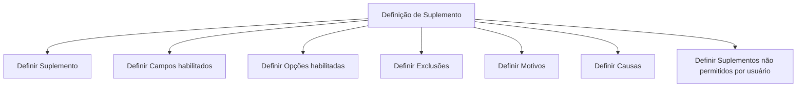

# Definição de Suplemento — Conteúdo em Construção

## 1. Metadados do Documento
- **Arquivo de Origem:** Não identificado
- **Tipo de Documento:** Procedimento
- **Domínio / Sistema:** Suplementos; portal RS / Zeus
- **Público-Alvo:** Negócio, operação e equipes responsáveis pela configuração de suplementos
- **Data/Versão Identificada:** Não identificada

---

## 2. Resumo Executivo & Contexto de Negócio

O documento apresenta uma estrutura inicial, marcada como “EN CONSTRUCCIÓN”, para a definição de um **Suplemento**. O conteúdo indica que o procedimento pretende cobrir objetivo, conceito, características gerais e processo a seguir.

O processo listado organiza a configuração de suplemento em sete definições: suplemento, campos habilitados, opções habilitadas, exclusões, motivos, causas e suplementos não permitidos por usuário.

O material não detalha regras operacionais, critérios de validação, responsabilidades, telas, integrações, contratos técnicos ou efeitos de cada configuração. Portanto, o artefato deve ser interpretado como um índice ou esqueleto de procedimento, e não como uma especificação funcional completa.

O texto também referencia “Inicio”, “Soluciones”, “APIs”, “Documentación”, “Zeus”, “ES” e “RS”, sem explicar a relação entre esses itens e o processo de definição de suplementos.

---

## 3. Arquitetura, Componentes & Tecnologias Envolvidas

O documento não descreve arquitetura de software, tecnologias, microsserviços, APIs, bancos de dados, ambientes ou integrações técnicas. Os únicos elementos nomeados são o processo de definição de suplemento e referências de navegação ou contexto: RS, Zeus, APIs e Documentación.



**Nota de Análise:** O documento menciona “APIs” e “Zeus”, mas não descreve endpoints, métodos HTTP, contratos, autenticação, fluxos de integração ou responsabilidades técnicas associadas.

---

## 4. Regras de Negócio, Especificações Funcionais & Processos

O processo identificado no documento é composto pelas seguintes etapas ou áreas de definição:

1. **Definir Suplemento:** o documento indica a necessidade de definir um suplemento, sem apresentar atributos, critérios ou regras.
2. **Definir Campos habilitados:** o documento prevê a configuração de campos habilitados para o suplemento, sem listar campos ou condições de habilitação.
3. **Definir Opções habilitadas:** o documento prevê a definição de opções habilitadas, sem detalhar valores, dependências ou comportamentos.
4. **Definir Exclusões:** o documento cita exclusões como item configurável, mas não informa regras de exclusão.
5. **Definir Motivos:** o documento inclui motivos no processo, sem catálogo ou associação funcional.
6. **Definir Causas:** o documento inclui causas no processo, sem catálogo ou relacionamento explícito com motivos.
7. **Definir Suplementos não permitidos por usuário:** o documento prevê restrições de suplementos por usuário, mas não especifica usuários, perfis, critérios de autorização ou mecanismos de aplicação.

**Nota de Análise:** Não há detalhamento suficiente para estabelecer ordem obrigatória, pré-requisitos, regras condicionais, permissões ou resultados esperados para as sete definições.

---

## 5. Tabelas de Parâmetros, Ambientes e Estruturas de Dados

| Item / Parâmetro | Descrição / Função | Tipo / Valores / Formato | Ambiente / Observações |
| :--- | :--- | :--- | :--- |
| Suplemento | Entidade principal a ser definida no processo. | Não especificado. | O documento não informa atributos do suplemento. |
| Campos habilitados | Item de configuração associado à definição de suplemento. | Não especificado. | Nenhum campo é listado. |
| Opções habilitadas | Item de configuração associado à definição de suplemento. | Não especificado. | Nenhuma opção é listada. |
| Exclusões | Item de configuração associado à definição de suplemento. | Não especificado. | Não há critérios de exclusão. |
| Motivos | Item previsto no processo de definição. | Não especificado. | Não há catálogo de motivos. |
| Causas | Item previsto no processo de definição. | Não especificado. | Não há catálogo de causas. |
| Suplementos não permitidos por usuário | Restrição de suplemento por usuário. | Não especificado. | Não há identificação de usuários, perfis ou regras de bloqueio. |
| RS | Termo exibido no rodapé do conteúdo. | Não especificado. | Relação com o processo não detalhada. |
| Zeus | Termo exibido na navegação ou rodapé do conteúdo. | Não especificado. | Relação com o processo não detalhada. |
| APIs | Termo exibido na navegação ou rodapé do conteúdo. | Não especificado. | Não há APIs descritas. |
| Documentación | Termo exibido na navegação ou rodapé do conteúdo. | Não especificado. | Não há documentos referenciados. |

---

## 6. Bateria de Perguntas & Respostas para RAG (FAQ Sintético)

### P1: Qual é o objetivo do documento sobre definição de suplemento?
**R:** O documento apresenta uma estrutura em construção para tratar a definição de suplemento, incluindo objetivo, conceito, características gerais e processo a seguir. O objetivo específico não é detalhado no conteúdo fornecido.

### P2: Quais são as etapas listadas para definir um suplemento?
**R:** O documento lista sete itens: definir suplemento, campos habilitados, opções habilitadas, exclusões, motivos, causas e suplementos não permitidos por usuário.

### P3: Quais campos devem ser habilitados para um suplemento?
**R:** O documento indica que existe uma etapa chamada “Definir Campos habilitados”, mas não informa quais campos existem, quais podem ser habilitados ou quais regras controlam essa habilitação.

### P4: O documento informa quais opções podem ser habilitadas?
**R:** Não. O conteúdo apenas inclui “Definir Opciones habilitadas” como uma etapa do processo, sem listar opções, valores permitidos ou dependências.

### P5: Como devem funcionar as exclusões de suplementos?
**R:** O documento cita “Definir Exclusiones”, mas não descreve condições, critérios, regras de prioridade ou efeitos das exclusões.

### P6: Existe uma relação definida entre motivos e causas?
**R:** Não. “Definir Motivos” e “Definir Causas” aparecem como itens independentes no processo, mas o documento não explica se existe relacionamento entre motivos e causas.

### P7: Como são configurados suplementos não permitidos por usuário?
**R:** O documento prevê uma definição de “Suplementos no permitidos por usuario”, mas não informa quais usuários ou perfis são considerados, nem como o bloqueio é configurado ou aplicado.

### P8: O documento descreve APIs para a configuração de suplementos?
**R:** Não. Embora “APIs” apareça no rodapé ou na navegação do conteúdo, não há endpoints, métodos HTTP, contratos, autenticação ou exemplos de integração.

### P9: O documento identifica o sistema responsável pela definição de suplementos?
**R:** O conteúdo menciona “Zeus” e “RS”, mas não estabelece explicitamente qual sistema executa a definição de suplementos nem descreve as responsabilidades desses termos.

### P10: O conteúdo é uma especificação funcional completa?
**R:** Não. O próprio documento é identificado como “EN CONSTRUCCIÓN” e não contém detalhamento de regras, dados, permissões, telas, fluxos operacionais ou integrações.

---

## 7. Glossário de Termos, Siglas & Conceitos-Chave

- **Suplemento:** Entidade central cuja definição é abordada pelo documento; seus atributos e comportamento não são detalhados.
- **Campos habilitados:** Configuração citada para o suplemento; campos específicos não são identificados.
- **Opções habilitadas:** Configuração citada para o suplemento; opções específicas não são identificadas.
- **Exclusões:** Item de configuração citado no processo; regras não detalhadas.
- **Motivos:** Item de definição citado no processo; significado operacional não detalhado.
- **Causas:** Item de definição citado no processo; significado operacional não detalhado.
- **RS:** Sigla ou termo exibido no rodapé; não definido no documento.
- **Zeus:** Termo exibido na navegação ou rodapé; não definido no documento.
- **APIs:** Termo exibido na navegação ou rodapé; nenhuma interface é descrita.
- **EN CONSTRUCCIÓN:** Indicação de que o material está em construção.

---

## 8. Notas Críticas, Riscos & Limitações

- O documento está explicitamente marcado como **“EN CONSTRUCCIÓN”**.
- Não há regras de negócio detalhadas para suplemento, campos, opções, exclusões, motivos ou causas.
- Não há definição de usuários, perfis, permissões ou mecanismo de bloqueio para suplementos não permitidos por usuário.
- Não há arquitetura técnica, integrações, APIs, contratos, ambientes, URLs, rotas de log ou parâmetros de infraestrutura.
- “RS”, “Zeus”, “APIs” e “Documentación” são citados sem contextualização suficiente para determinar seu papel.
- Não há data, versão, autor, sistema proprietário ou arquivo de origem identificados.

---

## 9. Conteúdo Bruto Estruturado (Referência Fiel)

```text
--- [PÁGINA 1 DE 1] ---

EN CONSTRUCCIÓN
DEFINICIÓN de Suplemento
Objetivo
¿En qué consiste?
Características generales
Proceso a seguir
DEFINIR
Suplemento
(1)
DEFINIR
Campos habilitados
(2)
DEFINIR
Opciones habilitadas
(3)
DEFINIR
Exclusiones
(4)
DEFINIR
Motivos
(5)
DEFINIR
Causas
(6)
DEFINIR
Suplementos
no permitidos
por usuario
(7)
1. DEFINIR Suplemento
1. DEFINIR Campos habilitados
1. DEFINIR Opciones habilitadas
1. DEFINIR Exclusiones
1. DEFINIR Motivos
1. DEFINIR Causas
1. DEFINIR Suplementos no permitidos por usuario
 /
 RS
Inicio Soluciones APIs Documentación Zeus
ES
```
