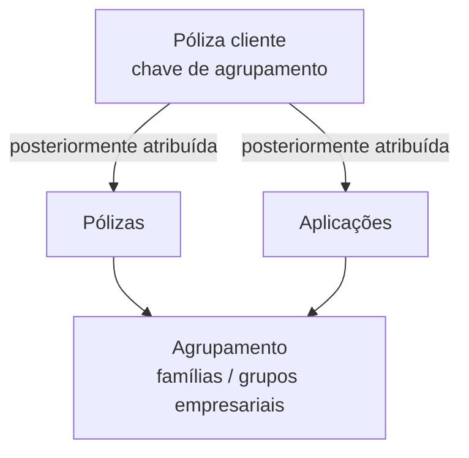

# Definição de Póliza Cliente — Chave de Agrupamento de Pólizas e Aplicações

## 1. Metadados do Documento
- **Arquivo de Origem:** Não identificado
- **Tipo de Documento:** Especificação Técnica
- **Domínio / Sistema:** Definición de póliza cliente; navegação menciona Soluciones APIs, Documentación e Zeus
- **Público-Alvo:** Não identificado
- **Data/Versão Identificada:** Não identificada

---

## 2. Resumo Executivo & Contexto de Negócio

O documento define o conceito de **póliza cliente**, uma chave destinada a ser posteriormente atribuída a pólizas e/ou aplicações. A finalidade declarada é permitir o agrupamento desses elementos.

A chave de póliza cliente foi concebida para representar agrupamentos como famílias e grupos empresariais. O documento não apresenta regras adicionais de elegibilidade, hierarquia, persistência ou ciclo de vida da chave.

A definição possui duas propriedades explícitas: o **Número de póliza cliente**, que identifica a póliza cliente, e a **Descrição**, utilizada como alias identificador. Não há detalhamento de formatos, obrigatoriedade, validações ou valores permitidos.

---

## 3. Arquitetura, Componentes & Tecnologias Envolvidas

O conteúdo não descreve uma arquitetura de software, integrações, microsserviços, tecnologias, ambientes ou contratos de API. O relacionamento funcional explicitamente apresentado é a atribuição posterior de uma chave de póliza cliente a pólizas e/ou aplicações para fins de agrupamento.



**Nota de Análise:** O documento menciona “Soluciones APIs”, “Documentación” e “Zeus” na linha de navegação, mas não detalha suas responsabilidades, integrações ou relação funcional com a definição de póliza cliente.

---

## 4. Regras de Negócio, Especificações Funcionais & Processos

1. Deve ser estabelecida uma chave de **póliza cliente**.
2. A chave de póliza cliente será atribuída posteriormente a pólizas e/ou aplicações.
3. A finalidade da atribuição é agrupar pólizas e/ou aplicações.
4. Os exemplos de agrupamentos citados são:
   - Famílias.
   - Grupos empresariais.
5. A definição de póliza cliente contém a propriedade **Número de póliza cliente**, que identifica a póliza cliente.
6. A definição de póliza cliente contém a propriedade **Descrição**, que funciona como alias identificador da póliza cliente.

**Nota de Análise:** O documento não especifica se uma póliza ou aplicação pode receber mais de uma chave de póliza cliente, nem define regras de criação, alteração, exclusão, validação ou autorização.

---

## 5. Tabelas de Parâmetros, Ambientes e Estruturas de Dados

| Item / Parâmetro | Descrição / Função | Tipo / Valores / Formato | Ambiente / Observações |
| :--- | :--- | :--- | :--- |
| Póliza cliente | Chave estabelecida para agrupar pólizas e/ou aplicações. | Não especificado. | Pensada para agrupamentos como famílias e grupos empresariais. |
| Número de póliza cliente | Chave que identifica a póliza cliente. | Não especificado. | Propriedade de definição. |
| Descrição | Alias que identifica a póliza cliente. | Não especificado. | Propriedade de definição. |
| Pólizas | Elementos que podem receber posteriormente a chave de póliza cliente. | Não especificado. | Podem ser agrupadas pela chave. |
| Aplicações | Elementos que podem receber posteriormente a chave de póliza cliente. | Não especificado. | Podem ser agrupadas pela chave. |
| Soluciones APIs | Item mencionado na navegação do documento. | Não especificado. | Sem detalhamento funcional. |
| Documentación | Item mencionado na navegação do documento. | Não especificado. | Sem detalhamento funcional. |
| Zeus | Item mencionado na navegação do documento. | Não especificado. | Sem detalhamento funcional. |

---

## 6. Bateria de Perguntas & Respostas para RAG (FAQ Sintético)

### P1: Qual é o objetivo da definição de póliza cliente?
**R:** O objetivo é estabelecer uma chave que será posteriormente atribuída a pólizas e/ou aplicações para agrupá-las.

### P2: Para quais elementos a chave de póliza cliente pode ser atribuída?
**R:** A chave de póliza cliente pode ser atribuída posteriormente a pólizas e/ou aplicações.

### P3: Quais tipos de agrupamento são citados para a póliza cliente?
**R:** O documento cita famílias e grupos empresariais como exemplos de agrupamentos para os quais a chave de póliza cliente foi pensada.

### P4: O que representa o número de póliza cliente?
**R:** O número de póliza cliente é a chave que identifica a póliza cliente.

### P5: Qual é a função do campo Descrição na definição de póliza cliente?
**R:** A Descrição é o alias que identifica a póliza cliente.

### P6: O documento define o formato do número de póliza cliente?
**R:** Não. O documento informa apenas que o número de póliza cliente é a chave identificadora, sem apresentar formato, tamanho, tipo de dado ou regras de validação.

### P7: O documento especifica como a chave de póliza cliente é atribuída às pólizas ou aplicações?
**R:** Não. O documento informa que a chave será atribuída posteriormente, mas não detalha interface, processo operacional, API, regras de autorização ou mecanismo técnico para essa atribuição.

### P8: O documento define se uma póliza pode pertencer a mais de uma póliza cliente?
**R:** Não. Não há informação sobre cardinalidade, múltiplas associações ou restrições de associação entre pólizas, aplicações e pólizas cliente.

### P9: Zeus possui alguma responsabilidade definida na funcionalidade de póliza cliente?
**R:** Não. Zeus é mencionado apenas na linha de navegação do conteúdo bruto, sem descrição de responsabilidade ou integração com a funcionalidade.

---

## 7. Glossário de Termos, Siglas & Conceitos-Chave

- **Póliza cliente:** Chave definida para ser posteriormente atribuída a pólizas e/ou aplicações, com o objetivo de agrupá-las.
- **Número de póliza cliente:** Chave que identifica a póliza cliente.
- **Descrição:** Alias que identifica a póliza cliente.
- **Póliza:** Entidade que pode receber uma chave de póliza cliente; o documento não fornece definição adicional.
- **Aplicação:** Entidade que pode receber uma chave de póliza cliente; o documento não fornece definição adicional.
- **Zeus:** Termo apresentado na navegação do documento, sem definição no conteúdo.
- **ES:** Sigla apresentada na navegação do documento, sem expansão ou definição.
- **RS:** Sigla apresentada no conteúdo, sem expansão ou definição.

---

## 8. Notas Críticas, Riscos & Limitações

- O documento é resumido e não especifica arquitetura, APIs, integrações, ambientes, tecnologias ou persistência de dados.
- Não há definição de formatos, tipos de dados, obrigatoriedade ou validações para o Número de póliza cliente e a Descrição.
- Não há regras de cardinalidade entre póliza cliente, pólizas e aplicações.
- Não são descritos processos de criação, manutenção, exclusão, auditoria ou controle de acesso para pólizas cliente.
- Os termos “Zeus”, “ES” e “RS” não possuem definição contextual no conteúdo fornecido.

---

## 9. Conteúdo Bruto Estruturado (Referência Fiel)

```text
--- [PÁGINA 1 DE 1] ---

DEFINICIÓN de póliza cliente
Objetivo
Establece una clave que posteriormente será asignada a pólizas y/o aplicaciones con el fin de
agruparlas. Esta clave está pensada para agrupar (familias, grupos empresariales, etc.).
-Propiedades de definición
Propiedades de definición
Número de póliza cliente
Clave que identificará a la póliza cliente.
Descripción
Alias que identifica a la póliza cliente.
 / 
 RS
Inicio Soluciones APIs Documentación Zeus
ES
```
