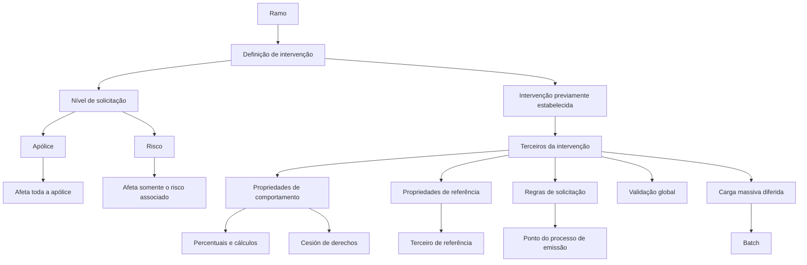

# Definição de Intervenções do Ramo no Reef.core

## 1. Metadados do Documento
- **Arquivo de Origem:** Não identificado no conteúdo fornecido
- **Tipo de Documento:** Especificação Técnica
- **Domínio / Sistema:** Reef.core — definição de intervenções do ramo para emissão ou modificação de apólices
- **Público-Alvo:** Analistas funcionais, desenvolvedores, arquitetos e operadores de processos de apólices
- **Data/Versão Identificada:** Não identificada

---

## 2. Resumo Executivo & Contexto de Negócio

O documento descreve a configuração de **intervenções** associadas a um ramo no sistema Reef.core. A definição determina quais intervenções previamente cadastradas poderão ser solicitadas durante processos de emissão ou modificação de apólices ou aplicações do ramo.

As intervenções não podem ser criadas livremente no ponto de configuração descrito. Quando uma nova intervenção for necessária, a inclusão deve ser solicitada previamente. A configuração atua sobre intervenções já estabelecidas e reúne propriedades gerais, comportamentais, de referência, de solicitação, de validação, de momento de solicitação e de carga massiva.

Uma intervenção pode ser solicitada no nível de **apólice** ou de **risco**. Intervenções de apólice afetam a apólice completa, independentemente da quantidade de riscos existentes. Intervenções de risco afetam somente o risco ao qual foram associadas.

O modelo permite controlar terceiros vinculados a intervenções, incluindo quantidade mínima e máxima, existência de terceiro principal, múltiplos terceiros principais, terceiro utilizado para cálculos, percentuais de distribuição, cessão de direitos, identificação de pessoa V.I.P. e referência a terceiros de outras intervenções.

O Reef.core pode receber lógicas de negócio configuradas para decidir se terceiros devem ser solicitados, determinar terceiros de referência, definir documentos para cálculo, validar globalmente uma intervenção e carregar terceiros em modo diferido por batch. Em diversos casos, a escolha efetiva de terceiros é manual, realizada pela pessoa que executa a operação, e não pelo Reef.core.

---

## 3. Arquitetura, Componentes & Tecnologias Envolvidas

| Componente / Conceito | Papel identificado |
| :--- | :--- |
| Reef.core | Sistema citado como responsável pelo processo de emissão e pelo uso das configurações de intervenções. |
| Ramo | Ramo ao qual uma definição de intervenção se aplica. |
| Definição de intervenção | Configuração que determina quais intervenções podem ser requeridas no processo de emissão ou modificação. |
| Intervenção | Entidade previamente estabelecida que pode ser solicitada para apólice ou risco. |
| Apólice | Nível de solicitação no qual uma intervenção afeta toda a apólice. |
| Risco | Nível de solicitação no qual uma intervenção afeta somente o risco associado. |
| Terceiro | Pessoa associada a uma intervenção, sujeita a regras de quantidade, principalidade, cálculo, referência e validação. |
| Lógica de negócio | Regra associável à configuração para determinar solicitação, referência, cálculo, validação ou carga massiva. |
| Processo de emissão | Processo no qual intervenções e atributos podem ser solicitados em momentos configuráveis. |
| Carga massiva / batch | Mecanismo diferido para carregar terceiros de uma intervenção. |



> **Nota de Análise:** O documento não especifica métodos HTTP, contratos JSON, banco de dados, URLs, portas, infraestrutura de implantação ou tecnologias de implementação do Reef.core.

---

## 4. Regras de Negócio, Especificações Funcionais & Processos

### 4.1 Definição de intervenções do ramo

1. A definição decide quais intervenções já definidas poderão ser requeridas durante a emissão ou modificação de uma apólice ou aplicação do ramo.
2. As intervenções são estabelecidas previamente.
3. As intervenções não são de criação livre na definição do ramo.
4. A necessidade de uma nova intervenção exige solicitação para que a intervenção seja incluída.
5. A configuração inclui propriedades:
   - Gerais;
   - De comportamento;
   - De referência;
   - Que determinam se a intervenção será solicitada;
   - Que determinam quando a intervenção será solicitada;
   - Relativas à validação;
   - Relativas à carga massiva.

### 4.2 Propriedades gerais

#### Ramo
A propriedade **Ramo** aponta para o ramo afetado pela definição de intervenção.

#### Nível de solicitação
As intervenções podem ser solicitadas em dois níveis:

- **Apólice:** a intervenção registrada afeta toda a apólice, independentemente da quantidade de riscos que a apólice possua.
- **Risco:** a intervenção registrada afeta exclusivamente o risco ao qual a intervenção está associada.

#### Ordem
A propriedade **Ordem** define a sequência em que as intervenções serão requeridas dentro do nível de solicitação configurado.

#### Intervenção a requerir
A propriedade **Intervenção a requerir** identifica qual intervenção, dentre as intervenções previamente estabelecidas, será solicitada.

#### Inabilitado
A propriedade **Inabilitado** determina se uma intervenção permanece ativa ou se deixa de poder ser incluída em uma nova apólice.

Regras associadas ao estado inabilitado:

1. Uma intervenção inabilitada não pode ser selecionada para uma nova apólice.
2. Apólices existentes que já possuam a intervenção continuam aplicando a intervenção.
3. A continuidade da aplicação em apólices existentes ocorre até que um suplemento altere a intervenção.
4. Quando uma alteração por suplemento ocorrer, a intervenção inabilitada não poderá ser selecionada novamente.

### 4.3 Propriedades de comportamento

#### Número de terceiros
A configuração de **Número de terceiros** define:

- Se o registro de terceiros sob a intervenção é obrigatório;
- O número mínimo de terceiros;
- O número máximo de terceiros.

#### Existe um terceiro principal
A propriedade determina se deve existir um terceiro considerado principal quando a intervenção permite mais de um terceiro.

Regras associadas:

1. A propriedade tem relevância quando a intervenção aceita múltiplos terceiros.
2. O Reef.core não escolhe qual terceiro será principal.
3. A pessoa que executa a operação escolhe o terceiro principal.

#### Vários terceiros se consideram principais
A propriedade indica que mais de um terceiro pode ser considerado principal.

#### Indicar um terceiro que se considera para cálculos
A propriedade define se deve existir, ou não, um terceiro utilizado para cálculos.

Regras associadas:

1. O terceiro utilizado para cálculos é selecionado manualmente.
2. O Reef.core não identifica automaticamente o terceiro usado para cálculo.
3. A pessoa que executa a operação decide qual terceiro da intervenção será utilizado pelo Reef.core nos cálculos.
4. Os cálculos utilizam os dados do terceiro escolhido.

#### Lógica de negócio que determina sobre que terceiro se calcula
A lógica de negócio determina o tipo de documento e o número de documento sobre os quais os cálculos serão realizados.

#### Incluir porcentagem
A propriedade exige a solicitação de percentual quando houver necessidade de divisão entre terceiros de uma intervenção.

Exemplos de situações citadas:

- Declaração de beneficiários;
- Existência de mais de uma entidade à qual direitos foram cedidos em razão do financiamento do risco.

#### A porcentagem deve somar 100
A propriedade aplica-se quando a intervenção requer percentuais e exige que a soma dos percentuais de todos os terceiros incluídos na intervenção seja igual a 100.

#### Cesión de derechos
A ativação da propriedade de **Cesión de derechos** exige informações sobre o empréstimo contratado com a pessoa indicada na intervenção, relacionado ao risco segurado.

No processo de emissão, devem ser solicitadas as seguintes informações do empréstimo:

1. Número do contrato;
2. Data de vencimento do financiamento;
3. Valor financiado.

#### Pessoa V.I.P.
Quando a propriedade **Persona V.I.P.** está ativada, o processo de emissão solicita se a pessoa incluída na apólice pela intervenção é considerada uma pessoa importante.

O documento afirma que, em princípio, o Reef.core não apresenta comportamento especial para essa condição; a informação tem finalidade informativa.

### 4.4 Propriedades de referência

#### Intervenção de referência
A propriedade permite determinar que o terceiro associado à intervenção em definição seja obtido a partir de outra intervenção indicada como referência.

#### Lógica de negócio que determina o terceiro de referência
A lógica de negócio determina qual terceiro será utilizado como padrão.

A lógica deve retornar:

- Tipo de documento;
- Número de documento;

da pessoa considerada terceiro padrão.

#### A intervenção obriga que o terceiro seja distinto do tomador
A propriedade determina se o tipo e número de documento do tomador podem ou não ser utilizados na intervenção em definição.

### 4.5 Propriedades que determinam se a intervenção será solicitada

#### Lógica de negócio que determina se os terceiros da intervenção serão solicitados
A lógica de negócio determina se, para o movimento em execução, é necessário solicitar terceiros da intervenção.

A finalidade da lógica é evitar a solicitação de intervenções quando as informações disponíveis permitirem determinar que não faz sentido solicitá-las.

#### Inabilitar todos os terceiros da intervenção que não é solicitada
A propriedade está associada à lógica que determina a solicitação de terceiros.

Quando existir uma lógica definida e a intervenção não for solicitada, a propriedade determina se todos os terceiros da intervenção não solicitada devem ser inabilitados.

### 4.6 Propriedades relativas à validação

#### Lógica de negócio de validação da intervenção
Uma lógica de negócio pode ser associada para validar a intervenção.

A validação:

1. É realizada sobre todos os terceiros incluídos na intervenção;
2. É global para a intervenção;
3. Não é descrita no documento como uma validação individual isolada por terceiro.

### 4.7 Propriedades que determinam quando a intervenção será solicitada

#### Ponto do processo de emissão no qual a intervenção é solicitada
A configuração permite escolher o momento em que uma intervenção será solicitada no processo de emissão.

O objetivo é permitir que determinados atributos já tenham sido solicitados, ou ainda não tenham sido solicitados, para proporcionar melhor controle da intervenção.

Valores possíveis:

- Para intervenções de apólice:
  - Antes dos atributos da apólice;
  - Ao pressionar o botão terminar.
- Para intervenções de risco:
  - Antes dos atributos do risco;
  - Depois dos atributos do risco.

### 4.8 Propriedades relativas à carga massiva

#### Lógica de carga massiva de terceiros da intervenção
Quando uma lógica for associada a esse ponto, a lógica será responsável por carregar os terceiros da intervenção de forma diferida, em modo batch.

---

## 5. Tabelas de Parâmetros, Ambientes e Estruturas de Dados

| Item / Parâmetro | Descrição / Função | Tipo / Valores / Formato | Ambiente / Observações |
| :--- | :--- | :--- | :--- |
| Ramo | Identifica o ramo afetado pela definição de intervenção. | Referência a ramo. | Aplicável à definição de intervenção. |
| Nível de solicitação | Define o escopo no qual a intervenção será requerida. | Apólice ou Risco. | Apólice afeta toda a apólice; Risco afeta somente o risco associado. |
| Ordem | Define a sequência de solicitação das intervenções. | Ordem de requerimento. | Aplicada dentro do nível de solicitação definido. |
| Intervenção a requerir | Define qual intervenção previamente estabelecida será solicitada. | Intervenção existente. | Não há criação livre de intervenções nesse ponto. |
| Inabilitado | Define se a intervenção está ativa para novas apólices. | Ativo ou inabilitado. | Intervenções já existentes em apólices permanecem aplicáveis até alteração por suplemento. |
| Número de terceiros | Define obrigatoriedade e quantidade de terceiros da intervenção. | Obrigatoriedade; mínimo; máximo. | Associado às propriedades de comportamento. |
| Existe um terceiro principal | Define se deve existir terceiro principal. | Sim ou não. | Relevante quando múltiplos terceiros são permitidos. A escolha é manual. |
| Vários terceiros se consideram principais | Permite que mais de um terceiro seja principal. | Sim ou não. | Aplicável a intervenções com terceiros. |
| Terceiro para cálculos | Determina se deve existir terceiro utilizado em cálculos. | Existência obrigatória ou não. | Seleção manual pela pessoa que realiza a operação. |
| Lógica de cálculo por terceiro | Determina o documento utilizado para cálculo. | Tipo de documento e número de documento. | Define sobre qual terceiro os cálculos ocorrem. |
| Incluir porcentagem | Exige percentual associado aos terceiros da intervenção. | Percentual. | Usado em repartições entre terceiros, beneficiários ou cessão de direitos. |
| Porcentagem deve somar 100 | Exige totalização dos percentuais. | Soma igual a 100. | Considera os percentuais de todos os terceiros da intervenção. |
| Cesión de derechos | Solicita dados de financiamento relacionados ao risco segurado. | Número de contrato; data de vencimento; valor financiado. | Associada à pessoa indicada na intervenção. |
| Pessoa V.I.P. | Solicita indicação de pessoa importante. | Sim ou não. | Em princípio, possui função informativa e não provoca comportamento especial no Reef.core. |
| Intervenção de referência | Permite usar terceiro de outra intervenção como referência. | Referência a intervenção. | Define a origem do terceiro associado. |
| Lógica do terceiro de referência | Define terceiro padrão da intervenção. | Tipo de documento e número de documento. | Deve retornar a identificação da pessoa considerada padrão. |
| Terceiro distinto do tomador | Define se o tomador pode ser usado como terceiro da intervenção. | Permitido ou não permitido. | Avalia tipo e número de documento do tomador. |
| Lógica de solicitação de terceiros | Determina se terceiros devem ser solicitados para um movimento. | Lógica de negócio. | Pode evitar solicitação quando a intervenção não fizer sentido. |
| Inabilitar terceiros não solicitados | Define se terceiros devem ser inabilitados quando a intervenção não for solicitada. | Sim ou não. | Vinculada à lógica de solicitação de terceiros. |
| Lógica de validação | Valida globalmente os terceiros de uma intervenção. | Lógica de negócio. | Abrange todos os terceiros incluídos na intervenção. |
| Momento de solicitação — apólice | Define quando uma intervenção de apólice é solicitada. | Antes dos atributos de apólice; ao pressionar terminar. | Processo de emissão. |
| Momento de solicitação — risco | Define quando uma intervenção de risco é solicitada. | Antes dos atributos de risco; depois dos atributos de risco. | Processo de emissão. |
| Lógica de carga massiva | Carrega terceiros de forma diferida. | Lógica de negócio / batch. | Aplicável à carga massiva de terceiros da intervenção. |

> **Nota de Análise:** O documento não apresenta servidores, URLs de ambientes, rotas de logs, variáveis de configuração, formatos JSON, esquemas de banco de dados ou tipos técnicos de campos.

---

## 6. Bateria de Perguntas & Respostas para RAG (FAQ Sintético)

### P1: Qual é o objetivo da definição de intervenções do ramo no Reef.core?
**R:** A definição de intervenções do ramo determina quais intervenções previamente estabelecidas poderão ser requeridas durante o processo de emissão ou modificação de uma apólice ou aplicação do ramo. As intervenções não são criadas livremente nessa configuração; novas intervenções devem ser solicitadas para inclusão.

### P2: Quais são os níveis possíveis para solicitar uma intervenção?
**R:** As intervenções podem ser solicitadas no nível de apólice ou de risco. Uma intervenção no nível de apólice afeta toda a apólice, independentemente do número de riscos. Uma intervenção no nível de risco afeta exclusivamente o risco ao qual está associada.

### P3: O que acontece quando uma intervenção é inabilitada?
**R:** Uma intervenção inabilitada deixa de poder ser incluída em novas apólices. Entretanto, apólices que já possuam essa intervenção continuam aplicando-a até que um suplemento altere a situação. No momento da alteração por suplemento, a intervenção inabilitada não poderá ser selecionada novamente.

### P4: Quem define qual terceiro é o principal em uma intervenção com vários terceiros?
**R:** A pessoa que executa a operação define qual terceiro é considerado principal. O Reef.core não realiza automaticamente a escolha do terceiro principal.

### P5: Como o terceiro utilizado para cálculos é escolhido?
**R:** A pessoa que realiza a operação escolhe manualmente, entre os terceiros da intervenção, qual será utilizado pelo Reef.core para cálculos. O Reef.core não localiza automaticamente esse terceiro. Uma lógica de negócio pode determinar o tipo e o número de documento sobre os quais os cálculos serão realizados.

### P6: Quando uma intervenção exige percentuais e qual regra de totalização pode ser aplicada?
**R:** Uma intervenção exige percentuais quando é necessário distribuir participação entre terceiros, como em declarações de beneficiários ou quando direitos são cedidos a mais de uma entidade em razão do financiamento do risco. Quando configurada, a regra exige que a soma dos percentuais de todos os terceiros da intervenção seja igual a 100.

### P7: Quais informações devem ser solicitadas quando a propriedade de cessão de direitos é ativada?
**R:** A ativação de cessão de direitos exige informações sobre o empréstimo contratado com a pessoa indicada na intervenção e relacionado ao risco segurado: número de contrato, data de vencimento do financiamento e valor financiado.

### P8: Para que serve uma intervenção de referência?
**R:** Uma intervenção de referência permite que o terceiro associado à intervenção em definição seja obtido de outra intervenção indicada. A lógica de negócio associada determina o terceiro padrão, retornando o tipo de documento e o número de documento da pessoa considerada como referência.

### P9: Qual é a finalidade da lógica que determina se os terceiros de uma intervenção serão solicitados?
**R:** Essa lógica avalia se, para o movimento em execução, é necessário solicitar terceiros da intervenção. O objetivo é evitar solicitações desnecessárias quando as informações já disponíveis indicarem que a intervenção não faz sentido no contexto do movimento.

### P10: Como funciona a validação de uma intervenção?
**R:** A lógica de validação da intervenção é global à intervenção. A validação considera todos os terceiros incluídos na intervenção, e o documento não descreve uma validação individual independente para cada terceiro.

### P11: Em quais momentos uma intervenção de apólice pode ser solicitada?
**R:** Uma intervenção de apólice pode ser solicitada antes dos atributos da apólice ou quando o usuário pressiona o botão terminar no processo de emissão.

### P12: Em quais momentos uma intervenção de risco pode ser solicitada?
**R:** Uma intervenção de risco pode ser solicitada antes dos atributos do risco ou depois dos atributos do risco durante o processo de emissão.

### P13: O que faz a lógica de carga massiva de terceiros?
**R:** Quando associada à intervenção, a lógica de carga massiva é responsável por carregar os terceiros da intervenção de forma diferida, por meio de processamento batch.

---

## 7. Glossário de Termos, Siglas & Conceitos-Chave

- **Reef.core:** Sistema citado no documento como participante do processo de emissão e das regras de intervenções.
- **Ramo:** Área ou ramo ao qual a definição de intervenção se aplica.
- **Intervenção:** Entidade previamente estabelecida que pode ser requerida em processos de emissão ou modificação.
- **Apólice:** Nível de solicitação no qual a intervenção afeta todos os riscos da apólice.
- **Risco:** Nível de solicitação no qual a intervenção afeta exclusivamente o risco associado.
- **Terceiro:** Pessoa vinculada a uma intervenção.
- **Tomador:** Pessoa cujo tipo e número de documento podem ser restringidos como terceiro de uma intervenção.
- **Terceiro principal:** Terceiro identificado como principal em uma intervenção que permite múltiplos terceiros.
- **Terceiro de referência:** Terceiro padrão, potencialmente obtido a partir de outra intervenção.
- **Cesión de derechos:** Propriedade que solicita dados de financiamento ou empréstimo relacionados ao risco segurado e à pessoa indicada na intervenção.
- **Pessoa V.I.P.:** Pessoa identificada como importante para finalidade informativa no processo de emissão.
- **Suplemento:** Alteração que pode modificar uma intervenção existente em uma apólice.
- **Lógica de negócio:** Regra configurável usada para determinar solicitação, referência, cálculo, validação ou carga de terceiros.
- **Batch:** Processamento diferido usado para carga massiva de terceiros.
- **V.I.P.:** Sigla apresentada no documento para “persona V.I.P.”; o significado expandido não é explicitado no texto.

---

## 8. Notas Críticas, Riscos & Limitações

- As intervenções não são de livre criação na definição do ramo; a inclusão de uma nova intervenção depende de solicitação prévia.
- A inabilitação de uma intervenção não remove automaticamente a intervenção de apólices existentes.
- A escolha do terceiro principal e do terceiro usado para cálculos depende da pessoa que executa a operação; o Reef.core não executa essas escolhas automaticamente.
- O documento não especifica a implementação das lógicas de negócio, incluindo linguagem, interface, entradas, saídas, regras internas ou tratamento de erros.
- O documento informa que a condição de pessoa V.I.P. é, em princípio, apenas informativa e não desencadeia comportamento especial no Reef.core.
- O documento não descreve como conflitos são tratados quando há múltiplos terceiros principais.
- O documento não detalha os critérios concretos de validação, apenas estabelece que a validação pode ser global à intervenção.
- O documento não detalha o agendamento, frequência, reprocessamento, monitoramento ou tratamento de falhas da carga diferida em batch.
- Não há informações sobre ambientes, segurança, autorização, auditoria, APIs, persistência de dados ou integração com sistemas externos.

---

## 9. Conteúdo Bruto Estruturado (Referência Fiel)

```text
--- [PÁGINA 1 DE 6] ---

EN CONSTRUCCIÓN
DEFINICIÓN de Intervenciones del ramo
Objetivo
En este punto de la definición se decide qué intervenciones (de las definidas), podrán ser requeridas
en el proceso de emisión o modificación de póliza/aplicación del ramo.
Las intervenciones han sido establecidas previamente y no son de libre creación. Cuando sea
necesario una nueva intervención, debe ser solicitada para que se realice su inclusión.
-Propiedades generales
-Propiedades de comportamiento
-Propiedades de referencia
-Propiedades que determinan si se solicita la intervención
-Propiedades que determinan cuando se solicita la intervención
-Propiedades relativas a la validación
-Propiedades relativas a carga masiva
Propiedades generales
Ramo
Apunta al ramo al que afecta esta definición.
 /
 RS
Inicio Soluciones APIs Documentación Zeus
ES

--- [PÁGINA 2 DE 6] ---

Nivel de solicitud
Los niveles en los que se puede solicitar intervenciones son:
Póliza
Riesgo
Póliza
Las intervenciones que se registran afectan a toda la póliza independientemente del número de
riesgos que contenga la póliza
Riesgo
Las intervenciones que se registran afectan únicamente al riesgo al que se asocia
Orden
Orden en el que serán requeridas las intervenciones en el nivel de solicitud definido.
Intervención a requerir
En este punto se debe especificar qué intervención será solicitada de las establecidas.
Inhabilitado
En este punto se determina si está activo o por el contrario ya no puede ser incluido en una nueva
póliza. Es importante destacar que, aunque se inhabilite, todas las pólizas que dispongan de ello,
seguirá aplicándose hasta que mediante un suplemento se cambie. En ese momento, al estar
inhabilitado ya no será posible seleccionarlo.
Propiedades de comportamiento
Número de terceros
En este punto se indica si es obligatorio registrar algún tercero bajo la intervención que se está
definiendo y/o el número mínimo/máximo de terceros a incluir.
Existe un tercero principal
Ejemplo:
Ejemplo:

--- [PÁGINA 3 DE 6] ---

En este atributo se determina si es necesario que exista un tercero (en caso que haya varios) que se
considere el principal. Este atributo cobra sentido cuando la intervención permite asignar más de un
tercero. La elección de qué tercero se considera el principal no la realiza Reef.core, la realiza la
persona que efectúa la operación.
Varios terceros se consideran principales
Este atributo indica que pueden existir más de un tercero considerados como principal.
Indicar un tercero que se considera para cálculos
Debe de existir (o no) un tercero que se considerará para realizar cálculos. Este se asignará de forma
manual. Es decir, Reef.core no lo hallará, será la persona que realice la operación la que decida de
entre los terceros de la intervención cual será el que Reef.core utilizará para realizar cálculos con los
datos del tercero elegido.
Lógica de negocio que determina sobre que tercero se calcula
Determina el tipo de documento y número de documento sobre el que se realizará los cálculos.
Incluir porcentaje
Es necesario solicitar un porcentaje. Esto es necesario cuando se ha de realizar un reparto entre
distintos terceros de una intervención, como por ejemplo en caso de declarar beneficiarios, o en caso
que exista más de una entidad a la que se ha cedido los derechos debido a la financiación del riesgo,
etc.
El porcentaje debe sumar 100
Este atributo se utiliza cuando la intervención precisa de incluir un porcentaje y este debe sumar 100
sumando los porcentajes de cada uno de los terceros incluidos en esa intervención.
Ejemplo:
Ejemplo:
Ejemplo:
Ejemplo:
Ejemplo:

--- [PÁGINA 4 DE 6] ---

Cesión de derechos
La activación de esta propiedad implica que para esta intervención se solicitará información relativa
al préstamo que se tiene contraído (con el indicado en la intervención que se está definiendo) sobre
el riesgo asegurado. La información relativa al préstamo que se solicita en el proceso de emisión es:
Nº de contrato
Fecha de vencimiento de la financiación
Importe financiado
Persona V.I.P.
Si se activa esta propiedad, se solicitará en el proceso de emisión si la persona que se está
incluyendo en la póliza en la intervención se considera una persona importante. En principio,
Reef.core no tiene un comportamiento especial, es simplemente a modo informativo.
Propiedades de referencia
Intervención de referencia
En este punto se puede determinar que el tercero asociado a la intervención que se está definiendo
pueda ser tomado de otra intervención que es la que se indica en este lugar.
Lógica de negocio que determina el tercero de referencia
Esta lógica se encarga de determinar quien será el tercero que se utiliza como defecto. Es decir, se
encarga de devolver el tipo de documento y el número de documento de la persona que será
considerada como tercero por defecto.
La intervención obliga a que el tercero sea distinto al tomador
Indica si en la intervención que se está definiendo, se puede utilizar al tipo de documento y número
de documento del tomador o no.
Propiedades que determinan si se solicita la intervención
Lógica de negocio que determina si se solicita los terceros de la intervención
Ejemplo:
Ejemplo:
Ejemplo:

--- [PÁGINA 5 DE 6] ---

El objetivo de esta lógica de negocio es determinar si para el movimiento que se está realizando es
necesario realizar la solicitud de terceros en la intervención. Esto es porque pude ser que con la
información recogida se puede determinar si la intervención tiene sentido solicitarla o no.
Se inhabilitan todos los terceros de la intervención que no se solicita
Este atributo está ligado al anterior cuando existe una lógica definida. En este caso se determina en
el caso que la intervención no se solicite, si inhabilita todos los terceros de la intervención que no se
ha solicitado o no.
Propiedades relativas a la validación
Lógica de negocio de validación de la intervención
En este punto se puede asociar una lógica de negocio que realiza validaciones de la intervención. Es
decir, de todos los terceros incluidos en la intervención, por tanto la validación es global a la
intervención.
Propiedades que determinan cuando se solicita la intervención
Punto del proceso de emisión en el que se solicita la intervención
Es posible elegir el momento en el que se solicita la intervención. Esto es debido a que hay veces,
que es necesario que se hayan solicitado los atributos (o no) para un mejor control de la intervención.
Los valores posibles (y dependiendo de si la intervención es de riesgo o de póliza) son:
Intervenciones de póliza
Antes de los atributos de póliza
Al pulsar el botón terminar
Intervenciones de riesgo
Antes de los atributos de riesgo
Después de los atributos de riesgo
Propiedades relativas a carga masiva
Lógica de carga masiva de terceros de la intervención
Ejemplo:
Ejemplo:

--- [PÁGINA 6 DE 6] ---

Si se asocia una lógica en este punto, esta se encargará de cargar los terceros de la intervención en
diferido (batch).
```
