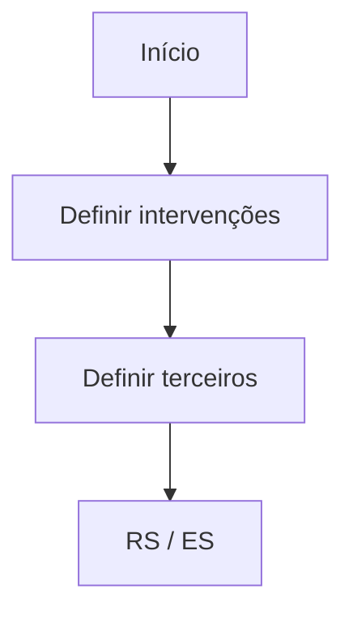

# En Construcción — Definición de Intervenciones por Contrato/Subcontrato

## 1. Metadados do Documento
- **Arquivo de Origem:** Não identificado no conteúdo fornecido
- **Tipo de Documento:** Apresentação Executiva
- **Domínio / Sistema:** Definição de intervenções por contrato/subcontrato; Zeus
- **Público-Alvo:** Não identificado no conteúdo fornecido
- **Data/Versão Identificada:** Não identificada

---

## 2. Resumo Executivo & Contexto de Negócio

O documento apresenta um conteúdo em construção sobre a **definição de intervenções por contrato/subcontrato**. O material estrutura o tema em torno de objetivo, explicação do conceito, características gerais e processo a seguir.

O processo indicado é composto por duas etapas principais: **definir intervenções** e **definir terceiros**. A ordem numérica apresentada estabelece primeiro a definição das intervenções e, em seguida, a definição dos terceiros associados.

O conteúdo também referencia os termos ou áreas **RS**, **ES**, **Soluciones**, **APIs**, **Documentación** e **Zeus**, além dos itens de navegação “Inicio”. Entretanto, o material não descreve a função operacional, técnica ou organizacional desses termos.

**Nota de Análise:** O documento contém apenas títulos, tópicos e um fluxo resumido. Não há detalhamento adicional sobre critérios de definição, contratos, subcontratos, intervenções, terceiros, APIs, integrações ou responsabilidades.

---

## 3. Arquitetura, Componentes & Tecnologias Envolvidas

O conteúdo fornecido não descreve uma arquitetura de software, componentes técnicos, tecnologias implementadas, contratos de integração ou fluxos de dados. Os únicos elementos identificados são referências textuais a **Soluciones**, **APIs**, **Documentación**, **Zeus**, **RS** e **ES**.

O processo explicitamente apresentado pode ser representado como o fluxo abaixo:



**Nota de Análise:** O documento não esclarece o significado de “RS” e “ES”, nem especifica se “Zeus” é um sistema, módulo, ambiente, produto ou repositório de documentação.

---

## 4. Regras de Negócio, Especificações Funcionais & Processos

O material estabelece o seguinte processo de alto nível:

1. **Definir intervenções**
   - A primeira etapa do processo é a definição de intervenções.
   - O documento associa esta etapa ao número **(1)**.
   - Não são fornecidos critérios, campos, regras de validação, estados, responsáveis ou resultados esperados para a definição de intervenções.

2. **Definir terceiros**
   - A segunda etapa do processo é a definição de terceiros.
   - O documento associa esta etapa ao número **(2)**.
   - Não são fornecidos critérios de associação entre terceiros e intervenções, dados cadastrais, regras contratuais, validações ou responsabilidades.

3. **Relação com contrato/subcontrato**
   - O título do documento indica que a definição de intervenções ocorre no contexto de **contrato/subcontrato**.
   - O texto não detalha a estrutura de contratos e subcontratos, o relacionamento entre ambos, regras de elegibilidade ou mecanismos de vinculação.

4. **Tópicos previstos**
   - Objetivo.
   - Explicação sobre “em que consiste”.
   - Características gerais.
   - Processo a seguir.

**Nota de Análise:** Os tópicos “Objetivo”, “¿En qué consiste?” e “Características generales” são listados, mas não possuem conteúdo explicativo no material fornecido.

---

## 5. Tabelas de Parâmetros, Ambientes e Estruturas de Dados

| Item / Parâmetro | Descrição / Função | Tipo / Valores / Formato | Ambiente / Observações |
| :--- | :--- | :--- | :--- |
| Intervenções | Elemento a ser definido na primeira etapa do processo. | Não detalhado. | Relacionado ao contexto de contrato/subcontrato. |
| Terceiros | Elemento a ser definido na segunda etapa do processo. | Não detalhado. | Não há regra de vinculação detalhada. |
| Contrato/subcontrato | Contexto indicado no título do material. | Não detalhado. | Não há estrutura, atributos ou regras descritas. |
| RS | Termo exibido ao final do fluxo. | Sigla não definida no documento. | Sem detalhamento adicional. |
| ES | Termo exibido ao final do fluxo. | Sigla não definida no documento. | Sem detalhamento adicional. |
| Soluciones | Item textual presente na navegação ou referência final. | Não detalhado. | Sem função descrita. |
| APIs | Item textual presente na navegação ou referência final. | Não detalhado. | Não há métodos, endpoints ou contratos documentados. |
| Documentación | Item textual presente na navegação ou referência final. | Não detalhado. | Não há referências documentais apresentadas. |
| Zeus | Nome citado na referência final. | Não detalhado. | O documento não identifica a natureza de Zeus. |

---

## 6. Bateria de Perguntas & Respostas para RAG (FAQ Sintético)

### P1: Qual é o tema central do documento?
**R:** O documento aborda a definição de intervenções por contrato/subcontrato. O material está identificado como “En Construcción”, indicando que o conteúdo ainda se encontra em elaboração.

### P2: Quais são as etapas do processo apresentado?
**R:** O processo possui duas etapas numeradas: primeiro, definir intervenções; segundo, definir terceiros.

### P3: A definição de terceiros ocorre antes ou depois da definição de intervenções?
**R:** A definição de terceiros ocorre depois da definição de intervenções. O documento numera “DEFINIR intervenciones” como etapa (1) e “DEFINIR terceros” como etapa (2).

### P4: Quais regras determinam como uma intervenção deve ser definida?
**R:** O documento não apresenta regras, critérios, campos obrigatórios, validações ou responsáveis para a definição de intervenções. Apenas registra que “definir intervenções” é a primeira etapa do processo.

### P5: O documento explica como terceiros devem ser vinculados a contratos ou subcontratos?
**R:** Não. O documento menciona “definir terceiros” como segunda etapa, mas não detalha critérios de vínculo, estrutura de dados, validações ou regras contratuais.

### P6: O que significa a sigla RS no fluxo?
**R:** O significado de RS não é definido no conteúdo fornecido. A sigla aparece ao final do fluxo, junto de ES, sem explicação complementar.

### P7: O que significa a sigla ES no fluxo?
**R:** O significado de ES não é definido no conteúdo fornecido. A sigla aparece ao final do fluxo, junto de RS, sem explicação complementar.

### P8: Quais sistemas ou ferramentas são citados no documento?
**R:** O conteúdo cita “Soluciones”, “APIs”, “Documentación” e “Zeus”. Contudo, não descreve suas funções, integrações, tecnologias, interfaces ou responsabilidades.

### P9: O documento contém especificações de APIs?
**R:** Não. Embora “APIs” seja citado, o material não contém endpoints, métodos HTTP, autenticação, payloads, contratos JSON, códigos de resposta ou qualquer especificação de integração.

### P10: Há uma explicação das características gerais do processo?
**R:** Não. “Características generales” aparece como tópico previsto, mas não possui detalhamento no conteúdo fornecido.

---

## 7. Glossário de Termos, Siglas & Conceitos-Chave

- **Intervenções:** Entidades ou elementos que devem ser definidos na primeira etapa do processo apresentado.
- **Terceiros:** Entidades ou elementos que devem ser definidos na segunda etapa do processo apresentado.
- **Contrato/subcontrato:** Contexto no qual o documento situa a definição de intervenções.
- **RS:** Sigla citada no fluxo; significado não definido no documento.
- **ES:** Sigla citada no fluxo; significado não definido no documento.
- **APIs:** Termo citado no documento; não há expansão ou especificação técnica apresentada.
- **Documentación:** Termo citado no documento; não há documentação referenciada ou descrita.
- **Zeus:** Nome citado no documento; natureza e função não identificadas.
- **Soluciones:** Termo citado no documento; função não identificada.

---

## 8. Notas Críticas, Riscos & Limitações

- O documento está explicitamente marcado como **“EN CONSTRUCCIÓN”**.
- Não há definição do objetivo, apesar de existir um tópico denominado “Objetivo”.
- Não há explicação para o tópico “¿En qué consiste?”.
- Não há descrição das características gerais.
- Não há regras de negócio, critérios de validação, campos, responsabilidades, exceções ou indicadores operacionais.
- Não há especificações de integração, APIs, contratos de dados, ambientes, logs ou procedimentos de suporte.
- As siglas **RS** e **ES** não são definidas.
- A referência a **Zeus** não especifica se representa sistema, módulo, ambiente, documentação ou outro ativo.
- Não há detalhamento adicional sobre contrato, subcontrato, intervenção ou terceiro.

---

## 9. Conteúdo Bruto Estruturado (Referência Fiel)

```text
--- [PÁGINA 1 DE 1] ---

EN CONSTRUCCIÓN
DEFINICIÓN de Intervenciones por
contrato/subcontrato
Objetivo
¿En qué consiste?
Características generales
Proceso a seguir
DEFINIR
intervenciones
(1)
DEFINIR
terceros
(2)
1. DEFINIR intervenciones
2. DEFINIR terceros
 / 
 RS
Inicio Soluciones APIs Documentación Zeus
ES
```
