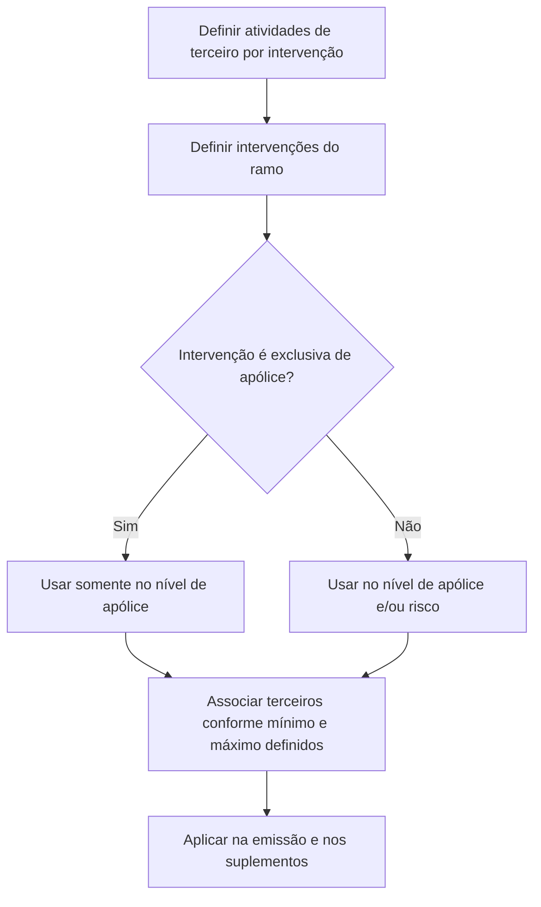

# Definição de Intervenções no Reef.core para Emissão e Suplementos

## 1. Metadados do Documento
- **Arquivo de Origem:** Não identificado; conteúdo bruto fornecido no enunciado
- **Tipo de Documento:** Procedimento / Especificação Funcional
- **Domínio / Sistema:** Reef.core; apólices, ramos, riscos e terceiros
- **Público-Alvo:** Negócio, analistas funcionais e equipes responsáveis pela configuração de ramos
- **Data/Versão Identificada:** Não identificada

---

## 2. Resumo Executivo & Contexto de Negócio

O documento descreve a definição de **intervenções** que serão solicitadas durante a emissão e os suplementos de apólices no sistema Reef.core. Cada intervenção pode agrupar uma ou mais pessoas físicas ou jurídicas, denominadas terceiros.

As intervenções disponíveis são previamente estabelecidas no Reef.core e não podem ser criadas livremente. Quando houver necessidade de uma nova intervenção, deve ser solicitada sua inclusão no sistema.

A intervenção de tomador da apólice é indicada como obrigatória em um ramo. As demais intervenções podem ou não ser incluídas em um ramo e, quando incluídas, podem ser configuradas como não obrigatórias para cada apólice.

O documento também estabelece que é possível definir a quantidade mínima e máxima de terceiros associados a uma intervenção. Algumas intervenções são exclusivas do nível de apólice, enquanto outras podem ser utilizadas tanto no nível de apólice quanto no nível de risco.

---

## 3. Arquitetura, Componentes & Tecnologias Envolvidas

Os elementos funcionais identificados são:

- **Reef.core:** sistema no qual as intervenções já estão estabelecidas.
- **Emissão:** processo no qual são solicitadas figuras/intervenções.
- **Suplementos:** processo também contemplado pela definição de intervenções.
- **Ramo:** contexto no qual as intervenções são definidas e configuradas.
- **Apólice:** nível que pode possuir intervenções e terceiros associados.
- **Risco:** nível que pode utilizar determinadas intervenções, exceto as exclusivas de apólice.
- **Terceiros:** pessoas físicas ou jurídicas associadas a uma intervenção.



> **Nota de Análise:** O conteúdo não descreve arquitetura técnica, integrações, métodos HTTP, contratos JSON, bancos de dados, ambientes ou tecnologias adicionais.

---

## 4. Regras de Negócio, Especificações Funcionais & Processos

1. Uma intervenção é uma agrupação sob a qual são incluídos um ou mais terceiros.
2. Os terceiros associados a uma intervenção podem ser pessoas físicas ou jurídicas.
3. As intervenções são utilizadas para definir quais figuras serão solicitadas durante a emissão e os suplementos.
4. As intervenções já foram previamente estabelecidas no Reef.core.
5. As intervenções não são de livre criação.
6. A necessidade de uma nova intervenção exige solicitação para que sua inclusão seja realizada.
7. Exceto pela intervenção de tomador da apólice, as intervenções não são obrigatórias de incluir em um ramo.
8. Mesmo quando uma intervenção é incorporada a um ramo, ela pode ser definida como não obrigatória.
9. Como consequência, algumas apólices podem possuir terceiros associados a uma intervenção, enquanto outras apólices podem não possuir terceiros naquela mesma intervenção.
10. É possível estabelecer um número mínimo e máximo de terceiros que atuam em uma intervenção.
11. Existem intervenções exclusivas do nível de apólice.
12. As intervenções que não são exclusivas de apólice podem ser utilizadas indistintamente no nível de apólice e no nível de risco.
13. As intervenções exclusivas de nível de apólice explicitamente listadas são: tomador, tomadores alternos e pagador.

### Processo de definição

1. Definir as atividades de terceiro por intervenção.
2. Definir as intervenções do ramo.

> **Nota de Análise:** O documento apresenta os dois passos do processo, mas não detalha campos, telas, responsáveis, critérios de aprovação ou a relação operacional entre atividades de terceiros e intervenções do ramo.

---

## 5. Tabelas de Parâmetros, Ambientes e Estruturas de Dados

| Item / Parâmetro | Descrição / Função | Tipo / Valores / Formato | Ambiente / Observações |
| :--- | :--- | :--- | :--- |
| Intervenção | Agrupação sob a qual são incluídos um ou mais terceiros | Figura previamente estabelecida no Reef.core | Utilizada na emissão e nos suplementos |
| Terceiro | Pessoa associada a uma intervenção | Pessoa física ou pessoa jurídica | Uma intervenção pode incluir um ou mais terceiros |
| Obrigatoriedade no ramo | Define se a intervenção deve ser incluída no ramo | Obrigatória ou não obrigatória | A exceção citada é a intervenção de tomador da apólice |
| Obrigatoriedade na apólice | Permite que uma intervenção incluída no ramo seja não obrigatória em apólices específicas | Não obrigatória, conforme definição | Algumas apólices podem não ter terceiros em determinada intervenção |
| Quantidade de terceiros | Limita a quantidade de terceiros que atuam em uma intervenção | Número mínimo e número máximo | Valores numéricos concretos não foram informados |
| Nível de utilização | Determina onde uma intervenção pode ser usada | Apólice; apólice e risco | Algumas intervenções são exclusivas de apólice |
| Tomador | Intervenção exclusiva de nível de apólice | Intervenção | Citada como obrigatória no ramo |
| Tomadores alternos | Intervenção exclusiva de nível de apólice | Intervenção | Sem detalhamento adicional |
| Pagador | Intervenção exclusiva de nível de apólice | Intervenção | Sem detalhamento adicional |
| Atividades de terceiro por intervenção | Primeira etapa do processo documentado | Etapa de definição | Sem campos ou critérios detalhados |
| Intervenções do ramo | Segunda etapa do processo documentado | Etapa de definição | Sem campos ou critérios detalhados |

---

## 6. Bateria de Perguntas & Respostas para RAG (FAQ Sintético)

### P1: O que é uma intervenção no contexto do Reef.core?
**R:** Uma intervenção é uma agrupação sob a qual são incluídos um ou mais terceiros. Os terceiros associados podem ser pessoas físicas ou jurídicas. As intervenções são utilizadas para definir quais figuras serão solicitadas durante a emissão e os suplementos.

### P2: É possível criar livremente uma nova intervenção no Reef.core?
**R:** Não. As intervenções foram estabelecidas previamente no Reef.core e não são de livre criação. Quando uma nova intervenção for necessária, deve ser solicitada sua inclusão.

### P3: Qual intervenção é obrigatória de incluir em um ramo?
**R:** O documento indica que, salvo a intervenção de tomador da apólice, as intervenções não são obrigatórias de incluir em um ramo. Portanto, o tomador da apólice é a exceção indicada.

### P4: Uma intervenção incluída em um ramo precisa ser obrigatória em todas as apólices?
**R:** Não. Mesmo que uma intervenção seja incorporada a um ramo, ela pode ser definida como não obrigatória. Dessa forma, algumas apólices podem ter terceiros associados à intervenção e outras podem não ter terceiros associados a ela.

### P5: É possível limitar a quantidade de terceiros associados a uma intervenção?
**R:** Sim. O documento informa que é factível estabelecer um número mínimo e máximo de terceiros que atuam em uma intervenção. Os valores concretos desses limites não foram especificados.

### P6: Quais intervenções são exclusivas do nível de apólice?
**R:** As intervenções exclusivas do nível de apólice listadas no documento são: tomador, tomadores alternos e pagador.

### P7: As intervenções podem ser usadas no nível de risco?
**R:** Algumas intervenções podem ser usadas indistintamente no nível de apólice e risco. Entretanto, as intervenções identificadas como exclusivas de apólice não podem ser usadas no nível de risco segundo a classificação apresentada.

### P8: Qual é o processo apresentado para definir intervenções?
**R:** O processo possui duas etapas: primeiro, definir as atividades de terceiro por intervenção; segundo, definir as intervenções do ramo.

### P9: O documento detalha os campos ou critérios de configuração das atividades de terceiro por intervenção?
**R:** Não. O documento apresenta a etapa “definir atividades de terceiro por intervenção”, mas não descreve campos, valores permitidos, regras de validação ou critérios de aprovação.

### P10: Em quais processos as intervenções serão solicitadas?
**R:** As intervenções serão solicitadas nos processos de emissão e suplementos.

---

## 7. Glossário de Termos, Siglas & Conceitos-Chave

- **Reef.core:** Sistema citado como o local onde as intervenções foram previamente estabelecidas.
- **Intervenção:** Agrupação sob a qual são incluídos um ou mais terceiros.
- **Terceiro:** Pessoa física ou jurídica associada a uma intervenção.
- **Apólice:** Entidade que pode conter intervenções e terceiros associados.
- **Ramo:** Contexto no qual são definidas as intervenções aplicáveis.
- **Risco:** Nível em que podem ser utilizadas intervenções não exclusivas de apólice.
- **Tomador:** Intervenção exclusiva de nível de apólice; indicada como exceção à não obrigatoriedade de intervenções em um ramo.
- **Tomadores alternos:** Intervenção exclusiva de nível de apólice.
- **Pagador:** Intervenção exclusiva de nível de apólice.
- **Emissão:** Processo em que são solicitadas figuras/intervenções.
- **Suplementos:** Processo também abrangido pela solicitação de figuras/intervenções.

---

## 8. Notas Críticas, Riscos & Limitações

- O documento não identifica o arquivo de origem, versão, data, responsável ou público formal.
- Não há detalhamento técnico sobre APIs, persistência de dados, integrações, interfaces, permissões ou ambientes.
- Não foram informados os valores mínimos e máximos permitidos para terceiros por intervenção.
- Não foram descritos os procedimentos de solicitação, aprovação ou implantação de novas intervenções.
- Não há definição detalhada para as atividades de terceiro por intervenção.
- Não há critérios para decidir quais intervenções podem ser usadas simultaneamente em apólice e risco.
- **Nota de Análise:** O conteúdo lista tomador, tomadores alternos e pagador como intervenções exclusivas de apólice, porém não detalha regras específicas para cada uma.

---

## 9. Conteúdo Bruto Estruturado (Referência Fiel)

```text
--- [PÁGINA 1 DE 2] ---

DEFINICIÓN de Intervenciones
Objetivo
Realizar la definición de qué figuras se solicitará en la emisión y suplementos. A cada figura se le
podrá asociar personas físicas o jurídicas (terceros).
¿En qué consiste?
Existe una serie de figuras establecidas en Reef.core las cuales se decide si formarán parte de las
pólizas. Se puede decir que una figura es una agrupación bajo la que se incluyen uno o varios
terceros.
A estas figuras se las denomina intervenciones.
Las intervenciones han sido establecidas previamente y no son de libre creación. Cuando sea
necesario una nueva intervención, debe ser solicitada para que se realice su inclusión.
Características generales
Salvo la intervención de tomador de la póliza no son obligatorias de incluir en un ramo
Incluso si se incorpora una intervención a un ramo, se puede definir como no obligatoria. Es
decir, habrá póliza que disponga de terceros en esa intervención y otras pólizas no tendrán
Ejemplo:
 / 
 RS
Inicio Soluciones APIs Documentación Zeus
ES


--- [PÁGINA 2 DE 2] ---

asociados terceros a a esa intervención
Es factible establecer un número mínimo y máximo de terceros que actúan en una intervención
Existen intervenciones que son exclusivas de póliza (detalladas a continuación) y otras se
pueden utilizar indistintamente en el nivel de póliza y riesgo
INTERVENCIÓN EXCLUSIVA
DE NIVEL PÓLIZA
TOMADOR
TOMADORES ALTERNOS
PAGADOR
Proceso a seguir
La definición de las intervenciones se realiza completando los pasos mostrados a continuación.
DEFINIR
actividades
de tercero
por
intervención
(1)
DEFINIR
Intervenciones
del
ramo
(2)
1. DEFINIR actividades de tercero por intervención
1. DEFINIR intervenciones del ramo
Ejemplo:
Ejemplo:
```
