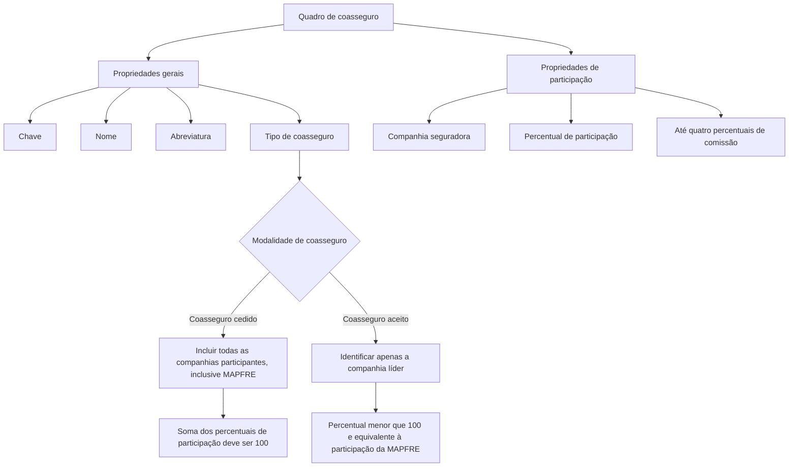

# Definição e Configuração de Quadro de Coasseguro

## 1. Metadados do Documento
- **Arquivo de Origem:** `Não identificado no conteúdo extraído`
- **Tipo de Documento:** `Especificação Técnica`
- **Domínio / Sistema:** `Coasseguro / MAPFRE`
- **Público-Alvo:** `Negócio, Operação, Analistas Funcionais e Desenvolvedores`
- **Data/Versão Identificada:** `Não identificada`

---

## 2. Resumo Executivo & Contexto de Negócio

O documento define o conceito de **quadro de coasseguro** como o agrupamento de entidades participantes de um acordo de coasseguro. Cada entidade participa da cobertura de um risco, ou de um conjunto de riscos, segundo um percentual previamente estabelecido em contrato.

O objetivo funcional é registrar as companhias seguradoras participantes e as respetivas condições de participação conforme o tipo de coasseguro. O quadro possui propriedades gerais de identificação — chave, nome, abreviatura e tipo de coasseguro — além das propriedades de participação de cada companhia seguradora.

O documento diferencia as regras aplicáveis ao **coasseguro cedido** e ao **coasseguro aceito**. No coasseguro cedido, todas as companhias participantes, inclusive a MAPFRE, devem estar registradas no quadro e a soma dos percentuais de participação deve ser igual a 100. No coasseguro aceito, somente a companhia que atua como líder é identificada, e o percentual é inferior a 100, equivalendo à participação da MAPFRE.

Além da participação em prêmios de apólices e sinistros, o documento prevê até quatro percentuais de comissão por companhia. Esses percentuais representam a parcela assumida em comissão do agente, despesas, sobretaxas ou outros valores acordados.

---

## 3. Arquitetura, Componentes & Tecnologias Envolvidas

O conteúdo extraído não descreve arquitetura de software, integrações técnicas, APIs, tecnologias, ambientes, contratos HTTP ou estruturas de persistência. O documento apresenta um modelo funcional para cadastro e validação de quadros de coasseguro.

Componentes funcionais identificados:

| Componente | Função identificada |
| :--- | :--- |
| Quadro de coasseguro | Agrupa as companhias participantes de um acordo de coasseguro. |
| Companhia seguradora | Entidade participante do acordo; deve existir previamente como seguradora. |
| MAPFRE | Companhia cuja atuação determina regras distintas para coasseguro cedido e aceito. |
| Tipo de coasseguro | Identifica a modalidade do quadro segundo a forma como a MAPFRE atua. |
| Percentual de participação | Define a participação da companhia em prêmios de apólices e sinistros. |
| Percentuais de comissão | Define até quatro percentuais relativos à parcela assumida em comissão, despesas, sobretaxas ou outros valores acordados. |



> *Nota de Análise: O documento não detalha telas, banco de dados, serviços, métodos HTTP, contratos JSON, regras de cálculo de comissão ou comportamento de validação automatizada.*

---

## 4. Regras de Negócio, Especificações Funcionais & Processos

### 4.1. Definição de quadro de coasseguro

Um quadro de coasseguro é o conjunto de entidades que participam, sob um contrato de coasseguro, da cobertura de um risco ou conjunto de riscos. A participação de cada entidade é definida por um percentual preestabelecido.

### 4.2. Objetivo do registro

O registro do quadro de coasseguro deve permitir:

1. Registrar as entidades que participam do acordo de coasseguro.
2. Registrar as condições de participação das entidades.
3. Organizar as condições conforme o tipo de coasseguro.
4. Identificar o papel da MAPFRE na modalidade configurada.

### 4.3. Propriedades gerais do quadro

1. A **chave** agrupa as companhias participantes do acordo de coasseguro.
2. O **nome** identifica descritivamente o quadro de coasseguro.
3. A **abreviatura** representa o nome curto do quadro de coasseguro.
4. O **tipo de coasseguro** identifica a forma de coasseguro do quadro conforme a atuação da MAPFRE.

### 4.4. Propriedades de participação

1. Cada companhia seguradora participante deve existir previamente como seguradora.
2. A própria MAPFRE está incluída na exigência de existência prévia como seguradora.
3. O percentual de participação determina a participação da companhia:
   - No prêmio das apólices.
   - Nos sinistros.
4. Podem ser definidos até quatro percentuais de comissão para cada companhia.
5. Os percentuais de comissão podem corresponder à parte assumida pela companhia em:
   - Comissão do agente.
   - Despesas.
   - Sobretaxas.
   - Qualquer outro valor acordado.

### 4.5. Regras para coasseguro cedido

1. Todas as companhias que participam do coasseguro cedido devem ser incluídas no quadro.
2. A MAPFRE deve estar incluída entre as companhias participantes do coasseguro cedido.
3. A soma dos percentuais de participação de todas as companhias incluídas no quadro deve ser igual a **100**.

### 4.6. Regras para coasseguro aceito

1. No coasseguro aceito, deve ser identificada somente a companhia que atua como líder.
2. O percentual de participação no coasseguro aceito deve ser menor que **100**.
3. O percentual de participação informado no coasseguro aceito equivale à participação da MAPFRE.

---

## 5. Tabelas de Parâmetros, Ambientes e Estruturas de Dados

| Item / Parâmetro | Descrição / Função | Tipo / Valores / Formato | Ambiente / Observações |
| :--- | :--- | :--- | :--- |
| Quadro de coasseguro | Agrupa companhias que participam de um acordo de coasseguro. | Conjunto de entidades participantes. | Aplicável à cobertura de um risco ou conjunto de riscos. |
| Chave | Agrupa as companhias participantes do acordo de coasseguro. | Não especificado. | Propriedade geral do quadro. |
| Nome | Identifica descritivamente o quadro de coasseguro. | Texto descritivo; formato não especificado. | Propriedade geral do quadro. |
| Abreviatura | Representa o nome curto do quadro de coasseguro. | Texto curto; formato não especificado. | Propriedade geral do quadro. |
| Tipo de coasseguro | Identifica a forma de coasseguro conforme a atuação da MAPFRE. | Coasseguro cedido ou coasseguro aceito. | Propriedade geral do quadro. |
| Companhia seguradora | Identifica uma seguradora participante do acordo. | Companhia seguradora previamente existente. | Inclui a própria MAPFRE quando aplicável. |
| Percentual de participação | Define a participação da companhia no prêmio das apólices e nos sinistros. | Percentual. | No cedido, a soma total deve ser 100; no aceito, deve ser menor que 100. |
| Percentual de participação — coasseguro cedido | Participação de cada companhia incluída no quadro cedido. | Soma dos percentuais igual a 100. | Todas as participantes, inclusive MAPFRE, devem ser incluídas. |
| Percentual de participação — coasseguro aceito | Participação equivalente à participação da MAPFRE. | Percentual menor que 100. | Somente a companhia líder é identificada. |
| Percentuais de comissão | Estabelecem a parcela assumida pela companhia em valores acordados. | Até quatro percentuais distintos. | Podem tratar comissão do agente, despesas, sobretaxas ou outros valores acordados. |
| Ambientes técnicos | Não descritos no conteúdo extraído. | Não aplicável. | Não há URLs, servidores, portas ou rotas de log informados. |

---

## 6. Bateria de Perguntas & Respostas para RAG (FAQ Sintético)

### P1: O que é um quadro de coasseguro?
**R:** Um quadro de coasseguro é o conjunto de entidades que participam de um contrato de coasseguro. Cada entidade participa da cobertura de um risco ou de um conjunto de riscos segundo um percentual previamente estabelecido.

### P2: Qual é o objetivo de registrar um quadro de coasseguro?
**R:** O registro permite cadastrar as entidades participantes e as condições de participação de cada entidade, organizadas conforme o tipo de coasseguro.

### P3: Quais são as propriedades gerais de um quadro de coasseguro?
**R:** As propriedades gerais identificadas são chave, nome, abreviatura e tipo de coasseguro. A chave agrupa as companhias do acordo, o nome identifica o quadro, a abreviatura representa seu nome curto e o tipo identifica a modalidade segundo a atuação da MAPFRE.

### P4: Quais condições uma companhia seguradora deve atender para participar de um quadro de coasseguro?
**R:** As companhias participantes devem existir previamente como seguradoras. Essa exigência também se aplica à própria MAPFRE.

### P5: Como funciona o percentual de participação de uma companhia no coasseguro?
**R:** O percentual de participação define a parcela com que a companhia participa tanto no prêmio das apólices quanto nos sinistros.

### P6: Qual é a regra para a soma dos percentuais no coasseguro cedido?
**R:** No coasseguro cedido, a soma dos percentuais de participação de todas as companhias incluídas no quadro deve ser igual a 100.

### P7: Quais companhias devem ser incluídas em um quadro de coasseguro cedido?
**R:** Devem ser incluídas todas as companhias que participam do coasseguro cedido, inclusive a MAPFRE.

### P8: Como deve ser configurado o coasseguro aceito?
**R:** No coasseguro aceito, somente a companhia que atua como líder é identificada. O percentual informado deve ser menor que 100 e equivale à participação da MAPFRE.

### P9: Quantos percentuais de comissão podem ser definidos para uma companhia?
**R:** Podem ser determinados até quatro percentuais de comissão distintos para a companhia correspondente.

### P10: Que valores podem ser representados pelos percentuais de comissão?
**R:** Os percentuais de comissão podem estabelecer a parte assumida pela companhia na comissão do agente, em despesas, em sobretaxas ou em qualquer outro valor acordado.

### P11: O documento detalha como são calculados os percentuais de comissão?
**R:** Não. O documento informa que podem ser definidos até quatro percentuais de comissão e indica os tipos de valores que podem ser abrangidos, mas não apresenta fórmulas, critérios de cálculo ou exemplos completos.

---

## 7. Glossário de Termos, Siglas & Conceitos-Chave

- **Coasseguro:** Acordo no qual entidades participam, cada uma com um percentual preestabelecido, da cobertura de um risco ou conjunto de riscos.
- **Coasseguro aceito:** Modalidade em que somente é identificada a companhia que atua como líder; o percentual é menor que 100 e equivale à participação da MAPFRE.
- **Coasseguro cedido:** Modalidade em que todas as companhias participantes, inclusive a MAPFRE, devem ser incluídas; a soma dos percentuais de participação deve ser 100.
- **Companhia líder:** Companhia identificada no coasseguro aceito.
- **MAPFRE:** Companhia mencionada no documento cuja forma de atuação determina as regras aplicáveis ao tipo de coasseguro.
- **Percentual de participação:** Percentual acordado que determina a participação da companhia nos prêmios das apólices e nos sinistros.
- **Percentuais de comissão:** Até quatro percentuais que representam a parcela assumida pela companhia em comissão do agente, despesas, sobretaxas ou outros valores acordados.
- **Prêmio de apólice:** Elemento citado como objeto da participação percentual da companhia; o documento não apresenta definição adicional.
- **Sinistro:** Elemento citado como objeto da participação percentual da companhia; o documento não apresenta definição adicional.

---

## 8. Notas Críticas, Riscos & Limitações

- O conteúdo extraído não identifica o nome do arquivo de origem, data, versão, autor ou área responsável pelo documento.
- Não há detalhamento de arquitetura de software, tecnologias, integrações, APIs, banco de dados, autenticação, ambientes ou URLs.
- O documento não descreve regras de arredondamento, quantidade de casas decimais, tolerâncias ou comportamento de validação para a soma de percentuais.
- O documento não define quais são os quatro tipos específicos de percentuais de comissão; apenas indica que podem corresponder a comissão do agente, despesas, sobretaxas ou outros valores acordados.
- O exemplo anunciado ao final do conteúdo extraído não foi fornecido após a palavra “Ejemplo:”.
- A expressão de navegação “RS Inicio Soluciones APIs Documentación Zeus ES” aparece na extração, mas não recebe explicação funcional ou técnica no conteúdo disponibilizado.

---

## 9. Conteúdo Bruto Estruturado (Referência Fiel)

```text
--- [PÁGINA 1 DE 2] ---

DEFINICIÓN de cuadro de coaseguro
Objetivo
Con este nombre se suele designar al conjunto de entidades que, en virtud de un contrato de
coaseguro, participan cada una en un porcentaje preestablecido en la cobertura de un riesgo o
conjunto de estos
Se trata de registrar las entidades que participan y las condiciones de participación, según el tipo de
coaseguro.
Propiedades generales
Propiedades de participación
Propiedades generales
Cuadro de coaseguro
Clave por la que se agrupan las compañías que participan en el acuerdo de coaseguro.
Nombre
Descripción que identifica el cuadro de coaseguro.
Abreviatura
Nombre corto del cuadro de coaseguro.
 /
 RS
Inicio Soluciones APIs Documentación Zeus
ES


--- [PÁGINA 2 DE 2] ---

Tipo de coaseguro
Identifica la forma de coaseguro que tiene el cuadro, dependiendo de cómo actúa la compañía
MAPFRE.
Propiedades de participación
Compañía aseguradora
Identifica las compañía aseguradoras que forman parte del acuerdo.
Las compañías que participan deben existir previamente como aseguradoras, incluida la propia
compañía MAPFRE.
En coaseguro cedido se deben incluir todas las compañías que participan, incluida la compañía
MAPFRE.
En coaseguro aceptado solo se identifica la compañía que actúa como [líder].
Porcentaje de participación
Establece el porcentaje acordado, con el que la compañía participará tanto en la prima de las pólizas,
como en los siniestros.
En coaseguro cedido la suma de los porcentajes de participación, de todas las compañías
incluidas en el cuadro, debe ser 100.
En coaseguro aceptado este porcentaje debe ser menor a 100 y equivale a la participación de
MAPFRE.
Porcentajes de comisión
Se determinan hasta cuatro porcentajes de comisión distintos, que establecen la parte que asumirá la
compañía correspondiente, de la comisión del agente, gastos, recargos o cualquier otro importe que
se acuerde.
Ejemplo:
```
