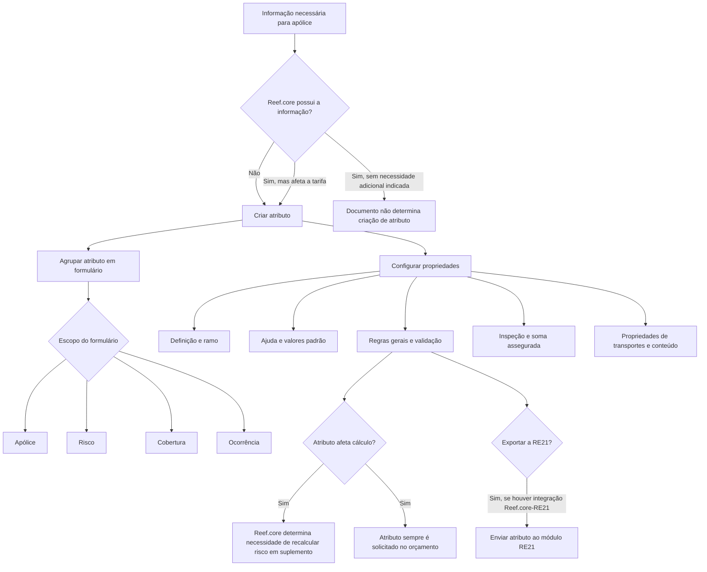

# Definição e Propriedades de Atributos no Reef.core

## 1. Metadados do Documento
- **Arquivo de Origem:** Não identificado — conteúdo bruto fornecido na solicitação
- **Tipo de Documento:** Especificação Técnica / Manual Funcional
- **Domínio / Sistema:** Reef.core; integração com RE21; tratamento de ramos de seguros
- **Público-Alvo:** Desenvolvedores, analistas funcionais, arquitetos, operação e equipes de parametrização de produtos de seguros
- **Data/Versão Identificada:** Não identificada

---

## 2. Resumo Executivo & Contexto de Negócio

O documento descreve a definição, parametrização e comportamento de atributos no sistema Reef.core. Atributos são necessários quando o Reef.core não dispõe de uma informação que precisa ser registrada em uma apólice ou quando uma informação existente afeta a tarifa. Os atributos devem ser agrupados em formulários.

A definição de um atributo cobre propriedades de identificação, ramo, ajuda, valores padrão, comportamento geral, validação, inspeção, soma assegurada e propriedades específicas. O documento detalha como esses elementos determinam a coleta, apresentação, persistência, validação e utilização de informações durante operações de emissão, orçamento, suplementos, inspeções e sinistros.

Os formulários de atributos possuem escopos associados à apólice, risco, cobertura ou ocorrência. O escopo define o elemento ao qual a informação se aplica, abrangendo todos os riscos da apólice, cada risco individualmente, uma cobertura de risco ou a cobertura, risco ou apólice associada a uma ocorrência.

O documento também estabelece regras importantes para atributos que afetam cálculo, possuem valor padrão, são únicos, obrigatórios, usados em inspeção, exportados ao módulo RE21 ou empregados como soma assegurada. A correta configuração impacta cálculos de risco, disponibilidade comercial, histórico de definições, consultas à carteira vigente e continuidade dos processos operacionais.

> **Nota de Análise:** O documento descreve propriedades funcionais e de parametrização de atributos, mas não detalha telas específicas além da referência usual à tela de ajuda `AL000010`, nem contratos técnicos, APIs, métodos HTTP, estruturas JSON ou versões do Reef.core.

---

## 3. Arquitetura, Componentes & Tecnologias Envolvidas

### Componentes e conceitos identificados

| Componente / Conceito | Função descrita |
| :--- | :--- |
| Reef.core | Sistema no qual atributos são definidos, associados a ramos e utilizados em apólices, riscos, coberturas, orçamentos, suplementos, sinistros e inspeções. |
| Atributo | Informação criada quando o Reef.core não possui a informação necessária ou quando a informação afeta a tarifa. |
| Formulário | Agrupamento de atributos, associado aos escopos de apólice, risco, cobertura ou ocorrência. |
| Apólice | Entidade de seguro à qual atributos podem ser associados. |
| Risco | Elemento da apólice que pode possuir atributos próprios. |
| Cobertura | Cobertura de um risco à qual atributos podem pertencer ou cuja soma assegurada pode utilizar o conteúdo do atributo. |
| Ocorrência | Escopo de formulário associado à cobertura, risco ou apólice. |
| RE21 | Módulo de resseguro para o qual um atributo pode ser exportado quando houver integração. |
| Oracle | Tecnologia mencionada como local onde pode existir a tabela de informações de ajuda. |
| AL000010 | Valor usual da propriedade de tela de ajuda. |
| Controle técnico | Mecanismo que pode reter uma operação de emissão; em caso de rejeição, parte das informações do elemento rejeitado é armazenada pelo Reef.core. |
| Carteira vigente | Conjunto de riscos vigentes consultado pela regra de unicidade de atributos. |
| Póliza marco | Tipo de apólice no tratamento de transportes. |
| Aplicações | Entidades que podem receber ou exibir atributos no tratamento de transportes. |
| PLATEA | Sistema ou contexto referido pelo conteúdo permitido `Transaction id PLATEA`; o documento não fornece detalhamento adicional. |

### Fluxo funcional de definição e uso de atributos



---

## 4. Regras de Negócio, Especificações Funcionais & Processos

### 4.1 Criação e agrupamento de atributos

1. Um atributo deve ser criado quando o Reef.core não dispõe de uma informação necessária para registrar em uma apólice.
2. Um atributo também deve ser criado quando o Reef.core dispõe da informação, mas essa informação afeta a tarifa.
3. Atributos devem ser agrupados em formulários.
4. Cada formulário pode possuir escopo de apólice, risco, cobertura ou ocorrência.

### 4.2 Escopos de formulário

| Tipo de formulário | Escopo afetado |
| :--- | :--- |
| Póliza | Todos os riscos da apólice. |
| Riesgo | Cada um dos riscos da apólice. |
| Cobertura | A cobertura do risco ao qual o formulário está associado. |
| Ocurrencia | A cobertura, risco ou apólice à qual o formulário está associado. |

### 4.3 Identificação, tipo e formato do atributo

- O **nome do atributo** deve ser determinado na definição e não deve ser confundido com a descrição.
- Recomenda-se o uso de um prefixo que indique o conteúdo armazenado.
- A **descrição do atributo** é o texto exibido ao usuário que realiza a operação.
- O **tipo de campo** determina o tipo de informação que será informado pelo usuário.
- Os tipos possíveis descritos são: caráter, número e data.
- O tipo **caráter** pode conter letras, números e outros caracteres.
- O tipo **número** pode conter somente números.
- O tipo **data** pode conter somente datas.
- O formato padrão de data é `ddmmyyyy`.
- O formato de data pode ser alterado para o padrão americano `mmddyyyy`.
- A propriedade de comprimento máximo determina o tamanho máximo aceito pelo atributo.

### 4.4 Propriedades de ramo

- A propriedade **ramo** aponta para o ramo afetado pela definição.
- A propriedade **modalidade de vida** determina a modalidade do atributo, exclusivamente para ramos com tratamento de vida.
- A propriedade **cobertura** define a cobertura à qual o atributo pertence.
- A propriedade **ordem** define a posição de solicitação ou exibição do atributo.
- A **data de validade** determina quando a definição estará disponível para uso.
- O uso correto da data de validade permite manter histórico das alterações realizadas na definição.
- A propriedade associada à modalidade comercial determina se o atributo participa da determinação da oferta comercial.
- Para ramos que trabalham com modalidades, um ou mais atributos podem determinar a oferta comercial disponibilizada ao cliente na criação ou alteração de uma apólice ou aplicação.
- O valor da modalidade depende de o ramo trabalhar ou não com modalidades e de como essas modalidades são formadas.

### 4.5 Propriedades de ajuda

- As propriedades de ajuda definem a assistência exibida ao usuário quando solicitada.
- A propriedade **pantalla** solicita a tela de ajuda; o valor usual informado é `AL000010`.
- A propriedade **tabla** solicita a tabela Oracle que contém a informação de ajuda.
- A propriedade **versión** identifica a versão da ajuda da tabela selecionada.
- A propriedade **depósito con la selección** não é obrigatória; quando necessária, identifica o local de armazenamento da informação selecionada na ajuda.

### 4.6 Lógica prévia e valor padrão

A lógica de negócio prévia à solicitação de informação pode determinar:

- O valor assumido pelo atributo.
- Se o valor pode ser alterado pela pessoa que realiza a operação.

| Atributo com valor padrão | Valor pode ser modificado |
| :--- | :--- |
| Sim | Sim |
| Sim | Não |
| Não | Sim |
| Não | Não |

Regras de valor padrão:

1. Um valor padrão pode ser definido para ser utilizado quando o atributo não possui valor durante a operação.
2. Caso o valor padrão dependa de alguma circunstância, deve-se utilizar também a lógica de negócio prévia à solicitação de informação.
3. Um atributo com valor padrão somente o utiliza quando não possui valor.
4. Depois que o atributo recebe um valor — seja o valor padrão ou outro valor — o atributo conserva esse valor.
5. O valor padrão não é novamente assumido depois que o atributo já possui algum valor.

### 4.7 Propriedades gerais

#### Atributo que afeta cálculo

- A propriedade **afecta al cálculo** determina se o conteúdo do atributo afeta o valor do seguro.
- Essa propriedade deve ser configurada corretamente.
- Com base no valor dessa propriedade, o Reef.core determina se o risco deve ou não ser recalculado em um suplemento.

#### Unicidade

- Um atributo único não pode possuir o mesmo valor em outra apólice dentro do mesmo período de vigência.
- Quando um atributo único possui valor padrão e seu conteúdo coincide com esse valor padrão, o Reef.core não realiza busca em outro risco vigente da carteira para localizar o conteúdo.
- Quando o atributo único deixa de possuir o valor padrão, o Reef.core realiza busca do conteúdo na carteira vigente.

#### Solicitação no orçamento

- A propriedade **se solicita en presupuesto** define se o atributo é solicitado durante um orçamento.
- O objetivo é solicitar a menor quantidade possível de informação quando um cliente deseja conhecer o preço de um seguro.
- Todo atributo declarado como afetando o cálculo é sempre solicitado em um orçamento.
- Para atributos que afetam cálculo, essa característica não pode receber valor configurável.

#### Sinistro, obrigatoriedade e maiúsculas/minúsculas

- A propriedade de exibição na tramitação de sinistro define se o atributo será apresentado ao usuário que trata o sinistro, sem necessidade de consultar a apólice.
- A propriedade **obligatorio** define se o atributo deve obrigatoriamente possuir valor.
- Enquanto um atributo obrigatório não possuir valor, o processo não pode continuar.
- Por padrão, o conteúdo de um atributo é registrado em maiúsculas.
- A propriedade de admissão de maiúsculas e/ou minúsculas permite que o conteúdo seja registrado em minúsculas.

### 4.8 Validação

- A lógica de negócio de validação verifica o conteúdo do atributo.
- A lógica determina se o conteúdo é correto.
- Quando o conteúdo não é correto, é retornado um erro.
- A validação é executada se o atributo possuir algum tipo de conteúdo.
- A propriedade **valida aunque el atributo no tenga valor** faz com que a validação seja executada mesmo quando o atributo estiver vazio.
- A propriedade **validación en el momento** faz com que a validação seja realizada logo após a introdução do valor, sem aguardar o acionamento do botão `Aceptar`.

### 4.9 Rejeição, RE21 e inabilitação

- Quando uma operação de emissão é retida por controle técnico e rejeitada, o Reef.core armazena parte das informações do elemento rejeitado.
- A propriedade **grabar atributo en caso de rechazo** define se o atributo deve ser armazenado em caso de rejeição.
- Quando o Reef.core está integrado ao RE21, a propriedade **exportar a RE21** define se o atributo será enviado ao módulo de resseguro.
- A propriedade **inhabilitado** determina se o atributo está ativo ou se não pode mais ser incluído em uma nova apólice.
- A inabilitação não interrompe a aplicação do atributo nas apólices que já o possuem.
- Uma apólice existente continuará aplicando o atributo até que um suplemento o altere.
- Quando o atributo estiver inabilitado, após a alteração por suplemento não será mais possível selecioná-lo.

### 4.10 Inspeção

- A propriedade de participação em formulário de inspeção determina que o atributo fará parte desse formulário para exibição e/ou informação de valor.
- A propriedade **clave en la búsqueda de inspecciones** define se o atributo é relevante para localizar uma inspeção.
- Devem ser escolhidos atributos de baixa cardinalidade na carteira de apólices, isto é, atributos com quantidade reduzida de valores distintos.
- Atributos de baixa cardinalidade devem ocupar as primeiras posições no formulário, conforme a propriedade **orden**.
- A busca de inspeção é realizada usando o operador de comparação igual.
- Na emissão de uma apólice, cada atributo definido possui um valor e o sistema procura uma inspeção.
- A propriedade de ordem determina tanto a posição no formulário quanto a ordem da busca de inspeção.

### 4.11 Soma assegurada e revalorização

- A propriedade **es una suma asegurada** define se o conteúdo do atributo será utilizado posteriormente como soma assegurada por uma cobertura.
- O exemplo apresentado refere-se ao ramo de automóveis: o valor do veículo é registrado como atributo do risco e posteriormente pode tornar-se soma assegurada da cobertura de danos ao próprio veículo.
- Quando um conteúdo é declarado como soma assegurada, existe a possibilidade de revalorizá-lo ou não.
- O **tipo de revalorização** define a forma pela qual a revalorização ocorrerá.
- A propriedade **como se revaloriza** define como a revalorização será executada após a decisão de revalorizar.
- Quando o tipo de revalorização afeta o capital atual ou inicial, o **porcentaje de revalorización** define o percentual aplicado.
- Quando o tipo de revalorização é baseado em outro índice, o **índice de revalorización** define qual índice será aplicado.
- A lógica de negócio de novo capital determina a nova soma assegurada.

> **Nota de Análise:** O documento indica que existem opções e formas de revalorização disponíveis em links externos, mas não apresenta essas opções no conteúdo fornecido.

### 4.12 Tratamento de transportes

Para ramos que possuem tratamento de transportes, é possível definir quando o atributo será modificável.

| Valor | Regra operacional |
| :--- | :--- |
| Póliza marco | O atributo é solicitado somente na criação ou alteração de uma apólice marco. Nas aplicações, o valor é exibido, mas não pode ser alterado. |
| Aplicaciones | O atributo é solicitado somente na criação ou alteração de uma aplicação. Nas apólices marco, o valor é exibido, mas não pode receber valores. |
| Pólizas marco y aplicaciones | O atributo é exibido e permite criar e/ou alterar valores tanto em apólices marco quanto em aplicações. |

### 4.13 Tipos de conteúdo permitidos

O tipo de conteúdo determina o conteúdo armazenado pelo atributo. Os valores permitidos apresentados são:

- Código fundo investimento.
- Edição fundo investimento.
- Percentual investimento fundo.
- Valor total investimento.
- Valor investimento fundo.
- Número de fundos de investimento.
- Anos de duração da apólice.
- Plano de contribuição.
- Suspensão do plano de contribuição.
- Valor do prêmio de investimento.
- Valor do prêmio de contribuição.
- Valor do prêmio total.
- Valor da contribuição pactuada.
- Valor de investimento da contribuição.
- Tipo gestor de contribuição.
- Código gestor de contribuição.
- Código suplemento de contribuição.
- Subcódigo suplemento de contribuição.
- Causa suplemento de contribuição.
- Motivo suplemento de contribuição.
- Agrupamento de sublimite.
- Transaction id PLATEA.

---

## 5. Tabelas de Parâmetros, Ambientes e Estruturas de Dados

### 5.1 Prefixos recomendados para nomes de atributos

| Prefixo | Conteúdo armazenado |
| :--- | :--- |
| `COD_` | Código cuja descrição se encontra em tabela do Reef.core ou do próprio ramo. |
| `FEC_` | Data. |
| `IMP_` | Valor monetário. |
| `MCA_` | Valor `SÍ` ou `NO`. |
| `NOM_` | Nome. |
| `APE_` | Sobrenome. |
| `PCT_` | Percentual. |
| `TIP_` | Valores previamente definidos em tabela do Reef.core ou do próprio ramo. |
| `VAL_` | Valor que não se enquadra nas categorias anteriores. |

### 5.2 Tipos e formatos de campo

| Item / Parâmetro | Descrição / Função | Tipo / Valores / Formato | Ambiente / Observações |
| :--- | :--- | :--- | :--- |
| Tipo de campo: Carácter | Armazena letras, números e outros caracteres. | Carácter | Aplicável à definição do atributo. |
| Tipo de campo: Número | Armazena somente números. | Número | Aplicável à definição do atributo. |
| Tipo de campo: Fecha | Armazena somente datas. | Fecha | Aplicável à definição do atributo. |
| Formato de data padrão | Formato padrão para atributos do tipo data. | `ddmmyyyy` | `dd`: dia; `mm`: mês; `yyyy`: ano. |
| Formato de data americano | Formato alternativo de data. | `mmddyyyy` | Pode substituir o formato padrão. |
| Longitud máxima | Determina o tamanho máximo aceito pelo atributo. | Não especificado | Aplicável à definição do atributo. |

### 5.3 Propriedades de configuração

| Item / Parâmetro | Descrição / Função | Tipo / Valores / Formato | Ambiente / Observações |
| :--- | :--- | :--- | :--- |
| Nombre del atributo | Define o nome do atributo. | Texto | Não deve ser confundido com a descrição. |
| Descripción del atributo | Texto exibido ao usuário operador. | Texto | Interface operacional. |
| Ramo | Identifica o ramo afetado. | Referência de ramo | Propriedade de ramo. |
| Modalidad de vida | Determina a modalidade para ramos de vida. | Não especificado | Somente ramos com tratamento de vida. |
| Cobertura | Define a cobertura à qual o atributo pertence. | Referência de cobertura | Propriedade de ramo. |
| Orden | Define posição de solicitação, formulário e/ou busca de inspeção. | Ordem/posição | Também relevante em inspeção. |
| Fecha de validez | Determina quando a definição fica disponível. | Data | Permite histórico de mudanças. |
| Pantalla | Define a tela de ajuda. | Usualmente `AL000010` | Propriedade de ajuda. |
| Tabla | Define a tabela de ajuda. | Tabela Oracle | Propriedade de ajuda. |
| Versión | Define a versão da ajuda da tabela. | Versão | Propriedade de ajuda. |
| Depósito con la selección | Local onde a seleção da ajuda é armazenada. | Nome do local | Não obrigatório. |
| Valor por defecto | Valor usado quando o atributo não tem valor. | Não especificado | Não é reassumido após o atributo receber valor. |
| Afecta al cálculo | Define se o conteúdo altera o valor do seguro. | Sim/Não | Impacta recálculo em suplemento e solicitação em orçamento. |
| Es único | Define unicidade na mesma vigência. | Sim/Não | Consulta à carteira vigente depende do valor padrão. |
| Se solicita en presupuesto | Define solicitação em orçamento. | Sim/Não | Não configurável para atributos que afetam cálculo. |
| Mostrar en la tramitación del siniestro | Define visibilidade no processo de sinistro. | Sim/Não | Evita necessidade de consultar apólice. |
| Obligatorio | Define obrigatoriedade de valor. | Sim/Não | Processo não continua sem valor obrigatório. |
| Admite mayúsculas y/o minúsculas | Permite registro em minúsculas. | Sim/Não | Padrão de registro é maiúsculas. |
| Lógica de negocio que valida el atributo | Valida conteúdo do atributo. | Lógica de negócio | Retorna erro quando conteúdo é incorreto. |
| Valida aunque el atributo no tenga valor | Executa validação para atributo vazio. | Sim/Não | Propriedade de validação. |
| Grabar atributo en caso de rechazo | Define persistência quando emissão é rejeitada. | Sim/Não | Associado ao controle técnico. |
| Exportar a RE21 | Define envio ao módulo RE21. | Sim/Não | Depende de integração Reef.core–RE21. |
| Inhabilitado | Impede inclusão em novas apólices. | Sim/Não | Não remove aplicação de apólices existentes. |
| Forma parte del formulario de inspección | Inclui atributo no formulário de inspeção. | Sim/Não | Para mostrar e/ou informar valor. |
| Clave en la búsqueda de inspecciones | Usa atributo na localização de inspeção. | Sim/Não | Preferir baixa cardinalidade. |
| Es una suma asegurada | Define uso como soma assegurada. | Sim/Não | Pode ser revalorizado. |
| Tipo de revalorización | Define forma de revalorização. | Não detalhado | Documento referencia opções externas não fornecidas. |
| Porcentaje de revalorización | Define percentual de revalorização. | Percentual | Quando o tipo afeta capital atual ou inicial. |
| Índice de revalorización | Define índice de revalorização. | Índice definido | Quando tipo utiliza outro índice. |
| Lógica de negocio que determina el nuevo capital | Determina nova soma assegurada. | Lógica de negócio | Propriedade de soma assegurada. |

### 5.4 Conteúdos permitidos para atributos

| Item / Parâmetro | Descrição / Função | Tipo / Valores / Formato | Ambiente / Observações |
| :--- | :--- | :--- | :--- |
| Tipo de contenido | Define o tipo de conteúdo do atributo. | Código fundo investimento | Conteúdo permitido. |
| Tipo de contenido | Define o tipo de conteúdo do atributo. | Edição fundo investimento | Conteúdo permitido. |
| Tipo de contenido | Define o tipo de conteúdo do atributo. | Percentual investimento fundo | Conteúdo permitido. |
| Tipo de contenido | Define o tipo de conteúdo do atributo. | Valor total investimento | Conteúdo permitido. |
| Tipo de contenido | Define o tipo de conteúdo do atributo. | Valor investimento fundo | Conteúdo permitido. |
| Tipo de contenido | Define o tipo de conteúdo do atributo. | Número de fundos de investimento | Conteúdo permitido. |
| Tipo de contenido | Define o tipo de conteúdo do atributo. | Anos duração apólice | Conteúdo permitido. |
| Tipo de contenido | Define o tipo de conteúdo do atributo. | Plano contribuição | Conteúdo permitido. |
| Tipo de contenido | Define o tipo de conteúdo do atributo. | Suspensão plano contribuição | Conteúdo permitido. |
| Tipo de contenido | Define o tipo de conteúdo do atributo. | Valor prêmio investimento | Conteúdo permitido. |
| Tipo de contenido | Define o tipo de conteúdo do atributo. | Valor prêmio contribuição | Conteúdo permitido. |
| Tipo de contenido | Define o tipo de conteúdo do atributo. | Valor prêmio total | Conteúdo permitido. |
| Tipo de contenido | Define o tipo de conteúdo do atributo. | Valor contribuição pactuada | Conteúdo permitido. |
| Tipo de contenido | Define o tipo de conteúdo do atributo. | Valor investimento contribuição | Conteúdo permitido. |
| Tipo de contenido | Define o tipo de conteúdo do atributo. | Tipo gestor contribuição | Conteúdo permitido. |
| Tipo de contenido | Define o tipo de conteúdo do atributo. | Código gestor contribuição | Conteúdo permitido. |
| Tipo de contenido | Define o tipo de conteúdo do atributo. | Código suplemento contribuição | Conteúdo permitido. |
| Tipo de contenido | Define o tipo de conteúdo do atributo. | Subcódigo suplemento contribuição | Conteúdo permitido. |
| Tipo de contenido | Define o tipo de conteúdo do atributo. | Causa suplemento contribuição | Conteúdo permitido. |
| Tipo de contenido | Define o tipo de conteúdo do atributo. | Motivo suplemento contribuição | Conteúdo permitido. |
| Tipo de contenido | Define o tipo de conteúdo do atributo. | Agrupamento sublimite | Conteúdo permitido. |
| Tipo de contenido | Define o tipo de conteúdo do atributo. | Transaction id PLATEA | Conteúdo permitido; sem detalhamento adicional. |

---

## 6. Bateria de Perguntas & Respostas para RAG (FAQ Sintético)

### P1: Quando um atributo deve ser criado no Reef.core?
**R:** Um atributo deve ser criado quando o Reef.core não possui uma informação necessária para registrar em uma apólice ou quando o Reef.core possui a informação, mas essa informação afeta a tarifa.

### P2: Quais são os escopos possíveis de um formulário de atributos?
**R:** Um formulário pode possuir escopo de apólice, risco, cobertura ou ocorrência. O formulário de apólice afeta todos os riscos; o de risco afeta cada risco; o de cobertura afeta a cobertura do risco associado; e o de ocorrência afeta a cobertura, o risco ou a apólice associada à ocorrência.

### P3: Qual formato de data é utilizado por padrão em atributos de data?
**R:** O formato padrão é `ddmmyyyy`, em que `dd` representa o dia, `mm` representa o mês e `yyyy` representa o ano. O formato pode ser alterado para o padrão americano `mmddyyyy`.

### P4: Como um atributo com valor padrão se comporta depois de receber um valor?
**R:** O valor padrão é usado somente quando o atributo não possui valor. Depois que o atributo recebe um valor, seja o próprio padrão ou outro valor, ele conserva o valor atual e não assume novamente o valor padrão.

### P5: O que ocorre quando um atributo afeta cálculo no Reef.core?
**R:** A configuração informa ao Reef.core que o conteúdo do atributo afeta o valor do seguro. Essa informação determina se o risco deve ser recalculado em um suplemento. Além disso, todo atributo que afeta cálculo é sempre solicitado em um orçamento.

### P6: Como funciona a regra de unicidade para um atributo com valor padrão?
**R:** Quando o atributo único contém o valor padrão, o Reef.core não pesquisa outro risco vigente na carteira para localizar o mesmo conteúdo. Quando o atributo deixa de ter o valor padrão, o Reef.core pesquisa o conteúdo na carteira vigente.

### P7: Quando a validação de um atributo é executada?
**R:** A lógica de validação verifica se o conteúdo do atributo é correto e retorna erro quando não é. Normalmente, a validação ocorre quando o atributo possui conteúdo. A propriedade de validação mesmo sem valor permite validar também um atributo vazio, e a validação no momento ocorre após a introdução do valor, antes do botão `Aceptar`.

### P8: O que acontece com um atributo inabilitado em apólices existentes?
**R:** Um atributo inabilitado não pode ser incluído em novas apólices. Entretanto, as apólices que já possuem o atributo continuam aplicando-o até que um suplemento o altere. Depois dessa alteração, o atributo inabilitado não poderá mais ser selecionado.

### P9: Quais atributos devem ser priorizados como chave na busca de inspeções?
**R:** Devem ser priorizados atributos de baixa cardinalidade, isto é, atributos com poucos valores distintos na carteira de apólices. Esses atributos também devem ocupar as primeiras posições no formulário, conforme a propriedade de ordem.

### P10: Como o conteúdo de um atributo pode ser utilizado como soma assegurada?
**R:** Um atributo pode ser marcado como soma assegurada para que uma cobertura utilize posteriormente seu conteúdo. O documento cita como exemplo o valor de um veículo registrado como atributo de risco e usado como soma assegurada em uma cobertura de danos ao próprio veículo. Esse valor pode ou não ser revalorizado.

### P11: Em que situação um atributo é exportado para o RE21?
**R:** A exportação ocorre quando o Reef.core está integrado ao RE21 e a propriedade `Exportar a RE21` indica que o atributo deve ser enviado ao módulo de resseguro.

### P12: Como o tratamento de transportes controla a edição de atributos?
**R:** Em `Póliza marco`, o atributo só pode ser informado ou alterado na apólice marco. Em `Aplicaciones`, só pode ser informado ou alterado em aplicações. Em `Pólizas marco y aplicaciones`, o atributo pode ser mostrado, criado e alterado nos dois contextos.

---

## 7. Glossário de Termos, Siglas & Conceitos-Chave

- **AL000010:** Valor usual informado para a propriedade de tela de ajuda.
- **Aplicaciones:** Entidades do tratamento de transportes nas quais atributos podem ser exibidos, informados ou modificados, conforme configuração.
- **Atributo:** Informação definida no Reef.core para registrar dados necessários em uma apólice ou dados que afetam a tarifa.
- **Carteira vigente:** Conjunto de riscos vigentes utilizado na busca associada à unicidade de atributos.
- **Cobertura:** Cobertura de um risco à qual um atributo pode pertencer ou que pode utilizar o atributo como soma assegurada.
- **Controle técnico:** Processo que pode reter uma emissão e resultar em rejeição.
- **Formulário:** Agrupamento de atributos com um escopo funcional.
- **Inhabilitado:** Estado em que o atributo não pode ser incluído em novas apólices.
- **Modalidade:** Oferta comercial que pode ser determinada por atributos em ramos que trabalham com modalidades.
- **Oracle:** Tecnologia mencionada como repositório de uma tabela de ajuda.
- **PLATEA:** Referência presente em `Transaction id PLATEA`; o documento não define a sigla ou o sistema.
- **Póliza marco:** Tipo de apólice usado no tratamento de transportes.
- **RE21:** Módulo de resseguro que pode receber atributos exportados pelo Reef.core.
- **Reef.core:** Sistema que gerencia atributos, apólices, riscos, coberturas, cálculos, inspeções e integrações descritas.
- **Revalorização:** Processo de atualização de uma soma assegurada conforme tipo, forma, percentual, índice ou lógica de negócio.
- **Soma assegurada:** Capital utilizado por uma cobertura, que pode ser originado do conteúdo de um atributo.

---

## 8. Notas Críticas, Riscos & Limitações

- O conteúdo não identifica nome de arquivo, data, versão, autor ou ambiente do documento.
- O documento não descreve APIs, contratos JSON, endpoints, métodos HTTP, portas, infraestrutura, servidores ou URLs.
- Os tipos e opções concretas de revalorização são referenciados por links externos, mas esses links e opções não foram fornecidos.
- O valor `AL000010` é apresentado como valor usual da tela de ajuda, não como valor obrigatório.
- A exportação para RE21 depende da integração entre Reef.core e RE21; detalhes de protocolo, formato e tratamento de falhas não são apresentados.
- A inabilitação de um atributo não remove imediatamente seu efeito das apólices existentes, o que exige atenção em mudanças de produto e suplementos.
- A seleção inadequada de atributos-chave para inspeção pode prejudicar a busca; o documento recomenda baixa cardinalidade e posicionamento inicial no formulário.
- A marcação incorreta de um atributo como afetando cálculo pode provocar comportamento incorreto de recálculo em suplementos.
- O documento lista `Transaction id PLATEA`, mas não define PLATEA, seu propósito ou sua estrutura.

---

## 9. Conteúdo Bruto Estruturado (Referência Fiel)

```text
--- [PÁGINA 1 DE 12] ---

DEFINICIÓN de atributo
Objetivo
Cuando Reef.core no dispone de información que sea necesaria registrar en una póliza o si dispone
de esa información pero afecta a la tarifa, es necesario crean atributos.
Los atributos deben agruparse en formularios y cada formulario puede ser de:
FORMULARIO DE... ÁMBITO DEL FORMULARIO QUE AFECTA A
Póliza Todos los riesgos de la póliza
Riesgo Cada uno de los riesgos de la póliza
Cobertura Aquella cobertura del riesgo al que está asociado
Ocurrencia Aquella cobertura, riesgo o póliza a la que está asociado
Propiedades de definición
Propiedades de defecto
Propiedades de ramo
Ejemplo:
 / 
 CF
Home Solutions APIs Documentation Zeus
EN

--- [PÁGINA 2 DE 12] ---

Propiedades de ayuda
Propiedades generales
Propiedades de suma asegurada
Propiedades de inspección
Propiedades de validación
Propiedades varias
Propiedades de visualización
Propiedades de definición
Nombre del atributo
En este punto se debe determinar cual es el nombre que recibirá (no confundir con la descripción).

--- [PÁGINA 3 DE 12] ---

Para un mejor entendimiento es aconsejable que el atributo disponga de un prefijo que indique
cual será el contenido que albergará. A continuación algunos ejemplos de prefijos:
PREFIJO EL ATRIBUTO CONTENDRÁ...
COD_ Un código cuya descripción se encuentra en una tabla de Reef.core o propia
del ramo
FEC_ Una fecha
IMP_ Un importe
MCA_ Un SÍ o un NO
NOM_ Un nombre
APE_ Un apellido
PCT_ Un porcentaje
TIP_ Valores prefijados previamente en una tabla de Reef.core o propia del ramo
VAL_ Un valor que NO sea alguno de los citados anteriormente
Descripción del atributo
Texto que se mostrará en pantalla al usuario que realiza la operación.
Tipo de campo
Se especifica que tipo de información contendrá el campo cuando sea solicitado al usuario que
realiza la operación. Los valores posibles son:
Carácter
Número
Fecha
Carácter
Consejo

--- [PÁGINA 4 DE 12] ---

El atributo contendrá letras, números y otros caracteres.
Número
El atributo solo contendrá números.
Fecha
El atributo solo contendrá fechas.
El formato de fecha por defecto es ddmmyyyy, donde:
dd es el día
mm es el mes
yyyy es el año
Este formato puede alterarse para adaptarse al estándar americano (mmddyyyy)
Longitud máxima
Longitud maxima que aceptará el atributo.
Propiedades de ramo
Ramo
Apunta al ramo al que afecta esta definición.
Modalidad de vida
Determina la modalidad (solo para ramos con tratamiento de vida) a la que pertenece el atributo.
Cobertura
Cobertura a la que pertenece.
Orden
Posición en el que aparecerá a la hora de ser solicitado.
Fecha de validez
Formato

--- [PÁGINA 5 DE 12] ---

Determina cuando la definición estará disponible para ser utilizada. Su correcto uso permite tener un
registro histórico de los cambios efectuados en la definición.
Determina la modalidad (oferta comercial)
El atributo forma parte a la hora de determinar la modalidad (oferta comercial). En la definición del
ramo, si este trabaja con modalidades, puede existir uno o varios atributos que determinen la
modalidad (oferta comercial) que se ofrecerá al cliente a la hora de crear o modificar una
póliza/aplicación. El valor de este atributo depende de si el ramo trabaja o no con modalidades
(oferta comercial) y de que manera se forman.
Propiedades de ayuda
Los siguientes atributos determinan la ayuda que le aparecerá a la persona que realiza la operación
si esta lo solicita.
Pantalla
Este atributo solicita la pantalla que mostrará a ayuda la persona que realiza la operación.
Usualmente el valor de este atributo es "AL000010".
Tabla
En este punto se solicita la tabla (Oracle) donde se encuentra la información de ayuda.
Versión
Versión de la ayuda de la Tabla seleccionada en el punto anterior.
Depósito con la selección
No es obligatorio, pero si es necesario, se requiere el nombre del lugar donde se deposita la
información seleccionada de la ayuda mostrada.
Propiedades de defecto
Lógica de negocio previa a la petición de información
Esta lógica puede llegar a determinar el valor que toma el atributo y si este es modificable por parte
de la persona que realiza la operación. Es decir, esta lógica puede determinar:

--- [PÁGINA 6 DE 12] ---

ATRIBUTO CON VALOR
POR DEFECTO
EL VALOR SE
PUEDE MODIFICAR
SI SI
SI NO
NO SI
NO NO
Valor por defecto
Se puede especificar un valor que será el que el atributo dispondrá a la hora de realizar la operación
(si el atributo carece de valor). Si el valor por defecto puede variar dependiendo de cualquier
circunstancia, se debe utilizar además, el atributo anterior (Lógica de negocio previa a la petición de
información).
Un atributo que tiene definido un valor por defecto, solo lo tomará si el atributo no tiene valor. En
cuanto tome un valor, ya sea el valor por defecto u otro, conservará el valor que tenga. Es decir,
en ningún caso tomara el valor por defecto.
Propiedades generales
Afecta al cálculo
Se determina si el contenido del atributo afecta al importe del seguro.
Esta característica es necesario que se rellene de forma correcta, ya que dependiendo del valor
que se de, Reef.core va a determinar cuando se debe volver a calcular (en un suplemento) el
riesgo o no.
Es único
La información del atributo es única. Es decir, no puede existir otra póliza con el mismo valor en el
mismo periodo de vigencia
Importante
Importante

--- [PÁGINA 7 DE 12] ---

Un atributo único, si tiene definido un valor por defecto, siempre que el contenido del atributo
coincida con el valor por defecto, Reef.core NO realizará la búsqueda con el fin de encontrar en
otro riesgo vigente de la cartera el contenido del atributo. En cuanto el atributo pierda el valor por
defecto, Reef.core realizará la búsqueda del contenido en la cartera vigente.
Se solicita en presupuesto
Indica si el atributo se solicita cuando se realice un presupuesto. El propósito de esta característica
es la de poder solicitar la mínima informción posible cuando un cliente quiere conocer el precio de un
seguro.
Todo atributo que se ha declarado que afecta al cálculo siempre se solicitará en un presupuesto,
por lo que esta a característica no será posible determinar un valor.
Mostrar en la tramitación del siniestro
Se especifica si el atributo será mostrado en la tramitación del siniestro. Es decir, la persona que
tramita podrá ver el contenido del atributo sin tener que consultar la póliza.
Obligatorio
Se indica si el atributo es obligatorio que disponga de valor o no. Si el atributo es obligatorio, hasta
que no tenga valor, el proceso no puede continuar.
Admite mayúsculas y/o minúsculas
Por defecto, el contenido de un atributo se registra en mayúsculas, esta característica permite que el
contenido de un atributo pueda ser en minúsculas.
Propiedades de validación
Lógica de negocio que valida el atributo
Esta lógica se encarga de validar el contenido del atributo. La lógica determinará si el contenido es
correcto o no, y en caso que no sea correcto se devolverá un error. La validación salta si el atributo
Ejemplo:
Importante
Importante
Ejemplo:

--- [PÁGINA 8 DE 12] ---

tiene algún tipo de contenido.
Valida aunque el atributo no tenga valor
La validación se realiza aunque el atributo carezca de algún valor. Es decir, se realiza la validación
aunque el atributo esté vacío de contenido.
Propiedades generales
Grabar atributo en caso de rechazo
Si una operación de emisión queda retenida por control técnico y es rechazada, Reef.core almacena
parte de la información del elemento rechazado y queda registrado. En este caso, se puede
determinar si el atributo en el caso de rechazo es necesario que quede almacenado o no.
Exportar a RE21
En el caso que Reef.core se integre con RE21 (Módulo de reaseguro), se indica si el atributo se
enviará a RE21.
Inhabilitado
En este punto se determina si está activo o por el contrario ya no puede ser incluido en una nueva
póliza. Es importante destacar que, aunque se inhabilite, todas las pólizas que dispongan de ello,
seguirá aplicándose hasta que mediante un suplemento se cambie. En ese momento, al estar
inhabilitado ya no será posible seleccionarlo.
Propiedades de inspección
Forma parte del formulario de inspección
Indica que formará parte del formulario de inspección, ya sea mostrar el que tuviera y/o para informar
un valor.
Clave en la búsqueda de inspecciones
Se indica si el atributo es importante a la hora de encontrar la inspección. Es relevante destacar que
conviene elegir aquellos atributos cuya cardinalidad sea baja (los distintos valores del atributo es
reducido) en la cartera de pólizas. A parte, estos atributos cuya cardinalidad sea baja deben ocupar
las primeras posiciones en el formulario (ver propiedad Orden).
La búsqueda de inspección se hace con el operador de comparación igual
Cada atributo definido, cuando se emita la póliza tendrá un valor, y el sistema buscará una
inspección. A la hora de buscar, se puede determinar que la búsqueda se haga por igual.

--- [PÁGINA 9 DE 12] ---

Orden
Lugar en el que aparecerá en el formulario y por el además se realizará la búsqueda de la
inspección.
Propiedades de suma asegurada
Es una suma asegurada
Se indica si el contenido va a ser una suma asegurada que posteriormente, alguna cobertura va a
tomar. Esto es muy común por ejemplo en ramos de automóviles en los que el valor del vehículo se
registra como un atributo del riesgo y, posteriormente ese valor se va a convertir en suma asegurada
de alguna cobertura del riesgo como puede ser la cobertura de Daños al propio vehículo. En este
caso, como se ha declarado que el contenido es una suma asegurada, se va a dar la oportunidad de
que se valor se revalorice o no. Esto se consigue definir en las siguientes propiedades
Tipo de revalorización
Se determina de que forma se va a revalorizar. Para ello, existen distintas formas que se pueden
consultar en el siguiente enlace.
Como se revaloriza
Una vez que se determina que se desea revalorizar, hay que decidir como se va a realizar la
revalorización. En el siguiente enlace se encuentran las opciones de las que se dispone.
Porcentaje de revalorización
Si el tipo de revalorización afecta al capital actual o inicial, en este punto se determina el porcentaje
que se aplicará para realizar la revalorización.
Índice de revalorización
Si se indicó que el tipo de revalorización es por otro índice, en este lugar se determina cual de los
distintos índices definidos es el que aplica a esta emisión.
Lógica de negocio que determina el nuevo capital
Lógica que determinará cual es la nueva suma asegurada.
Propiedades varias
Ocurrencia
Ejemplo:

--- [PÁGINA 10 DE 12] ---

En este punto se determina cual será el formulario que se va a utilizar asociado al atributo que se
está definiendo.
Transportes, atributo asociado a...
Si el ramo tiene definido el tratamiento de transportes, se puede elegir cuando el atributo va a ser
modificable. Los valores posibles son:
Póliza marco
Aplicaciones
Pólizas marco y aplicaciones
Póliza marco
El atributo en el proceso de emisión será solicitado solo cuando se cree o modifique una póliza
marco. En el caso de las aplicaciones, el atributo mostrará su valor pero no será posible alterar su
valor.
Aplicaciones
El atributo en el proceso de emisión será solicitado solo cuando se cree o modifique una aplicación.
En el caso de pólizas marco, el atributo mostrará su valor pero no será posible dar valores.
Pólizas marco y aplicaciones
En este caso, el atributo mostrará y permitirá crear y/o modificar valores tanto en el caso de póliza
marco como aplicación.
Propiedades varias
Tipo de contenido
Esta característica determina qué tipo de contenido albergará el atributo que se está definiendo. Los
contenidos permitidos son:
CONTENIDO
Código fondo inversión
Edición fondo inversión
Porcentaje inversión fondo
Importe total inversión

--- [PÁGINA 11 DE 12] ---

CONTENIDO
Importe inversión fondo
Número de fondos de inversión
Años duración póliza
Plan aportación
Suspensión plan aportación
Importe prima inversión
Importe prima aportación
Importe prima total
Importe aportación pactada
Importe inversión aportación
Tipo gestor aportación
Código gestor aportación
Código suplemento aportación
Subcódigo suplemento aportación
Causa suplemento aportación
Motivo suplemento aportación
Agrupación sublímite
Transaction id PLATEA

--- [PÁGINA 12 DE 12] ---

Propiedades de validación
Validación en el momento
La validación se realiza una vez que se ha introducido el valor sin esperar a que se pulse el botón
"Aceptar".
```
