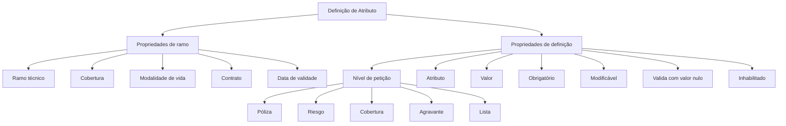

# Definição de Atributo — Conteúdo em Construção

## 1. Metadados do Documento
- **Arquivo de Origem:** Não identificado no conteúdo extraído.
- **Tipo de Documento:** Especificação funcional em construção.
- **Domínio / Sistema:** Definição de atributo; referências a Soluciones, APIs, Documentación e Zeus.
- **Público-Alvo:** Desenvolvedores, analistas funcionais e equipes de negócio.
- **Data/Versão Identificada:** Não identificada.

---

## 2. Resumo Executivo & Contexto de Negócio

O documento apresenta uma definição inicial de **Atributo**, explicitamente marcada como “EN CONSTRUCCIÓN”. O conteúdo organiza propriedades relacionadas a ramo e definição, associando os conceitos de ramo técnico, cobertura, modalidade de vida, contrato e data de validade.

A definição de atributo possui um nível de petição configurável. Os níveis listados são: Póliza, Riesgo, Cobertura, Agravante e Lista. O documento também relaciona os campos Atributo, Valor, Obrigatório, Modificável, validação com valor nulo e estado Inhabilitado.

O campo **Modificável** determina se é permitido alterar o valor de um campo. A validação com valor nulo indica que a validação precisa ser executada mesmo quando não há valor informado. O estado **Inhabilitado** representa um registro inabilitado.

O material não descreve contratos de API, métodos HTTP, persistência, regras de cálculo, telas, responsáveis, ambientes técnicos ou fluxos detalhados de operação. A referência a “Soluciones APIs Documentación Zeus” aparece no conteúdo bruto, mas não é explicada.

---

## 3. Arquitetura, Componentes & Tecnologias Envolvidas

Os elementos identificados no documento são:

- **Atributo:** entidade ou conceito central descrito.
- **Propriedades de ramo:** incluem ramo técnico, cobertura, modalidade de vida, contrato e data de validade.
- **Propriedades de definição:** incluem nível de petição, atributo, valor, obrigatório, modificável, validação com valor nulo e inabilitado.
- **Níveis de petição:** Póliza, Riesgo, Cobertura, Agravante e Lista.
- **Soluciones / APIs / Documentación / Zeus:** termos presentes no rodapé ou navegação textual; o documento não especifica suas responsabilidades técnicas.



> **Nota de Análise:** O diagrama representa apenas a estrutura conceitual extraída do documento. O conteúdo não apresenta arquitetura de software, comunicação entre serviços, bancos de dados, protocolos, URLs, ambientes ou contratos de integração.

---

## 4. Regras de Negócio, Especificações Funcionais & Processos

### 4.1 Propriedades de ramo

A definição de atributo está associada às seguintes propriedades de ramo:

1. **Ramo:** acompanhado do termo “ramo técnico”.
2. **Cobertura:** acompanhada do termo “cobertura”.
3. **Modalidade de vida:** acompanhada do termo “modalidad”.
4. **Contrato:** acompanhado do termo “contrato”.
5. **Fecha de validez:** apresentada junto ao texto “fecha de entrada en vigor”.

O documento não especifica formatos, obrigatoriedade, domínios de valores, relações entre ramo e cobertura, nem critérios para vigência de contrato.

### 4.2 Propriedades de definição

A definição de atributo contempla os seguintes elementos:

1. **Nível:** identificado como “nivel de peticion”.
2. **Atributo:** identificado como “atributo”.
3. **Valor:** identificado como “valor”.
4. **Obrigatório:** identificado como “obligatorio”.
5. **Modificável:** indica que é permitido modificar o valor do campo.
6. **Valida com valor nulo:** a validação deve ser executada mesmo que não exista valor.
7. **Inhabilitado:** indica registro inabilitado.

### 4.3 Níveis de petição

O documento lista cinco níveis de petição:

1. **Póliza**
2. **Riesgo**
3. **Cobertura**
4. **Agravante**
5. **Lista**

A lista de níveis aparece duas vezes no conteúdo bruto. Não há detalhamento sobre prioridade, hierarquia operacional, herança de atributos ou regras de conflito entre esses níveis.

### 4.4 Regras explícitas

- Um atributo pode possuir a propriedade **Modificável**, cuja descrição indica que é permitido modificar o valor do campo.
- Um atributo pode possuir a propriedade **Valida com valor nulo**, cuja descrição determina que a validação é necessária mesmo sem valor.
- Um registro pode possuir o estado **Inhabilitado**, descrito como “registro inhabilitado”.
- A definição possui um **nível de petição** entre Póliza, Riesgo, Cobertura, Agravante e Lista.

> **Nota de Análise:** O documento não define quais validações devem ser executadas para valores nulos, quais campos são obrigatórios, como a modificabilidade é aplicada, nem o comportamento de um registro inabilitado em consultas, alterações ou integrações.

---

## 5. Tabelas de Parâmetros, Ambientes e Estruturas de Dados

| Item / Parâmetro | Descrição / Função | Tipo / Valores / Formato | Ambiente / Observações |
| :--- | :--- | :--- | :--- |
| Definição de Atributo | Conceito central do documento. | Não especificado. | Documento marcado como “EN CONSTRUCCIÓN”. |
| Propriedades de ramo | Grupo de propriedades associado ao ramo. | Ramo técnico, cobertura, modalidade de vida, contrato e data de validade. | Não há formatos ou regras detalhadas. |
| Ramo | Propriedade de ramo. | “ramo técnico”. | Sem detalhamento adicional. |
| Cobertura | Propriedade de ramo. | “cobertura”. | Sem detalhamento adicional. |
| Modalidade de vida | Propriedade de ramo. | “modalidad”. | Sem detalhamento adicional. |
| Contrato | Propriedade de ramo. | “contrato”. | Sem detalhamento adicional. |
| Fecha de validez | Propriedade de ramo associada à entrada em vigor. | “fecha de entrada en vigor”. | Formato de data não informado. |
| Nível | Define o nível de petição. | Póliza, Riesgo, Cobertura, Agravante ou Lista. | Lista repetida no conteúdo original. |
| Atributo | Campo de definição. | “atributo”. | Tipo e catálogo não especificados. |
| Valor | Campo de definição. | “valor”. | Tipo, formato e domínio não especificados. |
| Obrigatório | Campo de definição. | “obligatorio”. | Critério de obrigatoriedade não especificado. |
| Modificável | Indica se o valor de um campo pode ser alterado. | “se permite modificar el valor del campo”. | Não há valores booleanos ou regras de autorização descritas. |
| Valida com valor nulo | Indica execução de validação mesmo sem valor informado. | “es necesario ejecutar la validacion aunque no tenga valor”. | Validações concretas não especificadas. |
| Inhabilitado | Estado de um registro. | “registro inhabilitado”. | Efeitos operacionais não especificados. |
| Soluciones | Termo apresentado no rodapé ou navegação. | Não especificado. | Sem relação técnica detalhada. |
| APIs | Termo apresentado no rodapé ou navegação. | Não especificado. | Não há endpoints, métodos ou contratos. |
| Documentación | Termo apresentado no rodapé ou navegação. | Não especificado. | Não há conteúdo adicional. |
| Zeus | Termo apresentado no rodapé ou navegação. | Não especificado. | Não há função definida no documento. |

---

## 6. Bateria de Perguntas & Respostas para RAG (FAQ Sintético)

### P1: Qual é o tema principal do documento?
**R:** O documento trata da **Definição de Atributo**. O conteúdo organiza propriedades de ramo e propriedades de definição, incluindo nível de petição, atributo, valor, obrigatoriedade, modificabilidade, validação com valor nulo e estado inabilitado.

### P2: Quais propriedades de ramo são citadas na definição de atributo?
**R:** As propriedades de ramo citadas são: ramo técnico, cobertura, modalidade de vida, contrato e data de validade. O documento também associa a data de validade ao texto “fecha de entrada en vigor”.

### P3: Quais níveis de petição estão disponíveis para um atributo?
**R:** Os níveis de petição listados são: **Póliza**, **Riesgo**, **Cobertura**, **Agravante** e **Lista**. O documento não define hierarquia, prioridade ou regras de aplicação entre esses níveis.

### P4: O que significa a propriedade Modificável?
**R:** A propriedade **Modificável** é descrita como “se permite modificar el valor del campo”. Portanto, ela indica se o valor de um campo pode ser modificado. O documento não informa os valores possíveis dessa propriedade nem critérios de permissão.

### P5: Uma validação deve ser executada quando o atributo não possui valor?
**R:** Sim. A propriedade **Valida con valor nulo** estabelece que “es necesario ejecutar la validacion aunque no tenga valor”. Isso significa que a validação é necessária mesmo quando não há valor informado.

### P6: O que representa o estado Inhabilitado?
**R:** O estado **Inhabilitado** é descrito como “registro inhabilitado”. O documento não explica se um registro inabilitado pode ser consultado, editado, excluído ou utilizado por processos posteriores.

### P7: O documento define quais campos são obrigatórios?
**R:** O documento cita a propriedade **Obrigatório** (“obligatorio”), mas não identifica quais campos são obrigatórios, nem apresenta critérios, mensagens de erro ou comportamento de validação associados à obrigatoriedade.

### P8: O documento informa o formato da data de validade?
**R:** Não. O documento menciona “Fecha de validez” e “fecha de entrada en vigor”, mas não fornece formato de data, timezone, regra de início e fim de vigência ou comportamento para datas inválidas.

### P9: Existem APIs ou contratos de integração especificados?
**R:** Não. Embora o texto apresente os termos “APIs”, “Documentación” e “Zeus”, não há endpoints, métodos HTTP, payloads JSON, autenticação, códigos de resposta ou contratos de integração descritos.

### P10: O documento está finalizado?
**R:** Não. A primeira página contém a expressão **“EN CONSTRUCCIÓN”**, indicando que o conteúdo está em construção.

### P11: Qual é a relação entre Cobertura e nível de petição?
**R:** O documento apresenta **Cobertura** em dois contextos: como propriedade de ramo e como um dos níveis de petição. O conteúdo não detalha como esses dois usos se relacionam funcionalmente.

### P12: Quais tecnologias ou ambientes técnicos são definidos?
**R:** Nenhuma tecnologia, ambiente, servidor, URL, versão, porta, ferramenta de CI/CD, banco de dados ou mecanismo de logging é definido no conteúdo extraído.

---

## 7. Glossário de Termos, Siglas & Conceitos-Chave

- **Atributo:** elemento central da definição apresentada no documento.
- **Agravante:** um dos níveis de petição listados para a definição de atributo.
- **APIs:** termo citado no rodapé ou navegação textual; sem detalhamento técnico.
- **Cobertura:** propriedade de ramo e também nível de petição listado.
- **Contrato:** propriedade de ramo citada no documento.
- **Documentación:** termo citado no rodapé ou navegação textual; sem detalhamento adicional.
- **Fecha de validez:** propriedade associada à data de entrada em vigor.
- **Inhabilitado:** estado descrito como “registro inhabilitado”.
- **Lista:** um dos níveis de petição listados.
- **Modalidade de vida:** propriedade de ramo citada no documento.
- **Modificável:** propriedade que indica se é permitido modificar o valor de um campo.
- **Nível de petição:** classificação da definição entre Póliza, Riesgo, Cobertura, Agravante e Lista.
- **Póliza:** um dos níveis de petição listados.
- **Ramo técnico:** propriedade de ramo citada no documento.
- **Riesgo:** um dos níveis de petição listados.
- **Soluciones:** termo citado no rodapé ou navegação textual; sem detalhamento adicional.
- **Valida com valor nulo:** propriedade que exige executar validação mesmo sem valor.
- **Zeus:** termo citado no rodapé ou navegação textual; sem detalhamento adicional.

---

## 8. Notas Críticas, Riscos & Limitações

- O documento está identificado como **“EN CONSTRUCCIÓN”**, indicando conteúdo incompleto.
- Não há nome de arquivo, autoria, data, versão ou histórico de alterações identificáveis.
- Não há descrição de arquitetura técnica, componentes de software, integrações, bancos de dados, protocolos ou ambientes.
- Não há especificação de tipos de dados, catálogos, valores permitidos, formatos de datas ou restrições de campos.
- Não há definição de comportamento para atributos obrigatórios, modificáveis, nulos ou inabilitados além das frases apresentadas.
- Os termos “Soluciones”, “APIs”, “Documentación” e “Zeus” não possuem explicação contextual no material.
- A relação funcional entre os níveis Póliza, Riesgo, Cobertura, Agravante e Lista não é detalhada.
- O conteúdo não apresenta métodos HTTP, contratos JSON, autenticação, regras de autorização, logs, URLs ou procedimentos operacionais.

---

## 9. Conteúdo Bruto Estruturado (Referência Fiel)

```text
--- [PÁGINA 1 DE 3] ---

EN CONSTRUCCIÓN
DEFINICIÓN de Atributo
Objetivo
Propiedades de ramo
Propiedades de definición
Propiedades de ramo
Ramo
ramo técnico
Cobertura
cobertura
Modalidad de vida
modalidad
Contrato
contrato
Fecha de validez
 /
 RS
Inicio Soluciones APIs Documentación Zeus
ES


--- [PÁGINA 2 DE 3] ---

fecha de entrada en vigor
Propiedades de definición
Nivel
nivel de peticion
(1)Poliza
(2)Riesgo
(3)Cobertura
(4)Agravante
(5)Lista
(1)Poliza
(2)Riesgo
(3)Cobertura
(4)Agravante
(5)Lista
Atributo
atributo
Valor
valor
Obligatorio
obligatorio
Modificable
se permite modificar el valor del campo


--- [PÁGINA 3 DE 3] ---

Valida con valor nulo
es necesario ejecutar la validacion aunque no tenga valor
Inhabilitado
registro inhabilitado
```
