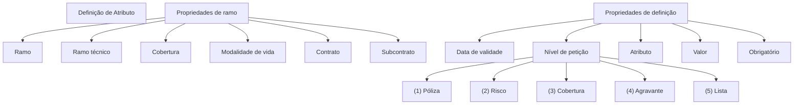

# Definição de Atributo — Propriedades de Ramo e Definição

## 1. Metadados do Documento
- **Arquivo de Origem:** Não identificado
- **Tipo de Documento:** Apresentação Executiva
- **Domínio / Sistema:** Definição de atributo; navegação menciona Zeus
- **Público-Alvo:** Negócio, analistas funcionais e desenvolvedores
- **Data/Versão Identificada:** Não identificada

---

## 2. Resumo Executivo & Contexto de Negócio

O documento apresenta uma definição resumida de **atributo**, relacionando propriedades de ramo e propriedades de definição. O conteúdo associa o atributo a elementos como ramo, ramo técnico, cobertura, modalidade de vida, contrato, subcontrato e data de validade.

A definição possui um campo de **nível de petição**, cujos valores enumerados são: Póliza, Risco, Cobertura, Agravante e Lista. O documento também identifica os campos atributo, valor e obrigatório.

A apresentação descreve três comportamentos operacionais: modificável, validação com valor nulo e inabilitado. Cada comportamento possui uma explicação curta sobre alteração de valor, execução de validação sem valor e estado de registro inabilitado.

**Nota de Análise:** O material não detalha métodos HTTP, contratos de API, persistência, regras de cálculo, tecnologias, ambientes, URLs operacionais ou relações técnicas entre os itens apresentados.

---

## 3. Arquitetura, Componentes & Tecnologias Envolvidas

Os elementos identificados são:

- Propriedades de ramo.
- Propriedades de definição.
- Ramo.
- Ramo técnico.
- Cobertura.
- Modalidade de vida.
- Contrato.
- Subcontrato.
- Data de validade.
- Nível de petição.
- Atributo, valor e obrigatório.
- Zeus, citado na navegação da apresentação.



---

## 4. Regras de Negócio, Especificações Funcionais & Processos

1. A definição de atributo contempla propriedades de ramo e propriedades de definição.
2. As propriedades de ramo listadas são ramo, ramo técnico, cobertura, modalidade de vida, contrato e subcontrato.
3. A definição inclui data de validade, também identificada como “fecha de entrada en vigor”.
4. O nível de petição possui cinco opções: Póliza, Risco, Cobertura, Agravante e Lista.
5. Um atributo possui referência a atributo, valor e obrigatório.
6. O indicador **Modificable** significa que é permitido modificar o valor do campo.
7. O indicador **Valida con valor nulo** significa que a validação precisa ser executada mesmo quando não existe valor.
8. O indicador **Inhabilitado** significa que o registro está inabilitado.

**Nota de Análise:** O documento não informa condições de precedência entre os níveis, critérios para tornar um atributo obrigatório, regras para datas de validade ou consequências funcionais de um registro inabilitado.

---

## 5. Tabelas de Parâmetros, Ambientes e Estruturas de Dados

| Item / Parâmetro | Descrição / Função | Tipo / Valores / Formato | Ambiente / Observações |
| :--- | :--- | :--- | :--- |
| Ramo | Propriedade de ramo | Não detalhado | Não informado |
| Ramo técnico | Propriedade de ramo | Não detalhado | Não informado |
| Cobertura | Propriedade de ramo; também opção de nível | Não detalhado | Não informado |
| Modalidade de vida | Propriedade de ramo | Não detalhado | Não informado |
| Contrato | Propriedade de ramo | Não detalhado | Não informado |
| Subcontrato | Propriedade de ramo | Não detalhado | Não informado |
| Data de validade | Propriedade de definição | “Fecha de entrada en vigor” | Formato não informado |
| Nível de petição | Nível associado à definição | Póliza; Risco; Cobertura; Agravante; Lista | Valores enumerados de 1 a 5 |
| Atributo | Campo da definição | Não detalhado | Não informado |
| Valor | Campo da definição | Não detalhado | Não informado |
| Obrigatório | Campo ou indicador da definição | Não detalhado | Não informado |
| Modificável | Permite alterar o valor do campo | Indicador comportamental | “Se permite modificar el valor del campo” |
| Valida com valor nulo | Exige validação mesmo sem valor | Indicador comportamental | “Es necesario ejecutar la validacion aunque no tenga valor” |
| Inabilitado | Indica registro inabilitado | Estado de registro | “Registro inhabilitado” |
| Zeus | Sistema ou área citada na navegação | Não detalhado | Sem informação técnica adicional |

---

## 6. Bateria de Perguntas & Respostas para RAG (FAQ Sintético)

### P1: Qual é o objetivo principal do documento?
**R:** O documento apresenta uma definição resumida de atributo, incluindo propriedades de ramo, propriedades de definição, níveis de petição e comportamentos relacionados à alteração, validação e inabilitação de registros.

### P2: Quais propriedades de ramo são listadas na definição de atributo?
**R:** As propriedades de ramo listadas são ramo, ramo técnico, cobertura, modalidade de vida, contrato e subcontrato.

### P3: Quais são os níveis de petição disponíveis para a definição de atributo?
**R:** Os níveis de petição apresentados são: (1) Póliza, (2) Risco, (3) Cobertura, (4) Agravante e (5) Lista.

### P4: O que significa o indicador “Modificable”?
**R:** O indicador “Modificable” significa que é permitido modificar o valor do campo.

### P5: Quando a validação deve ser executada para um atributo com “Valida con valor nulo”?
**R:** Quando o atributo estiver configurado com “Valida con valor nulo”, a validação deve ser executada mesmo que o atributo não tenha valor.

### P6: O que representa o estado “Inhabilitado”?
**R:** O estado “Inhabilitado” indica que o registro está inabilitado.

### P7: Qual informação temporal aparece nas propriedades de definição?
**R:** A informação temporal apresentada é a data de validade, também descrita como “fecha de entrada en vigor”.

### P8: O documento detalha o formato da data de validade?
**R:** Não. O documento cita a data de validade e “fecha de entrada en vigor”, mas não define formato, timezone, regra de cálculo ou critério de validação.

### P9: O documento define APIs, métodos HTTP ou contratos JSON para atributos?
**R:** Não. O documento menciona navegação com “Soluciones”, “APIs”, “Documentación” e “Zeus”, mas não detalha endpoints, métodos HTTP, payloads ou contratos JSON.

### P10: O que é informado sobre o campo obrigatório?
**R:** O documento lista “Obrigatório” como elemento associado à definição de atributo, mas não especifica seu comportamento, valores permitidos ou regras de aplicação.

---

## 7. Glossário de Termos, Siglas & Conceitos-Chave

- **Atributo:** Elemento cuja definição é apresentada junto com propriedades, nível, valor e obrigatoriedade.
- **Ramo:** Propriedade de ramo listada no documento.
- **Ramo técnico:** Propriedade de ramo listada no documento.
- **Cobertura:** Propriedade de ramo e opção de nível de petição.
- **Modalidade de vida:** Propriedade de ramo listada no documento.
- **Contrato:** Propriedade de ramo listada no documento.
- **Subcontrato:** Propriedade de ramo listada no documento.
- **Nível de petição:** Campo com cinco valores: Póliza, Risco, Cobertura, Agravante e Lista.
- **Póliza:** Opção de nível de petição identificada pelo valor 1.
- **Risco:** Opção de nível de petição identificada pelo valor 2.
- **Agravante:** Opção de nível de petição identificada pelo valor 4.
- **Lista:** Opção de nível de petição identificada pelo valor 5.
- **Modificável:** Permite modificar o valor do campo.
- **Valida com valor nulo:** Determina que a validação deve ser executada mesmo sem valor.
- **Inabilitado:** Indica registro inabilitado.
- **Zeus:** Termo citado na navegação, sem detalhamento adicional.

---

## 8. Notas Críticas, Riscos & Limitações

- O documento está identificado com a expressão **“EN CONSTRUCCIÓN”**, indicando conteúdo potencialmente incompleto.
- Não há arquivo, data, versão, autoria ou contexto organizacional identificáveis.
- Não há detalhamento técnico sobre Zeus, APIs, arquitetura, integrações, persistência ou ambientes.
- Não são definidos formatos, domínios de valores, validações detalhadas, permissões ou regras de obrigatoriedade.
- A relação exata entre propriedades de ramo, propriedades de definição e níveis de petição não é explicitada.
- A apresentação não fornece detalhamento adicional para os tópicos listados.

---

## 9. Conteúdo Bruto Estruturado (Referência Fiel)

```text
--- [PÁGINA 1 DE 3] ---

EN CONSTRUCCIÓN
DEFINICIÓN de Atributo
Objetivo
Propiedades de ramo
Propiedades de definición
Propiedades de ramo
Ramo
ramo técnico
Cobertura
cobertura
Modalidad de vida
modalidad
Contrato
contrato
Subcontrato
 /
 RS
Inicio Soluciones APIs Documentación Zeus
ES


--- [PÁGINA 2 DE 3] ---

subcontrato
Fecha de validez
fecha de entrada en vigor
Propiedades de definición
Nivel
nivel de peticion
(1)Poliza
(2)Riesgo
(3)Cobertura
(4)Agravante
(5)Lista
(1)Poliza
(2)Riesgo
(3)Cobertura
(4)Agravante
(5)Lista
Atributo
atributo
Valor
valor
Obligatorio
obligatorio


--- [PÁGINA 3 DE 3] ---

Modificable
se permite modificar el valor del campo
Valida con valor nulo
es necesario ejecutar la validacion aunque no tenga valor
Inhabilitado
registro inhabilitado
```
