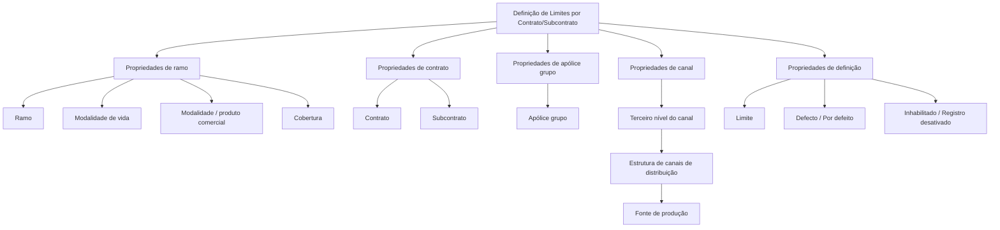

# Definição de Limites por Contrato/Subcontrato — Documento em Construção

## 1. Metadados do Documento
- **Arquivo de Origem:** `Não identificado`
- **Tipo de Documento:** Especificação Técnica / Documento em Construção
- **Domínio / Sistema:** Definição de limites por contrato/subcontrato
- **Público-Alvo:** Negócio, Analistas Funcionais, Desenvolvedores e Arquitetos
- **Data/Versão Identificada:** `Não identificada`

---

## 2. Resumo Executivo & Contexto de Negócio

O documento apresenta uma definição em construção para limites associados a contratos e subcontratos. O conteúdo estrutura os atributos de classificação e configuração utilizados nessa definição, agrupando-os em propriedades de ramo, contrato, apólice grupo, canal e definição.

Os atributos de ramo incluem ramo, modalidade de vida, modalidade/produto comercial e cobertura. Esses elementos permitem caracterizar o contexto de negócio em que um limite pode ser aplicável.

Os atributos contratuais incluem contrato e subcontrato. O documento também identifica a apólice grupo e o terceiro nível do canal como elementos de classificação relacionados, sendo o terceiro nível descrito como parte da estrutura de canais de distribuição e fonte de produção.

A configuração de definição de limite contempla três elementos: limite, valor padrão e inabilitação. O documento associa “Defecto” ao comportamento “por defeito” e “Inhabilitado” ao estado de registro desativado.

> **Nota de Análise:** O documento não detalha regras de priorização, algoritmos de cálculo, critérios de elegibilidade, integrações, métodos HTTP, contratos JSON, persistência de dados ou responsabilidades de componentes técnicos.

---

## 3. Arquitetura, Componentes & Tecnologias Envolvidas

O conteúdo não apresenta arquitetura de software, componentes técnicos, microsserviços, bases de dados, tecnologias, ambientes ou integrações. O material descreve apenas uma organização funcional de propriedades para definição de limites.



---

## 4. Regras de Negócio, Especificações Funcionais & Processos

1. A definição de limites é organizada por contrato e subcontrato.
2. A definição considera propriedades de ramo:
   - Ramo;
   - Modalidade de vida;
   - Modalidade ou produto comercial;
   - Cobertura.
3. A definição considera propriedades de contrato:
   - Contrato;
   - Subcontrato.
4. A definição considera uma propriedade de apólice grupo:
   - Apólice grupo.
5. A definição considera uma propriedade de canal:
   - Terceiro nível do canal.
6. O terceiro nível do canal é descrito como o terceiro nível da estrutura de canais de distribuição e como fonte de produção.
7. A definição contempla o atributo limite.
8. A definição contempla um atributo identificado como “Defecto”, descrito como “por defeito”.
9. A definição contempla um atributo identificado como “Inhabilitado”, descrito como “registro desativado”.

> **Nota de Análise:** Não há detalhamento sobre como os atributos de ramo, contrato, apólice grupo e canal são combinados para selecionar, validar, sobrescrever ou aplicar um limite.

---

## 5. Tabelas de Parâmetros, Ambientes e Estruturas de Dados

| Item / Parâmetro | Descrição / Função | Tipo / Valores / Formato | Ambiente / Observações |
| :--- | :--- | :--- | :--- |
| Ramo | Propriedade de ramo para a definição de limites. | Não especificado. | O documento apresenta também o termo `ramo`. |
| Modalidade de vida | Propriedade de ramo. | Não especificado. | Relacionada ao ramo. |
| Modalidade / produto comercial | Propriedade de ramo. | Não especificado. | O texto apresenta “modalidad - producto comercial”. |
| Cobertura | Propriedade de ramo. | Não especificado. | O documento apresenta também o termo `cobertura`. |
| RS | Termo exibido junto a cobertura. | Não especificado. | Não há explicação para a sigla ou relação com cobertura. |
| Contrato | Propriedade de contrato. | Não especificado. | O documento apresenta também o termo `contrato`. |
| Subcontrato | Propriedade de contrato. | Não especificado. | O documento apresenta também o termo `subcontrato`. |
| Apólice grupo | Propriedade de apólice grupo. | Não especificado. | O documento apresenta também o termo `póliza grupo`. |
| Terceiro nível do canal | Propriedade de canal. | Não especificado. | Descrito como terceiro nível da estrutura de canais de distribuição e fonte de produção. |
| Limite | Propriedade de definição. | Não especificado. | O documento apresenta também o termo `límite`. |
| Defecto | Propriedade de definição associada a “por defeito”. | Não especificado. | Não são descritas regras de aplicação do valor padrão. |
| Inhabilitado | Propriedade de definição associada a registro desativado. | Não especificado. | Não são descritas regras de ativação, reativação ou efeitos operacionais. |
| Início | Item de navegação exibido no documento. | Texto. | Sem detalhamento adicional. |
| Soluções | Item de navegação exibido no documento. | Texto. | Sem detalhamento adicional. |
| APIs | Item de navegação exibido no documento. | Texto. | Sem detalhamento adicional. |
| Documentação | Item de navegação exibido no documento. | Texto. | Sem detalhamento adicional. |
| Zeus | Item de navegação exibido no documento. | Texto. | Sem detalhamento adicional. |
| ES | Indicador exibido no documento. | Texto. | Possível indicador de idioma, mas não confirmado pelo conteúdo. |

---

## 6. Bateria de Perguntas & Respostas para RAG (FAQ Sintético)

### P1: Qual é o objetivo do documento sobre definição de limites?
**R:** O documento apresenta uma definição em construção para limites por contrato e subcontrato, organizada por propriedades de ramo, contrato, apólice grupo, canal e definição.

### P2: Quais propriedades de ramo são citadas para a definição de limites?
**R:** As propriedades de ramo citadas são ramo, modalidade de vida, modalidade/produto comercial e cobertura.

### P3: Quais propriedades contratuais são apresentadas?
**R:** As propriedades contratuais apresentadas são contrato e subcontrato.

### P4: O que representa o terceiro nível do canal?
**R:** O terceiro nível do canal é descrito como o terceiro nível da estrutura de canais de distribuição e como fonte de produção.

### P5: Qual propriedade está associada à apólice grupo?
**R:** A propriedade identificada no documento é “Póliza grupo”, apresentada como “Propriedades de póliza grupo”.

### P6: Quais elementos pertencem às propriedades de definição?
**R:** As propriedades de definição apresentadas são limite, defecto — descrito como “por defeito” — e inhabilitado — descrito como “registro desativado”.

### P7: O que significa “Inhabilitado” no contexto do documento?
**R:** “Inhabilitado” é associado explicitamente a “registro desativado”. O documento não especifica os critérios para desativação, reativação ou os efeitos de um registro inabilitado.

### P8: O documento define como o valor “por defeito” deve ser aplicado?
**R:** Não. O documento lista “Defecto” e o descreve como “por defeito”, mas não apresenta critérios, precedência, condições de uso ou comportamento operacional desse valor.

### P9: O documento informa o formato, unidade ou faixa permitida para o limite?
**R:** Não. O atributo “Límite” é listado, porém o documento não informa formato, unidade, faixa de valores, obrigatoriedade ou regra de cálculo.

### P10: Existem APIs ou contratos de integração detalhados para a definição de limites?
**R:** Não. Embora “APIs” apareça como item de navegação, o material não detalha endpoints, métodos HTTP, contratos JSON, autenticação ou integrações.

### P11: O que significa a sigla “RS” ao lado de cobertura?
**R:** O documento exibe “RS” junto ao item cobertura, mas não define a sigla nem explica sua finalidade.

### P12: Há regras de precedência entre ramo, contrato, subcontrato, apólice grupo e canal?
**R:** Não. O conteúdo apenas relaciona esses elementos como propriedades da definição de limites; não há regra explícita de prioridade, combinação ou conflito entre eles.

---

## 7. Glossário de Termos, Siglas & Conceitos-Chave

- **Ramo:** Propriedade de ramo listada na definição de limites.
- **Modalidade de vida:** Propriedade de ramo citada no documento.
- **Modalidade / produto comercial:** Propriedade de ramo associada ao contexto comercial.
- **Cobertura:** Propriedade de ramo citada para a definição.
- **RS:** Sigla exibida junto a cobertura; significado não definido no documento.
- **Contrato:** Propriedade contratual utilizada na definição de limites.
- **Subcontrato:** Propriedade contratual utilizada na definição de limites.
- **Apólice grupo:** Propriedade relativa à apólice grupo.
- **Terceiro nível do canal:** Terceiro nível da estrutura de canais de distribuição, identificado como fonte de produção.
- **Limite:** Propriedade de definição de limites.
- **Defecto:** Termo apresentado como “por defeito”.
- **Inhabilitado:** Termo apresentado como “registro desativado”.
- **APIs:** Termo presente na navegação; não há especificação técnica associada.
- **Zeus:** Termo presente na navegação; não há descrição funcional ou técnica associada.

---

## 8. Notas Críticas, Riscos & Limitações

- O documento está marcado como **“EN CONSTRUCCIÓN”**, indicando conteúdo potencialmente incompleto.
- Não há versão, data, autoria, sistema proprietário ou nome de arquivo identificados.
- Não há detalhamento de arquitetura técnica, componentes, integrações, APIs, segurança, persistência, logs ou ambientes.
- Não há definição de tipos, formatos, obrigatoriedade ou valores permitidos para os atributos listados.
- Não há regras de cálculo, priorização, conflito, validação ou aplicação do atributo limite.
- O significado da sigla **RS** não é definido.
- O termo **Zeus** aparece somente na navegação e não possui detalhamento adicional.
- Não há explicação sobre como registros “Inhabilitado” afetam a busca, seleção ou aplicação de limites.

---

## 9. Conteúdo Bruto Estruturado (Referência Fiel)

```text
--- [PÁGINA 1 DE 2] ---

EN CONSTRUCCIÓN
DEFINICIÓN de Límites por
contrato/subcontrato
Objetivo
Propiedades de ramo
Propiedades de contrato
Propiedades de póliza grupo
Propiedades de canal
Propiedades de definición
Propiedades de ramo
Ramo
ramo
Modalidad de vida
modalidad - producto comercial
Cobertura
cobertura
 /
 RS
Inicio Soluciones APIs Documentación Zeus
ES


--- [PÁGINA 2 DE 2] ---

Tipo de vehículo
tipo de vehículo
Fecha de validez
fecha entrada en vigor
Propiedades de contrato
Contrato
contrato
Subcontrato
subcontrato
Propiedades de póliza grupo
Póliza grupo
póliza grupo
Propiedades de canal
Tercer nivel del canal
tercer nivel de la estructura de canales de distribución - fuente de producción
Propiedades de definición
Límite
límite
Defecto
por defecto
Inhabilitado
registro desactivado
```
