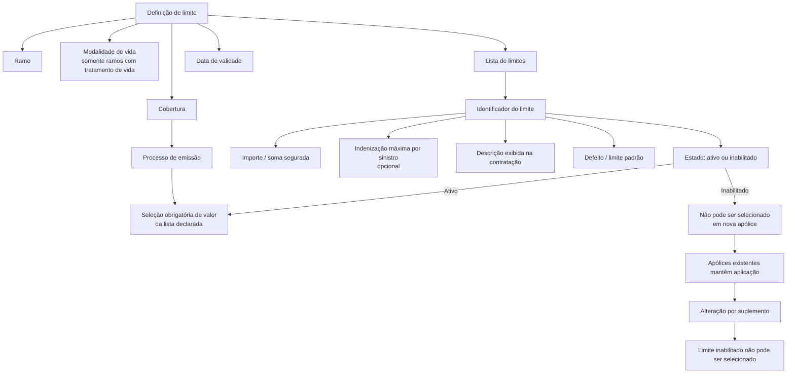

# Definição de Limite para Coberturas de Seguro

## 1. Metadados do Documento
- **Arquivo de Origem:** Não identificado
- **Tipo de Documento:** Especificação Funcional
- **Domínio / Sistema:** Definição de limite para cobertura, ramo e apólice de seguro
- **Público-Alvo:** Não identificado; conteúdo direcionado a usuários envolvidos na configuração e contratação de coberturas
- **Data/Versão Identificada:** Não identificada

---

## 2. Resumo Executivo & Contexto de Negócio

O documento descreve a funcionalidade de **definição de limite** aplicada a coberturas de seguro. A funcionalidade permite limitar as somas seguradas de uma cobertura mediante uma lista previamente declarada de valores permitidos.

Durante o processo de emissão, a soma segurada não é livremente informada: o usuário deve selecionar um valor entre as opções configuradas na lista de limites. Cada definição de limite pode estar associada a um ramo, a uma modalidade de vida — quando aplicável — e a uma cobertura específica.

A definição possui uma data de validade, utilizada para determinar quando estará disponível para uso. O uso adequado da data de validade permite manter o histórico das alterações realizadas na definição.

Além da soma segurada, um limite pode definir uma indenização máxima por sinistro. Também é possível indicar um limite padrão e inabilitar limites que não devem mais ser incluídos em novas apólices, preservando a aplicação dos limites já existentes em apólices vigentes até que sejam alterados por suplemento.

---

## 3. Arquitetura, Componentes & Tecnologias Envolvidas

Os elementos funcionais identificados no documento são:

| Componente / Conceito | Papel identificado |
| :--- | :--- |
| Definição de limite | Configuração que restringe as somas seguradas disponíveis para uma cobertura. |
| Ramo | Elemento ao qual a definição de limite aponta ou que é afetado pela definição. |
| Modalidade de vida | Modalidade à qual o atributo pertence, aplicável somente a ramos com tratamento de vida. |
| Cobertura | Cobertura à qual pertence a definição de limite. |
| Processo de emissão | Processo no qual é apresentada a lista de somas seguradas permitidas para seleção. |
| Soma segurada | Valor associado ao identificador de limite e escolhido na contratação da cobertura. |
| Indenização máxima por sinistro | Valor opcional que limita a indenização máxima para cada sinistro. |
| Apólice | Registro contratual que pode manter a aplicação de um limite mesmo após sua inabilitação. |
| Suplemento | Mecanismo mencionado para alterar o limite aplicado a uma apólice. |
| `Home Solutions APIs Documentation Zeus` | Texto identificado no conteúdo bruto; o documento não detalha seu papel funcional ou técnico. |
| `CF` | Texto identificado no conteúdo bruto; o documento não detalha seu significado. |



> **Nota de Análise:** O documento descreve relações funcionais entre definição de limite, ramo, modalidade de vida, cobertura, emissão, apólice e suplemento. Não apresenta tecnologias de implementação, APIs, métodos HTTP, contratos JSON, bancos de dados, URLs, servidores ou ambientes técnicos.

---

## 4. Regras de Negócio, Especificações Funcionais & Processos

### 4.1 Restrição de somas seguradas

1. Uma cobertura pode ter suas somas seguradas limitadas por valores previamente estabelecidos.
2. A configuração deve declarar uma lista de somas seguradas.
3. As somas seguradas declaradas constituem as opções oferecidas no processo de emissão.
4. No processo de emissão, deve ser escolhido um valor da lista declarada.
5. O documento não descreve a quantidade máxima de valores permitidos, nem critérios de ordenação ou validações numéricas adicionais para a lista.

### 4.2 Associação da definição de limite

1. A definição de limite aponta para o ramo afetado.
2. A definição pode determinar uma modalidade de vida.
3. A modalidade de vida é aplicável apenas a ramos com tratamento de vida.
4. A definição está associada a uma cobertura.

### 4.3 Vigência e histórico

1. A data de validade determina quando a definição estará disponível para utilização.
2. O uso correto da data de validade permite registrar historicamente as alterações realizadas na definição.
3. O documento não especifica formato de data, regra de início ou fim de vigência, nem tratamento de sobreposição entre períodos de validade.

### 4.4 Propriedades do limite

1. Cada limite possui um identificador.
2. Cada identificador possui uma soma segurada associada, denominada `importe` no conteúdo original.
3. Um limite pode definir a soma segurada.
4. Um limite também pode definir uma indenização máxima para cada sinistro.
5. Quando a funcionalidade de indenização máxima por sinistro for necessária, o respectivo valor deve ser incluído na definição.
6. Cada limite possui uma descrição exibida durante a contratação da cobertura.
7. Normalmente, a descrição coincide com o importe da soma segurada.
8. Quando houver indenização máxima por sinistro definida, essa indenização também é incluída na descrição.
9. Um limite pode ser declarado como padrão (`Defecto`).
10. O limite padrão é exibido como a soma segurada da cobertura.

### 4.5 Ativação, inabilitação e apólices existentes

1. A propriedade de inabilitação determina se o limite está ativo ou se não pode mais ser incluído em uma nova apólice.
2. A inabilitação não interrompe a aplicação do limite nas apólices que já o possuem.
3. Uma apólice existente continua aplicando o limite inabilitado até que esse limite seja alterado por suplemento.
4. Quando houver alteração por suplemento, um limite inabilitado não poderá ser selecionado novamente.
5. O documento não detalha perfis autorizados a inabilitar limites, etapas de aprovação, nem mecanismos de auditoria além do registro histórico permitido pela data de validade.

---

## 5. Tabelas de Parâmetros, Ambientes e Estruturas de Dados

| Item / Parâmetro | Descrição / Função | Tipo / Valores / Formato | Ambiente / Observações |
| :--- | :--- | :--- | :--- |
| Ramo | Indica o ramo ao qual a definição de limite afeta ou aponta. | Não especificado | Propriedade de ramo. |
| Modalidade de vida | Determina a modalidade à qual pertence o atributo. | Não especificado | Aplicável somente para ramos com tratamento de vida. |
| Cobertura | Identifica a cobertura à qual a definição de limite pertence. | Não especificado | Propriedade de ramo. |
| Data de validade | Determina quando a definição estará disponível para uso. | Data; formato não especificado | Permite manter registro histórico das alterações da definição. |
| Limite | Identificador do limite configurado. | Identificador; formato não especificado | Propriedade da definição. |
| `importe` | Soma segurada associada ao identificador de limite. | Valor monetário ou numérico não especificado | O documento usa o termo `importe`. |
| Importe máximo por sinistro | Define a indenização máxima para cada sinistro. | Valor não especificado | Opcional; utilizado quando a funcionalidade for necessária. |
| Descrição do limite | Texto exibido na contratação da cobertura. | Texto | Normalmente coincide com o importe da soma segurada; inclui a indenização máxima por sinistro quando definida. |
| Defecto | Define o limite utilizado como padrão. | Indicador ou seleção; formato não especificado | Faz o limite aparecer como soma segurada da cobertura. |
| Inhabilitado | Define se o limite está ativo ou não pode ser incluído em nova apólice. | Estado lógico; valores exatos não especificados | Não remove o limite de apólices já existentes. |
| Nova apólice | Apólice em que limites inabilitados não podem ser incluídos. | Processo/estado não especificado | Não há detalhamento operacional adicional. |
| Suplemento | Mecanismo para alterar o limite aplicado em uma apólice. | Processo não especificado | Após a alteração, não é possível selecionar limite inabilitado. |

> **Nota de Análise:** O conteúdo original não apresenta URLs, rotas de logs, servidores, credenciais, variáveis de ambiente, portas, versões de software ou endpoints técnicos.

---

## 6. Bateria de Perguntas & Respostas para RAG (FAQ Sintético)

### P1: Qual é o objetivo da definição de limite em uma cobertura?
**R:** A definição de limite permite restringir as somas seguradas de uma cobertura a valores previamente configurados. A configuração declara uma lista de somas seguradas que serão oferecidas no processo de emissão, e o usuário deve escolher um valor dessa lista.

### P2: O usuário pode informar livremente qualquer soma segurada durante a emissão?
**R:** Não. O documento estabelece que deve ser declarada previamente uma lista de somas seguradas e que, no processo de emissão, deve ser escolhido um valor dentre as opções dessa lista.

### P3: A quais elementos uma definição de limite pode estar associada?
**R:** A definição de limite aponta para o ramo afetado, pode determinar uma modalidade de vida e pertence a uma cobertura. A modalidade de vida é aplicável somente aos ramos que possuem tratamento de vida.

### P4: Para que serve a data de validade da definição de limite?
**R:** A data de validade determina quando a definição estará disponível para ser utilizada. O uso correto dessa data permite manter um registro histórico das mudanças efetuadas na definição.

### P5: O que representa o campo `importe` na definição de limite?
**R:** O campo `importe` determina a soma segurada associada ao identificador do limite. O documento não informa formato, moeda ou regras de validação para esse valor.

### P6: É possível definir uma indenização máxima por sinistro além da soma segurada?
**R:** Sim. Um limite pode definir a soma segurada e também uma indenização máxima para cada sinistro. Quando essa funcionalidade for necessária, o valor da indenização máxima por sinistro deve ser incluído na definição.

### P7: O que é exibido na descrição do limite durante a contratação da cobertura?
**R:** A descrição definida para o limite é a informação exibida na contratação da cobertura. Normalmente, essa descrição coincide com o importe da soma segurada e, quando houver indenização máxima por sinistro, essa indenização também deve ser incluída.

### P8: Qual é o efeito de definir um limite como padrão?
**R:** Um limite declarado como padrão (`Defecto`) é utilizado como valor padrão e aparece como a soma segurada da cobertura.

### P9: O que acontece ao inabilitar um limite?
**R:** Um limite inabilitado deixa de poder ser incluído em uma nova apólice. Entretanto, as apólices que já possuem esse limite continuam aplicando-o até que ele seja alterado por meio de um suplemento.

### P10: Uma apólice existente perde automaticamente um limite quando ele é inabilitado?
**R:** Não. A inabilitação não altera automaticamente as apólices existentes. O limite continua sendo aplicado até que um suplemento modifique a apólice.

### P11: Um limite inabilitado pode ser escolhido novamente durante uma alteração por suplemento?
**R:** Não. Se o limite estiver inabilitado, ele não poderá ser selecionado no momento em que uma alteração por suplemento for realizada.

### P12: O documento especifica APIs, contratos JSON ou métodos HTTP para a definição de limite?
**R:** Não. O documento apresenta regras funcionais de configuração de limites, mas não detalha APIs, métodos HTTP, contratos JSON, tecnologias de implementação ou integrações técnicas.

---

## 7. Glossário de Termos, Siglas & Conceitos-Chave

- **Cobertura:** Elemento ao qual pertence a definição de limite.
- **Data de validade:** Propriedade que determina quando a definição estará disponível para utilização.
- **Defecto:** Limite definido para uso padrão, exibido como soma segurada da cobertura.
- **Definição de limite:** Configuração que limita as somas seguradas disponíveis para uma cobertura.
- **Emissão:** Processo no qual o usuário seleciona uma soma segurada entre os valores declarados.
- **Importe:** Termo utilizado no documento para a soma segurada associada a um identificador de limite.
- **Importe máximo por sinistro:** Indenização máxima definida para cada sinistro.
- **Inhabilitado:** Estado em que o limite não pode ser incluído em uma nova apólice.
- **Limite:** Identificador configurado com soma segurada, descrição e, opcionalmente, indenização máxima por sinistro.
- **Modalidade de vida:** Modalidade aplicável a ramos com tratamento de vida.
- **Nova apólice:** Apólice na qual limites inabilitados não podem ser selecionados.
- **Póliza / Apólice:** Registro contratual que pode continuar aplicando um limite inabilitado até uma alteração por suplemento.
- **Ramo:** Elemento ao qual a definição de limite afeta ou aponta.
- **Sinistro:** Evento para o qual pode ser configurada uma indenização máxima.
- **Soma segurada:** Valor associado ao identificador do limite e disponibilizado como opção na emissão.
- **Suplemento:** Mecanismo mencionado para alterar o limite de uma apólice.

---

## 8. Notas Críticas, Riscos & Limitações

- O documento não identifica o arquivo de origem, data, versão, autor ou responsável pela especificação.
- O documento não detalha formatos, tipos de dados, moedas, precisão decimal ou validações para `importe` e para o importe máximo por sinistro.
- O documento não informa regras para coexistência, prioridade ou sobreposição de definições com datas de validade diferentes.
- O documento não especifica como é selecionado um único limite padrão quando existirem múltiplos limites configurados.
- O documento não detalha permissões, perfis de acesso, aprovações ou trilha de auditoria para criação, alteração, inabilitação ou suplementação de limites.
- O documento não define comportamento para tentativas de seleção de um limite inabilitado em fluxos já iniciados.
- O documento não apresenta arquitetura técnica, integrações, endpoints, contratos de API, persistência de dados, logs, ambientes ou mecanismos de tratamento de erro.
- **Nota de Análise:** Os textos `CF` e `Home Solutions APIs Documentation Zeus` aparecem na extração, mas não recebem explicação funcional no conteúdo fornecido.

---

## 9. Conteúdo Bruto Estruturado (Referência Fiel)

```text
--- [PÁGINA 1 DE 3] ---

DEFINICIÓN de límite
Objetivo
Es posible limitar las sumas aseguradas de una cobertura con unos valores establecidos
previamente. Es decir, se puede declarar una lista de sumas aseguradas que serán las opciones que
se ofrecerán en el proceso de emisión y se deberá elegir un valor de la lista declarada.
Propiedades de ramo
Propiedades de definición
Propiedades de ramo
Ramo
Apunta al ramo al que afecta esta definición.
Modalidad de vida
Determina la modalidad (solo para ramos con tratamiento de vida) a la que pertenece el atributo.
Cobertura
Cobertura a la que pertenece.
Ejemplo:
 /
 CF
Home Solutions APIs Documentation Zeus
EN


--- [PÁGINA 2 DE 3] ---

Fecha de validez
Determina cuando la definición estará disponible para ser utilizada. Su correcto uso permite tener un
registro histórico de los cambios efectuados en la definición.
Propiedades de definición
Límite
En este punto se determina cual será el identificador del límite.
importe
En este punto se determina cual es la suma asegurada asociada al identificador.
Importe máximo por siniestro
Es posible que un límite defina la suma asegurada, pero también se puede definir la indemnización
máxima por cada uno de los siniestros. Cuando se necesita de esta funcionalidad (indemnización
máxima por siniestro), se incluye en este punto cual es esa indemnización máxima por cada uno de
los siniestros.
LÍmite
Se define una descripción que será la que aparecerá en la contratación de la cobertura.
Normalmente coincide con el importe de la suma asegurada y si está definido la indemnización
máxima por siniestro también se incluye.
Defecto
Adicionalmente se puede declarar un límite para que sea el utilizado como defecto. Esto lo que
provoca es que aparecerá este límite como suma asegurada de la cobertura.
Inhabilitado
Ejemplo:
Ejemplo:
Ejemplo:
Ejemplo:


--- [PÁGINA 3 DE 3] ---

En este punto se determina si está activo o por el contrario ya no puede ser incluido en una nueva
póliza. Es importante destacar que, aunque se inhabilite, todas las pólizas que dispongan de ello,
seguirá aplicándose hasta que mediante un suplemento se cambie. En ese momento, al estar
inhabilitado ya no será posible seleccionarlo.
```
