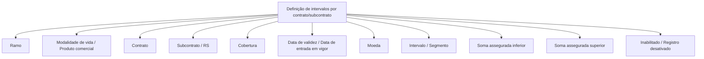

# Definição de Intervalos por Contrato/Subcontrato

## 1. Metadados do Documento
- **Arquivo de Origem:** Não identificado no conteúdo fornecido
- **Tipo de Documento:** Especificação Funcional
- **Domínio / Sistema:** Definição de intervalos por contrato/subcontrato
- **Público-Alvo:** Negócio, analistas funcionais e desenvolvedores
- **Data/Versão Identificada:** Não identificada

---

## 2. Resumo Executivo & Contexto de Negócio

O documento apresenta uma definição em construção para intervalos associados a contrato e subcontrato. O conteúdo descreve propriedades de ramo e propriedades de definição usadas na composição desse registro de intervalo.

A estrutura funcional identifica o ramo, a modalidade de vida, o contrato, o subcontrato ou RS, a cobertura, a data de validez, a moeda, o intervalo e os limites inferior e superior de soma assegurada.

O intervalo é identificado também pelo termo `segmento`. O limite inferior da soma assegurada corresponde ao menor valor do intervalo, enquanto o limite superior da soma assegurada corresponde ao maior valor do intervalo.

O documento não detalha regras de persistência, cálculos, validações de consistência, integrações, métodos HTTP, contratos JSON, tecnologia implementada ou comportamento operacional do estado de inabilitação.

> **Nota de Análise:** O conteúdo fornecido lista propriedades e campos funcionais, mas não apresenta detalhamento adicional sobre fluxo de telas, APIs, banco de dados ou regras de validação.

---

## 3. Arquitetura, Componentes & Tecnologias Envolvidas

Os elementos identificados no documento são:

- Ramo
- Modalidade de vida
- Produto comercial
- Contrato
- Subcontrato
- RS
- Cobertura
- Data de validez ou data de entrada em vigor
- Moeda
- Intervalo ou segmento
- Soma assegurada inferior
- Soma assegurada superior
- Estado de inabilitação ou registro desativado
- Soluciones
- APIs
- Documentación
- Zeus

O documento indica relações terminológicas entre alguns elementos, tais como `modalidad - producto comercial`, `subcontrato / RS`, `fecha de validez - fecha entrada en vigor` e `intervalo - segmento`. Não há descrição suficiente para afirmar relações técnicas, comunicação entre APIs ou dependências de execução.



---

## 4. Regras de Negócio, Especificações Funcionais & Processos

1. A definição tratada pelo documento é denominada **definição de intervalos por contrato/subcontrato**.
2. O registro possui propriedades de ramo.
3. O registro possui propriedades de definição.
4. O ramo é identificado pelo campo ou termo `ramo`.
5. A modalidade de vida é relacionada no documento à expressão `modalidad - producto comercial`.
6. O contrato é identificado pelo campo ou termo `contrato`.
7. O subcontrato é identificado pelo campo ou termo `subcontrato`.
8. O documento apresenta `RS` como associado a subcontrato, na expressão `subcontrato / RS`.
9. A cobertura é identificada pelo campo ou termo `cobertura`.
10. A data de validez é associada à data de entrada em vigor.
11. A moeda é identificada pelo campo ou termo `moneda`.
12. O intervalo é associado ao termo `segmento`.
13. A soma assegurada inferior representa o valor menor do intervalo.
14. A soma assegurada superior representa o valor maior do intervalo.
15. O estado `Inhabilitado` é associado a `registro desactivado`.

> **Nota de Análise:** O documento não informa se a soma assegurada inferior deve ser menor que a soma assegurada superior, nem define tratamento para valores iguais, sobreposição de intervalos, datas inválidas ou registros inabilitados.

---

## 5. Tabelas de Parâmetros, Ambientes e Estruturas de Dados

| Item / Parâmetro | Descrição / Função | Tipo / Valores / Formato | Ambiente / Observações |
| :--- | :--- | :--- | :--- |
| Definição de intervalos por contrato/subcontrato | Objeto funcional central apresentado no documento. | Não informado | Conteúdo marcado como `EN CONSTRUCCIÓN`. |
| Ramo | Propriedade de ramo. | `ramo` | Não há valores permitidos definidos. |
| Modalidade de vida | Propriedade associada à modalidade. | `modalidad - producto comercial` | Não há detalhamento adicional. |
| Produto comercial | Termo relacionado à modalidade de vida. | `producto comercial` | Relação apresentada literalmente como `modalidad - producto comercial`. |
| Contrato | Propriedade de contrato. | `contrato` | Não há formato informado. |
| Subcontrato | Propriedade de subcontrato. | `subcontrato` | Apresentado em conjunto com RS. |
| RS | Termo associado a subcontrato. | `RS` | Significado não definido no documento. |
| Cobertura | Propriedade de cobertura. | `cobertura` | Não há formato informado. |
| Data de validez | Propriedade temporal da definição. | `fecha entrada en vigor` | O documento associa data de validez à data de entrada em vigor. |
| Moeda | Propriedade monetária da definição. | `moneda` | Não há domínio de valores informado. |
| Intervalo | Segmento definido para a estrutura. | `segmento` | O documento trata intervalo e segmento como termos associados. |
| Soma assegurada inferior | Menor valor do intervalo. | `suma asegurada inferior` | Não há unidade monetária ou regra de cálculo definida. |
| Soma assegurada superior | Maior valor do intervalo. | `suma asegurada superior` | Não há unidade monetária ou regra de cálculo definida. |
| Inabilitado | Estado de desativação do registro. | `registro desactivado` | Sem comportamento operacional especificado. |
| Soluciones | Item exibido na navegação ou interface. | Texto literal | Sem detalhamento funcional. |
| APIs | Item exibido na navegação ou interface. | Texto literal | Nenhuma API é descrita. |
| Documentación | Item exibido na navegação ou interface. | Texto literal | Sem links ou conteúdos especificados. |
| Zeus | Item exibido na navegação ou interface. | Texto literal | Papel não especificado. |

---

## 6. Bateria de Perguntas & Respostas para RAG (FAQ Sintético)

### P1: Qual é o objetivo funcional apresentado no documento?
**R:** O documento apresenta uma definição de intervalos por contrato e subcontrato. Essa definição reúne propriedades de ramo e propriedades de definição, incluindo contrato, subcontrato, cobertura, data de validez, moeda e limites de soma assegurada.

### P2: Quais propriedades de ramo são citadas?
**R:** O documento cita o ramo e a modalidade de vida. A modalidade de vida aparece relacionada ao termo `producto comercial` pela expressão `modalidad - producto comercial`.

### P3: Como o documento identifica contrato e subcontrato?
**R:** O contrato é identificado pelo termo `contrato`, e o subcontrato pelo termo `subcontrato`. O documento também apresenta a associação `subcontrato / RS`, sem definir o significado da sigla RS.

### P4: O que representa o intervalo na definição?
**R:** O intervalo é associado ao termo `segmento`. O conteúdo não especifica regras de criação, cálculo, ordenação ou validação dos segmentos.

### P5: O que é a soma assegurada inferior?
**R:** A soma assegurada inferior é definida como o valor menor do intervalo. O documento não informa formato numérico, moeda obrigatória ou validações relacionadas a esse limite.

### P6: O que é a soma assegurada superior?
**R:** A soma assegurada superior é definida como o valor maior do intervalo. Não há regra explícita que estabeleça comparação formal entre a soma assegurada inferior e a soma assegurada superior.

### P7: Qual data está associada à validade da definição?
**R:** A propriedade `Fecha de validez` é apresentada como `fecha entrada en vigor`, indicando associação com a data de entrada em vigor. O documento não informa formato de data ou regra para encerramento de validade.

### P8: Qual é o significado de Inhabilitado no documento?
**R:** `Inhabilitado` é associado ao estado `registro desactivado`. O documento não detalha se um registro desativado pode ser consultado, alterado, reativado ou utilizado em processos posteriores.

### P9: O documento descreve APIs ou contratos de integração?
**R:** Não. Embora o texto apresente o item `APIs`, não há métodos HTTP, endpoints, autenticação, payloads, contratos JSON ou regras de integração descritos.

### P10: Qual é o papel da moeda na definição de intervalos?
**R:** A moeda é listada como uma propriedade de definição. O documento não especifica códigos de moeda aceitos, relação obrigatória com a soma assegurada ou conversão cambial.

### P11: O documento está finalizado?
**R:** Não há confirmação de finalização. A primeira página contém a expressão `EN CONSTRUCCIÓN`, indicando que o conteúdo estava em construção no material fornecido.

### P12: O documento define o papel de Zeus?
**R:** Não. `Zeus` aparece como texto na navegação junto de `Soluciones`, `APIs` e `Documentación`, mas sua função não é explicada.

---

## 7. Glossário de Termos, Siglas & Conceitos-Chave

- **APIs:** Termo exibido no documento; não há definição de interfaces, endpoints ou contratos.
- **Cobertura:** Propriedade identificada como `cobertura`.
- **Contrato:** Propriedade identificada como `contrato`.
- **Data de entrada em vigor:** Termo associado à data de validez.
- **Data de validez:** Propriedade temporal apresentada como `fecha entrada en vigor`.
- **Inhabilitado:** Estado associado a `registro desactivado`.
- **Intervalo:** Propriedade associada ao termo `segmento`.
- **Modalidade de vida:** Propriedade associada a `producto comercial`.
- **Moeda:** Propriedade identificada como `moneda`.
- **Produto comercial:** Termo relacionado à modalidade de vida.
- **Ramo:** Propriedade identificada como `ramo`.
- **RS:** Sigla apresentada em associação com subcontrato; significado não definido.
- **Segmento:** Termo associado a intervalo.
- **Soma assegurada inferior:** Menor valor do intervalo.
- **Soma assegurada superior:** Maior valor do intervalo.
- **Subcontrato:** Propriedade identificada como `subcontrato`.
- **Zeus:** Termo exibido na navegação; significado não definido.

---

## 8. Notas Críticas, Riscos & Limitações

- O conteúdo está marcado como `EN CONSTRUCCIÓN`.
- Não há nome de arquivo, autor, data, versão ou histórico de alterações identificáveis.
- Não há detalhamento de regras de validação para datas, moeda, intervalos ou limites de soma assegurada.
- Não há definição do significado de `RS`.
- Não há descrição de APIs, métodos HTTP, URLs, autenticação, contratos de dados ou integrações.
- Não há descrição de persistência, modelo de dados, telas, permissões ou trilha de auditoria.
- Não há informação sobre como o estado `Inhabilitado` afeta o uso do registro.
- `Soluciones`, `APIs`, `Documentación` e `Zeus` aparecem sem detalhamento de função.

---

## 9. Conteúdo Bruto Estruturado (Referência Fiel)

```text
--- [PÁGINA 1 DE 2] ---

EN CONSTRUCCIÓN
DEFINICIÓN de intervalos por
contrato/subcontrato
Objetivo
Propiedades de ramo
Propiedades de definición
Propiedades de ramo
Ramo
ramo
Modalidad de vida
modalidad - producto comercial
Contrato
contrato
Subcontrato
subcontrato
 /
 RS
Inicio Soluciones APIs Documentación Zeus
ES


--- [PÁGINA 2 DE 2] ---

Cobertura
cobertura
Fecha de validez
fecha entrada en vigor
Propiedades de definición
Moneda
moneda
Intervalo
segmento
Suma asegurada (valor menor del intervalo)
suma asegurada inferior
Suma asegurada (valor mayor del intervalo)
suma asegurada superior
Inhabilitado
registro desactivado
```
