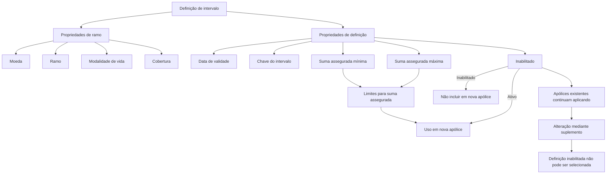

# Definição de Intervalo para Suma Assegurada de Cobertura

## 1. Metadados do Documento
- **Arquivo de Origem:** Não identificado
- **Tipo de Documento:** Especificação Técnica
- **Domínio / Sistema:** Definição de intervalo para cobertura e suma assegurada
- **Público-Alvo:** Não identificado
- **Data/Versão Identificada:** Não identificada

---

## 2. Resumo Executivo & Contexto de Negócio

O conteúdo descreve uma definição de intervalo usada para estabelecer um ou mais limites para a determinação da suma assegurada de uma cobertura. Cada intervalo possui um valor mínimo e um valor máximo de suma assegurada, delimitando os valores que podem ser utilizados.

A definição é associada a propriedades de ramo, incluindo moeda, ramo, modalidade de vida e cobertura. A modalidade de vida aplica-se somente a ramos que possuem tratamento de vida.

A vigência da definição é controlada por uma data de validade. O documento informa que o uso correto dessa data permite manter um histórico das mudanças efetuadas na definição.

Uma definição pode ser marcada como inabilitada. Quando inabilitada, ela não pode ser incluída em uma nova apólice; entretanto, apólices existentes que já a utilizam continuam aplicando-a até que um suplemento altere essa configuração. Após a alteração por suplemento, a definição inabilitada não poderá ser selecionada novamente.

---

## 3. Arquitetura, Componentes & Tecnologias Envolvidas

Os componentes conceituais identificados são:

- Definição de intervalo.
- Propriedades de ramo.
- Propriedades de definição.
- Moeda.
- Ramo.
- Modalidade de vida.
- Cobertura.
- Data de validade.
- Intervalo.
- Suma assegurada mínima.
- Suma assegurada máxima.
- Estado de inabilitação.
- Apólice.
- Suplemento.



> **Nota de Análise:** O conteúdo não detalha tecnologias, métodos HTTP, contratos JSON, banco de dados, interfaces, URLs, ambientes ou integrações técnicas.

---

## 4. Regras de Negócio, Especificações Funcionais & Processos

1. É possível estabelecer um ou vários intervalos que funcionam como limite para determinar a suma assegurada de uma cobertura.

2. A moeda representa a chave da moeda em que são expressos os importes dos valores do acessório.

3. O ramo identifica o ramo afetado pela definição.

4. A modalidade de vida determina a modalidade à qual pertence o atributo, mas é aplicável apenas a ramos com tratamento de vida.

5. A cobertura identifica a cobertura à qual pertence a definição.

6. A data de validade determina quando a definição estará disponível para utilização.

7. O uso correto da data de validade permite manter um registro histórico das alterações realizadas na definição.

8. A chave de intervalo é a chave associada ao intervalo configurado.

9. A suma assegurada mínima é o menor valor que pode ser utilizado como suma assegurada.

10. A suma assegurada máxima é o maior valor que pode ser utilizado como suma assegurada.

11. Quando uma definição está inabilitada, ela não pode ser incluída em uma nova apólice.

12. A inabilitação não interrompe automaticamente a aplicação da definição em apólices existentes que já a possuam.

13. Uma apólice existente continuará aplicando a definição inabilitada até que a configuração seja modificada mediante um suplemento.

14. Após a modificação mediante suplemento, a definição inabilitada não poderá ser selecionada novamente.

---

## 5. Tabelas de Parâmetros, Ambientes e Estruturas de Dados

| Item / Parâmetro | Descrição / Função | Tipo / Valores / Formato | Ambiente / Observações |
| :--- | :--- | :--- | :--- |
| Definição de intervalo | Estabelece um ou mais limites para determinar a suma assegurada de uma cobertura. | Definição configurável. | Não detalhado. |
| Moeda | Chave da moeda em que são expressos os importes dos valores do acessório. | Chave de moeda. | Não detalhado. |
| Ramo | Indica o ramo afetado pela definição. | Referência de ramo. | Não detalhado. |
| Modalidade de vida | Determina a modalidade à qual pertence o atributo. | Modalidade. | Aplicável somente a ramos com tratamento de vida. |
| Cobertura | Identifica a cobertura à qual pertence a definição. | Referência de cobertura. | Não detalhado. |
| Data de validade | Determina quando a definição fica disponível para utilização. | Data. | Permite manter histórico de alterações. |
| Intervalo | Chave associada ao intervalo. | Chave de intervalo. | Não detalhado. |
| Suma assegurada mínima | Menor valor permitido para a suma assegurada. | Valor monetário ou valor de suma assegurada. | Unidade monetária depende da moeda configurada. |
| Suma assegurada máxima | Maior valor permitido para a suma assegurada. | Valor monetário ou valor de suma assegurada. | Unidade monetária depende da moeda configurada. |
| Inabilitado | Determina se a definição está ativa ou se não pode mais ser incluída em uma nova apólice. | Estado ativo/inabilitado. | Não remove a aplicação em apólices existentes. |
| Apólice existente | Mantém a aplicação de uma definição inabilitada já utilizada. | Apólice. | Permanece assim até alteração mediante suplemento. |
| Suplemento | Mecanismo citado para modificar uma apólice existente. | Alteração de apólice. | Depois da alteração, definição inabilitada não pode ser selecionada. |

---

## 6. Bateria de Perguntas & Respostas para RAG (FAQ Sintético)

### P1: Qual é o objetivo da definição de intervalo?
**R:** A definição de intervalo permite estabelecer um ou vários limites para determinar a suma assegurada de uma cobertura.

### P2: Quais são os limites configurados em um intervalo de suma assegurada?
**R:** O intervalo possui uma suma assegurada mínima, que é o menor valor permitido, e uma suma assegurada máxima, que é o maior valor permitido.

### P3: Qual é a finalidade do campo de moeda?
**R:** A moeda é a chave da moeda em que são expressos os importes dos valores do acessório.

### P4: O que o ramo representa na definição de intervalo?
**R:** O ramo aponta para o ramo afetado pela definição de intervalo.

### P5: Quando a modalidade de vida deve ser considerada?
**R:** A modalidade de vida determina a modalidade à qual pertence o atributo e é aplicável somente a ramos com tratamento de vida.

### P6: Como a data de validade afeta uma definição de intervalo?
**R:** A data de validade determina quando a definição estará disponível para uso. Seu uso correto também permite registrar historicamente as mudanças realizadas na definição.

### P7: O que acontece quando uma definição é inabilitada?
**R:** Uma definição inabilitada não pode ser incluída em uma nova apólice. Contudo, apólices existentes que já utilizam a definição continuam aplicando-a.

### P8: A inabilitação remove imediatamente uma definição das apólices existentes?
**R:** Não. As apólices que já dispõem da definição continuam aplicando-a até que a configuração seja alterada mediante um suplemento.

### P9: O que ocorre após alterar uma apólice por suplemento quando a definição está inabilitada?
**R:** Após a alteração mediante suplemento, a definição inabilitada não pode ser selecionada novamente.

### P10: Qual é o significado da chave associada ao intervalo?
**R:** A chave associada ao intervalo identifica o intervalo configurado, embora o documento não detalhe seu formato, regras de geração ou unicidade.

### P11: O documento define valores numéricos concretos para a suma assegurada mínima e máxima?
**R:** Não. O documento apenas define a função de cada limite: a suma assegurada mínima é o menor valor utilizável e a máxima é o maior valor utilizável.

---

## 7. Glossário de Termos, Siglas & Conceitos-Chave

- **Definição de intervalo:** Configuração que estabelece um ou mais limites para a determinação da suma assegurada de uma cobertura.
- **Suma assegurada:** Valor sujeito aos limites mínimo e máximo definidos pelo intervalo.
- **Cobertura:** Cobertura à qual pertence a definição.
- **Ramo:** Ramo afetado pela definição de intervalo.
- **Modalidade de vida:** Modalidade relacionada ao atributo, aplicável apenas a ramos com tratamento de vida.
- **Data de validade:** Data que determina quando a definição está disponível para utilização.
- **Intervalo:** Entidade identificada por uma chave associada e composta por limites de suma assegurada.
- **Inabilitado:** Estado no qual a definição não pode ser selecionada para novas apólices.
- **Apólice:** Registro que pode continuar aplicando uma definição inabilitada se já a possuir.
- **Suplemento:** Alteração de apólice mencionada como o momento após o qual a definição inabilitada não pode mais ser selecionada.

---

## 8. Notas Críticas, Riscos & Limitações

- O documento não informa valores concretos para os limites de suma assegurada.
- O documento não especifica formato, obrigatoriedade ou regra de unicidade para a chave do intervalo.
- O documento não define o formato da data de validade nem critérios para início, término ou sobreposição de vigências.
- O documento não detalha o comportamento de múltiplos intervalos associados à mesma cobertura.
- O documento não especifica como ocorre tecnicamente a alteração mediante suplemento.
- O texto contém fragmentos como `Ejemplo: / CF Home Solutions APIs Documentation Zeus EN`, sem detalhamento contextual suficiente para classificá-los como componentes funcionais ou tecnológicos.
- Não foram identificados detalhes sobre APIs, persistência, autenticação, permissões, ambientes, logs ou procedimentos operacionais.

---

## 9. Conteúdo Bruto Estruturado (Referência Fiel)

```text
--- [PÁGINA 1 DE 2] ---

DEFINICIÓN de intervalo
Objetivo
Es posible establecer uno o varios rangos que sirvan como límite a la hora de determinar la suma
asegurada de una cobertura.
Propiedades de ramo
Propiedades de definición
Propiedades de ramo
Moneda
Clave de la moneda en la que están expresados los importes de valores del accesorio.
Ramo
Apunta al ramo al que afecta esta definición.
Modalidad de vida
Determina la modalidad (solo para ramos con tratamiento de vida) a la que pertenece el atributo.
Cobertura
Ejemplo:
 / 
 CF
Home Solutions APIs Documentation Zeus
EN


--- [PÁGINA 2 DE 2] ---

Cobertura a la que pertenece.
Fecha de validez
Determina cuando la definición estará disponible para ser utilizada. Su correcto uso permite tener un
registro histórico de los cambios efectuados en la definición.
Propiedades de definición
Intervalo
Clave asociada al intervalo.
Suma asegurada (valor menor del intervalo)
Es el valor mínimo que se puede utilizar como suma asegurada.
Suma asegurada (valor mayor del intervalo)
Es el valor máximo que se puede utilizar como suma asegurada.
Inhabilitado
En este punto se determina si está activo o por el contrario ya no puede ser incluido en una nueva
póliza. Es importante destacar que, aunque se inhabilite, todas las pólizas que dispongan de ello,
seguirá aplicándose hasta que mediante un suplemento se cambie. En ese momento, al estar
inhabilitado ya no será posible seleccionarlo.
```
