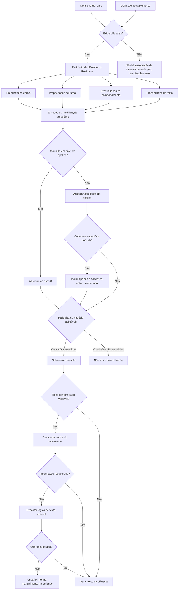

# Gestão de Cláusulas em Apólices no Reef.core

## 1. Metadados do Documento
- **Arquivo de Origem:** Não identificado no conteúdo extraído
- **Tipo de Documento:** Especificação Técnica / Manual Funcional
- **Domínio / Sistema:** Reef.core — emissão e modificação de apólices de seguros
- **Público-Alvo:** Desenvolvedores, Arquitetos, Analistas Funcionais, Operação e Negócio
- **Data/Versão Identificada:** Não identificada

---

## 2. Resumo Executivo & Contexto de Negócio

O documento descreve o modelo funcional de definição, seleção e aplicação de cláusulas em apólices e suplementos no sistema Reef.core. Uma cláusula é tratada como elemento fundamental da apólice, pois estabelece termos, condições, direitos, obrigações e limitações aplicáveis à companhia seguradora e ao segurado.

A necessidade de associação de cláusulas é determinada pela definição do ramo de seguro ou pela definição do suplemento. No Reef.core, devem ser identificadas as cláusulas aplicáveis às apólices emitidas para os ramos que exigem cláusulas e às modificações de apólices que também demandem seu uso.

A definição de cláusula reúne propriedades gerais, propriedades de ramo, propriedades de comportamento e propriedades de texto. Essas propriedades controlam identificação, vigência, disponibilidade, ordenação, nível de associação — apólice ou risco —, relação com coberturas, regras adicionais de negócio, capacidade de atualização pelo usuário, idioma e composição textual.

O documento também define o tratamento de textos variáveis e enriquecidos. Durante a emissão ou modificação de uma apólice, valores entre colchetes podem ser substituídos por informações registradas no movimento, recuperadas por lógica de negócio ou informadas manualmente pelo usuário quando não houver recuperação automática.

O conteúdo não apresenta contratos de API, URLs, ambientes, persistência de dados, métodos HTTP, modelos JSON, tecnologias de implementação ou detalhes de execução técnica da lógica de negócio. A especificação é predominantemente funcional.

---

## 3. Arquitetura, Componentes & Tecnologias Envolvidas

### Componentes e conceitos identificados

| Componente / Conceito | Papel no processo |
| :--- | :--- |
| **Reef.core** | Sistema no qual são definidas e associadas cláusulas a apólices e suas modificações. |
| **Ramo** | Determina se apólices ou modificações exigem associação de cláusulas e identifica o ramo afetado pela definição. |
| **Apólice** | Entidade de seguro à qual cláusulas podem ser associadas durante emissão ou modificação. |
| **Suplemento** | Modificação de apólice cuja definição pode determinar a necessidade de cláusulas. |
| **Risco** | Unidade específica da apólice à qual cláusulas de nível de risco podem ser associadas. |
| **Risco 0** | Risco utilizado para associação de cláusulas definidas em nível de apólice. |
| **Cobertura** | Chave de cobertura que pode condicionar a inclusão de uma cláusula de nível de risco. |
| **Lógica de negócio** | Regra que avalia condições adicionais da apólice para determinar seleção de cláusulas ou preenchimento de texto variável. |
| **Processo de emissão** | Processo que seleciona cláusulas, substitui valores variáveis e pode permitir preenchimento manual. |
| **Processo de modificação** | Processo de alteração da apólice no qual cláusulas também podem ser aplicadas. |
| **Movimento** | Fonte de informações registradas que podem substituir dados variáveis presentes no texto da cláusula. |



> **Nota de Análise:** O documento cita “lógica de negócio”, mas não detalha sua linguagem, motor de regras, ponto de configuração, critérios internos, entradas, saídas ou contratos de integração.

---

## 4. Regras de Negócio, Especificações Funcionais & Processos

### 4.1 Classificação de cláusulas

As cláusulas são classificadas em:

1. **Cláusulas gerais:** estabelecem regras gerais para todas as apólices com características similares.
2. **Cláusulas particulares:** definem casos específicos para determinadas apólices ou clientes, considerando o contexto e o caso particular do segurado.
3. **Cláusulas limitativas:** delimitam o risco segurado e determinam em que circunstâncias o contratante tem direito a solicitar a prestação do seguro.

O documento menciona exemplos de cláusulas gerais, particulares e limitativas em seguros de automóveis, mas não apresenta o conteúdo desses exemplos na extração fornecida.

### 4.2 Regras para associação de cláusulas

- A definição do ramo ou a definição do suplemento determina se cláusulas devem ser associadas às apólices ou às suas modificações.
- No Reef.core, devem ser identificadas as cláusulas associadas:
  - às apólices emitidas nos diferentes ramos que exigem cláusulas;
  - às modificações de apólices que determinam o uso de cláusulas.
- No Reef.core, devem ser definidas as cláusulas selecionáveis:
  - durante a emissão de apólices dos ramos aplicáveis;
  - durante a modificação das apólices aplicáveis.

### 4.3 Regras de vigência e inativação

- Cada cláusula possui uma data de edição, correspondente à entrada em vigor ou à última modificação da cláusula.
- A cada revisão do texto da cláusula, deve ser registrada uma nova data de edição.
- Pode existir mais de uma data de edição para a mesma cláusula.
- A data de validade determina quando uma definição fica disponível para uso.
- O uso correto da data de validade permite registrar historicamente mudanças na definição.
- Uma cláusula inabilitada não pode ser incluída em novas apólices.
- A inabilitação não elimina a aplicação da cláusula nas apólices que já a possuem.
- Uma cláusula inabilitada continua aplicável em uma apólice existente até que um suplemento altere essa cláusula.
- Quando ocorre uma alteração por suplemento, uma cláusula inabilitada não pode mais ser selecionada.

### 4.4 Regras de nível de associação: apólice, risco e cobertura

#### Cláusula em nível de apólice

- A propriedade **Cláusula a nível póliza** determina se a cláusula afeta toda a apólice.
- Quando uma cláusula é definida em nível de apólice e não existem condições adicionais que controlem sua inclusão, a cláusula deve ser sempre incluída.
- A cláusula de nível de apólice não é associada a um risco particular.
- A cláusula de nível de apólice é associada ao **risco 0**.

#### Cláusula em nível de risco

- Quando a cláusula não é definida em nível de apólice, a cláusula é associada a cada risco contido na apólice, desde que não existam outras condições que determinem sua inclusão ou exclusão.
- Para cláusulas em nível de risco, a propriedade **Cobertura** pode conter a chave de uma cobertura específica.
- Quando uma chave de cobertura é definida, a cláusula deve ser incluída sempre que essa cobertura estiver contratada.

### 4.5 Regras de lógica de negócio

- A propriedade **Lógica de negócio** representa uma lógica responsável por avaliar condições adicionais da apólice.
- A lógica de negócio complementa as condições determinadas pelas propriedades de nível, ramo, cobertura e demais propriedades documentadas.
- O objetivo da lógica de negócio é identificar se uma cláusula deve ou não ser selecionada.

> **Nota de Análise:** O documento não informa exemplos concretos de condições avaliadas pela lógica de negócio, nem detalha precedência entre condições, comportamento em falha ou regras de conflito entre cláusulas.

### 4.6 Regras de atualização pelo usuário

A propriedade **Forma de atualização** determina como o usuário pode controlar a inclusão de uma cláusula durante a emissão da apólice.

| Forma de atualização | Regra funcional |
| :--- | :--- |
| **Alta** | O usuário pode incluir a cláusula quando ela ainda não estiver selecionada. |
| **Borrar** | O usuário pode remover a cláusula quando ela estiver selecionada. |
| **Borrar/alta** | O usuário pode incluir uma cláusula não selecionada ou remover uma cláusula já selecionada. |
| **Ninguna** | O usuário não pode incluir nem remover a cláusula. |

### 4.7 Regras de texto da cláusula

- A propriedade **Idioma** identifica o idioma no qual o texto da cláusula foi definido.
- Os exemplos de idiomas citados são espanhol, inglês e turco.
- A propriedade **Hay texto variable** identifica se o texto da cláusula contém informações que devem ser obtidas a partir de dados registrados durante emissão ou modificação da apólice.
- A propriedade **Cláusula enriquecida** indica se o texto permite recursos de formatação, como sublinhado, negrito e itálico.
- A propriedade **Texto de la cláusula** armazena o texto da cláusula.

#### Texto não enriquecido

- Existe limite máximo de 60 caracteres por linha.
- Devem ser criadas tantas linhas quantas forem necessárias para completar o texto da cláusula.
- Em texto não enriquecido com dados variáveis, o espaço entre o colchete inicial e o colchete final determina o comprimento do dado que será inserido.

#### Texto enriquecido

- Permite incluir o texto completo sem limitação de tamanho mencionada no documento.
- Pode conter recursos de formatação, incluindo sublinhado, negrito e itálico.

#### Texto variável

- Dados variáveis devem ser identificados por uma chave entre colchetes, no formato `[chave]`.
- No processo de emissão, o conteúdo entre colchetes é substituído por uma informação registrada no movimento.
- Quando o processo de emissão não consegue recuperar a informação correspondente, o usuário pode informar o valor no momento da emissão.
- Uma lógica de negócio para texto variável pode ser desenvolvida para recuperar o valor de dados não registrados no processo de emissão.
- Essa lógica é responsável por registrar o valor que substituirá o dado especificado na definição da cláusula.
- O processo de emissão recupera os dados registrados pelo próprio processo e executa a lógica para recuperar valores de outros dados não registrados.
- Se nenhum dos mecanismos recuperar a informação necessária, o usuário pode preencher manualmente a informação na cláusula durante o processo de emissão.

---

## 5. Tabelas de Parâmetros, Ambientes e Estruturas de Dados

| Item / Parâmetro | Descrição / Função | Tipo / Valores / Formato | Ambiente / Observações |
| :--- | :--- | :--- | :--- |
| Cláusula | Chave que identifica a cláusula. | Chave identificadora. | Não detalhado. |
| Descrição cláusula | Título associado à chave da cláusula. | Texto. | Não detalhado. |
| Fecha edición | Registra entrada em vigor ou última modificação da cláusula. | Data; pode haver mais de uma data por cláusula. | Nova data deve ser registrada a cada revisão do texto. |
| Se puede imprimir | Indica se a cláusula será impressa com a documentação da apólice. | Propriedade booleana inferida pela descrição; valores não apresentados. | Aplicável à documentação da apólice. |
| Inhabilitado | Indica se a cláusula está ativa ou não pode mais ser incluída em nova apólice. | Propriedade de status; valores não apresentados. | Não remove cláusulas já aplicadas em apólices existentes. |
| Ramo | Identifica o ramo afetado pela definição da cláusula. | Referência ao ramo. | Determina aplicabilidade por ramo. |
| Fecha de validez | Define quando a definição fica disponível para uso. | Data ou período; formato não detalhado. | Permite histórico de mudanças na definição. |
| Orden | Define a posição de exibição da cláusula no processo de emissão. | Ordem / posição. | Utilizado durante solicitação de cláusulas na emissão. |
| Cláusula a nível póliza | Define se a cláusula afeta a apólice inteira ou riscos específicos. | Propriedade de nível. | Se aplicável à apólice, associa-se ao risco 0. |
| Cobertura | Indica a chave de cobertura para cláusulas em nível de risco. | Chave de cobertura. | A cláusula é incluída quando a cobertura estiver contratada. |
| Lógica de negócio | Avalia condições adicionais para determinar seleção da cláusula. | Lógica não detalhada. | Complementa regras baseadas em propriedades. |
| Forma de atualização | Controla inclusão ou remoção pelo usuário na emissão. | Alta; Borrar; Borrar/alta; Ninguna. | Aplicável no momento da emissão da apólice. |
| Idioma | Identifica o idioma do texto da cláusula. | Exemplos: espanhol, inglês, turco. | Lista completa de idiomas não detalhada. |
| Hay texto variable | Identifica presença de informação variável no texto. | Propriedade de presença; valores não apresentados. | Dados variáveis são representados entre colchetes. |
| Cláusula enriquecida | Indica se o texto permite formatação enriquecida. | Propriedade de presença; valores não apresentados. | Exemplos: sublinhado, negrito e itálico. |
| Texto de la cláusula | Armazena o conteúdo textual da cláusula. | Texto enriquecido ou não enriquecido. | Texto não enriquecido: máximo de 60 caracteres por linha. |
| Dado variável | Informação substituída durante emissão. | Chave entre colchetes, como `[chave]`. | Em texto não enriquecido, espaço entre colchetes determina comprimento disponível. |
| Risco 0 | Risco de associação para cláusulas em nível de apólice. | Identificador de risco. | Não representa associação a risco particular. |
| Movimento | Fonte de dados registrados para substituir informações variáveis. | Dados do processo; estrutura não detalhada. | Usado durante emissão ou modificação da apólice. |

> **Nota de Análise:** O conteúdo não informa servidores, URLs, ambientes — desenvolvimento, homologação ou produção —, diretórios de log, formatos de banco de dados, tipos de campo técnicos ou estruturas de payload.

---

## 6. Bateria de Perguntas & Respostas para RAG (FAQ Sintético)

### P1: O que é uma cláusula no contexto de uma apólice no Reef.core?
**R:** Uma cláusula é um elemento fundamental da apólice que define termos e condições específicos, incluindo direitos, obrigações e limitações para a companhia seguradora e para o segurado. No Reef.core, cláusulas são definidas e associadas às apólices e às modificações de apólices quando o ramo ou suplemento aplicável exige seu uso.

### P2: Quais tipos de cláusulas são classificados no documento?
**R:** O documento classifica cláusulas como gerais, particulares e limitativas. Cláusulas gerais estabelecem regras para apólices de características similares; cláusulas particulares abrangem casos específicos de apólices ou clientes; e cláusulas limitativas delimitam o risco segurado e determinam quando o contratante pode solicitar a prestação do seguro.

### P3: Como o Reef.core determina se uma apólice precisa de cláusulas?
**R:** A necessidade de cláusulas é determinada pela definição do ramo ou pela definição do suplemento. O Reef.core deve identificar quais cláusulas serão associadas às apólices emitidas nos ramos aplicáveis e às modificações de apólice que demandem cláusulas.

### P4: O que acontece quando uma cláusula é inabilitada?
**R:** Uma cláusula inabilitada não pode ser incluída em uma nova apólice. Entretanto, a inabilitação não elimina a cláusula das apólices que já a possuem: ela continua sendo aplicada até que uma alteração por suplemento ocorra. Nesse momento, por estar inabilitada, a cláusula não poderá ser novamente selecionada.

### P5: Como funciona uma cláusula definida em nível de apólice?
**R:** Uma cláusula em nível de apólice afeta a apólice inteira e não é associada a um risco específico. Quando não há condições adicionais que controlem sua inclusão, ela é sempre incluída e associada ao risco 0.

### P6: Como funciona uma cláusula definida em nível de risco?
**R:** Uma cláusula que não é definida em nível de apólice é associada a cada risco contido na apólice, desde que não existam condições adicionais que alterem sua inclusão. Se a cláusula possuir uma chave de cobertura específica, sua inclusão ocorre quando essa cobertura estiver contratada.

### P7: Qual é a finalidade da propriedade Cobertura em uma cláusula?
**R:** A propriedade Cobertura pode ser utilizada quando a cláusula está em nível de risco. Ela contém uma chave de cobertura específica e permite determinar que a cláusula seja incluída sempre que a cobertura correspondente estiver contratada na apólice.

### P8: Quais operações o usuário pode executar conforme a Forma de atualização?
**R:** Com **Alta**, o usuário pode incluir uma cláusula ainda não selecionada. Com **Borrar**, pode eliminar uma cláusula já selecionada. Com **Borrar/alta**, pode incluir ou remover a cláusula. Com **Ninguna**, o usuário não pode incluir nem remover a cláusula durante a emissão.

### P9: Qual é a diferença entre texto de cláusula enriquecido e não enriquecido?
**R:** Um texto enriquecido permite incluir o texto completo sem a limitação de linhas indicada e pode usar recursos como sublinhado, negrito e itálico. Um texto não enriquecido possui limite máximo de 60 caracteres por linha, exigindo a criação de múltiplas linhas quando necessário.

### P10: Como valores variáveis são preenchidos no texto de uma cláusula?
**R:** Valores variáveis são indicados por uma chave entre colchetes, como `[chave]`. Durante a emissão, o Reef.core substitui o conteúdo entre colchetes por dados registrados no movimento. Para dados não registrados, pode ser executada uma lógica de negócio específica. Caso nenhum mecanismo recupere o valor necessário, o usuário pode informá-lo manualmente durante a emissão.

### P11: Qual é a função da lógica de negócio para texto variável?
**R:** A lógica de negócio para texto variável é usada para recuperar o valor que deve substituir um dado variável quando esse dado não está registrado no processo de emissão. Essa lógica registra o valor que substituirá a chave especificada na definição da cláusula.

### P12: Por que a data de validade é importante na definição de cláusulas?
**R:** A data de validade determina quando uma definição de cláusula estará disponível para utilização. Seu uso correto permite manter um registro histórico das alterações realizadas na definição.

---

## 7. Glossário de Termos, Siglas & Conceitos-Chave

- **Reef.core:** Sistema citado como responsável pela definição e associação de cláusulas a apólices e modificações de apólice.
- **Apólice:** Documento ou entidade contratual de seguro à qual cláusulas são associadas.
- **Cláusula:** Elemento que define termos, condições, direitos, obrigações e limitações relacionados à apólice.
- **Cláusula geral:** Cláusula que estabelece regras aplicáveis a apólices de características similares.
- **Cláusula particular:** Cláusula aplicável a casos específicos, apólices específicas ou determinados clientes.
- **Cláusula limitativa:** Cláusula que delimita o risco segurado e as condições de direito à prestação do seguro.
- **Ramo:** Segmento ou classificação de seguro afetado pela definição de cláusula.
- **Suplemento:** Modificação de apólice cuja definição pode exigir associação de cláusulas.
- **Risco:** Elemento específico da apólice ao qual uma cláusula pode ser associada.
- **Risco 0:** Identificador utilizado para associar cláusulas em nível de apólice, sem vínculo com um risco particular.
- **Cobertura:** Elemento contratável cuja presença pode condicionar a inclusão de uma cláusula de nível de risco.
- **Movimento:** Fonte de dados registrados no processo de emissão ou modificação, usada para preencher texto variável.
- **Texto enriquecido:** Texto de cláusula que permite formatação, como sublinhado, negrito e itálico.
- **Texto variável:** Texto de cláusula com chaves entre colchetes que devem ser substituídas por dados recuperados ou preenchidos durante a emissão.
- **Alta:** Forma de atualização que permite incluir uma cláusula não selecionada.
- **Borrar:** Forma de atualização que permite remover uma cláusula selecionada.
- **Borrar/alta:** Forma de atualização que permite incluir ou remover uma cláusula.
- **Ninguna:** Forma de atualização que impede o usuário de incluir ou remover uma cláusula.

---

## 8. Notas Críticas, Riscos & Limitações

- O documento não identifica o arquivo de origem, autor, versão, data de publicação ou histórico de revisões.
- Não há detalhamento de APIs, contratos de dados, métodos HTTP, URLs, autenticação, integrações externas, ambientes, servidores ou rotas de logs.
- Não são definidos os valores técnicos possíveis para propriedades como **Se puede imprimir**, **Inhabilitado**, **Cláusula a nivel póliza**, **Hay texto variable** e **Cláusula enriquecida**.
- Não há definição de precedência entre condições de ramo, validade, cobertura, nível de cláusula, lógica de negócio e forma de atualização.
- O documento menciona exemplos de uso, exemplos de ordem, exemplos por nível, exemplos de cobertura, exemplos de formas de atualização e exemplos de texto variável, mas o conteúdo desses exemplos não consta na extração recebida.
- A lógica de negócio é citada como mecanismo decisório e de enriquecimento de texto, mas não há detalhamento de sua implementação, critérios, tratamento de erro ou comportamento em caso de indisponibilidade.
- A substituição de texto variável pode depender de informação manual do usuário se o movimento e a lógica de negócio não conseguirem recuperar o valor necessário, introduzindo risco de preenchimento incompleto ou incorreto.
- A restrição de 60 caracteres por linha em texto não enriquecido deve ser considerada na configuração de placeholders, pois o espaço entre colchetes define o tamanho disponível para o dado inserido.

---

## 9. Conteúdo Bruto Estruturado (Referência Fiel)

```text
--- [PÁGINA 1 DE 6] ---

DEFINICIÓN de cláusula
Objetivo
Se trata de un elemento fundamental que define los términos y condiciones específicos de una
póliza. Establece los derechos, obligaciones y limitaciones tanto para la compañía como para el
asegurado.
Básicamente se clasifican en:
Cláusulas generales: Establecen reglas generales para todos las pólizas de similares
características
Cláusulas particulares: Definen casos específicos para pólizas determinados o ciertos clientes.
Toman en consideración el contexto y el caso particular del asegurado
Cláusulas limitativas: Delimitan el riesgo asegurado. En otras palabras, definen cuándo un
riesgo permite que el contratante tenga derecho a solicitar la prestación del seguro
Cláusulas generales en seguros de autos
Cláusulas particulares en seguros de autos
Cláusulas limitativas en seguros de autos
 / 
 RS
Inicio Soluciones APIs Documentación Zeus
ES


--- [PÁGINA 2 DE 6] ---

Será la definición del ramo, o la definición del suplemento, las que determinen si en las pólizas o en
sus modificaciones, se deberán asociar cláusulas.
En Reef.core se deben identificar las cláusulas que se van a asociar a las pólizas que se emitan de
los diferentes ramos que así lo requieran, así como a las modificaciones de dichas pólizas que
determinen el uso de cláusulas.
En Reef.core se deben definir las cláusulas que se podrán seleccionar, tanto en la emisión de pólizas
de ramos que así lo requieran, como en las modificaciones de dichas pólizas
Propiedades generales
Propiedades de ramo
Propiedades de comportamiento
Propiedades de texto
Propiedades generales
Cláusula
Clave que identifica la cláusula.
Descripción cláusula
Título asociado a la clave de la cláusula.
Fecha edición
Contiene la fecha de entrada en vigor o de la última modificación de la cláusula.
Cada vez que se haga una revisión del texto de la cláusula se registrará una nueva fecha de edición,
indicando el momento en el que se ha realizado dicha modificación, pudiendo existir más de una
fecha para cada cláusula.
Se puede imprimir
Propiedad que indica si la cláusula se imprimirá junto con el resto de documentación de la póliza.
Inhabilitado
En este punto se determina si está activa, o por el contrario ya no puede ser incluida en una nueva
póliza. Es importante destacar que, aunque se inhabilite, todas las pólizas que dispongan de ello,
seguirá aplicándose hasta que mediante un suplemento se cambie. En ese momento, al estar
inhabilitado ya no será posible seleccionarlo.
Ejemplo de uso de la propiedad


--- [PÁGINA 3 DE 6] ---

Propiedades de ramo
Ramo
Apunta al ramo al que afecta esta definición.
Fecha de validez
Determina cuando la definición estará disponible para ser utilizada. Su correcto uso permite tener un
registro histórico de los cambios efectuados en la definición.
Orden
Posición en la que se mostrará la cláusula a la hora de ser solicitada en el proceso de emisión.
Propiedades de comportamiento
Cláusula a nivel póliza
Determina si la cláusula afecta a toda la póliza o por el contrario, se asociará a cada riesgo en
particular.
Las cláusulas definidas a nivel póliza, si no existen otras condiciones que determinen si se incluyen o
no, se incluirá siempre, sin asociarse a ningún riesgo en particular, se asocian al riesgo 0.
Las cláusulas que no están definidas a nivel póliza, si no hay otras condiciones que determinen la
inclusión o no de las mismas, se asociarán a cada riesgo que contenga la póliza.
Cobertura
Cuando la cláusula es a nivel de riesgo, esta propiedad puede contener una clave de cobertura
específica, para determinar que la cláusula se incluye siempre que dicha cobertura esté contratada.
Lógica de negocio
Corresponde con una lógica cuyo cometido es evaluar otras condiciones de la póliza, además de las
que determinan las propiedades explicadas anteriormente, para identificar si la cláusula se debe
seleccionar o no.
Ejemplo orden cláusulas
Ejemplo cláusulas por nivel
Ejemplo cláusulas a nivel riesgo y cobertura


--- [PÁGINA 4 DE 6] ---

Forma de actualización
Esta propiedad indica cómo puede el usuario determinar la inclusión de la cláusula en el momento de
la emisión de la póliza.
Alta
Borrar
Borrar/alta
Ninguna
Alta
El usuario podrá incluir la cláusula en caso de no estar previamente seleccionada.
Borrar
Este valor indica que el usuario podrá eliminar la cláusula de la póliza en caso de que esta esté
seleccionada.
Borrar/alta
Se podrá tanto incluir la cláusula, si no está seleccionada, como borrarla en caso de estarlo.
Ninguna
El usuario no podrá incluir ni borrar la cláusula.
Propiedades de texto
Idioma
Esta propiedad identifica el idioma en el que está definido el texto, como por ejemplo español, inglés,
turco,...
Ejemplo de uso de la lógica de negocio
Ejemplo forma actualización ALTA
Ejemplo forma actualización BORRAR
Ejemplo forma actualización BORRAR/ALTA
Ejemplo forma actualización NINGUNA


--- [PÁGINA 5 DE 6] ---

Hay texto variable
Identifica si en el texto de la cláusula existe alguna información que se debe tomar de los datos
registrados en el proceso de emisión o modificación de la póliza.
Cláusula enriquecida
Indica si el texto de la cláusula permitirá incluir determinadas características de formato como
subrayados, letra negrita, cursiva, etc.
Texto de la cláusula
Contiene el texto de la cláusula.
Cuando el texto no es enriquecido, existe una limitación de 60 caracteres como máximo por línea,
por lo que se deben crear tantas líneas como sea necesario para completar el texto de la cláusula.
Mientras que si el texto es enriquecido, se puede incluir el texto completo sin limitación.
Cuando en el texto de la cláusula hay información variable, se debe indicar la clave que identifica el
dato a recuperar, entre corchetes ([ ]). Debido a la restricción del número de caracteres por línea,
para texto no enriquecido, el espacio que hay entre el corchete de inicio y el corchete final, determina
la longitud que tendrá el dato a incluir en la cláusula.
En el proceso de emisión se sustituirá el dato entre corchetes por la información registrada en el
movimiento. Si el proceso no puede recuperar información para el dato correspondiente, este podrá
ser informado por el usuario en el momento de la emisión.
Lógica de negocio para informar el valor del texto variable
Corresponde a una lógica que se puede desarrollar para recuperar el valor que debe tomar la parte
variable del texto de la cláusula, cuando se indica algún dato que no está registrado en el proceso de
emisión.
Será esta lógica la encargada de registrar el valor que sustituirá al dato que se haya especificado en
la definición de la cláusula. De esta forma, desde el proceso de emisión, se recuperarán los valores
de los datos registrados por el propio proceso y se ejecutará la lógica para recuperar los valores de
Opciones de texto enriquecido
Ejemplo de texto de cláusula
Ejemplo de texto variable


--- [PÁGINA 6 DE 6] ---

otros datos no registrados en el proceso. Si en ninguno de los casos se logra recuperar la
información requerida, desde el propio proceso de emisión se podrá incluir manualmente dicha
información en la cláusula.
Ejemplo de lógica de texto variable
```
