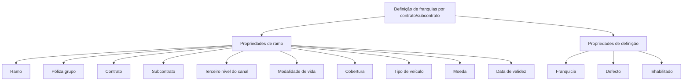

# Definição de Franquias por Contrato/Subcontrato — Estrutura de Propriedades

## 1. Metadados do Documento
- **Arquivo de Origem:** Não identificado
- **Tipo de Documento:** Especificação Funcional
- **Domínio / Sistema:** Definição de franquias; canais de distribuição; Zeus
- **Público-Alvo:** Desenvolvedores, Arquitetos, Analistas Funcionais e Negócio
- **Data/Versão Identificada:** Não identificada

---

## 2. Resumo Executivo & Contexto de Negócio

O documento descreve uma funcionalidade em construção para definição de franquias por contrato e subcontrato. O conteúdo organiza propriedades de ramo e propriedades de definição necessárias para configurar ou identificar uma franquia.

As propriedades de ramo relacionam a definição de franquia a elementos de negócio como ramo, apólice de grupo, contrato, subcontrato, terceiro nível do canal, modalidade de vida, cobertura, tipo de veículo, moeda e data de vigência.

As propriedades de definição incluem a própria franquia, a indicação de franquia por defeito e o estado de inabilitação do registro. O material diferencia explicitamente o valor de negócio de determinados campos de suas descrições funcionais.

O documento não fornece detalhes sobre interfaces, persistência de dados, métodos HTTP, contratos JSON, regras de precedência, cálculos, integrações ou comportamento operacional. A análise mantém essas lacunas explicitamente para evitar inferências não suportadas.

---

## 3. Arquitetura, Componentes & Tecnologias Envolvidas

| Componente / Conceito | Papel identificado |
| :--- | :--- |
| Definição de franquias | Funcionalidade em construção para definição por contrato/subcontrato. |
| Propriedades de ramo | Conjunto de atributos de contexto para a definição de franquia. |
| Propriedades de definição | Conjunto de atributos que caracteriza a configuração de franquia. |
| Canal de distribuição | Estrutura na qual é citado o terceiro nível como fonte de produção. |
| Zeus | Sistema ou ambiente citado na navegação do conteúdo; não há detalhamento técnico. |
| APIs | Referência de navegação; não há APIs, métodos ou contratos especificados. |
| Soluciones / Documentación | Referências de navegação; não há descrição adicional. |



> **Nota de Análise:** O documento cita “APIs”, “Documentación” e “Zeus”, mas não detalha integrações, tecnologias, endpoints, métodos HTTP ou contratos de dados.

---

## 4. Regras de Negócio, Especificações Funcionais & Processos

1. A funcionalidade está identificada como **“EN CONSTRUCCIÓN”**, indicando que a definição de franquias por contrato/subcontrato se encontra em construção.
2. A definição de franquia deve considerar propriedades de ramo e propriedades de definição.
3. As propriedades de ramo mencionadas são:
   - Ramo;
   - Póliza grupo;
   - Contrato;
   - Subcontrato;
   - Terceiro nível do canal;
   - Modalidade de vida;
   - Cobertura;
   - Tipo de veículo;
   - Moeda;
   - Data de validez.
4. O terceiro nível do canal é descrito como o terceiro nível da estrutura de canais de distribuição e como fonte de produção.
5. A modalidade de vida é descrita como modalidade associada a produto comercial.
6. A data de validez corresponde à data de entrada em vigor.
7. As propriedades de definição incluem:
   - Franquicia;
   - Defecto;
   - Inhabilitado.
8. O valor “Defecto” corresponde à franquicia por defecto.
9. O valor “Inhabilitado” corresponde a um registro desativado.

> **Nota de Análise:** O documento não especifica quais propriedades são obrigatórias, quais valores são permitidos, como os campos são validados, nem como resolver conflitos entre múltiplas definições de franquia.

---

## 5. Tabelas de Parâmetros, Ambientes e Estruturas de Dados

| Item / Parâmetro | Descrição / Função | Tipo / Valores / Formato | Ambiente / Observações |
| :--- | :--- | :--- | :--- |
| Ramo | Propriedade de ramo. | `ramo` | Não detalhado. |
| Póliza grupo | Propriedade de ramo. | `póliza grupo` | Não detalhado. |
| Contrato | Propriedade de ramo. | `contrato` | Parte do objetivo de definição por contrato/subcontrato. |
| Subcontrato | Propriedade de ramo. | `subcontrato` | Parte do objetivo de definição por contrato/subcontrato. |
| Tercer nivel del canal | Terceiro nível da estrutura de canais de distribuição; fonte de produção. | `tercer nivel de la estructura de canales de distribución - fuente de producción` | Não detalhado. |
| Modalidad de vida | Modalidade associada a produto comercial. | `modalidad - producto comercial` | Não detalhado. |
| Cobertura | Propriedade de ramo. | `cobertura` | Não detalhado. |
| Tipo de vehículo | Propriedade de ramo. | `tipo de vehículo` | Não detalhado. |
| Moneda | Propriedade de ramo. | `moneda` | Não detalhado. |
| Fecha de validez | Data de entrada em vigor. | `fecha entrada en vigor` | Não detalhado. |
| Franquicia | Propriedade de definição. | `franquicia` | Não detalhado. |
| Defecto | Indica franquia por defeito. | `franquicia por defecto` | Não detalhado. |
| Inhabilitado | Indica registro desativado. | `registro desactivado` | Não detalhado. |
| Zeus | Item citado na navegação. | Não informado | Sem detalhamento técnico. |
| APIs | Item citado na navegação. | Não informado | Sem endpoints ou contratos informados. |

---

## 6. Bateria de Perguntas & Respostas para RAG (FAQ Sintético)

### P1: Qual é o objetivo do documento?
**R:** O objetivo é descrever uma funcionalidade em construção para definição de franquias por contrato e subcontrato, utilizando propriedades de ramo e propriedades de definição.

### P2: Quais propriedades de ramo são citadas para a definição de franquias?
**R:** As propriedades de ramo citadas são ramo, póliza grupo, contrato, subcontrato, terceiro nível do canal, modalidade de vida, cobertura, tipo de veículo, moeda e data de validez.

### P3: O que representa o terceiro nível do canal?
**R:** O terceiro nível do canal representa o terceiro nível da estrutura de canais de distribuição e é identificado como fonte de produção.

### P4: Como a modalidade de vida é caracterizada?
**R:** A modalidade de vida é caracterizada como “modalidad - producto comercial”, ou seja, uma modalidade relacionada a produto comercial.

### P5: Qual é o significado de “Fecha de validez”?
**R:** “Fecha de validez” corresponde à data de entrada em vigor, conforme a descrição “fecha entrada en vigor” apresentada no documento.

### P6: Quais são as propriedades de definição de franquia?
**R:** As propriedades de definição são Franquicia, Defecto e Inhabilitado.

### P7: O que significa a propriedade “Defecto”?
**R:** A propriedade “Defecto” significa “franquicia por defecto”, isto é, franquia por defeito.

### P8: O que significa a propriedade “Inhabilitado”?
**R:** A propriedade “Inhabilitado” significa “registro desactivado”, isto é, um registro desativado.

### P9: O documento define métodos de API ou contratos JSON?
**R:** Não. Embora o conteúdo cite “APIs”, o documento não apresenta métodos HTTP, endpoints, contratos JSON, formatos de requisição ou formatos de resposta.

### P10: O documento especifica regras de validação ou precedência entre contrato e subcontrato?
**R:** Não. O documento informa que a definição é por contrato/subcontrato, mas não detalha regras de validação, obrigatoriedade, precedência, seleção ou resolução de conflitos.

---

## 7. Glossário de Termos, Siglas & Conceitos-Chave

- **Franquicia:** Propriedade de definição identificada como franquia.
- **Defecto:** Propriedade identificada como franquia por defeito.
- **Inhabilitado:** Propriedade que indica registro desativado.
- **Ramo:** Propriedade de ramo.
- **Póliza grupo:** Propriedade de ramo associada a apólice de grupo.
- **Contrato:** Propriedade de ramo usada no contexto da definição de franquia.
- **Subcontrato:** Propriedade de ramo usada no contexto da definição de franquia.
- **Tercer nivel del canal:** Terceiro nível da estrutura de canais de distribuição, identificado como fonte de produção.
- **Modalidad de vida:** Modalidade relacionada a produto comercial.
- **Cobertura:** Propriedade de ramo.
- **Tipo de vehículo:** Propriedade de ramo.
- **Moneda:** Propriedade de ramo.
- **Fecha de validez:** Data de entrada em vigor.
- **Zeus:** Termo citado na navegação, sem definição adicional.
- **APIs:** Termo citado na navegação, sem especificação de interfaces.

---

## 8. Notas Críticas, Riscos & Limitações

- O conteúdo está marcado como **“EN CONSTRUCCIÓN”**.
- Não há identificação de arquivo, autor, data, versão ou sistema proprietário além da referência a Zeus.
- Não há detalhamento de arquitetura técnica, banco de dados, integrações, serviços, APIs ou mecanismos de autenticação.
- Não há definição de tipos de dados, domínios de valores, obrigatoriedade, chaves, regras de precedência ou validações.
- Não há fluxo operacional que descreva criação, alteração, consulta, desativação ou aplicação de uma franquia.
- Não há evidência documental para inferir se “Defecto” é exclusivo, obrigatório ou aplicável por ramo, contrato, subcontrato ou outro atributo.

---

## 9. Conteúdo Bruto Estruturado (Referência Fiel)

```text
--- [PÁGINA 1 DE 2] ---

EN CONSTRUCCIÓN
DEFINICIÓN de franquicias por
contrato/subcontrato
Objetivo
Propiedades de ramo
Propiedades de definición
Propiedades de ramo
Ramo
ramo
Póliza grupo
póliza grupo
Contrato
contrato
Subcontrato
subcontrato
 /
 RS
Inicio Soluciones APIs Documentación Zeus
ES


--- [PÁGINA 2 DE 2] ---

Tercer nivel del canal
tercer nivel de la estructura de canales de distribución - fuente de producción
Modalidad de vida
modalidad - producto comercial
Cobertura
cobertura
Tipo de vehículo
tipo de vehículo
Moneda
moneda
Fecha de validez
fecha entrada en vigor
Propiedades de definición
Franquicia
franquicia
Defecto
franquicia por defecto
Inhabilitado
registro desactivado
```
