# Definição de Franquia — Propriedades, Limites e Cálculo

## 1. Metadados do Documento
- **Arquivo de Origem:** Não identificado — conteúdo bruto fornecido com 6 páginas.
- **Tipo de Documento:** Especificação Funcional.
- **Domínio / Sistema:** Definição de franquias no domínio de seguros.
- **Público-Alvo:** Negócio, analistas funcionais, desenvolvedores e operação.
- **Data/Versão Identificada:** Não identificada.

---

## 2. Resumo Executivo & Contexto de Negócio

O documento especifica as propriedades necessárias para definir uma franquia no contexto de seguros. A franquia pode atender a uma de duas finalidades mutuamente exclusivas: estabelecer a quantia pela qual o segurado responde em caso de sinistro ou limitar as prestações caso ocorram sinistros.

A configuração de franquia permite estabelecer participação do segurado por percentual, importe, dias ou horas. Para tipos monetários, a definição inclui moeda; para tipos temporais, a documentação descreve limites a partir dos quais o segurado assume responsabilidade.

A definição é vinculada a propriedades de ramo, incluindo ramo, modalidade de vida, cobertura, tipo de veículo e data de validade. A data de validade permite manter histórico de alterações na definição. Também existe uma indicação de franquia por defeito, sendo obrigatório haver uma franquia por defeito.

O documento descreve limites mínimo e máximo de franquia, cada um podendo não existir, ser definido sobre a soma assegurada ou ser definido por importe. Adicionalmente, descreve como a franquia deve ser aplicada durante a tramitação de sinistros — sobre o custo ou sobre a soma assegurada.

Por fim, a franquia pode participar do cálculo de prima. O cálculo pode ser realizado pela própria definição ou derivado para conceitos de desagregação. Os tipos de cálculo documentados são tanto por cento, tanto por mil, importe fixo e objeto, sendo este último baseado em lógica de negócio.

---

## 3. Arquitetura, Componentes & Tecnologias Envolvidas

O conteúdo não descreve arquitetura técnica de software, integrações, contratos HTTP, bases de dados, microsserviços ou ambientes de execução. O documento apresenta uma estrutura funcional de configuração de franquias no domínio de seguros.

Os componentes funcionais identificados são:

| Componente / Conceito | Descrição documentada |
| :--- | :--- |
| Definição de franquia | Configuração identificada por uma chave e associada a regras, limites, aplicação em sinistros e cálculo em prima. |
| Tipo de franquia | Tipologia que determina o objetivo coberto pela franquia: percentual, importe, dias ou horas. |
| Propriedades de ramo | Associação da franquia a ramo, modalidade de vida, cobertura, tipo de veículo e data de validade. |
| Propriedades gerais | Incluem franquia por defeito e estado de inabilitação. |
| Franquia mínima | Define o valor mínimo que o segurado deve abonar. |
| Franquia máxima | Define o valor máximo que o segurado deve abonar. |
| Franquia em sinistros | Define se a aplicação na tramitação ocorre sobre o custo ou sobre a soma assegurada. |
| Cálculo em prima | Define como a franquia influencia o cálculo de prima. |
| Lógica de negócio | Mecanismo citado para determinar importe mínimo, importe máximo ou importe de cálculo da franquia. |
| Home Solutions APIs Documentation Zeus | Texto presente no conteúdo bruto, sem detalhamento de função, arquitetura ou integração. |

```mermaid
graph TD
    A[Definição de Franquia] --> B[Chave de identificação]
    A --> C[Tipo de franquia]
    A --> D[Propriedades de ramo]
    A --> E[Propriedades gerais]
    A --> F[Franquia mínima]
    A --> G[Franquia máxima]
    A --> H[Franquia em sinistros]
    A --> I[Cálculo em prima]

    C --> C1[Percentual]
    C --> C2[Importe]
    C --> C3[Dias]
    C --> C4[Horas]

    D --> D1[Ramo]
    D --> D2[Modalidade de vida]
    D --> D3[Cobertura]
    D --> D4[Tipo de veículo]
    D --> D5[Data de validade]

    E --> E1[Franquia por defeito]
    E --> E2[Inabilitada]

    F --> F1[Sem mínimo]
    F --> F2[Sobre a soma assegurada]
    F --> F3[Importe]

    G --> G1[Sem máximo]
    G --> G2[Sobre a soma assegurada]
    G --> G3[Importe]

    H --> H1[Sobre o custo]
    H --> H2[Sobre a soma assegurada]

    I --> I1[Tanto por cento]
    I --> I2[Tanto por mil]
    I --> I3[Importe fixo]
    I --> I4[Objeto]
```



> **Nota de Análise:** O documento não detalha implementação técnica, persistência de dados, serviços, APIs, métodos HTTP, contratos JSON, tecnologias de desenvolvimento ou mecanismos de execução das lógicas de negócio.

---

## 4. Regras de Negócio, Especificações Funcionais & Processos

### 4.1. Objetivos da franquia

Uma franquia pode cobrir duas metas, mas uma franquia somente pode abranger uma delas; portanto, as metas são excludentes:

1. Estabelecer as quantias pelas quais o segurado responde em caso de sinistro. O segurado suportará a totalidade ou parte do custo de um sinistro conforme o importe desse sinistro.
2. Limitar as prestações caso ocorram sinistros.

A franquia pode adicionalmente implicar redução de prima. A forma de alcançar essa redução pode ser definida no próprio apartado de franquia.

### 4.2. Identificação e tipologia da franquia

A definição deve estabelecer uma chave para identificar a franquia. Também deve especificar um tipo de franquia que determina qual objetivo será coberto pela franquia.

Os tipos possíveis são:

- **Percentual:** determina o percentual com o qual o segurado participa para custear o importe do sinistro. Com esta opção, o segurado sempre participa do custo do sinistro.
- **Importe:** especifica o importe com o qual o segurado participa do custo do sinistro.
- **Dias:** determina o limite em dias a partir do qual o segurado se responsabilizará.
- **Horas:** determina o limite em horas a partir do qual o segurado se responsabilizará.

O valor da franquia indica o valor correspondente ao tipo de franquia escolhido. Quando o tipo de franquia é um importe, a moeda deve indicar a moeda em que o valor da franquia é expresso.

### 4.3. Associação a ramo, cobertura e vigência

A definição de franquia possui propriedades de ramo:

1. **Ramo:** aponta para o ramo afetado pela definição.
2. **Modalidade de vida:** determina a modalidade à qual pertence o atributo, somente para ramos com tratamento de vida.
3. **Cobertura:** indica a cobertura à qual a franquia pertence.
4. **Tipo de veículo:** deve ser especificado quando a franquia estiver associada a uma cobertura de ramo com tratamento de automóvel.
5. **Data de validade:** determina quando a definição estará disponível para uso. O uso correto dessa data permite registrar historicamente as alterações efetuadas na definição.

### 4.4. Franquia por defeito e inabilitação

A franquia por defeito indica se uma franquia é aquela que deve ser utilizada como padrão. Deve existir uma franquia por defeito.

A propriedade **Inabilitada** determina se a franquia está ativa ou se não pode mais ser incluída em uma nova apólice. Quando uma franquia é inabilitada:

- As apólices que já possuem a franquia continuam aplicando-a.
- A franquia continua sendo aplicada até que seja modificada por meio de suplemento.
- Após a franquia ser inabilitada, não será possível selecioná-la para uma nova inclusão.

### 4.5. Limite mínimo de franquia

A franquia mínima determina o importe mínimo que o segurado deve abonar. As opções disponíveis são:

- **Sem mínimo:** não existe valor mínimo fixado.
- **Sobre a soma assegurada:** o valor mínimo é fixado sobre a soma assegurada.
- **Importe:** o valor mínimo é um importe.

Quando houver um importe mínimo de franquia, esse importe é expresso na moeda indicada previamente. A lógica de negócio de importe mínimo de franquia determina qual será o importe mínimo.

### 4.6. Limite máximo de franquia

A franquia máxima determina o importe máximo que o segurado deve abonar. As opções disponíveis são:

- **Sem máximo:** não existe valor máximo fixado.
- **Sobre a soma assegurada:** o valor máximo é fixado sobre a soma assegurada.
- **Importe:** o valor máximo é um importe.

Quando houver um importe máximo de franquia, esse importe é expresso na moeda indicada previamente. A lógica de negócio de importe máximo de franquia determina qual será o importe máximo.

### 4.7. Aplicação da franquia em sinistros

O tipo de franquia em sinistros determina o comportamento durante a tramitação de sinistros:

- **Sobre o custo:** na tramitação, a franquia é aplicada sobre o custo.
- **Sobre a soma assegurada:** na tramitação, a franquia é aplicada sobre a soma assegurada.

### 4.8. Cálculo em prima

O cálculo em prima pode ser realizado segundo a definição apresentada no documento ou pode ser derivado para conceitos de desagregação. Quando derivado para conceitos de desagregação, a definição apresentada não é aplicada.

O resultado do cálculo pode ter sinal positivo (`+`) ou negativo (`-`).

Os tipos de cálculo da franquia são:

- **Tanto por cento:** o importe correspondente à franquia é calculado por percentual aplicado sobre a soma assegurada.
- **Tanto por mil:** o importe correspondente à franquia é calculado por tanto por mil aplicado sobre a soma assegurada.
- **Importe fixo:** o importe correspondente à franquia é um importe.
- **Objeto:** o importe correspondente à franquia é calculado por uma lógica de negócio.

A taxa de cálculo indica o tanto por cento ou tanto por mil, conforme o tipo de cálculo selecionado. O campo importe indica o importe correspondente ao tipo de cálculo escolhido. A lógica de negócio para cálculo da franquia determina o importe correspondente à franquia.

---

## 5. Tabelas de Parâmetros, Ambientes e Estruturas de Dados

| Item / Parâmetro | Descrição / Função | Tipo / Valores / Formato | Ambiente / Observações |
| :--- | :--- | :--- | :--- |
| Franquia | Chave de identificação da franquia. | Chave. | O formato da chave não é detalhado. |
| Tipo de franquia | Define a tipologia e o objetivo coberto pela franquia. | Percentual; Importe; Dias; Horas. | Os objetivos de franquia são excludentes. |
| Valor da franquia | Informa o valor do tipo de franquia escolhido. | Valor conforme o tipo selecionado. | Sem formato ou validação documentados. |
| Moeda | Indica a moeda em que o valor da franquia é expresso. | Moeda. | Aplicável quando o tipo de franquia é importe. |
| Ramo | Aponta para o ramo afetado pela definição. | Não detalhado. | Propriedade de ramo. |
| Modalidade de vida | Determina a modalidade à qual pertence o atributo. | Não detalhado. | Somente para ramos com tratamento de vida. |
| Cobertura | Indica a cobertura à qual a franquia pertence. | Não detalhado. | Propriedade de ramo. |
| Tipo de veículo | Define o tipo de veículo com franquia associada. | Não detalhado. | Obrigatório quando associado a cobertura de ramo com tratamento de automóvel. |
| Data de validade | Define quando a definição pode ser usada. | Data. | Permite histórico de alterações na definição. |
| Franquia por defeito | Indica se a franquia deve ser usada como padrão. | Indicador lógico não detalhado. | Deve existir uma franquia por defeito. |
| Inabilitada | Define se a franquia está ativa ou não pode ser incluída em nova apólice. | Indicador lógico não detalhado. | Não interrompe a aplicação nas apólices existentes. |
| Tipo de franquia mínima | Define como o mínimo devido pelo segurado é determinado. | Sem mínimo; Sobre a soma assegurada; Importe. | Propriedade de importe mínimo. |
| Importe mínimo de franquia | Define o importe mínimo devido pelo segurado. | Importe monetário. | Expresso na moeda indicada previamente. |
| Lógica de negócio de importe mínimo | Determina o importe mínimo de franquia. | Lógica de negócio. | Implementação não detalhada. |
| Tipo de franquia máxima | Define como o máximo devido pelo segurado é determinado. | Sem máximo; Sobre a soma assegurada; Importe. | Propriedade de importe máximo. |
| Importe máximo de franquia | Define o importe máximo devido pelo segurado. | Importe monetário. | Expresso na moeda indicada previamente. |
| Lógica de negócio de importe máximo | Determina o importe máximo de franquia. | Lógica de negócio. | Implementação não detalhada. |
| Tipo de franquia em sinistros | Define a base de aplicação da franquia na tramitação do sinistro. | Sobre o custo; Sobre a soma assegurada. | Propriedade de franquia em sinistros. |
| Cálculo em prima | Define se o cálculo usa a definição ou é derivado para conceitos de desagregação. | Conforme definição ou derivado. | O resultado pode ter sinal positivo ou negativo. |
| Tipo de cálculo | Determina como o importe da franquia é calculado. | Tanto por cento; Tanto por mil; Importe fixo; Objeto. | Propriedade de cálculo. |
| Taxa de cálculo | Indica o tanto por cento ou tanto por mil. | Taxa. | Aplicável conforme tipo de cálculo escolhido. |
| Importe de cálculo | Indica o importe correspondente ao tipo de cálculo. | Importe. | Sem formato detalhado. |
| Lógica de negócio para cálculo da franquia | Determina o importe correspondente à franquia. | Lógica de negócio. | Referenciada como `{#nom_prg_calculo}` no conteúdo bruto. |

> **Nota de Análise:** O documento não apresenta servidores, URLs, portas, credenciais, nomes de ambientes, rotas de logs, contratos de dados ou campos técnicos adicionais.

---

## 6. Bateria de Perguntas & Respostas para RAG (FAQ Sintético)

### P1: Quais são os objetivos que uma franquia pode cobrir?
**R:** Uma franquia pode estabelecer as quantias pelas quais o segurado responde em caso de sinistro ou limitar as prestações quando ocorrerem sinistros. Uma franquia somente pode abranger uma dessas metas, pois elas são excludentes.

### P2: Quais tipos de franquia estão disponíveis na definição?
**R:** Os tipos documentados são percentual, importe, dias e horas. O tipo percentual define a participação do segurado como percentual do importe do sinistro; o tipo importe define uma quantia; os tipos dias e horas definem limites temporais a partir dos quais o segurado se responsabiliza.

### P3: O que acontece quando o tipo de franquia é percentual?
**R:** Quando o tipo de franquia é percentual, o percentual determina a participação do segurado no custeio do importe do sinistro. O documento afirma que, com essa opção, o segurado sempre participa do custo do sinistro.

### P4: Quando a moeda deve ser informada na definição de franquia?
**R:** A moeda deve indicar a moeda em que a propriedade valor da franquia será expressa quando o tipo de franquia for importe.

### P5: Como a data de validade é utilizada na definição de franquia?
**R:** A data de validade determina quando uma definição de franquia estará disponível para uso. O uso correto permite manter um registro histórico das alterações efetuadas na definição.

### P6: Existe obrigatoriedade de uma franquia padrão?
**R:** Sim. A propriedade franquia por defeito indica se a franquia deve ser utilizada como padrão, e o documento estabelece que deve existir uma franquia por defeito.

### P7: O que acontece com as apólices existentes quando uma franquia é inabilitada?
**R:** A inabilitação impede que a franquia seja incluída em uma nova apólice, mas não interrompe sua aplicação nas apólices que já a possuem. Essas apólices continuam aplicando a franquia até que ela seja alterada por meio de suplemento.

### P8: Quais opções existem para configurar a franquia mínima?
**R:** A franquia mínima pode ser configurada como sem mínimo, sobre a soma assegurada ou importe. Sem mínimo significa que não existe valor mínimo fixado; sobre a soma assegurada fixa o mínimo sobre a soma assegurada; importe define o mínimo como uma quantia.

### P9: Como a franquia máxima pode ser configurada?
**R:** A franquia máxima pode ser sem máximo, sobre a soma assegurada ou importe. Sem máximo significa que não existe valor máximo fixado; sobre a soma assegurada fixa o máximo sobre a soma assegurada; importe define o máximo como uma quantia.

### P10: Sobre quais bases a franquia pode ser aplicada durante a tramitação de sinistros?
**R:** A franquia pode ser aplicada sobre o custo ou sobre a soma assegurada. A opção sobre o custo aplica a franquia ao custo durante a tramitação; a opção sobre a soma assegurada aplica a franquia sobre a soma assegurada.

### P11: Quais são os tipos de cálculo de franquia em prima?
**R:** Os tipos de cálculo são tanto por cento, tanto por mil, importe fixo e objeto. Tanto por cento aplica um percentual sobre a soma assegurada; tanto por mil aplica um tanto por mil sobre a soma assegurada; importe fixo utiliza um importe; objeto utiliza uma lógica de negócio.

### P12: O resultado do cálculo em prima pode diminuir a prima?
**R:** Sim. O documento informa que o resultado do cálculo pode ter sinal positivo (`+`) ou negativo (`-`). Além disso, informa que uma franquia pode implicar redução de prima, cuja forma de obtenção pode ser definida no próprio apartado.

---

## 7. Glossário de Termos, Siglas & Conceitos-Chave

- **Franquia:** Configuração que estabelece a participação do segurado em sinistro ou limita prestações em caso de sinistro.
- **Segurado:** Parte que pode suportar a totalidade ou parte do custo de um sinistro, dependendo da configuração da franquia.
- **Sinistro:** Evento para o qual o documento descreve aplicação de custos, limites e franquia.
- **Importe:** Quantia utilizada para participação do segurado, limites mínimo ou máximo e cálculo de franquia.
- **Ramo:** Propriedade à qual a definição de franquia aponta; o documento não detalha sua classificação ou estrutura.
- **Modalidade de vida:** Modalidade aplicável somente a ramos com tratamento de vida.
- **Cobertura:** Cobertura à qual uma franquia pertence.
- **Soma assegurada:** Base utilizada para calcular ou aplicar determinados tipos de franquia.
- **Franquia por defeito:** Franquia indicada para uso padrão; deve existir uma franquia por defeito.
- **Inabilitada:** Estado em que a franquia não pode ser incluída em nova apólice, mas permanece aplicada às apólices existentes até alteração por suplemento.
- **Suplemento:** Mecanismo citado para alterar a franquia aplicada a uma apólice existente; o documento não detalha seu processo.
- **Cálculo em prima:** Cálculo relacionado à prima que pode seguir a definição de franquia ou ser derivado para conceitos de desagregação.
- **Tanto por cento:** Tipo de cálculo que aplica percentual sobre a soma assegurada.
- **Tanto por mil:** Tipo de cálculo que aplica taxa por mil sobre a soma assegurada.
- **Objeto:** Tipo de cálculo cujo importe é determinado por lógica de negócio.
- **Home Solutions APIs Documentation Zeus:** Texto presente no documento sem definição ou contexto adicional.

---

## 8. Notas Críticas, Riscos & Limitações

- O documento não identifica nome de arquivo, autoria, data, versão, sistema proprietário ou ambiente operacional.
- Não são descritas APIs, serviços, microsserviços, endpoints, tecnologias, bases de dados, autenticação, permissões ou mecanismos de integração.
- As lógicas de negócio para importe mínimo, importe máximo e cálculo de franquia são citadas, mas não possuem detalhamento de regras, fórmulas, contratos de entrada, contratos de saída ou implementação.
- O documento não informa validações para chave da franquia, valores monetários, moedas, datas, taxa de cálculo, coexistência entre limites mínimos e máximos ou consistência entre tipos de franquia.
- O texto afirma que deve existir uma franquia por defeito, mas não detalha como garantir unicidade, prioridade ou comportamento quando houver mais de uma franquia marcada como padrão.
- O termo `Home Solutions APIs Documentation Zeus` aparece como rodapé ou referência no conteúdo, sem informação suficiente para inferir relação técnica com a definição de franquia.
- A referência `{#nom_prg_calculo}` é apresentada para lógica de negócio do cálculo de franquia, mas não há definição do identificador, programa ou mecanismo correspondente.

---

## 9. Conteúdo Bruto Estruturado (Referência Fiel)

```text
--- [PÁGINA 1 DE 6] ---

DEFINICIÓN de Franquicia
Objetivo
Pueden cubrir dos metas, aunque una franquicia solo puede abarcar una de ellas. Esto quiere decir
que son excluyentes:
1. Establecen las cantidades por las que el asegurado responde en caso de siniestro. Es decir, el
asegurado soportará la totalidad o parte del coste de un siniestro dependiendo del importe de
este.
1. Limitar las prestaciones en caso que se produzcan
Adicionalmente, la franquicia puede conllevar una reducción de la prima y el como llegar a esta
reducción puede ser definida en este mismo apartado.
Propiedades de definición
Propiedades de ramo
Propiedades generales
Propiedades de franquicia mínima
Propiedades de franquicia máxima
Ejemplo:
Ejemplo:
 / 
 CF
Home Solutions APIs Documentation Zeus
EN


--- [PÁGINA 2 DE 6] ---

Propiedades de franquicia en siniestros
Propiedades de cálculo
Propiedades de definición
Franquicia
Se establece la clave con la que se va a identificar la franquicia.
Tipo de franquicia
Se especifica la tipología que marcará cual es el objetivo que cubrirá la franquicia. Los valores
posibles son:
Porcentaje
Importe
Días
Horas
Porcentaje
Determina el porcentaje con el que el asegurado participará para costear el importe del siniestro.
Con esta opción, el asegurado siempre va a participar en el coste del siniestro.
Importe
Especifica el importe con el que el asegurado participará en el coste del siniestro.
Días
Determina el límite en días a partir del cual el asegurado se hará cargo
Horas
Ejemplo:
Ejemplo:
Ejemplo:


--- [PÁGINA 3 DE 6] ---

Determina el límite en horas a partir del cual el asegurado se hará cargo
Valor de la franquicia*
Indica el valor del tipo de franquicia elegido.
Moneda
Moneda en la que estará expresada la propiedad Valor de la franquicia cuando el tipo de franquicia
es un importe.
Propiedades de ramo
Ramo
Apunta al ramo al que afecta esta definición.
Modalidad de vida
Determina la modalidad (solo para ramos con tratamiento de vida) a la que pertenece el atributo.
Cobertura
Cobertura a la que pertenece.
Tipo de vehículo
En el caso que la franquicia se esté asociando a una cobertura de un ramo con tratamiento de
automóvil, se debe especificar además, el tipo de vehículo que dispondrá de la franquicia.
Fecha de validez
Determina cuando la definición estará disponible para ser utilizada. Su correcto uso permite tener un
registro histórico de los cambios efectuados en la definición.
Propiedades generales
Franquicia por defecto
Indica si la franquicia es la que se debe utilizar como defecto. Debe existir una franquicia por defecto.
Ejemplo:
Ejemplo:


--- [PÁGINA 4 DE 6] ---

Inhabilitada
En este punto se determina si está activa o por el contrario ya no puede ser incluida en una nueva
póliza. Es importante destacar que, aunque se inhabilite, todas las pólizas que dispongan de ella,
seguirá aplicándose hasta que mediante un suplemento se cambie. En ese momento, al estar
inhabilitada ya no será posible seleccionarlo.
Propiedades de importe mínimo de franquicia
Tipo de franquicia mínima
La franquicia mínima intenta determinar cual será el importe mínimo que deberá abonar el
asegurado. Existe las siguientes opciones:
Sin mínimo
Sobre la suma asegurada
Importe
Sin mínimo
No existe un valor mínimo fijado
Sobre la suma asegurada
El valor mínimo se fija sobre la suma asegurada
Importe
El valor mínimo es un importe
Importe mínimo de franquicia
En este punto se indica cual es el importe mínimo expresado en la moneda indicada previamente.
Lógica de negocio de importe mínimo de franquicia
Esta lógica se encarga de determinar cual es el importe mínimo.
Propiedades de importe máximo de franquicia
Tipo de franquicia máxima
La franquicia máxima intenta determinar cual será el importe máximo que deberá abonar el
asegurado. Existe las siguientes opciones:
Sin máximo


--- [PÁGINA 5 DE 6] ---

Sobre la suma asegurada
Importe
Sin máximo
No existe un valor máximo fijado
Sobre la suma asegurada
El valor máximo se fija sobre la suma asegurada
Importe
El valor máximo es un importe
Importe máximo de franquicia
En este punto se indica cual es el importe máximo expresado en la moneda indicada previamente.
Lógica de negocio de importe máximo de franquicia
Esta lógica se encarga de determinar cual es el importe máximo.
Propiedades de franquicia en siniestros
Tipo de franquicia en siniestros
En este punto se determina como será el comportamiento en siniestros.
Sobre el coste
Sobre la suma asegurada
Sobre el coste
En la tramitación se aplicará la franquicia sobre el coste.
Sobre la suma asegurada
En la tramitación se aplicará la franquicia sobre la suma asegurada.
Propiedades de cálculo
Cálculo en prima
El cálculo sobre se realiza según la definición que se muestra a continuación, o, por el contrario, el
cálculo se deriva a los conceptos de desglose por lo que no aplicará la definición que se muestra a


--- [PÁGINA 6 DE 6] ---

continuación. El resultado del cálculo puede ser tanto con signo positivo (+), como negativo (-).
Tipo de cálculo
A continuación se muestran las posibilidades a la hora de realizar el cálculo correspondiente a la
franquicia
Tanto por ciento
Tanto por mil
Importe fijo
Objeto
Tanto por ciento El cálculo del importe correspondiente a la franquicia se hallará mediante un
porcentaje que se aplicará sobre la suma asegurada
Tanto por mil El cálculo del importe correspondiente a la franquicia se hallará mediante un tanto
por mil que se aplicará sobre la suma asegurada
Importe fijo El cálculo del importe correspondiente a la franquicia será un importe
Objeto El cálculo del importe correspondiente a la franquicia se hallará mediante una lógica de
negocio
Tasa de cálculo
Se indica el tanto por ciento o tanto por mil dependiendo del tipo de cálculo elegido.
Importe
Se indica el importe que corresponde con el tipo de cálculo elegido.
Lógica de negocio para el cálculo de la franquicia {#nom_prg_calculo})
Esta lógica de negocio determinará cual es el importe correspondiente a la franquicia
```
