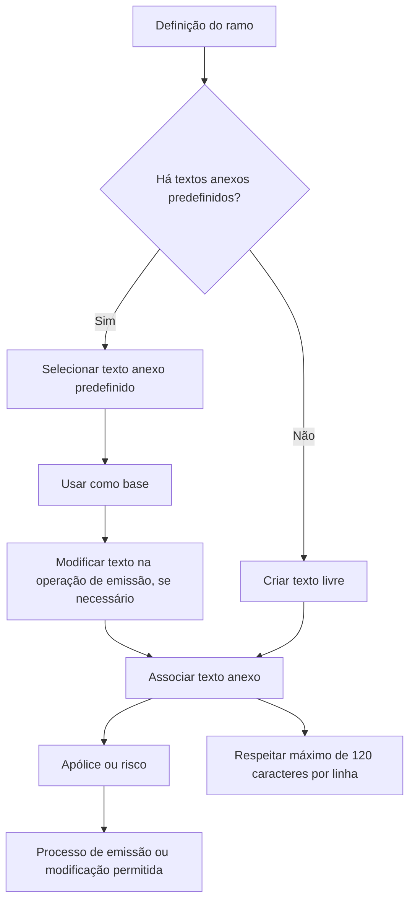

# Definição de Textos Anexos para Apólices e Riscos de Seguro

## 1. Metadados do Documento
- **Arquivo de Origem:** `Não identificado — texto bruto fornecido na solicitação`
- **Tipo de Documento:** `Especificação Funcional`
- **Domínio / Sistema:** `Seguro — emissão e modificações de apólices ou riscos`
- **Público-Alvo:** `Negócio, analistas funcionais, desenvolvedores e operação`
- **Data/Versão Identificada:** `Não identificada`

---

## 2. Resumo Executivo & Contexto de Negócio

O documento define o conceito de **texto anexo** no contexto de seguros. Um texto anexo pode ser associado a uma apólice ou a um risco durante o processo de emissão ou durante modificações que permitam a inclusão de textos anexos.

A finalidade do texto anexo é esclarecer conceitos ou registrar aspectos específicos que afetem as condições do seguro. O documento caracteriza o conteúdo como texto livre, mas admite a existência de textos anexos predefinidos quando essa possibilidade estiver configurada na definição do ramo de seguro.

Textos anexos predefinidos podem ser utilizados como base em operações de emissão e posteriormente modificados. Cada texto anexo possui uma chave identificadora, uma descrição associada, um idioma e a redação do próprio texto.

A principal restrição técnica identificada é estrutural: cada linha do texto anexo pode conter no máximo **120 caracteres**. Portanto, textos que excedam esse limite devem ser criados em múltiplas linhas.

---

## 3. Arquitetura, Componentes & Tecnologias Envolvidas

O conteúdo fornecido não descreve arquitetura de software, microsserviços, tecnologias, APIs, contratos HTTP, bancos de dados ou ambientes técnicos. O documento apresenta exclusivamente um fluxo funcional de associação e manutenção de textos anexos em operações de seguro.

Componentes funcionais identificados:

| Componente | Descrição |
| :--- | :--- |
| Texto anexo | Texto utilizado para esclarecer um conceito ou indicar aspecto específico que afete condições do seguro. |
| Apólice | Entidade à qual o texto anexo pode ser associado. |
| Risco | Entidade à qual o texto anexo pode ser associado. |
| Processo de emissão | Operação na qual um texto anexo pode ser associado. |
| Modificações | Operações que podem permitir a inclusão de textos anexos. |
| Definição do ramo | Configuração que pode estabelecer a disponibilidade de textos anexos predefinidos. |
| Texto anexo predefinido | Texto-base identificado por chave e descrição, passível de ser modificado em operações de emissão. |



> **Nota de Análise:** O documento não detalha interfaces, persistência, métodos de integração, regras de autorização, APIs ou tecnologias responsáveis pela gestão de textos anexos.

---

## 4. Regras de Negócio, Especificações Funcionais & Processos

### 4.1 Finalidade do texto anexo

1. O texto anexo pode ser associado a uma **apólice** ou a um **risco**.
2. A associação pode ocorrer no processo de **emissão**.
3. A associação também pode ocorrer em modificações que permitam textos anexos.
4. O texto anexo é utilizado para:
   - esclarecer algum conceito;
   - indicar algum aspecto específico;
   - registrar conteúdo que afete as condições do seguro.

### 4.2 Textos livres e textos predefinidos

1. O documento classifica o texto anexo como texto livre.
2. A definição do ramo pode estabelecer textos anexos predefinidos.
3. Quando existirem, os textos anexos predefinidos podem ser utilizados como base.
4. Os textos anexos predefinidos utilizados como base podem ser modificados nas operações de emissão.

### 4.3 Propriedades gerais do texto anexo

1. **Anexo:** chave que identifica o texto anexo predefinido.
2. **Descrição do anexo:** título associado à chave identificadora do texto anexo predefinido.
3. **Idioma:** propriedade que identifica o idioma no qual o texto está definido; os exemplos citados são espanhol, inglês e turco.
4. **Texto anexo:** redação do conteúdo anexo.

### 4.4 Restrição de comprimento

1. A definição do texto anexo possui limite máximo de **120 caracteres por linha**.
2. Quando o conteúdo total do texto anexo exceder 120 caracteres, devem ser criadas tantas linhas quanto forem necessárias para completar o texto.

---

## 5. Tabelas de Parâmetros, Ambientes e Estruturas de Dados

| Item / Parâmetro | Descrição / Função | Tipo / Valores / Formato | Ambiente / Observações |
| :--- | :--- | :--- | :--- |
| Anexo | Chave que identifica um texto anexo predefinido. | Chave identificadora; formato não especificado. | Aplicável a textos anexos predefinidos. |
| Descrição do anexo | Título associado à chave de identificação do texto anexo predefinido. | Texto; tamanho não especificado. | Associada ao campo Anexo. |
| Idioma | Identifica o idioma no qual o texto está definido. | Exemplos: espanhol, inglês, turco. | O conjunto completo de idiomas não é especificado. |
| Texto anexo | Redação do conteúdo anexo. | Texto livre, dividido em linhas quando necessário. | Pode ser usado para esclarecer conceitos ou indicar aspectos que afetem condições do seguro. |
| Limite por linha | Limite de caracteres para cada linha do texto anexo. | Máximo de 120 caracteres por linha. | Devem ser criadas múltiplas linhas para conteúdos maiores. |
| Apólice | Entidade que pode receber associação de texto anexo. | Não especificado. | Associação possível durante emissão ou modificações permitidas. |
| Risco | Entidade que pode receber associação de texto anexo. | Não especificado. | Associação possível durante emissão ou modificações permitidas. |
| Definição do ramo | Definição que pode determinar a existência de textos anexos predefinidos. | Não especificado. | Não são descritos critérios, telas ou configuração técnica. |

---

## 6. Bateria de Perguntas & Respostas para RAG (FAQ Sintético)

### P1: O que é um texto anexo no contexto de seguros?
**R:** Um texto anexo é um conteúdo que pode ser associado a uma apólice ou a um risco para esclarecer algum conceito ou indicar algum aspecto específico que afete as condições do seguro.

### P2: Em quais operações um texto anexo pode ser associado?
**R:** Um texto anexo pode ser associado no processo de emissão e nas modificações que permitam textos anexos. O documento não especifica quais tipos de modificação são permitidos.

### P3: Um texto anexo precisa obrigatoriamente ser predefinido?
**R:** Não. O documento informa que o texto anexo é texto livre. Entretanto, a definição do ramo pode estabelecer textos predefinidos que podem ser usados como base.

### P4: O que acontece quando existe um texto anexo predefinido?
**R:** Quando a definição do ramo especificar textos anexos predefinidos, esses textos podem ser utilizados como base nas operações de emissão e podem ser modificados durante essas operações.

### P5: Qual propriedade identifica um texto anexo predefinido?
**R:** A propriedade **Anexo** é a chave que identifica o texto anexo predefinido.

### P6: Qual é a função da descrição do anexo?
**R:** A **Descrição do anexo** contém o título associado à chave que identifica o texto anexo predefinido.

### P7: Como o idioma é tratado em um texto anexo?
**R:** A propriedade **Idioma** identifica o idioma no qual o texto está definido. O documento apresenta como exemplos espanhol, inglês e turco.

### P8: Qual é a limitação de tamanho do texto anexo?
**R:** O texto anexo possui limite máximo de 120 caracteres por linha. Para redigir conteúdos maiores, devem ser criadas tantas linhas quanto forem necessárias.

### P9: O limite de 120 caracteres se aplica ao texto inteiro ou a cada linha?
**R:** O limite se aplica a cada linha do texto anexo. O documento determina máximo de 120 caracteres por linha, permitindo múltiplas linhas para completar o conteúdo.

### P10: O documento informa quais métodos HTTP ou contratos JSON são usados para textos anexos?
**R:** Não. O conteúdo fornecido não detalha métodos HTTP, contratos JSON, APIs, tecnologias, endpoints ou integrações técnicas para a gestão de textos anexos.

---

## 7. Glossário de Termos, Siglas & Conceitos-Chave

- **Anexo:** Chave que identifica o texto anexo predefinido.
- **Apólice:** Entidade de seguro à qual um texto anexo pode ser associado.
- **Definição do ramo:** Definição do ramo de seguro que pode estabelecer textos anexos predefinidos.
- **Descrição do anexo:** Título associado à chave identificadora do texto anexo predefinido.
- **Idioma:** Propriedade que identifica o idioma em que o texto anexo está definido.
- **Modificação:** Operação que pode permitir a associação de um texto anexo.
- **Risco:** Entidade de seguro à qual um texto anexo pode ser associado.
- **Texto anexo:** Redação usada para esclarecer conceitos ou indicar aspectos que afetem condições do seguro.
- **Texto anexo predefinido:** Texto estabelecido na definição do ramo, utilizado como base e passível de modificação em operações de emissão.

---

## 8. Notas Críticas, Riscos & Limitações

- O documento não identifica o arquivo de origem, versão, data, autor ou proprietário funcional.
- O documento não especifica quais ramos de seguro suportam textos anexos predefinidos.
- O documento não define o formato da chave **Anexo**, nem regras de unicidade, obrigatoriedade ou ciclo de vida.
- O documento não estabelece se a alteração de um texto predefinido preserva vínculo com a chave original.
- O documento não detalha validações para idioma, caracteres permitidos, quantidade máxima de linhas ou tamanho máximo total do texto anexo.
- O documento não apresenta regras de autorização, auditoria, versionamento, persistência ou aprovação de alterações.
- O documento não descreve arquitetura técnica, APIs, métodos HTTP, contratos JSON, ambientes, URLs, logs ou integrações.
- **Nota de Análise:** O conteúdo recebido contém menções de navegação como “Inicio Soluciones APIs Documentación Zeus” e “ES”, mas não apresenta detalhamento suficiente para classificá-las como sistemas, módulos ou URLs.

---

## 9. Conteúdo Bruto Estruturado (Referência Fiel)

```text
--- [PÁGINA 1 DE 2] ---

DEFINICIÓN de textos anexos
Objetivo
Se trata de un texto que, según la definición del ramo, puede asociarse a la póliza o al riesgo, en el
propio proceso de emisión o en aquellas modificaciones que permitan textos anexos, con el fin de
aclarar algún concepto o indicar algún aspecto específico que afecte a las condiciones del seguro.
Aunque es un texto libre, en algunos casos, se pueden establecer textos predefinidos, si así se
especifica en la definición del ramo, que podrán tomarse como base y modificarse en las operaciones
de emisión.
Propiedades generales
Propiedades generales
Anexo
Clave que identifica el texto anexo predefinido.
Descripción del anexo
Contiene el título asociado a la clave que identifica el texto anexo predefinido.
Idioma
Esta propiedad identifica el idioma en el que está definido el texto, como por ejemplo español, inglés,
turco,...
 /
 RS
Inicio Soluciones APIs Documentación Zeus
ES


--- [PÁGINA 2 DE 2] ---

Texto anexo
Contiene la redacción del texto anexo.
La definición de este texto tiene una limitación de 120 caracteres como máximo por línea, por lo que
se deben crear tantas líneas como sean necesarias para completar el texto del anexo.
```
