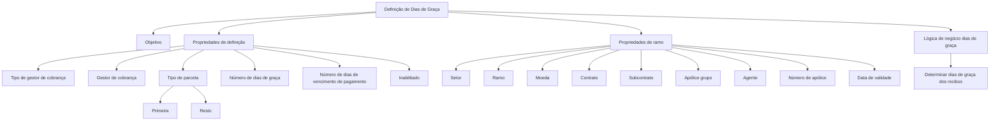

# Definição de Dias de Graça — Propriedades de Definição e Ramo

## 1. Metadados do Documento
- **Arquivo de Origem:** `Não identificado`
- **Tipo de Documento:** `Especificação Técnica`
- **Domínio / Sistema:** `Definição de Dias de Graça`
- **Público-Alvo:** `Negócio, Analistas Funcionais, Desenvolvedores e Operação`
- **Data/Versão Identificada:** `Não identificada`

---

## 2. Resumo Executivo & Contexto de Negócio

O conteúdo apresenta a definição de **Dias de graça**, incluindo o objetivo da definição, propriedades de configuração e uma referência à lógica de negócio usada para determinar dias de graça de recibos.

A configuração é organizada em dois grupos: **Propriedades de definição** e **Propriedades de ramo**. As propriedades de definição incluem tipo e gestor de cobrança, tipo de parcela, número de dias de graça, número de dias de vencimento de pagamento e o indicador de inabilitação do registro.

As propriedades de ramo descrevem critérios de segmentação associados a setor, ramo, moeda, contrato, subcontrato, apólice de grupo, agente, número de apólice e data de validade. O documento não descreve como esses critérios são combinados, priorizados ou validados.

O conteúdo menciona uma lógica de negócio para determinar os dias de graça de recibos, mas não fornece fórmulas, condições de decisão, exemplos de cálculo, métodos HTTP, contratos JSON, persistência ou fluxos operacionais detalhados.

---

## 3. Arquitetura, Componentes & Tecnologias Envolvidas

O documento não identifica tecnologias, microsserviços, bancos de dados, APIs, ambientes técnicos, URLs específicas ou ferramentas de implantação. São exibidos os termos de navegação **Inicio**, **Soluciones**, **APIs**, **Documentación** e **Zeus**, sem detalhamento de função técnica.

O diagrama abaixo representa somente a estrutura conceitual explicitamente indicada pelo conteúdo.



> **Nota de Análise:** O conteúdo cita “APIs” e “Zeus”, mas não detalha interfaces, serviços, responsabilidades, protocolos ou integração entre esses elementos.

---

## 4. Regras de Negócio, Especificações Funcionais & Processos

1. A definição de dias de graça possui um objetivo, porém o conteúdo não informa textualmente qual é esse objetivo.
2. Existe uma seção denominada **Lógica de negócio dias de graça**.
3. A lógica de negócio é descrita como destinada a determinar os dias de graça dos recibos.
4. O tipo de parcela possui as opções:
   - **(1) Primera**
   - **(2) Resto**
5. O número de dias de graça é associado ao conceito de número de dias de vencimento de pagamento.
6. O estado **Inhabilitado** é descrito como **registro desactivado**.
7. As propriedades de ramo incluem dimensões de classificação ou seleção: setor, ramo, moeda, contrato, subcontrato, apólice de grupo, agente, número de apólice e data de validade.
8. O conteúdo não informa:
   - Fórmula de cálculo dos dias de graça.
   - Critérios para seleção entre “Primera” e “Resto”.
   - Precedência entre propriedades de ramo.
   - Regras de validação de campos.
   - Comportamento de registros inabilitados no cálculo.
   - Relação entre gestor de cobrança e dias de graça.
   - Formatos, obrigatoriedade ou domínio de valores dos campos.

---

## 5. Tabelas de Parâmetros, Ambientes e Estruturas de Dados

| Item / Parâmetro | Descrição / Função | Tipo / Valores / Formato | Ambiente / Observações |
| :--- | :--- | :--- | :--- |
| Objetivo | Objetivo da definição de dias de graça. | Não detalhado. | O conteúdo apenas exibe o rótulo “Objetivo”. |
| Tipo de gestor de cobrança | Propriedade de definição relacionada ao tipo de gestor. | Não detalhado. | Apresentado como “Tipo de gestor de cobro”. |
| Gestor de cobrança | Propriedade de definição relacionada ao gestor. | Não detalhado. | Apresentado como “Gestor de cobro”. |
| Tipo de parcela | Classificação da parcela. | `(1) Primera`; `(2) Resto`. | Não há regra de seleção informada. |
| Número de dias de graça | Número de dias de graça. | Não detalhado. | Relacionado no conteúdo a “número de dias vencimento de pago”. |
| Número de dias de vencimento de pagamento | Número de dias de vencimento de pagamento. | Não detalhado. | Não há fórmula ou relação operacional detalhada. |
| Lógica de negócio de dias de graça | Lógica para determinar os dias de graça dos recibos. | Não detalhado. | Não há condições, algoritmo ou exemplos. |
| Inabilitado | Indicador de desativação do registro. | “registro desactivado”. | O efeito no processamento não é detalhado. |
| Setor | Propriedade de ramo. | Não detalhado. | Apresentado como “Sector”. |
| Ramo | Propriedade de ramo. | Não detalhado. | Apresentado como “Ramo”. |
| Moeda | Propriedade de ramo. | Não detalhado. | Apresentado como “Moneda”. |
| Contrato | Propriedade de ramo. | Não detalhado. | Sem regras adicionais. |
| Subcontrato | Propriedade de ramo. | Não detalhado. | Sem regras adicionais. |
| Apólice grupo | Propriedade de ramo. | Não detalhado. | Apresentado como “Póliza grupo”. |
| Agente | Propriedade de ramo. | Não detalhado. | Sem regras adicionais. |
| Número de apólice | Propriedade de ramo. | Não detalhado. | Também apresentado como “numero de poliza”. |
| Data de validade | Data de entrada em vigor. | Não detalhado. | Apresentado como “Fecha de validez” e “fecha entrada en vigor”. |
| Inicio | Item de navegação exibido. | Texto. | Sem detalhamento funcional. |
| Soluciones | Item de navegação exibido. | Texto. | Sem detalhamento funcional. |
| APIs | Item de navegação exibido. | Texto. | Não há especificações de APIs. |
| Documentación | Item de navegação exibido. | Texto. | Sem detalhamento funcional. |
| Zeus | Termo exibido na navegação. | Texto. | Papel não identificado. |
| ES | Indicador exibido na navegação. | Texto. | Possível referência a idioma, mas não detalhada. |

---

## 6. Bateria de Perguntas & Respostas para RAG (FAQ Sintético)

### P1: Qual é a finalidade da lógica de negócio de dias de graça?
**R:** A lógica de negócio de dias de graça é descrita como uma lógica destinada a determinar os dias de graça dos recibos. O documento não apresenta algoritmo, fórmula, critérios de decisão ou exemplos desse cálculo.

### P2: Quais opções de tipo de parcela são apresentadas?
**R:** O conteúdo apresenta duas opções para tipo de parcela: **(1) Primera** e **(2) Resto**. Não há detalhamento sobre o significado operacional dessas opções nem sobre quando cada uma deve ser utilizada.

### P3: Quais propriedades fazem parte da definição de dias de graça?
**R:** As propriedades de definição citadas são tipo de gestor de cobrança, gestor de cobrança, tipo de parcela, número de dias de graça, número de dias de vencimento de pagamento e inabilitado.

### P4: O que significa o indicador “Inhabilitado”?
**R:** O conteúdo associa “Inhabilitado” à descrição “registro desactivado”. O documento não especifica se um registro desativado deixa de participar do cálculo, deixa de ser exibido ou possui outro comportamento.

### P5: Quais critérios de ramo são listados para a definição de dias de graça?
**R:** Os critérios listados são setor, ramo, moeda, contrato, subcontrato, apólice de grupo, agente, número de apólice e data de validade.

### P6: A documentação define como combinar setor, ramo, moeda e contrato?
**R:** Não. O conteúdo lista setor, ramo, moeda, contrato e outros campos como propriedades de ramo, mas não descreve combinações permitidas, ordem de prioridade, obrigatoriedade ou regras de conflito.

### P7: Existe uma definição de formato para o número de dias de graça?
**R:** Não. O documento menciona “Número de dias de graça”, mas não informa tipo numérico, limites mínimos ou máximos, unidade adicional, obrigatoriedade ou validações.

### P8: Qual é a relação documentada entre número de dias de graça e vencimento de pagamento?
**R:** O conteúdo apresenta “Número de dias de graça” e “número de dias vencimento de pago”, mas não explica a relação de cálculo entre os dois campos.

### P9: Quais APIs são disponibilizadas para a definição de dias de graça?
**R:** Não é possível determinar. O termo “APIs” aparece na navegação do conteúdo, mas não há métodos, endpoints, URLs, contratos, autenticação ou documentação técnica de APIs.

### P10: O documento identifica uma tecnologia, microsserviço ou banco de dados?
**R:** Não. O conteúdo não identifica tecnologias, microsserviços, bancos de dados, protocolos, servidores ou ambientes técnicos. O termo “Zeus” é exibido, mas sua função não é detalhada.

---

## 7. Glossário de Termos, Siglas & Conceitos-Chave

- **Dias de graça:** Conceito central do conteúdo, associado à determinação de dias de graça dos recibos.
- **Recibos:** Entidades para as quais a lógica de negócio determina dias de graça.
- **Gestor de cobro:** Termo apresentado como propriedade de definição relacionada a gestor de cobrança.
- **Tipo de gestor de cobro:** Termo apresentado como propriedade de definição relacionada ao tipo de gestor de cobrança.
- **Tipo de cuota:** Termo apresentado como tipo de parcela.
- **Primera:** Opção `(1)` para tipo de parcela.
- **Resto:** Opção `(2)` para tipo de parcela.
- **Inhabilitado:** Indicador associado a “registro desactivado”.
- **Póliza grupo:** Propriedade de ramo associada à apólice de grupo.
- **Fecha de validez:** Campo associado à data de validade e à data de entrada em vigor.
- **APIs:** Termo exibido na navegação; não há descrição de interfaces de programação.
- **Zeus:** Termo exibido na navegação; significado não detalhado.
- **ES:** Termo exibido na navegação; significado não detalhado.

---

## 8. Notas Críticas, Riscos & Limitações

- O conteúdo é resumido e não fornece detalhamento técnico suficiente para implementar a lógica de cálculo de dias de graça.
- Não há algoritmo, fórmula, critérios de elegibilidade, precedência ou exemplo de cálculo para recibos.
- Não são informados formatos, tipos de dados, obrigatoriedade ou validações dos campos.
- Não há especificação de APIs, URLs, autenticação, contratos de integração, persistência, ambientes ou logs.
- O comportamento de registros marcados como **Inhabilitado** não é detalhado.
- Não há definição da relação entre o tipo de parcela e o cálculo de dias de graça.
- Não há explicação sobre a função de **Zeus**, **APIs**, **Inicio**, **Soluciones** ou **Documentación** no contexto técnico.
- **Nota de Análise:** O documento lista propriedades e rótulos de configuração, porém não detalha regras de seleção, métodos HTTP, contratos JSON ou comportamentos de processamento.

---

## 9. Conteúdo Bruto Estruturado (Referência Fiel)

```text
--- [PÁGINA 1 DE 3] ---

EN CONSTRUCCIÓN
DEFINICIÓN de Días de gracia
Objetivo
Propiedades de definición
Propiedades de ramo
Propiedades de definición
Tipo de gestor de cobro
tipo de gestor
Gestor de cobro
gestor de cobro
Tipo de cuota
tipo de cuota
(1)Primera
(2)Resto
(1)Primera
 / 
 RS
Inicio Soluciones APIs Documentación Zeus
ES


--- [PÁGINA 2 DE 3] ---

(2)Resto
Número de días de gracia
número de días vencimiento de pago
Lógica de negocio días de gracia
lógica de negocio para determinar los días de gracia de los recibos
Inhabilitado
registro desactivado
Propiedades de ramo
Sector
sector
Ramo
ramo
Moneda
moneda
Contrato
contrato
Subcontrato
subcontrato
Póliza grupo
póliza grupo
Agente
agente
Número de póliza


--- [PÁGINA 3 DE 3] ---

numero de poliza
Fecha de validez
fecha entrada en vigor
```
