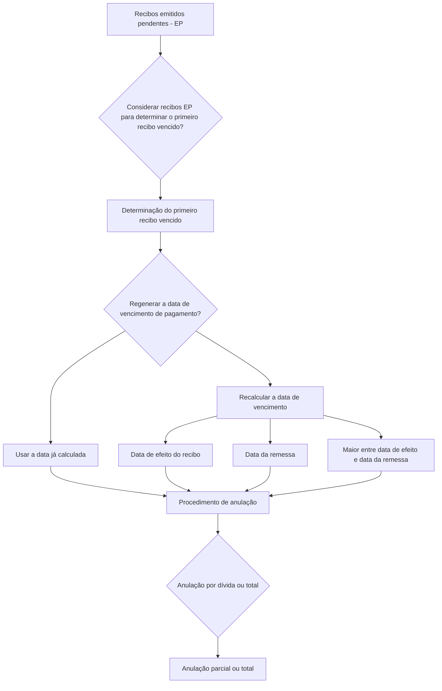

# Definição de Anulação por Falta de Pagamento — Documento em Construção

## 1. Metadados do Documento
- **Arquivo de Origem:** Não identificado
- **Tipo de Documento:** Especificação Técnica
- **Domínio / Sistema:** Anulação por falta de pagamento
- **Público-Alvo:** Negócio, Desenvolvedores e Operação
- **Data/Versão Identificada:** Não identificada

---

## 2. Resumo Executivo & Contexto de Negócio

O documento descreve a definição de anulação por falta de pagamento, incluindo propriedades de configuração e lógica de negócio para anulação total ou parcial. O material está marcado como “EN CONSTRUCCIÓN”, indicando conteúdo ainda em elaboração.

A definição trata recibos emitidos pendentes, identificados pela sigla `EP`. Uma propriedade determina se os recibos `EP` devem ser considerados na identificação do primeiro recibo vencido.

O documento também apresenta a regeneração da data de vencimento de pagamento. A configuração informa se o processo deve utilizar uma data já calculada ou recalcular a data de vencimento.

Para o recálculo, o documento enumera três referências possíveis: data de efeito do recibo, data da remessa ou a maior data entre a data de efeito e a data da remessa. A lógica final menciona que um procedimento determina se a anulação ocorre por dívida ou de forma total, mas não detalha os critérios usados por esse procedimento.

---

## 3. Arquitetura, Componentes & Tecnologias Envolvidas

O conteúdo fornecido não descreve arquitetura de software, integrações, microsserviços, tecnologias, ambientes ou contratos técnicos. O fluxo funcional explicitamente identificado é:



> **Nota de Análise:** O documento não detalha os componentes técnicos responsáveis pelo processamento dos recibos, pelo recálculo da data de vencimento ou pela execução da anulação.

---

## 4. Regras de Negócio, Especificações Funcionais & Processos

1. A definição de anulação por falta de pagamento trata recibos emitidos pendentes (`EP`).
2. Existe uma marca de configuração que indica se os recibos `EP` devem ser considerados para determinar o primeiro recibo vencido.
3. Existe uma configuração para regenerar a data de vencimento de pagamento.
4. A regeneração da data de vencimento pode utilizar como base uma data previamente calculada ou realizar um novo cálculo.
5. Quando houver recálculo, a data de partida pode ser definida por uma das seguintes opções:
   1. Data de efeito do recibo.
   2. Data da remessa.
   3. Maior data entre a data de efeito do recibo e a data da remessa.
6. A lógica de negócio para anulação total ou parcial inclui um procedimento que indica se a anulação ocorre por dívida ou de forma total.

> **Nota de Análise:** O documento não informa a semântica operacional completa de “anulação por dívida”, os critérios de decisão para anulação total ou parcial, nem as consequências do processo sobre os recibos envolvidos.

---

## 5. Tabelas de Parâmetros, Ambientes e Estruturas de Dados

| Item / Parâmetro | Descrição / Função | Tipo / Valores / Formato | Ambiente / Observações |
| :--- | :--- | :--- | :--- |
| Recibos emitidos pendentes | Recibos tratados pela definição de anulação por falta de pagamento. | `EP` | O significado expandido de `EP` não é detalhado além de “emitidos pendientes”. |
| Consideração de recibos EP | Marca que indica se os recibos `EP` são considerados para determinar o primeiro recibo vencido. | Marca / valor não especificado | Não são informados valores permitidos nem comportamento padrão. |
| Regeneração da data de vencimento de pagamento | Configuração que determina se a data de vencimento deve ser regenerada. | Marca / valor não especificado | Pode utilizar data já calculada ou executar novo cálculo. |
| Base da regeneração | Define qual data é usada no recálculo da data de vencimento. | 1. Data de efeito do recibo; 2. Data da remessa; 3. Maior entre ambas | O documento não informa formato de data nem regras para dados ausentes. |
| Procedimento de anulação | Indica se a anulação ocorre por dívida ou de forma total. | Procedimento / critérios não especificados | Relacionado à lógica de anulação total ou parcial. |

---

## 6. Bateria de Perguntas & Respostas para RAG (FAQ Sintético)

### P1: Qual é o objetivo da definição de anulação por falta de pagamento?
**R:** A definição de anulação por falta de pagamento trata recibos emitidos pendentes (`EP`), estabelece parâmetros para identificação do primeiro recibo vencido, permite regenerar a data de vencimento de pagamento e contempla lógica para anulação total ou parcial.

### P2: O que significa EP no contexto do documento?
**R:** `EP` é a identificação usada pelo documento para recibos emitidos pendentes. O documento não fornece uma definição adicional da sigla.

### P3: Os recibos emitidos pendentes devem ser usados para determinar o primeiro recibo vencido?
**R:** Existe uma marca de configuração que define se os recibos emitidos pendentes (`EP`) serão considerados para determinar o primeiro recibo vencido. Os valores possíveis e o valor padrão dessa marca não são detalhados.

### P4: O que é a regeneração da data de vencimento de pagamento?
**R:** A regeneração da data de vencimento de pagamento é uma configuração relacionada ao vencimento. Ela indica se o processo utiliza a data previamente calculada ou se executa novamente o cálculo da data de vencimento.

### P5: Quais datas podem servir como base para recalcular a data de vencimento?
**R:** O documento lista três referências para o recálculo: a data de efeito do recibo, a data da remessa ou a maior data entre a data de efeito do recibo e a data da remessa.

### P6: Como é escolhida a maior data entre efeito e remessa?
**R:** A terceira opção de regeneração é “Fecha efecto o remesa (mayor)”, ou seja, a maior entre a data de efeito do recibo e a data da remessa. O documento não especifica a regra de comparação, o formato das datas ou o tratamento de datas inexistentes.

### P7: O documento detalha quando usar a data já calculada em vez de recalculá-la?
**R:** Não. O documento somente informa que existe uma marca para decidir se a data já calculada é usada como base ou se a data de vencimento é recalculada.

### P8: A anulação por falta de pagamento pode ser parcial?
**R:** Sim. O documento contém uma seção denominada “Lógica de negocio para anulación total o parcial”, indicando que o processo contempla anulação total ou parcial.

### P9: Como o processo decide entre anulação por dívida e anulação total?
**R:** O documento informa que existe um procedimento que indica se a anulação é por dívida ou total. Entretanto, não apresenta os critérios, entradas, regras decisórias ou efeitos de cada modalidade.

### P10: O documento descreve APIs, métodos HTTP ou integrações técnicas?
**R:** Não. Embora o conteúdo apresente referências de navegação como “Soluciones APIs”, “Documentación” e “Zeus”, não há detalhes sobre APIs, métodos HTTP, contratos JSON, endpoints, autenticação ou integrações.

---

## 7. Glossário de Termos, Siglas & Conceitos-Chave

- **EP:** Recibos emitidos pendentes.
- **Anulação por falta de pagamento:** Processo descrito para tratar recibos pendentes e aplicar uma anulação por dívida ou total.
- **Primeiro recibo vencido:** Recibo vencido cuja identificação pode considerar recibos `EP`, conforme uma marca de configuração.
- **Data de efeito do recibo:** Uma das referências disponíveis para recalcular a data de vencimento.
- **Data da remessa:** Uma das referências disponíveis para recalcular a data de vencimento.
- **Regeneração da data de vencimento:** Decisão de manter uma data já calculada ou recalcular a data de vencimento.
- **Anulação total ou parcial:** Modalidade de anulação mencionada no documento; seus critérios não são detalhados.

---

## 8. Notas Críticas, Riscos & Limitações

- O documento está identificado como “EN CONSTRUCCIÓN”, portanto seu conteúdo pode estar incompleto ou sujeito a alterações.
- Não há detalhes sobre valores permitidos, padrões ou implementação das marcas de configuração.
- O procedimento que determina anulação por dívida ou total não possui critérios funcionais descritos.
- Não há definição de dados de entrada, dados de saída, mensagens de erro, exceções, auditoria ou reversão do processo.
- Não há arquitetura técnica, serviços, APIs, bancos de dados, ambientes, URLs, versões ou responsáveis identificados.
- Não são especificadas as consequências operacionais de uma anulação total, parcial ou por dívida.

---

## 9. Conteúdo Bruto Estruturado (Referência Fiel)

```text
--- [PÁGINA 1 DE 2] ---

EN CONSTRUCCIÓN
DEFINICIÓN de Anulación por falta de pago
Objetivo
Propiedades de definición
Propiedades de definición
Trata recibos emitidos pendientes (EP)
marca que indica si se tienen en cuenta los recibos ep para determinar el primer recibo vencido
Regenera la fecha de vencimiento de pago
marca que indica si se toma como base la fecha que ya esta calculado o se vuelve a calcular
Fecha de partida para la regenración
indica en base a que fecha se hara el recalculo de la fecha
(1)Fecha efecto recibo
(2)Fecha remesa
(3)Fecha efecto o remesa (mayor)
(1)Fecha efecto recibo
 /
 RS
Inicio Soluciones APIs Documentación Zeus
ES


--- [PÁGINA 2 DE 2] ---

(2)Fecha remesa
(3)Fecha efecto o remesa (mayor)
Lógica de negocio para anulación total o parcial
procedimiento que indica si la anulacion es por deuda o total
```
