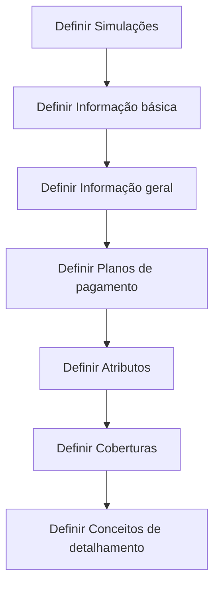

# Definição de Cotização — Fluxo de Construção

## 1. Metadados do Documento
- **Arquivo de Origem:** `Não informado`
- **Tipo de Documento:** `Apresentação Executiva`
- **Domínio / Sistema:** `Definición de Cotización`
- **Público-Alvo:** `Não identificado`
- **Data/Versão Identificada:** `Não identificada`

---

## 2. Resumo Executivo & Contexto de Negócio

O documento apresenta o tema **“Definición de Cotización”** no contexto de conteúdo marcado como **“EN CONSTRUCCIÓN”**. O material organiza a definição de cotização em etapas sequenciais, sem descrever detalhadamente regras de cálculo, contratos, integrações ou responsáveis.

A estrutura indicada começa pela definição de simulações e segue pela construção de informações básicas, informações gerais, planos de pagamento, atributos, coberturas e conceitos de detalhamento. Essas etapas são exibidas tanto visualmente quanto em uma lista numerada de sete itens.

O documento também contém os termos de navegação ou contexto visual **“Inicio”, “Soluciones”, “APIs”, “Documentación”, “Zeus”, “RS” e “ES”**. Entretanto, o conteúdo disponível não explica a função desses elementos, nem confirma se representam módulos, menus, sistemas, ambientes ou identificadores.

**Nota de Análise:** o documento descreve apenas a sequência de tópicos da definição de cotização. Não apresenta regras de negócio detalhadas, dados de entrada, critérios de validação, APIs, modelos de dados, tecnologias ou resultados esperados para cada etapa.

---

## 3. Arquitetura, Componentes & Tecnologias Envolvidas

O documento não especifica arquitetura de software, microsserviços, bancos de dados, integrações, tecnologias, protocolos ou ambientes. O único fluxo identificável é o processo sequencial de definição de cotização.



### Componentes e termos citados

| Componente / Termo | Evidência no documento | Detalhamento disponível |
| :--- | :--- | :--- |
| Definición de Cotización | Título central do conteúdo | Apresentada como assunto do fluxo de sete etapas |
| Simulaciones | Etapa 1 | Não detalhada |
| Información básica | Etapa 2 | Não detalhada |
| Información general | Etapa 3 | Não detalhada |
| Planes de pago | Etapa 4 | Não detalhada |
| Atributos | Etapa 5 | Não detalhada |
| Coberturas | Etapa 6 | Não detalhada |
| Conceptos de desglose | Etapa 7 | Não detalhada |
| Zeus | Termo exibido na interface ou contexto visual | Função não informada |
| APIs | Termo exibido na interface ou contexto visual | APIs não são descritas |
| Documentación | Termo exibido na interface ou contexto visual | Documentação não é detalhada |
| RS | Termo exibido no material | Significado não informado |
| ES | Termo exibido no material | Significado não informado |

---

## 4. Regras de Negócio, Especificações Funcionais & Processos

O processo apresentado para a definição de cotização possui sete etapas, na ordem abaixo:

1. **Definir Simulações**
   - O documento indica que simulações devem ser definidas como primeira etapa.
   - Não são apresentados critérios, entradas, saídas ou regras para as simulações.

2. **Definir Informação básica**
   - A informação básica deve ser definida após as simulações.
   - O documento não enumera quais campos compõem a informação básica.

3. **Definir Informação geral**
   - A informação geral deve ser definida após a informação básica.
   - Não há diferenciação funcional documentada entre informação básica e informação geral.

4. **Definir Planos de pagamento**
   - Os planos de pagamento devem ser definidos após a informação geral.
   - Não são apresentados tipos de plano, periodicidades, valores ou condições de pagamento.

5. **Definir Atributos**
   - Atributos devem ser definidos após os planos de pagamento.
   - O documento não especifica quais atributos existem ou como são validados.

6. **Definir Coberturas**
   - Coberturas devem ser definidas após os atributos.
   - Não há definição de cobertura, elegibilidade, limites ou exclusões.

7. **Definir Conceitos de detalhamento**
   - Os conceitos de detalhamento devem ser definidos como última etapa exibida.
   - O documento não define os conceitos nem o formato do detalhamento.

**Restrição identificada:** o material está marcado como **“EN CONSTRUCCIÓN”**, indicando que o conteúdo pode estar em desenvolvimento. Não há detalhamento adicional que permita inferir regras operacionais ou funcionais.

---

## 5. Tabelas de Parâmetros, Ambientes e Estruturas de Dados

| Item / Parâmetro | Descrição / Função | Tipo / Valores / Formato | Ambiente / Observações |
| :--- | :--- | :--- | :--- |
| Estado do conteúdo | Indica que o material está em construção | `EN CONSTRUCCIÓN` | Não há versão ou data informada |
| Etapa 1 | Definição de simulações | `DEFINIR Simulaciones` | Sem detalhamento adicional |
| Etapa 2 | Definição de informação básica | `DEFINIR Información básica` | Sem campos informados |
| Etapa 3 | Definição de informação geral | `DEFINIR Información general` | Sem campos informados |
| Etapa 4 | Definição de planos de pagamento | `DEFINIR Planes de pago` | Sem regras ou valores informados |
| Etapa 5 | Definição de atributos | `DEFINIR Atributos` | Sem catálogo de atributos |
| Etapa 6 | Definição de coberturas | `DEFINIR Coberturas` | Sem catálogo de coberturas |
| Etapa 7 | Definição de conceitos de detalhamento | `DEFINIR Conceptos de desglose` | Sem estrutura de detalhamento |
| Navegação | Termo exibido no conteúdo | `Inicio` | Função não detalhada |
| Navegação | Termo exibido no conteúdo | `Soluciones` | Função não detalhada |
| Navegação | Termo exibido no conteúdo | `APIs` | Não há contratos de API |
| Navegação | Termo exibido no conteúdo | `Documentación` | Conteúdo não especificado |
| Sistema ou referência visual | Termo exibido no conteúdo | `Zeus` | Função não informada |
| Identificador | Termo exibido no conteúdo | `RS` | Significado não informado |
| Idioma ou identificador | Termo exibido no conteúdo | `ES` | Significado não informado |

---

## 6. Bateria de Perguntas & Respostas para RAG (FAQ Sintético)

### P1: Qual é o objetivo do documento “Definición de Cotización”?
**R:** O documento apresenta uma sequência de sete etapas para estruturar a definição de cotização: simulações, informação básica, informação geral, planos de pagamento, atributos, coberturas e conceitos de detalhamento. O material não descreve um objetivo de negócio mais detalhado.

### P2: Qual é a primeira etapa do processo de definição de cotização?
**R:** A primeira etapa é **“DEFINIR Simulaciones”**. O documento não informa quais dados, critérios ou resultados devem compor as simulações.

### P3: Quais são as etapas da definição de cotização?
**R:** As etapas são: 1) definir simulações; 2) definir informação básica; 3) definir informação geral; 4) definir planos de pagamento; 5) definir atributos; 6) definir coberturas; e 7) definir conceitos de detalhamento.

### P4: O documento especifica quais campos pertencem à informação básica?
**R:** Não. O documento apresenta **“DEFINIR Información básica”** como segunda etapa, mas não lista campos, formatos, obrigatoriedade ou regras de validação.

### P5: O documento diferencia informação básica de informação geral?
**R:** Não. Ambas aparecem como etapas distintas — informação básica na etapa 2 e informação geral na etapa 3 —, mas o material não explica a diferença funcional ou estrutural entre elas.

### P6: Existem regras para planos de pagamento na definição de cotização?
**R:** Não. O documento inclui **“DEFINIR Planes de pago”** como quarta etapa, porém não apresenta regras de periodicidade, cálculo, vencimento, valores ou condições de pagamento.

### P7: O documento define os atributos utilizados na cotização?
**R:** Não. A etapa **“DEFINIR Atributos”** é apresentada, mas não existe catálogo de atributos, tipos de dado, valores permitidos ou regras de associação.

### P8: O que o documento informa sobre coberturas?
**R:** O documento determina que coberturas devem ser definidas na sexta etapa, por meio de **“DEFINIR Coberturas”**. Não há descrição de tipos de cobertura, critérios de elegibilidade, limites ou exclusões.

### P9: O que são os conceitos de detalhamento no documento?
**R:** O documento lista **“DEFINIR Conceptos de desglose”** como a sétima etapa da definição de cotização. Não fornece definição adicional, estrutura de dados ou exemplos desses conceitos.

### P10: O documento contém especificações de APIs para a definição de cotização?
**R:** Não. Embora o termo **“APIs”** apareça no conteúdo visual, o documento não descreve endpoints, métodos HTTP, contratos JSON, autenticação ou integrações.

### P11: O documento apresenta uma arquitetura de sistema ou microsserviços?
**R:** Não. O material não identifica componentes técnicos, microsserviços, tecnologias, bancos de dados, ambientes ou fluxos de integração. Apenas permite reconstruir o fluxo sequencial das sete etapas.

### P12: Qual é o estado do material apresentado?
**R:** O documento contém a indicação **“EN CONSTRUCCIÓN”**. Não há data, versão ou explicação adicional sobre o estágio de construção.

---

## 7. Glossário de Termos, Siglas & Conceitos-Chave

- **Cotización:** termo central do documento; o material apresenta um processo para sua definição, sem fornecer uma definição conceitual adicional.
- **Simulaciones:** primeira etapa da definição de cotização.
- **Información básica:** segunda etapa da definição de cotização.
- **Información general:** terceira etapa da definição de cotização.
- **Planes de pago:** quarta etapa da definição de cotização.
- **Atributos:** quinta etapa da definição de cotização.
- **Coberturas:** sexta etapa da definição de cotização.
- **Conceptos de desglose:** sétima etapa da definição de cotização.
- **APIs:** termo exibido no conteúdo; nenhuma interface de programação é especificada.
- **Zeus:** termo exibido no conteúdo; significado e função não informados.
- **RS:** sigla ou identificador exibido no material; significado não informado.
- **ES:** sigla ou identificador exibido no material; significado não informado.
- **EN CONSTRUCCIÓN:** indicação textual de que o conteúdo está em construção.

---

## 8. Notas Críticas, Riscos & Limitações

- O documento está explicitamente marcado como **“EN CONSTRUCCIÓN”**.
- Não há arquivo de origem, versão, data, autor, público-alvo ou responsável identificado no texto fornecido.
- Não há regras de negócio detalhadas para simulações, informações, planos de pagamento, atributos, coberturas ou conceitos de detalhamento.
- Não são informados campos, estruturas de dados, critérios de obrigatoriedade, validações ou tratamentos de erro.
- Não há especificações técnicas de APIs, integrações, ambientes, URLs, logs, tecnologias ou componentes de software.
- Os termos **Zeus**, **RS** e **ES** são exibidos sem definição contextual.
- A página 2 não contém conteúdo textual funcional adicional.

---

## 9. Conteúdo Bruto Estruturado (Referência Fiel)

```text
--- [PÁGINA 1 DE 2] ---

EN CONSTRUCCIÓN
DEFINICIÓN de Cotización
Objetivo
¿En qué consiste?
Características generales
Proceso a seguir
DEFINIR
Simulaciones
(1)
DEFINIR
Información
básica
(2)
DEFINIR
Información
general
(3)
DEFINIR
Planes de
pago
(4)
DEFINIR
Atributos
(5)
DEFINIR
Coberturas
(6)
DEFINIR
Conceptos de
desglose
(7)
1. DEFINIR Simulaciones
2. DEFINIR Información básica
3. DEFINIR Información general
4. DEFINIR Planes de pago
5. DEFINIR Atributos
6. DEFINIR Coberturas
7. DEFINIR Conceptos de desglose
 /
 RS
Inicio Soluciones APIs Documentación Zeus
ES


--- [PÁGINA 2 DE 2] ---

[Página em branco ou apenas elementos visuais/imagem]
```
