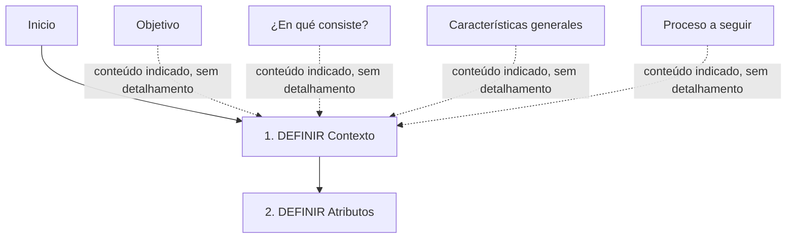

# Definição de Contexto — Documento em Construção

## 1. Metadados do Documento
- **Arquivo de Origem:** Não identificado no conteúdo fornecido
- **Tipo de Documento:** Apresentação Executiva
- **Domínio / Sistema:** Definição de Contexto; referências a Soluciones, APIs, Documentación e Zeus
- **Público-Alvo:** Não identificado no texto; conteúdo sugere público envolvido na definição de contexto e atributos
- **Data/Versão Identificada:** Não identificada

---

## 2. Resumo Executivo & Contexto de Negócio

O documento apresenta um conteúdo marcado como **“EN CONSTRUCCIÓN”**, indicando que o material ainda está em elaboração. O tema central é a **definição de contexto**, organizada em torno de objetivo, descrição do conceito, características gerais e processo a seguir.

O processo explicitamente apresentado possui duas etapas sequenciais: primeiro, **definir o contexto**; segundo, **definir os atributos**. A apresentação repete essas duas etapas como os elementos principais da estrutura proposta.

O conteúdo também contém referências textuais a “Soluciones”, “APIs”, “Documentación” e “Zeus”, além das siglas ou marcadores “RS” e “ES”. Entretanto, o documento não estabelece relações funcionais, técnicas ou organizacionais entre esses termos.

**Nota de Análise:** O documento não detalha o objetivo específico da definição de contexto, os critérios para definição de atributos, responsáveis, entradas, saídas, regras de validação ou resultados esperados do processo.

---

## 3. Arquitetura, Componentes & Tecnologias Envolvidas

O conteúdo fornecido não descreve uma arquitetura de software, infraestrutura, tecnologias, integrações, protocolos, microsserviços ou ambientes. Os únicos elementos potencialmente relacionados a componentes ou áreas são os termos “Soluciones”, “APIs”, “Documentación” e “Zeus”, apresentados sem explicação adicional.

O fluxo identificado é processual e contém duas etapas: definição de contexto e definição de atributos.



**Nota de Análise:** O documento cita “APIs”, porém não detalha interfaces, métodos HTTP, contratos, endpoints, formatos de payload, autenticação ou consumidores dessas APIs. O termo “Zeus” também é citado sem definição funcional ou técnica.

---

## 4. Regras de Negócio, Especificações Funcionais & Processos

### Processo identificado: Definição de Contexto

1. O processo inicia na etapa **“DEFINIR Contexto”**.
2. A etapa de definição de contexto é identificada como **etapa (1)**.
3. Após a definição de contexto, o processo avança para **“DEFINIR Atributos”**.
4. A etapa de definição de atributos é identificada como **etapa (2)**.
5. O documento relaciona o conteúdo aos tópicos:
   - Objetivo;
   - “¿En qué consiste?”;
   - Características gerais;
   - Processo a seguir.

### Restrições de fidelidade

- Não há critérios descritos para determinar o que constitui um contexto válido.
- Não há lista de atributos, tipos de atributos, obrigatoriedade, formato ou regras de preenchimento.
- Não há descrição de validações, exceções, aprovações, responsáveis ou ferramentas utilizadas.
- Não há detalhamento adicional para os marcadores “RS” e “ES”.

---

## 5. Tabelas de Parâmetros, Ambientes e Estruturas de Dados

| Item / Parâmetro | Descrição / Função | Tipo / Valores / Formato | Ambiente / Observações |
| :--- | :--- | :--- | :--- |
| Estado do documento | Indica que o conteúdo está em elaboração. | `EN CONSTRUCCIÓN` | Não há versão ou data associada. |
| Objetivo | Tópico listado na apresentação. | Não detalhado | Não há descrição do objetivo. |
| ¿En qué consiste? | Tópico listado para explicar a definição de contexto. | Não detalhado | Não há explicação adicional. |
| Características generales | Tópico listado na apresentação. | Não detalhado | Não há características enumeradas. |
| Proceso a seguir | Tópico que introduz o fluxo de duas etapas. | Sequencial | Contexto seguido de atributos. |
| Etapa 1 | Definir contexto. | `DEFINIR Contexto` | Marcada como `(1)`. |
| Etapa 2 | Definir atributos. | `DEFINIR Atributos` | Marcada como `(2)`. |
| Soluciones | Termo presente no conteúdo. | Não detalhado | Relação com o processo não especificada. |
| APIs | Termo presente no conteúdo. | Não detalhado | Não há contratos ou especificações técnicas. |
| Documentación | Termo presente no conteúdo. | Não detalhado | Não há documentos ou repositórios identificados. |
| Zeus | Termo presente no conteúdo. | Não detalhado | Não há definição do sistema, módulo ou ferramenta. |
| RS | Marcador ou sigla presente no conteúdo. | `RS` | Significado não definido. |
| ES | Marcador ou sigla presente no conteúdo. | `ES` | Significado não definido. |

---

## 6. Bateria de Perguntas & Respostas para RAG (FAQ Sintético)

### P1: Qual é o tema principal do documento?
**R:** O tema principal é a **definição de contexto**. O documento organiza o assunto pelos tópicos objetivo, descrição do conceito, características gerais e processo a seguir.

### P2: Qual é o estado de maturidade do documento?
**R:** O documento está marcado como **“EN CONSTRUCCIÓN”**, indicando que o conteúdo ainda está em construção ou elaboração.

### P3: Quais são as etapas do processo apresentado?
**R:** O processo possui duas etapas: **1. DEFINIR Contexto** e **2. DEFINIR Atributos**.

### P4: Qual etapa deve ocorrer primeiro: definir contexto ou definir atributos?
**R:** A primeira etapa é **DEFINIR Contexto**, identificada como etapa `(1)`. A definição de atributos ocorre em seguida, como etapa `(2)`.

### P5: O documento detalha como definir um contexto?
**R:** Não. O documento identifica a atividade **“DEFINIR Contexto”**, mas não informa critérios, responsáveis, ferramentas, entradas, saídas ou regras de validação para essa definição.

### P6: O documento especifica quais atributos devem ser definidos?
**R:** Não. O documento apresenta a etapa **“DEFINIR Atributos”**, porém não lista atributos, formatos, tipos, obrigatoriedade ou regras de preenchimento.

### P7: Quais tópicos gerais acompanham a definição de contexto?
**R:** Os tópicos apresentados são: **Objetivo**, **¿En qué consiste?**, **Características generales** e **Proceso a seguir**. O documento não desenvolve o conteúdo desses tópicos.

### P8: O documento descreve APIs ou contratos de integração?
**R:** Não. O termo **“APIs”** aparece no conteúdo, mas não há endpoints, métodos HTTP, protocolos, contratos JSON, autenticação ou fluxos de integração descritos.

### P9: O que é Zeus no contexto do documento?
**R:** O documento apenas menciona **“Zeus”**. Não há definição que permita classificá-lo como sistema, módulo, ferramenta, ambiente ou componente arquitetural.

### P10: O que significam RS e ES?
**R:** O conteúdo inclui os marcadores **“RS”** e **“ES”**, mas não apresenta seus significados. Portanto, não é possível expandir as siglas sem extrapolar o documento original.

---

## 7. Glossário de Termos, Siglas & Conceitos-Chave

- **Contexto:** Elemento que deve ser definido na primeira etapa do processo apresentado. O documento não fornece uma definição conceitual adicional.
- **Atributos:** Elementos que devem ser definidos na segunda etapa do processo apresentado. O documento não especifica quais atributos existem ou como devem ser modelados.
- **APIs:** Termo citado no conteúdo sem detalhamento técnico ou funcional.
- **Documentación:** Termo em espanhol citado no conteúdo; não há documentos, estrutura documental ou responsabilidades descritas.
- **Soluciones:** Termo em espanhol citado no conteúdo; não há definição de escopo ou relação explicitada.
- **Zeus:** Termo citado sem definição no documento.
- **RS:** Sigla ou marcador sem significado identificado.
- **ES:** Sigla ou marcador sem significado identificado.
- **EN CONSTRUCCIÓN:** Indicação em espanhol de que o documento está em construção.

---

## 8. Notas Críticas, Riscos & Limitações

- O documento está explicitamente em construção, o que limita seu uso como especificação definitiva.
- Não há objetivo detalhado, escopo, responsáveis, critérios de aceite ou resultados esperados.
- O processo contém somente duas etapas nomeadas; faltam entradas, saídas, regras de decisão, exceções e validações.
- Os termos “Soluciones”, “APIs”, “Documentación”, “Zeus”, “RS” e “ES” não possuem definição contextual suficiente.
- Não há arquitetura técnica, ambientes, URLs, servidores, parâmetros, estruturas de dados ou contratos de integração.
- Não é possível inferir tecnologias, versões, papéis organizacionais ou significados de siglas sem introduzir informações não sustentadas pelo documento.

---

## 9. Conteúdo Bruto Estruturado (Referência Fiel)

```text
--- [PÁGINA 1 DE 1] ---

EN CONSTRUCCIÓN
DEFINICIÓN de Contexto
Objetivo
¿En qué consiste?
Características generales
Proceso a seguir
DEFINIR
Contexto
(1)
DEFINIR
Atributos
(2)
1. DEFINIR Contexto
2. DEFINIR Atributos
 / 
 RS
Inicio Soluciones APIs Documentación Zeus
ES
```
