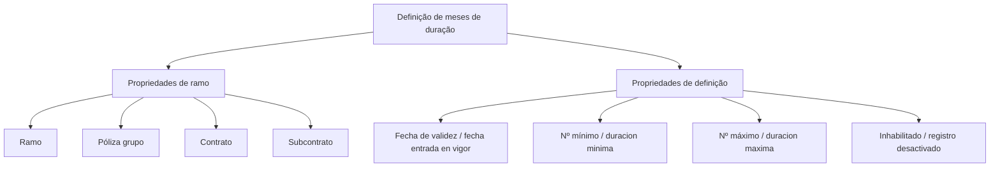

# Definição de Meses de Duração — Propriedades de Ramo e Definição

## 1. Metadados do Documento
- **Arquivo de Origem:** `Não identificado`
- **Tipo de Documento:** `Não identificado`
- **Domínio / Sistema:** `Definição de meses de duração para ramo, póliza grupo, contrato e subcontrato`
- **Público-Alvo:** `Negócio, analistas funcionais e desenvolvedores`
- **Data/Versão Identificada:** `Não identificada`

---

## 2. Resumo Executivo & Contexto de Negócio

O conteúdo descreve uma definição relacionada a meses de duração. A definição inclui propriedades de ramo e propriedades de definição, associadas aos níveis Ramo, Póliza grupo, Contrato e Subcontrato.

As propriedades de definição incluem a data de entrada em vigor, um número mínimo associado à duração mínima, um número máximo associado à duração máxima e um indicador de inabilitação para registro desativado.

O documento também apresenta referências textuais a “Inicio”, “Soluciones”, “APIs”, “Documentación”, “Zeus”, “ES” e “RS”. Não há detalhamento suficiente para determinar se esses termos representam módulos, navegação, ambientes, idiomas, sistemas ou outras classificações.

A fonte não descreve fórmulas de cálculo, critérios de precedência entre Ramo, Póliza grupo, Contrato e Subcontrato, nem regras para tratamento de durações fora dos limites mínimo e máximo.

---

## 3. Arquitetura, Componentes & Tecnologias Envolvidas

Os elementos identificados formam uma estrutura de definição de duração associada a entidades de negócio hierárquicas. O texto não identifica tecnologias, microsserviços, bancos de dados, protocolos, URLs ou ambientes técnicos.



**Nota de Análise:** O conteúdo não detalha relacionamentos técnicos, ordem de processamento, contratos de integração, métodos HTTP, estruturas JSON ou persistência de dados.

---

## 4. Regras de Negócio, Especificações Funcionais & Processos

1. Existe uma definição denominada **“DEFINICIÓN de meses de duración”**.
2. A definição contém referências a **Propiedades de ramo** e **Propiedades de definición**.
3. As propriedades de ramo mencionam os seguintes elementos:
   - Ramo;
   - Póliza grupo;
   - Contrato;
   - Subcontrato.
4. As propriedades de definição mencionam:
   - Fecha de validez;
   - Fecha entrada en vigor;
   - Nº mínimo;
   - duracion minima;
   - Nº máximo;
   - duracion maxima;
   - Inhabilitado;
   - registro desactivado.
5. O documento associa textualmente “Nº mínimo” a “duracion minima”.
6. O documento associa textualmente “Nº máximo” a “duracion maxima”.
7. O documento associa textualmente “Inhabilitado” a “registro desactivado”.

**Nota de Análise:** Não foi informada uma regra explícita que determine se a duração deve estar entre a duração mínima e a duração máxima, embora os campos sejam listados no mesmo contexto. Não é possível afirmar validação, bloqueio ou cálculo sem evidência adicional.

---

## 5. Tabelas de Parâmetros, Ambientes e Estruturas de Dados

| Item / Parâmetro | Descrição / Função | Tipo / Valores / Formato | Ambiente / Observações |
| :--- | :--- | :--- | :--- |
| DEFINICIÓN de meses de duración | Definição principal mencionada no documento. | Não informado. | Não há detalhamento funcional adicional. |
| Propiedades de ramo | Grupo de propriedades relacionado ao ramo. | Não informado. | Listado mais de uma vez no conteúdo. |
| Ramo | Elemento listado em propriedades de ramo. | Não informado. | Também aparece como `ramo`. |
| Póliza grupo | Elemento listado em propriedades de ramo. | Não informado. | Também aparece como `póliza grupo`. |
| Contrato | Elemento listado em propriedades de ramo. | Não informado. | Também aparece como `contrato`. |
| Subcontrato | Elemento listado em propriedades de ramo. | Não informado. | Também aparece como `subcontrato`. |
| Propiedades de definición | Grupo de propriedades da definição de meses de duração. | Não informado. | Inclui validade, duração mínima, duração máxima e inabilitação. |
| Fecha de validez | Data de validade citada nas propriedades de definição. | Data não especificada. | O formato da data não foi informado. |
| fecha entrada en vigor | Data de entrada em vigor citada nas propriedades de definição. | Data não especificada. | Não há relação explícita com `Fecha de validez`. |
| Nº mínimo | Campo associado textualmente a `duracion minima`. | Número; formato não informado. | Não há regra de validação explicitada. |
| duracion minima | Duração mínima mencionada. | Não informado. | Unidade “meses” é sugerida pelo título da definição, mas não detalhada por campo. |
| Nº máximo | Campo associado textualmente a `duracion maxima`. | Número; formato não informado. | Não há regra de validação explicitada. |
| duracion maxima | Duração máxima mencionada. | Não informado. | Unidade “meses” é sugerida pelo título da definição, mas não detalhada por campo. |
| Inhabilitado | Indicador listado nas propriedades de definição. | Não informado. | Associado textualmente a `registro desactivado`. |
| registro desactivado | Estado de registro desativado. | Não informado. | Não há descrição do efeito operacional. |
| RS | Termo isolado presente no conteúdo. | Não informado. | Significado não identificado. |
| Zeus | Termo isolado presente no conteúdo. | Não informado. | Não é possível confirmar se é um sistema ou módulo. |
| ES | Termo isolado presente no conteúdo. | Não informado. | Significado não identificado. |

---

## 6. Bateria de Perguntas & Respostas para RAG (FAQ Sintético)

### P1: Qual é o objetivo principal do documento?
**R:** O documento apresenta uma “DEFINICIÓN de meses de duración”, com propriedades de ramo e propriedades de definição. O material não informa um objetivo de negócio mais detalhado.

### P2: Quais entidades são listadas nas propriedades de ramo?
**R:** As propriedades de ramo listam Ramo, Póliza grupo, Contrato e Subcontrato. O documento não descreve o relacionamento hierárquico ou funcional entre essas entidades.

### P3: Quais propriedades fazem parte da definição de meses de duração?
**R:** As propriedades de definição mencionadas são Fecha de validez, fecha entrada en vigor, Nº mínimo, duracion minima, Nº máximo, duracion maxima, Inhabilitado e registro desactivado.

### P4: O documento informa qual é o formato da data de entrada em vigor?
**R:** Não. O conteúdo menciona “fecha entrada en vigor”, mas não especifica formato, timezone, obrigatoriedade, regras de preenchimento ou comportamento de validação.

### P5: Como são definidos os limites mínimo e máximo de duração?
**R:** O documento lista “Nº mínimo” junto de “duracion minima” e “Nº máximo” junto de “duracion maxima”. Não há fórmula, unidade detalhada por campo, regra de comparação ou comportamento para valores fora dos limites.

### P6: O que significa o campo Inhabilitado?
**R:** O conteúdo associa “Inhabilitado” a “registro desactivado”. Não há detalhamento sobre quem pode inabilitar o registro, quais operações ficam bloqueadas ou se o estado pode ser revertido.

### P7: Existe uma regra explícita ligando a data de validade à data de entrada em vigor?
**R:** Não. “Fecha de validez” e “fecha entrada en vigor” são listadas como propriedades de definição, mas a fonte não estabelece precedência, diferença semântica ou regra de consistência entre as duas datas.

### P8: Quais tecnologias ou integrações são descritas?
**R:** Nenhuma tecnologia ou integração é descrita de forma verificável. Os termos “APIs”, “Documentación” e “Zeus” aparecem no conteúdo, porém sem detalhamento técnico suficiente.

### P9: O documento define APIs, métodos HTTP ou contratos JSON?
**R:** Não. Embora o termo “APIs” apareça no texto, não são descritos endpoints, métodos HTTP, parâmetros, payloads, códigos de resposta ou contratos JSON.

### P10: O documento define uma sequência operacional para cadastrar a duração?
**R:** Não. O material apresenta campos e termos relacionados à definição de meses de duração, mas não contém etapas operacionais, telas, ações de usuário ou fluxo de aprovação.

---

## 7. Glossário de Termos, Siglas & Conceitos-Chave

- **Ramo:** Entidade listada nas propriedades de ramo; significado adicional não detalhado.
- **Póliza grupo:** Entidade listada nas propriedades de ramo; significado adicional não detalhado.
- **Contrato:** Entidade listada nas propriedades de ramo; significado adicional não detalhado.
- **Subcontrato:** Entidade listada nas propriedades de ramo; significado adicional não detalhado.
- **Fecha de validez:** Data de validade mencionada como propriedade de definição.
- **fecha entrada en vigor:** Data de entrada em vigor mencionada como propriedade de definição.
- **duracion minima:** Duração mínima mencionada na definição de meses de duração.
- **duracion maxima:** Duração máxima mencionada na definição de meses de duração.
- **Inhabilitado:** Indicador associado a registro desativado.
- **registro desactivado:** Registro em estado desativado.
- **RS:** Termo presente sem expansão ou definição.
- **ES:** Termo presente sem expansão ou definição.
- **Zeus:** Termo presente sem definição contextual.

---

## 8. Notas Críticas, Riscos & Limitações

- O conteúdo é resumido e não informa autoria, data, versão, arquivo de origem, sistema responsável ou público-alvo formal.
- Não há definição explícita das regras de validação entre duração mínima e duração máxima.
- Não há evidência de unidade de medida operacional para cada campo de duração, embora o título mencione meses.
- Não há descrição de permissões, responsáveis, auditoria, aprovação ou ciclo de vida do registro.
- Os termos “RS”, “Zeus”, “ES”, “APIs” e “Documentación” não possuem contextualização suficiente para definição segura.
- Não há arquitetura técnica detalhada, integrações, ambientes, URLs, portas, logs, banco de dados ou contratos de interface.

---

## 9. Conteúdo Bruto Estruturado (Referência Fiel)

```text
--- [PÁGINA 1 DE 2] ---

EN CONSTRUCCIÓN
DEFINICIÓN de meses de duración
Objetivo
Propiedades de ramo
Propiedades de definición
Propiedades de ramo
Ramo
ramo
Póliza grupo
póliza grupo
Contrato
contrato
Subcontrato
subcontrato
Fecha de validez
 / 
 RS
Inicio Soluciones APIs Documentación Zeus
ES


--- [PÁGINA 2 DE 2] ---

fecha entrada en vigor
Propiedades de definición
Nº mínimo
duracion minima
Nº máximo
duracion maxima
Inhabilitado
registro desactivado
```
