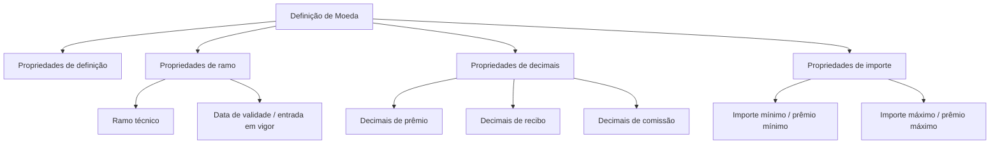

# Definição de Moedas — Propriedades de Ramo, Decimais e Importes

## 1. Metadados do Documento
- **Arquivo de Origem:** Não identificado
- **Tipo de Documento:** Especificação Técnica resumida
- **Domínio / Sistema:** Definição de moedas; referências a Soluciones, APIs, Documentación e Zeus
- **Público-Alvo:** Negócio, analistas funcionais e desenvolvedores
- **Data/Versão Identificada:** Não identificada

---

## 2. Resumo Executivo & Contexto de Negócio

O conteúdo descreve a definição de moedas em um contexto de seguros, pois menciona ramo técnico, cálculo de prêmios, recibos e comissões. O objetivo explícito é apresentado como “Definición de Monedas”.

A definição de uma moeda reúne propriedades de ramo, de decimais e de importe. As propriedades de ramo associam a moeda a um ramo técnico e a uma data de validade ou entrada em vigor.

As propriedades de decimais determinam a quantidade de casas decimais empregada nos cálculos de prêmios, recibos e comissões. As propriedades de importe estabelecem os valores mínimo e máximo de prêmio.

O documento é resumido e não descreve telas, APIs, contratos JSON, métodos HTTP, persistência, regras de prioridade ou comportamento operacional para valores fora dos limites configurados.

---

## 3. Arquitetura, Componentes & Tecnologias Envolvidas

Os únicos elementos de navegação ou contexto citados são: **Inicio**, **Soluciones**, **APIs**, **Documentación**, **Zeus**, **ES** e **RS**. O documento não explica a função técnica, integração ou responsabilidade de cada elemento.



**Nota de Análise:** O conteúdo não detalha arquitetura de software, microsserviços, banco de dados, endpoints, autenticação, tecnologias de implementação ou ambientes.

---

## 4. Regras de Negócio, Especificações Funcionais & Processos

1. A entidade ou conceito central apresentado é a **moeda**.
2. A moeda possui propriedades de definição, propriedades de ramo, propriedades de decimais e propriedades de importe.
3. As propriedades de ramo incluem:
   - Ramo;
   - Ramo técnico;
   - Data de validade;
   - Data de entrada em vigor.
4. As propriedades de decimais incluem:
   - Decimais de prêmio: número de decimais no cálculo de prêmios;
   - Decimais de recibo: número de decimais no cálculo de recibos;
   - Decimais de comissão: número de decimais no cálculo de comissões.
5. As propriedades de importe incluem:
   - Importe mínimo: prêmio mínimo;
   - Importe máximo: prêmio máximo.
6. O termo **“Defecto”** é apresentado com o equivalente **“por defecto”**, sem detalhamento de qual atributo recebe valor padrão, qual é esse valor ou em que condição ele é aplicado.

**Nota de Análise:** O documento não informa fórmulas de cálculo, regras de arredondamento, moeda padrão, códigos de moeda, critérios de validação, período de vigência aplicável, nem consequências para prêmios abaixo do mínimo ou acima do máximo.

---

## 5. Tabelas de Parâmetros, Ambientes e Estruturas de Dados

| Item / Parâmetro | Descrição / Função | Tipo / Valores / Formato | Ambiente / Observações |
| :--- | :--- | :--- | :--- |
| Moeda | Elemento central da definição de moedas. | Não informado | O documento também apresenta “RS” próximo ao termo moeda. |
| Propriedades de definição | Grupo de propriedades associado à definição de moeda. | Não informado | Não há detalhamento dos atributos do grupo. |
| Ramo | Propriedade de ramo. | Não informado | Associada ao ramo técnico. |
| Ramo técnico | Propriedade de ramo. | Não informado | Não há catálogo, código ou formato informado. |
| Data de validade | Propriedade de ramo. | Data; formato não informado | Também descrita como data de entrada em vigor. |
| Data de entrada em vigor | Referência para a data de validade. | Data; formato não informado | O documento não esclarece se é sinônimo ou atributo distinto. |
| Defecto | Indicação de valor padrão. | “por defecto” | Sem atributo, valor ou regra de aplicação identificados. |
| Decimais de prêmio | Número de decimais empregado no cálculo de prêmios. | Número inteiro presumido; formato não informado | Não há regra de arredondamento. |
| Decimais de recibo | Número de decimais empregado no cálculo de recibos. | Número inteiro presumido; formato não informado | Não há regra de arredondamento. |
| Decimais de comissão | Número de decimais empregado no cálculo de comissões. | Número inteiro presumido; formato não informado | Não há regra de arredondamento. |
| Importe mínimo | Define o prêmio mínimo. | Valor monetário; formato não informado | Não há comportamento informado para valores inferiores. |
| Importe máximo | Define o prêmio máximo. | Valor monetário; formato não informado | Não há comportamento informado para valores superiores. |
| Inicio | Item de navegação citado. | Não informado | Sem função técnica descrita. |
| Soluciones | Item de navegação citado. | Não informado | Sem função técnica descrita. |
| APIs | Item de navegação citado. | Não informado | Nenhuma API é especificada. |
| Documentación | Item de navegação citado. | Não informado | Sem referência documental adicional. |
| Zeus | Elemento citado. | Não informado | Sem contexto funcional ou técnico adicional. |
| ES | Identificador citado. | Não informado | Possível referência de idioma, sem confirmação textual. |

---

## 6. Bateria de Perguntas & Respostas para RAG (FAQ Sintético)

### P1: Qual é o objetivo apresentado no documento?
**R:** O objetivo apresentado é a **definição de moedas**. O documento organiza essa definição em propriedades de definição, ramo, decimais e importe.

### P2: Quais propriedades de ramo são citadas para a definição de moeda?
**R:** As propriedades de ramo citadas são ramo, ramo técnico, data de validade e data de entrada em vigor.

### P3: O que representam os decimais de prêmio?
**R:** Os decimais de prêmio representam o número de decimais usado no cálculo de prêmios.

### P4: O que representam os decimais de recibo?
**R:** Os decimais de recibo representam o número de decimais usado no cálculo de recibos.

### P5: O que representam os decimais de comissão?
**R:** Os decimais de comissão representam o número de decimais usado no cálculo de comissões.

### P6: Qual é a função do importe mínimo na definição de moeda?
**R:** O importe mínimo corresponde ao prêmio mínimo. O documento não especifica a unidade, o formato nem a ação adotada quando um prêmio calculado fica abaixo desse valor.

### P7: Qual é a função do importe máximo na definição de moeda?
**R:** O importe máximo corresponde ao prêmio máximo. O documento não informa como o sistema trata prêmios que ultrapassem esse limite.

### P8: O documento define regras de arredondamento para prêmios, recibos e comissões?
**R:** Não. O documento informa que há parâmetros de decimais para cálculos de prêmios, recibos e comissões, mas não detalha regras de arredondamento, truncamento ou precisão permitida.

### P9: O documento especifica APIs ou métodos HTTP para gestão de moedas?
**R:** Não. Embora “APIs” seja citado como elemento de navegação, o conteúdo não detalha endpoints, métodos HTTP, contratos JSON, autenticação ou operações para definição de moedas.

### P10: O que significa “Defecto” no documento?
**R:** O termo “Defecto” aparece associado à expressão “por defecto”, indicando a existência de uma noção de valor padrão. Contudo, o documento não identifica qual propriedade recebe esse valor nem qual valor padrão é utilizado.

---

## 7. Glossário de Termos, Siglas & Conceitos-Chave

- **Moeda:** Elemento principal tratado pela definição apresentada.
- **Ramo:** Propriedade relacionada ao contexto de negócio da moeda.
- **Ramo técnico:** Propriedade de ramo citada sem definição adicional.
- **Data de validade:** Data associada à vigência; o conteúdo também usa a expressão “data de entrada em vigor”.
- **Decimais de prêmio:** Número de decimais utilizado no cálculo de prêmios.
- **Decimais de recibo:** Número de decimais utilizado no cálculo de recibos.
- **Decimais de comissão:** Número de decimais utilizado no cálculo de comissões.
- **Importe mínimo:** Prêmio mínimo.
- **Importe máximo:** Prêmio máximo.
- **Defecto / por defecto:** Indicação de valor padrão, sem regra detalhada.
- **APIs:** Termo citado no menu ou navegação; não há especificação de interfaces.
- **Zeus:** Nome citado no documento sem explicação funcional ou técnica.
- **ES:** Identificador citado sem expansão confirmada.
- **RS:** Identificador citado ao lado de “moeda”, sem expansão confirmada.

---

## 8. Notas Críticas, Riscos & Limitações

- O conteúdo é resumido e não apresenta uma arquitetura de software detalhada.
- Não há identificação do arquivo de origem, autor, versão ou data.
- Não são especificados códigos de moedas, padrões internacionais, formatos numéricos ou formatos de data.
- Não há regras para arredondamento, truncamento, conversão cambial ou cálculo de prêmio.
- Não há detalhamento sobre validação de valores mínimos e máximos.
- Não é possível confirmar se “data de validade” e “data de entrada em vigor” são sinônimos ou campos distintos.
- Não há contratos de APIs, métodos HTTP, URLs, ambientes, logs ou mecanismos de integração.
- **Nota de Análise:** O documento lista “Zeus”, “APIs” e “Documentación”, porém não detalha seus papéis, integrações ou responsabilidades.

---

## 9. Conteúdo Bruto Estruturado (Referência Fiel)

```text
--- [PÁGINA 1 DE 2] ---

EN CONSTRUCCIÓN
DEFINICIÓN de Monedas
Objetivo
Propiedades de definición
Propiedades de ramo
Propiedades de decimales
Propiedades de importe
Propiedades de ramo
Ramo
ramo técnico
Fecha de validez
fecha de entrada en vigor
Propiedades de definición
Moneda
moneda
 / 
 RS
Inicio Soluciones APIs Documentación Zeus
ES


--- [PÁGINA 2 DE 2] ---

Defecto
por defecto
Propiedades de decimales
Decimales prima
numero de decimales en el calculo de primas
Decimales recibo
numero de decimales en el calculo de recibos
Decimales comisión
numero de decimales en el calculo de comisiones
Propiedades de importe
Importe mínimo
prima mínima
Importe máximo
prima maxima
```
