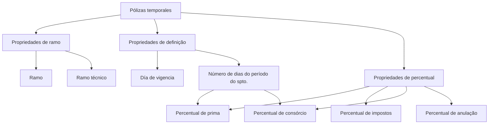

# Definição de Escalas para Pólizas Temporales — Documento em Construção

## 1. Metadados do Documento
- **Arquivo de Origem:** Não identificado
- **Tipo de Documento:** Especificação Técnica / Funcional em construção
- **Domínio / Sistema:** Definição de escalas para pólizas temporales
- **Público-Alvo:** Negócio, analistas funcionais, desenvolvedores e arquitetura
- **Data/Versão Identificada:** Não identificada

---

## 2. Resumo Executivo & Contexto de Negócio

O documento apresenta uma definição ainda em construção para escalas aplicáveis a **pólizas temporales**. O conteúdo organiza a configuração em três grupos de propriedades: propriedades de ramo, propriedades de definição e propriedades de percentual.

As propriedades de ramo incluem os campos “Ramo” e “ramo técnico”. As propriedades de definição incluem o “Día de vigencia” e o número de dias correspondentes ao período do “spto.”, termo que não é expandido pelo material fornecido.

As propriedades de percentual abrangem percentual de prima, percentual de impostos, percentual de consórcio e percentual de anulação. O texto associa explicitamente alguns percentuais ao número de dias, indicando que a escala depende da duração do período considerado.

O material não detalha fórmulas de cálculo, critérios de seleção de escalas, persistência dos dados, contratos de API, responsáveis pelo processo ou fluxos de aprovação. A referência a “Soluciones”, “APIs”, “Documentación” e “Zeus” aparece na extração, mas o relacionamento desses termos com a definição de escalas não é explicado.

---

## 3. Arquitetura, Componentes & Tecnologias Envolvidas

Os seguintes termos e componentes são citados:

| Componente / Termo | Evidência no documento | Detalhamento disponível |
| :--- | :--- | :--- |
| Pólizas temporales | Título e objetivo do conteúdo | O documento trata da definição de escalas para esse tipo de póliza. |
| Ramo | Propriedades de ramo | Não há valores, catálogo ou regra de seleção informados. |
| Ramo técnico | Propriedades de ramo | Não há definição adicional. |
| Día de vigencia | Propriedades de definição | Não há formato, origem ou regra de cálculo especificados. |
| Número de dias do período do spto. | Propriedades de definição | Usado como referência para percentuais de escala. “spto.” não é definido. |
| Prima | Propriedades de percentual | Há “Porcentaje de prima”; não há fórmula ou base de incidência. |
| RS | Expressão “Porcentaje de prima / RS” | A sigla “RS” não é definida. |
| Impostos | Propriedades de percentual | Há “Porcentaje de impuestos”; não há regra adicional. |
| Consórcio | Propriedades de percentual | O percentual depende do número de dias. |
| Anulação | Propriedades de percentual | Há percentual de anulação; não há critérios de aplicação. |
| Soluciones / APIs / Documentación / Zeus | Rodapé ou navegação extraída | Não há descrição funcional ou técnica. |



> **Nota de Análise:** O documento não descreve arquitetura de software, integrações, tecnologias de implementação, métodos HTTP, contratos JSON, bancos de dados ou responsabilidades entre componentes.

---

## 4. Regras de Negócio, Especificações Funcionais & Processos

1. A definição de escalas é destinada a **pólizas temporales**.
2. A configuração apresentada deve contemplar propriedades de ramo:
   - Ramo.
   - Ramo técnico.
3. A configuração apresentada deve contemplar propriedades de definição:
   - Día de vigencia.
   - Número de dias correspondentes ao período do spto.
4. A configuração apresentada deve contemplar propriedades de percentual:
   - Percentual de prima.
   - Percentual de impostos.
   - Percentual de consórcio.
   - Percentual de anulação.
5. O documento afirma que existe um **percentual de escala segundo o número de dias**.
6. O documento afirma que o **percentual de consórcio** é definido segundo o número de dias.
7. O conteúdo menciona “Porcentaje de prima / RS”, sem explicar se “RS” representa uma unidade, regra, sistema, indicador ou outro conceito.
8. O conteúdo menciona “porcentaje de anulacion” após “Porcentaje de anulación”, mas não detalha se ambas as ocorrências representam o mesmo atributo ou regras distintas.

> **Nota de Análise:** Não foram fornecidas faixas de dias, valores percentuais, prioridades, validações, fórmulas, regras de arredondamento, condições de exceção ou mecanismos de aprovação.

---

## 5. Tabelas de Parâmetros, Ambientes e Estruturas de Dados

| Item / Parâmetro | Descrição / Função | Tipo / Valores / Formato | Ambiente / Observações |
| :--- | :--- | :--- | :--- |
| Ramo | Propriedade de ramo para a definição de escalas. | Não informado. | Não há catálogo de ramos. |
| Ramo técnico | Propriedade de ramo para a definição de escalas. | Não informado. | Não há definição adicional. |
| Día de vigencia | Propriedade de definição. | Não informado. | O documento não informa formato de data ou regra de vigência. |
| Número de dias do período do spto. | Propriedade de definição usada como referência de escala. | Número de dias; formato não informado. | “spto.” não é expandido. |
| Percentual de prima | Propriedade percentual vinculada à definição de escala. | Percentual; valor e precisão não informados. | A extração inclui “/ RS”. |
| RS | Termo associado ao percentual de prima. | Não informado. | Sigla sem definição. |
| Percentual de impostos | Propriedade percentual. | Percentual; valor e precisão não informados. | Não há regra de cálculo. |
| Percentual de consórcio | Percentual definido segundo o número de dias. | Percentual; faixas e precisão não informadas. | Dependência explícita do número de dias. |
| Percentual de anulação | Propriedade percentual relacionada à anulação. | Percentual; valor e precisão não informados. | Critérios de aplicação não informados. |
| Soluciones | Termo presente na extração. | Não informado. | Possível item de navegação; relação funcional não detalhada. |
| APIs | Termo presente na extração. | Não informado. | Nenhuma API ou contrato é descrito. |
| Documentación | Termo presente na extração. | Não informado. | Possível item de navegação. |
| Zeus | Termo presente na extração. | Não informado. | Não há explicação de função ou integração. |

---

## 6. Bateria de Perguntas & Respostas para RAG (FAQ Sintético)

### P1: Qual é o objetivo do documento sobre definição de escalas?
**R:** O documento apresenta uma definição em construção de escalas para pólizas temporales. A estrutura indicada inclui propriedades de ramo, propriedades de definição e propriedades de percentual.

### P2: Quais propriedades de ramo são citadas para a definição de escalas?
**R:** As propriedades de ramo citadas são “Ramo” e “ramo técnico”. O documento não fornece valores permitidos, catálogos, regras de validação ou critérios para selecionar um ramo técnico.

### P3: Quais propriedades de definição devem ser consideradas?
**R:** O documento cita “Día de vigencia” e o número de dias correspondentes ao período do “spto.”. Não há detalhamento sobre o significado de “spto.”, formato da vigência ou forma de obtenção do número de dias.

### P4: O percentual de escala depende de qual informação?
**R:** O documento informa que existe “porcentaje de escala segun el numero de dias”. Portanto, o número de dias é explicitamente apresentado como referência para a definição do percentual de escala.

### P5: Como o percentual de consórcio é definido?
**R:** O percentual de consórcio é indicado como dependente do número de dias, conforme o trecho “porcentaje de consorcio segun el numero de dias”. O material não fornece faixas de dias nem percentuais correspondentes.

### P6: Quais percentuais são mencionados para pólizas temporales?
**R:** O documento menciona percentual de prima, percentual de impostos, percentual de consórcio e percentual de anulação. Não são fornecidos valores, fórmulas, casas decimais ou bases de incidência.

### P7: O que significa a sigla RS no percentual de prima?
**R:** O documento apresenta a expressão “Porcentaje de prima / RS”, mas não define a sigla “RS”. Não é possível determinar, apenas com o conteúdo fornecido, se RS é uma regra, unidade, sistema ou indicador.

### P8: Existem APIs descritas para consulta ou manutenção das escalas?
**R:** Não. Embora o termo “APIs” apareça na extração, o documento não descreve endpoints, métodos HTTP, contratos de requisição ou resposta, autenticação ou integração técnica.

### P9: O documento define como calcular o percentual de impostos?
**R:** Não. O conteúdo apenas lista “Porcentaje de impuestos” como propriedade de percentual. Não há fórmula, alíquota, condição de aplicação ou dependência de ramo, vigência ou número de dias.

### P10: Há uma regra detalhada para percentual de anulação?
**R:** Não. O documento menciona “Porcentaje de anulación” e “porcentaje de anulacion”, porém não esclarece se são a mesma propriedade, nem apresenta regras, critérios, faixas ou valores.

### P11: Quais ambientes ou servidores estão documentados?
**R:** Nenhum ambiente, servidor, URL, porta, credencial ou rota de log é documentado no conteúdo fornecido.

### P12: O documento está completo para implementação técnica?
**R:** Não. O material está identificado como “EN CONSTRUCCIÓN” e carece de detalhes essenciais para implementação, como modelo de dados, faixas de escala, valores percentuais, fórmulas, validações, contratos de integração e critérios de operação.

---

## 7. Glossário de Termos, Siglas & Conceitos-Chave

- **Pólizas temporales:** Tipo de póliza ao qual se aplica a definição de escalas descrita no documento.
- **Ramo:** Propriedade de ramo citada na configuração de escalas; não há definição adicional.
- **Ramo técnico:** Propriedade de ramo citada na configuração de escalas; não há definição adicional.
- **Día de vigencia:** Propriedade de definição; o documento não especifica formato ou semântica detalhada.
- **spto.:** Termo abreviado relacionado ao período cujos dias são considerados; significado não definido.
- **Prima:** Elemento para o qual é citado um percentual.
- **RS:** Sigla associada à expressão “Porcentaje de prima / RS”; significado não identificado.
- **Consórcio:** Elemento para o qual é citado um percentual dependente do número de dias.
- **Anulação:** Elemento para o qual é citado um percentual.
- **Zeus:** Termo presente na extração sem definição funcional, técnica ou organizacional.

---

## 8. Notas Críticas, Riscos & Limitações

- O documento está explicitamente marcado como **“EN CONSTRUCCIÓN”**.
- Não há definição de escalas numéricas, faixas de dias, percentuais ou fórmulas de cálculo.
- A sigla **RS** não é definida.
- O termo **spto.** não é expandido ou explicado.
- Não há modelo de dados, regras de validação, critérios de precedência ou tratamento de exceções.
- Não há ambientes, URLs, logs, servidores, integrações ou contratos de API documentados.
- Não é possível determinar a relação funcional entre “Soluciones”, “APIs”, “Documentación”, “Zeus” e a definição de escalas.
- A ocorrência de “Porcentaje de anulación” e “porcentaje de anulacion” não permite concluir se há duplicidade textual ou atributos distintos.

---

## 9. Conteúdo Bruto Estruturado (Referência Fiel)

```text
--- [PÁGINA 1 DE 2] ---

EN CONSTRUCCIÓN
DEFINICIÓN de Escalas para pólizas
temporales
Objetivo
Propiedades de ramo
Propiedades de definición
Propiedades de porcentaje
Propiedades de ramo
Ramo
ramo técnico
Propiedades de definición
Día de vigencia
numero de dias corrspondientes al perio-do del spto.
Propiedades de porcentaje
Porcentaje de prima
 / 
 RS
Inicio Soluciones APIs Documentación Zeus
ES


--- [PÁGINA 2 DE 2] ---

porcentaje de escala segun el numero de dias
Porcentaje de impuestos
porcentaje de consorcio segun el numero de dias
Porcentaje de anulación
porcentaje de anulacion
```
