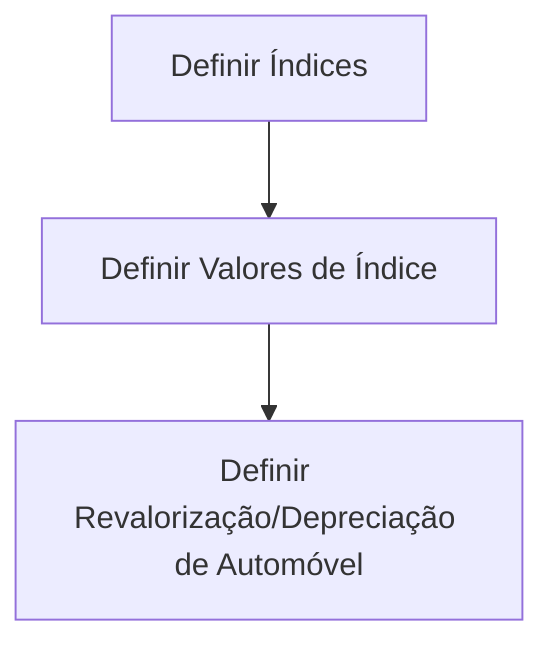

# Definição de Revalorização/Depreciação de Automóvel

## 1. Metadados do Documento
- **Arquivo de Origem:** Não identificado
- **Tipo de Documento:** Apresentação Executiva
- **Domínio / Sistema:** Revalorização/depreciação de automóvel; Zeus
- **Público-Alvo:** Negócio, desenvolvedores e operação
- **Data/Versão Identificada:** Não identificada

---

## 2. Resumo Executivo & Contexto de Negócio

O documento apresenta uma estrutura introdutória para a definição de revalorização/depreciação de automóvel. O conteúdo indica que o processo é organizado em três etapas sequenciais: definir índices, definir valores de índice e definir a revalorização/depreciação do automóvel.

A apresentação contém seções previstas para objetivo, explicação do conceito, características gerais e processo a seguir. Contudo, o texto extraído não fornece detalhamento sobre o objetivo operacional, fórmulas, regras de cálculo, critérios de elegibilidade ou resultados esperados da revalorização/depreciação.

A sequência apresentada sugere uma dependência funcional entre índices, valores de índice e a definição final de revalorização/depreciação de automóvel. Não há especificação de sistemas de origem, APIs, contratos, tecnologias, ambientes, responsáveis ou periodicidade de execução.

O rodapé menciona “Soluciones”, “APIs”, “Documentación” e “Zeus”, além dos marcadores “RS” e “ES”. O documento não explica a função, expansão ou relação desses termos com o processo de revalorização/depreciação.

---

## 3. Arquitetura, Componentes & Tecnologias Envolvidas

O documento não descreve uma arquitetura técnica completa. Os únicos elementos explicitamente apresentados são as etapas funcionais de definição de índices, valores de índice e revalorização/depreciação de automóvel.

| Componente / Elemento | Papel identificado no documento | Detalhamento disponível |
| :--- | :--- | :--- |
| Índices | Primeira etapa do processo. | Não há definição dos tipos, fontes ou regras dos índices. |
| Valores de índice | Segunda etapa do processo. | Não há formato, período de vigência ou método de manutenção informado. |
| Revalorização/depreciação automóvel | Terceira etapa do processo. | Não há fórmula, condições ou saída detalhada. |
| Zeus | Termo presente no rodapé. | Não detalhado no conteúdo extraído. |
| Soluciones | Termo presente no rodapé. | Não detalhado no conteúdo extraído. |
| APIs | Termo presente no rodapé. | Não há endpoints, métodos HTTP ou contratos descritos. |
| Documentación | Termo presente no rodapé. | Não há referência documental adicional. |



> **Nota de Análise:** O documento apresenta um fluxo de três etapas, mas não detalha componentes de software, integrações, tecnologias, APIs, contratos JSON, bancos de dados ou ambientes técnicos.

---

## 4. Regras de Negócio, Especificações Funcionais & Processos

### Processo explicitamente apresentado

1. **Definir índices**
   - O documento identifica a definição de índices como a primeira etapa do processo.
   - Não são apresentados nomes de índices, critérios de seleção, origem dos dados, fórmulas ou responsáveis pela definição.

2. **Definir valores de índice**
   - O documento identifica a definição de valores de índice como a segunda etapa.
   - Não são apresentados valores concretos, tipos de dados, unidades, datas de vigência, limites ou regras de atualização.

3. **Definir revalorização/depreciação de automóvel**
   - O documento identifica essa definição como a terceira etapa.
   - Não são apresentados critérios para revalorização ou depreciação, cálculo monetário, percentual, frequência, condições de aprovação ou tratamento de exceções.

### Tópicos declarados sem detalhamento adicional

- Objetivo
- “¿En qué consiste?”
- Características gerais
- Processo a seguir

> **Nota de Análise:** A extração contém apenas títulos e etapas. Não há regras de negócio detalhadas, critérios de validação, parâmetros de cálculo ou exceções operacionais sustentadas pelo texto original.

---

## 5. Tabelas de Parâmetros, Ambientes e Estruturas de Dados

| Item / Parâmetro | Descrição / Função | Tipo / Valores / Formato | Ambiente / Observações |
| :--- | :--- | :--- | :--- |
| Índices | Elemento a ser definido na etapa 1. | Não informado. | Não informado. |
| Valores de índice | Elemento a ser definido na etapa 2. | Não informado. | Não informado. |
| Revalorização/depreciação automóvel | Elemento a ser definido na etapa 3. | Não informado. | Não informado. |
| Soluciones | Item listado no rodapé. | Não informado. | Relação com o processo não detalhada. |
| APIs | Item listado no rodapé. | Não informado. | Não há URLs, métodos ou contratos. |
| Documentación | Item listado no rodapé. | Não informado. | Não há documentos vinculados. |
| Zeus | Item listado no rodapé. | Não informado. | Relação com o processo não detalhada. |
| RS | Marcador listado no rodapé. | Não informado. | Sigla não expandida. |
| ES | Marcador listado no rodapé. | Não informado. | Sigla não expandida. |

---

## 6. Bateria de Perguntas & Respostas para RAG (FAQ Sintético)

### P1: Qual é o tema central do documento?
**R:** O documento trata da definição de revalorização/depreciação de automóvel e apresenta um processo composto por definição de índices, definição de valores de índice e definição da revalorização/depreciação do automóvel.

### P2: Quais são as etapas do processo de revalorização/depreciação de automóvel?
**R:** O processo apresentado possui três etapas: 1) definir índices, 2) definir valores de índice e 3) definir revalorização/depreciação de automóvel.

### P3: O documento informa quais índices devem ser utilizados?
**R:** Não. O documento apenas indica que os índices devem ser definidos na primeira etapa, sem listar nomes, fontes, fórmulas ou critérios de utilização.

### P4: O documento apresenta valores concretos para os índices?
**R:** Não. A apresentação cita a definição de valores de índice como segunda etapa, mas não fornece valores, formato, unidade, vigência ou regra de atualização.

### P5: Como é calculada a revalorização ou depreciação do automóvel?
**R:** O cálculo não é detalhado no conteúdo extraído. O documento somente estabelece que a revalorização/depreciação de automóvel deve ser definida após as etapas de índices e valores de índice.

### P6: Existem regras de negócio ou critérios de validação para o processo?
**R:** Não há regras de negócio, critérios de validação, exceções ou condições operacionais descritas no texto extraído.

### P7: O documento especifica APIs para o processo de revalorização/depreciação?
**R:** Não. O termo “APIs” aparece no rodapé, mas não há endpoints, métodos HTTP, parâmetros, autenticação ou contratos de integração descritos.

### P8: Qual é o papel de Zeus no processo?
**R:** O termo “Zeus” aparece no rodapé da apresentação, mas o documento não explica seu papel, sua função ou sua relação com a definição de revalorização/depreciação.

### P9: O documento informa o objetivo da revalorização/depreciação?
**R:** O documento contém a seção “Objetivo”, mas o texto extraído não apresenta conteúdo explicativo para essa seção.

### P10: Há informações sobre ambiente, servidor, versão ou data do documento?
**R:** Não. A extração não contém URLs de ambiente, servidores, versão identificada ou data identificada.

---

## 7. Glossário de Termos, Siglas & Conceitos-Chave

- **Revalorização/depreciação:** Processo mencionado no documento para automóvel; critérios e método de cálculo não são detalhados.
- **Índices:** Elementos que devem ser definidos na primeira etapa do processo.
- **Valores de índice:** Valores associados aos índices, a serem definidos na segunda etapa do processo.
- **APIs:** Termo listado no rodapé; não expandido ou detalhado no documento.
- **Zeus:** Termo listado no rodapé; não definido no documento.
- **RS:** Marcador listado no rodapé; significado não identificado.
- **ES:** Marcador listado no rodapé; significado não identificado.
- **Soluciones:** Termo em espanhol listado no rodapé; função não especificada.
- **Documentación:** Termo em espanhol listado no rodapé; função não especificada.

---

## 8. Notas Críticas, Riscos & Limitações

- O conteúdo extraído é predominantemente estrutural e não contém detalhamento técnico ou funcional suficiente para implementar o processo.
- Não há definição de fórmulas, critérios, fontes de dados, periodicidade, unidades, vigência ou responsáveis pelos índices e respectivos valores.
- Não há contratos de integração, especificações de APIs, URLs, ambientes, autenticação ou dados de infraestrutura.
- Os termos “Zeus”, “RS”, “ES”, “Soluciones”, “APIs” e “Documentación” não são explicados.
- Não há indicação de versão, data, autoria ou aprovação do documento.
- A ausência de detalhamento impede concluir como a revalorização/depreciação é calculada, validada, persistida ou consumida por outros sistemas.

---

## 9. Conteúdo Bruto Estruturado (Referência Fiel)

```text
--- [PÁGINA 1 DE 1] ---

EN CONSTRUCCIÓN
DEFINICIÓN de Revalorización/depreciación
Objetivo
¿En qué consiste?
Características generales
Proceso a seguir
DEFINIR
Índices
(1)
DEFINIR
Valores de índice
(2)
DEFINIR
Revalorización/depreciación
automóvil
(3)
1. DEFINIR Índices
2. DEFINIR Valores de índice
3. DEFINIR Revalorización/depreciación automóvil
 /
 RS
Inicio Soluciones APIs Documentación Zeus
ES
```
