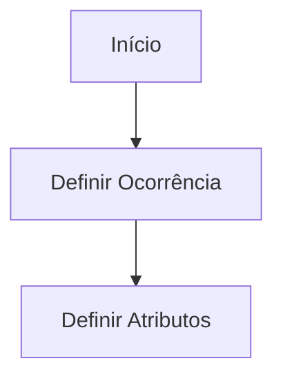

# Definição de Ocorrência — Documento em Construção

## 1. Metadados do Documento
- **Arquivo de Origem:** `Não identificado`
- **Tipo de Documento:** `Procedimento`
- **Domínio / Sistema:** `Não identificado`
- **Público-Alvo:** `Não identificado`
- **Data/Versão Identificada:** `Não identificada`

---

## 2. Resumo Executivo & Contexto de Negócio

O conteúdo apresenta um documento em construção sobre a **definição de ocorrência**. O material indica como tópicos principais o objetivo, a explicação sobre em que consiste uma ocorrência, características gerais e o processo a seguir.

O processo explicitamente apresentado possui duas etapas: **definir a ocorrência** e **definir atributos**. A estrutura sugere que a definição dos atributos depende da prévia definição da ocorrência.

O documento também contém referências textuais a “Inicio”, “Soluciones”, “APIs”, “Documentación”, “Zeus”, “ES” e “RS”. Contudo, o conteúdo fornecido não explica o significado, a função ou a relação entre esses termos.

Não há detalhamento de regras operacionais, atributos, contratos de APIs, responsáveis, ambientes, critérios de validação ou resultados esperados. O documento deve ser tratado como um esboço estrutural, não como uma especificação completa.

---

## 3. Arquitetura, Componentes & Tecnologias Envolvidas

O conteúdo não descreve arquitetura de software, componentes técnicos, microsserviços, tecnologias, integrações ou ambientes. Os únicos termos potencialmente relacionados a plataformas ou navegação são “APIs”, “Documentación” e “Zeus”, sem descrição adicional.



> **Nota de Análise:** O documento menciona “APIs”, “Documentación” e “Zeus”, porém não detalha integrações, métodos HTTP, contratos, tecnologias ou responsabilidades associadas.

---

## 4. Regras de Negócio, Especificações Funcionais & Processos

### Processo identificado

1. **Definir Ocorrência**
   - O documento identifica esta atividade como a primeira etapa do processo.
   - Não são informados critérios, campos, responsáveis, validações ou saídas para a definição de ocorrência.

2. **Definir Atributos**
   - O documento identifica esta atividade como a segunda etapa do processo.
   - Não são informados quais atributos devem ser definidos, seus formatos, obrigatoriedade ou regras de negócio.

### Tópicos anunciados sem detalhamento

- Objetivo.
- ¿En qué consiste?
- Características generales.
- Proceso a seguir.

> **Nota de Análise:** O conteúdo lista os tópicos acima, mas não apresenta explicações adicionais para eles.

---

## 5. Tabelas de Parâmetros, Ambientes e Estruturas de Dados

| Item / Parâmetro | Descrição / Função | Tipo / Valores / Formato | Ambiente / Observações |
| :--- | :--- | :--- | :--- |
| Ocorrência | Elemento a ser definido na primeira etapa do processo. | Não informado. | Não há critérios ou estrutura descritos. |
| Atributos | Elementos a serem definidos após a ocorrência. | Não informado. | O documento não enumera atributos. |
| APIs | Termo citado no conteúdo. | Não informado. | Não há endpoints, métodos ou contratos. |
| Documentación | Termo citado no conteúdo. | Não informado. | Não há referência a repositório, URL ou formato. |
| Zeus | Termo citado no conteúdo. | Não informado. | Não há definição funcional ou técnica. |
| ES | Sigla ou identificador citado no conteúdo. | Não informado. | Significado não identificado. |
| RS | Sigla ou identificador citado no conteúdo. | Não informado. | Significado não identificado. |

---

## 6. Bateria de Perguntas & Respostas para RAG (FAQ Sintético)

### P1: Qual é o assunto principal do documento?
**R:** O documento aborda a definição de ocorrência e está identificado como “EN CONSTRUCCIÓN”, indicando conteúdo ainda em elaboração.

### P2: Quais etapas do processo de definição de ocorrência estão apresentadas?
**R:** O processo contém duas etapas: primeiro, **DEFINIR Ocorrência**; segundo, **DEFINIR Atributos**.

### P3: O documento descreve como definir uma ocorrência?
**R:** Não. O documento indica “DEFINIR Ocorrencia” como primeira etapa, mas não fornece critérios, campos, validações ou instruções detalhadas.

### P4: Quais atributos devem ser definidos para uma ocorrência?
**R:** O documento informa que existe uma etapa denominada “DEFINIR Atributos”, mas não lista os atributos nem descreve seus tipos, formatos ou obrigatoriedade.

### P5: O documento explica as características gerais da ocorrência?
**R:** Não. “Características generales” aparece como tópico, sem conteúdo explicativo adicional.

### P6: O documento especifica APIs relacionadas à definição de ocorrência?
**R:** Não. O termo “APIs” é citado, mas o documento não apresenta endpoints, métodos HTTP, autenticação, payloads ou contratos de integração.

### P7: O que é Zeus no contexto do documento?
**R:** O termo “Zeus” aparece no conteúdo, porém não possui definição funcional, técnica ou contextual adicional.

### P8: Há ambientes, servidores ou URLs definidos?
**R:** Não. O conteúdo fornecido não apresenta ambientes, servidores, URLs, portas ou parâmetros de configuração.

### P9: O documento contém uma data ou versão?
**R:** Não. Não foi identificada data, versão, autoria ou identificação formal do documento no texto fornecido.

### P10: Qual é a relação entre definição de ocorrência e definição de atributos?
**R:** A estrutura do processo apresenta “DEFINIR Ocorrencia” como etapa 1 e “DEFINIR Atributos” como etapa 2, indicando uma sequência na qual a ocorrência é definida antes dos atributos.

---

## 7. Glossário de Termos, Siglas & Conceitos-Chave

- **Ocorrência:** Entidade ou conceito que o documento determina que deve ser definido; não há detalhamento adicional.
- **Atributos:** Elementos associados à ocorrência que devem ser definidos na segunda etapa; não são especificados.
- **APIs:** Termo citado no documento sem definição de interfaces, contratos ou integrações.
- **Documentación:** Termo em espanhol que significa documentação; não há conteúdo adicional associado.
- **Zeus:** Nome citado no documento sem definição contextual.
- **ES:** Sigla ou identificador citado sem significado definido.
- **RS:** Sigla ou identificador citado sem significado definido.
- **EN CONSTRUCCIÓN:** Expressão em espanhol que indica que o documento está em construção.

---

## 8. Notas Críticas, Riscos & Limitações

- O documento está explicitamente marcado como **“EN CONSTRUCCIÓN”**.
- Não há definição formal para “ocorrência”.
- Não há catálogo ou estrutura de atributos.
- Não há regras de negócio, critérios de validação, papéis responsáveis ou fluxos de exceção.
- Não há especificações de APIs, documentação técnica, ambientes ou integrações.
- Os termos “Zeus”, “ES” e “RS” não são explicados.
- A ausência de detalhamento impede a implementação ou operação do processo sem fontes complementares.

---

## 9. Conteúdo Bruto Estruturado (Referência Fiel)

```text
--- [PÁGINA 1 DE 1] ---

EN CONSTRUCCIÓN
DEFINICIÓN de Ocurrencia
Objetivo
¿En qué consiste?
Características generales
Proceso a seguir
DEFINIR
Ocurrencia
(1)
DEFINIR
Atributos
(2)
1. DEFINIR Ocurrencia
2. DEFINIR Atributos
 /
 RS
Inicio Soluciones APIs Documentación Zeus
ES
```
