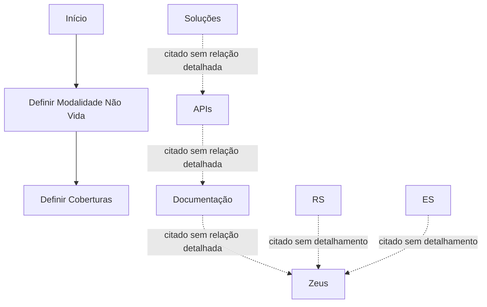

# Definição de Modalidade Não Vida — Conteúdo em Construção

## 1. Metadados do Documento
- **Arquivo de Origem:** Não informado
- **Tipo de Documento:** Apresentação Executiva
- **Domínio / Sistema:** Definição de Modalidade Não Vida; Zeus
- **Público-Alvo:** Não identificado
- **Data/Versão Identificada:** Não identificada

---

## 2. Resumo Executivo & Contexto de Negócio

O documento apresenta um conteúdo em construção sobre a **definição de modalidade não vida**. A estrutura indicada aborda o objetivo, a descrição da modalidade, características gerais e o processo a seguir.

O processo central apresentado possui duas etapas explícitas: primeiro, definir a modalidade não vida; segundo, definir as coberturas. O material não detalha critérios, responsáveis, regras de validação, dados de entrada, saídas ou contratos associados a essas etapas.

O documento também lista os termos **Início**, **Soluções**, **APIs**, **Documentação**, **Zeus**, **RS** e **ES**. Entretanto, não explicita as relações entre esses elementos nem descreve funcionalidades, integrações ou responsabilidades.

> **Nota de Análise:** O conteúdo extraído possui caráter resumido. Não há detalhamento adicional sobre a modalidade não vida, coberturas, APIs, documentação, Zeus, RS ou ES.

---

## 3. Arquitetura, Componentes & Tecnologias Envolvidas

Os elementos citados são:

- Modalidade não vida
- Coberturas
- Soluções
- APIs
- Documentação
- Zeus
- RS
- ES

O texto não descreve arquitetura técnica, tecnologias, protocolos, endpoints, ambientes, integrações ou fluxo de dados. O único fluxo identificável é o processo sequencial de definição da modalidade e, posteriormente, das coberturas.



---

## 4. Regras de Negócio, Especificações Funcionais & Processos

### Processo identificado

1. **Definir modalidade não vida**
   - O documento identifica esta atividade como a primeira etapa do processo.
   - Não informa os atributos da modalidade, critérios de classificação, responsáveis, validações ou resultado esperado.

2. **Definir coberturas**
   - O documento identifica esta atividade como a segunda etapa do processo.
   - Não informa quais coberturas devem ser definidas, regras de elegibilidade, valores, limites, exclusões ou dependência com a modalidade não vida.

### Restrições de interpretação

- Não há regras de negócio detalhadas.
- Não há especificação funcional de telas, campos ou jornadas.
- Não há contratos de APIs, métodos HTTP, URLs, payloads ou respostas.
- Não há instruções operacionais para Zeus, RS ou ES.
- Não há evidência textual que permita expandir o significado das siglas RS e ES.

---

## 5. Tabelas de Parâmetros, Ambientes e Estruturas de Dados

| Item / Parâmetro | Descrição / Função | Tipo / Valores / Formato | Ambiente / Observações |
| :--- | :--- | :--- | :--- |
| Modalidade não vida | Elemento a ser definido na primeira etapa do processo. | Não informado | Sem critérios ou atributos descritos. |
| Coberturas | Elemento a ser definido na segunda etapa do processo. | Não informado | Sem catálogo, regras ou associação detalhada com modalidade não vida. |
| Soluções | Termo listado no conteúdo. | Não informado | Relação com outros elementos não detalhada. |
| APIs | Termo listado no conteúdo. | Não informado | Não há endpoints, métodos HTTP ou contratos JSON. |
| Documentação | Termo listado no conteúdo. | Não informado | Não há localização, formato ou conteúdo descrito. |
| Zeus | Termo listado no conteúdo. | Não informado | O documento não define Zeus como sistema, módulo ou ambiente. |
| RS | Sigla listada no conteúdo. | Não informado | Significado não identificado. |
| ES | Sigla listada no conteúdo. | Não informado | Significado não identificado. |
| Início | Ponto inicial indicado no fluxo visual. | Não informado | Não há condição de entrada descrita. |

---

## 6. Bateria de Perguntas & Respostas para RAG (FAQ Sintético)

### P1: Qual é o tema principal do documento?
**R:** O documento trata da definição de uma modalidade não vida e da definição de coberturas associadas. O conteúdo está identificado como “em construção”.

### P2: Quais etapas do processo são explicitamente apresentadas?
**R:** O documento apresenta duas etapas: primeiro, definir a modalidade não vida; depois, definir as coberturas.

### P3: O documento explica como definir uma modalidade não vida?
**R:** Não. O documento apenas lista “Definir Modalidade no vida” como a primeira etapa, sem critérios, campos, regras ou responsáveis.

### P4: Quais coberturas devem ser definidas para a modalidade não vida?
**R:** O documento não especifica quais coberturas devem ser definidas. Apenas indica “Definir Coberturas” como a segunda etapa do processo.

### P5: Existem regras de negócio para validar a modalidade não vida?
**R:** Não há regras de negócio, condições de validação, cálculos ou restrições detalhadas no conteúdo fornecido.

### P6: O documento fornece especificações de APIs?
**R:** Não. Embora o termo “APIs” seja citado, não há métodos HTTP, URLs, autenticação, parâmetros, contratos JSON ou respostas documentados.

### P7: Qual é o papel de Zeus no processo?
**R:** O termo “Zeus” aparece no conteúdo, mas o documento não descreve sua função, integração, responsabilidade ou relação com a definição de modalidade não vida.

### P8: O que significam as siglas RS e ES?
**R:** O significado de RS e ES não é definido no documento. As siglas são apenas listadas no conteúdo extraído.

### P9: Há documentação operacional ou técnica disponível no material?
**R:** O termo “Documentação” é citado, mas o material não apresenta links, repositórios, procedimentos, localização ou conteúdo documental.

### P10: O documento identifica ambientes, servidores ou URLs?
**R:** Não. Não foram identificados ambientes, servidores, URLs, portas, credenciais ou configurações técnicas.

---

## 7. Glossário de Termos, Siglas & Conceitos-Chave

- **Modalidade não vida:** Entidade ou conceito que o documento determina que deve ser definido na primeira etapa; não há definição adicional.
- **Coberturas:** Entidade ou conceito que o documento determina que deve ser definido na segunda etapa; não há definição adicional.
- **APIs:** Termo citado no documento sem especificações técnicas adicionais.
- **Zeus:** Termo citado no documento sem definição funcional ou técnica adicional.
- **RS:** Sigla citada sem expansão ou significado identificado.
- **ES:** Sigla citada sem expansão ou significado identificado.

---

## 8. Notas Críticas, Riscos & Limitações

- O documento está explicitamente marcado como **“EN CONSTRUCCIÓN”**.
- O conteúdo não fornece detalhamento suficiente para implementação, operação, integração ou validação técnica.
- Não há definição de responsabilidades, critérios de aceite, entradas, saídas ou exceções do processo.
- A relação entre Soluções, APIs, Documentação, Zeus, RS e ES não está documentada.
- Não foram identificadas versões, datas, ambientes, URLs, logs, dependências ou contratos de integração.
- A expansão das siglas RS e ES não é suportada pelo conteúdo original e, portanto, não deve ser inferida.

---

## 9. Conteúdo Bruto Estruturado (Referência Fiel)

```text
--- [PÁGINA 1 DE 1] ---

EN CONSTRUCCIÓN
DEFINICIÓN de Modalidad (no vida)
Objetivo
¿En qué consiste?
Características generales
Proceso a seguir
DEFINIR
Modalidad
no vida
(1)
DEFINIR
Coberturas
(2)
1. DEFINIR Modalidad no vida
2. DEFINIR Coberturas
 /
 RS
Inicio Soluciones APIs Documentación Zeus
ES
```
