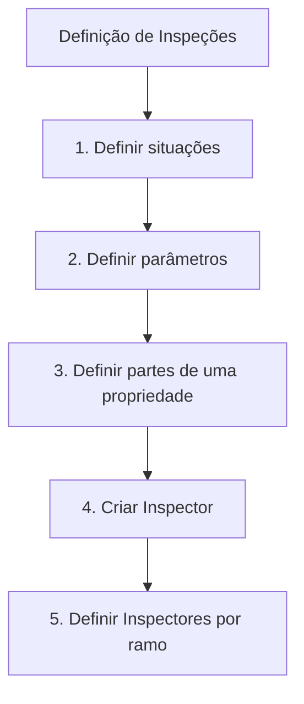

# Definição de Inspeções — Processo de Configuração no Zeus

## 1. Metadados do Documento
- **Arquivo de Origem:** Não identificado
- **Tipo de Documento:** Apresentação Executiva
- **Domínio / Sistema:** Inspeções / Zeus
- **Público-Alvo:** Negócio, Operação, Desenvolvedores e Arquitetos
- **Data/Versão Identificada:** Não identificada

---

## 2. Resumo Executivo & Contexto de Negócio

O documento apresenta uma definição de alto nível para o domínio de **Inspeções**, indicando um processo de configuração composto por cinco etapas sequenciais. O conteúdo está identificado como “EN CONSTRUCCIÓN”, sinalizando que a definição apresentada pode estar em elaboração.

O processo começa pela definição de situações e parâmetros. Em seguida, aborda a definição das partes de uma propriedade, a criação de um Inspector e, por fim, a associação ou definição de inspectores por ramo.

A apresentação referencia o ambiente ou sistema **Zeus**, além de menus ou áreas nomeadas “Inicio”, “Soluciones”, “APIs” e “Documentación”. Contudo, o texto não explica as responsabilidades dessas áreas nem apresenta contratos técnicos, integrações, critérios de negócio ou detalhes operacionais.

O objetivo explícito é apresentado pelo título “DEFINICIÓN de Inspecciones”, mas o documento não detalha o que constitui uma inspeção, quais dados devem ser registrados, quais ramos existem ou quais regras governam a criação e associação de inspectores.

---

## 3. Arquitetura, Componentes & Tecnologias Envolvidas

Os elementos explicitamente citados são:

- **Inspeções:** domínio funcional central da apresentação.
- **Situações:** primeiro elemento a ser definido no processo.
- **Parâmetros:** segundo elemento a ser definido.
- **Partes de uma propriedade:** estrutura a ser definida antes da criação de um Inspector.
- **Inspector:** entidade ou recurso que deve ser criado.
- **Inspectores por ramo:** associação ou configuração final indicada pelo fluxo.
- **Zeus:** sistema ou contexto de navegação mencionado no conteúdo.
- **Inicio, Soluciones, APIs e Documentación:** itens textuais apresentados como áreas ou opções de navegação.



> **Nota de Análise:** O documento não descreve arquitetura de software, microsserviços, bancos de dados, protocolos, APIs, métodos HTTP, contratos JSON, tecnologias de implementação ou ambientes técnicos.

---

## 4. Regras de Negócio, Especificações Funcionais & Processos

O documento define o seguinte processo para a configuração de Inspeções:

1. **Definir situações**
   - A primeira etapa consiste em definir situações.
   - O conteúdo não informa quais situações existem, seus identificadores, condições de uso ou transições possíveis.

2. **Definir parâmetros**
   - A segunda etapa consiste em definir parâmetros.
   - O documento não apresenta nomes, valores, tipos, obrigatoriedade ou regras de validação para os parâmetros.

3. **Definir partes de uma propriedade**
   - A terceira etapa consiste em definir as partes de uma propriedade.
   - O documento não detalha quais partes podem compor uma propriedade, sua estrutura ou relacionamento com uma inspeção.

4. **Criar Inspector**
   - A quarta etapa consiste em criar um Inspector.
   - O conteúdo não especifica atributos do Inspector, permissões, credenciais, identificadores ou critérios de criação.

5. **Definir Inspectores por ramo**
   - A quinta etapa consiste em definir Inspectores por ramo.
   - O documento não identifica os ramos existentes, as regras de associação nem a cardinalidade entre Inspector e ramo.

> **Nota de Análise:** A sequência das cinco etapas está explicitamente apresentada, mas não há detalhamento adicional sobre entradas, saídas, responsáveis, validações, exceções ou critérios de conclusão de cada etapa.

---

## 5. Tabelas de Parâmetros, Ambientes e Estruturas de Dados

| Item / Parâmetro | Descrição / Função | Tipo / Valores / Formato | Ambiente / Observações |
| :--- | :--- | :--- | :--- |
| Situações | Primeiro elemento a definir no processo de Inspeções. | Não especificado. | Não há lista de situações ou regras associadas. |
| Parâmetros | Segundo elemento a definir no processo de Inspeções. | Não especificado. | Não há nomes, valores ou formatos. |
| Partes de uma propriedade | Elementos de uma propriedade a serem definidos antes da criação do Inspector. | Não especificado. | Não há estrutura ou catálogo de partes. |
| Inspector | Entidade ou recurso a ser criado na quarta etapa. | Não especificado. | O documento usa o termo singular “Inspector”. |
| Inspectores por ramo | Configuração ou associação indicada na quinta etapa. | Não especificado. | Os ramos não são identificados. |
| Zeus | Sistema ou contexto citado no rodapé do conteúdo. | Não especificado. | Sem URL, versão ou ambiente informado. |
| Inicio | Item textual citado no rodapé. | Não especificado. | Sem detalhamento funcional. |
| Soluciones | Item textual citado no rodapé. | Não especificado. | Sem detalhamento funcional. |
| APIs | Item textual citado no rodapé. | Não especificado. | Nenhuma API é descrita. |
| Documentación | Item textual citado no rodapé. | Não especificado. | Nenhuma documentação adicional é fornecida. |
| RS | Sigla exibida no rodapé. | Não especificado. | O documento não expande a sigla. |
| ES | Sigla exibida no rodapé. | Não especificado. | O documento não expande a sigla. |

---

## 6. Bateria de Perguntas & Respostas para RAG (FAQ Sintético)

### P1: Qual é o objetivo principal do documento “DEFINICIÓN de Inspecciones”?
**R:** O documento apresenta uma definição de alto nível para Inspeções e enumera um processo de cinco etapas: definir situações, definir parâmetros, definir partes de uma propriedade, criar um Inspector e definir Inspectores por ramo.

### P2: Quais são as etapas do processo de definição de Inspeções?
**R:** As etapas apresentadas são: 1) definir situações; 2) definir parâmetros; 3) definir partes de uma propriedade; 4) criar Inspector; e 5) definir Inspectores por ramo.

### P3: O que deve ser definido antes de criar um Inspector?
**R:** Antes de criar um Inspector, o processo apresentado exige definir situações, definir parâmetros e definir as partes de uma propriedade.

### P4: Em qual etapa do processo é criado o Inspector?
**R:** O Inspector é criado na quarta etapa, identificada como “CREAR Inspector”.

### P5: O documento informa quais campos ou atributos um Inspector possui?
**R:** Não. O documento somente indica a etapa “CREAR Inspector”, sem informar campos, identificadores, permissões, dados obrigatórios ou regras de validação.

### P6: O documento detalha quais situações devem ser configuradas para Inspeções?
**R:** Não. O documento informa apenas que situações devem ser definidas na primeira etapa; não fornece uma lista de situações, critérios de seleção ou regras de transição.

### P7: Quais parâmetros devem ser definidos para Inspeções?
**R:** O documento determina que parâmetros devem ser definidos na segunda etapa, mas não apresenta os nomes, tipos, valores permitidos, formatos ou regras desses parâmetros.

### P8: O que são as “partes de uma propriedade” no processo de Inspeções?
**R:** O documento cita “partes de una propiedad” como a terceira definição necessária no processo, mas não explica quais partes existem, como são modeladas ou como se relacionam às Inspeções.

### P9: Como os Inspectores são associados aos ramos?
**R:** O documento indica “DEFINIR inspectores por ramo” como quinta etapa, porém não especifica os ramos, a forma de associação, critérios de seleção ou regras de permissão.

### P10: O documento apresenta APIs ou contratos de integração para Inspeções?
**R:** Não. Embora o texto mencione “APIs” no rodapé, não há especificações de endpoints, métodos HTTP, autenticação, payloads, respostas ou contratos de integração.

### P11: Qual sistema é citado no documento?
**R:** O sistema ou contexto explicitamente citado é “Zeus”. O documento não apresenta informações adicionais sobre a função, arquitetura, versão ou ambiente do Zeus.

### P12: O documento está concluído?
**R:** O texto contém a indicação “EN CONSTRUCCIÓN”, sugerindo que o material está em construção. Não há versão, data, status formal de aprovação ou indicação de conclusão.

---

## 7. Glossário de Termos, Siglas & Conceitos-Chave

- **Inspeções:** domínio ou processo central abordado pelo documento; não recebe definição detalhada no conteúdo.
- **Situações:** elemento que deve ser definido na primeira etapa do processo de Inspeções.
- **Parâmetros:** elemento que deve ser definido na segunda etapa do processo de Inspeções.
- **Partes de uma propriedade:** elemento que deve ser definido na terceira etapa do processo.
- **Inspector:** entidade ou recurso que deve ser criado na quarta etapa.
- **Inspectores por ramo:** configuração indicada na quinta etapa; o documento não detalha o significado de “ramo”.
- **Zeus:** sistema ou contexto mencionado no documento, sem detalhamento adicional.
- **APIs:** termo apresentado no rodapé; não há descrição de interfaces, contratos ou integrações.
- **RS:** sigla apresentada no conteúdo sem expansão ou definição.
- **ES:** sigla apresentada no conteúdo sem expansão ou definição.
- **EN CONSTRUCCIÓN:** indicação de que o conteúdo está em construção.

---

## 8. Notas Críticas, Riscos & Limitações

- O documento possui caráter resumido e não fornece especificações técnicas implementáveis.
- Não há descrição de regras de validação, critérios de elegibilidade, responsabilidades, exceções ou fluxos alternativos.
- Não são identificados os valores permitidos para situações, parâmetros, partes de propriedade ou ramos.
- Não há contratos de API, URLs, ambientes, credenciais, rotas de log, mecanismos de autenticação ou detalhes de integração.
- Não há definição dos dados necessários para criar um Inspector.
- As siglas **RS** e **ES** não são explicadas.
- A indicação “EN CONSTRUCCIÓN” sugere risco de incompletude ou alteração futura do conteúdo.
- O documento não permite inferir a arquitetura técnica do sistema Zeus ou o papel das áreas “Inicio”, “Soluciones”, “APIs” e “Documentación”.

---

## 9. Conteúdo Bruto Estruturado (Referência Fiel)

```text
--- [PÁGINA 1 DE 1] ---

EN CONSTRUCCIÓN
DEFINICIÓN de Inspecciones
Objetivo
¿En qué consiste?
Características generales
Proceso a seguir
DEFINIR
situaciones
(1)
DEFINIR
parámetros
(2)
DEFINIR
partes
de una propiedad
(2)
CREAR
Inspector
(3)
DEFINIR
inspectores
por ramo
(4)
1. DEFINIR situaciones
2. DEFINIR parámetros
3. DEFINIR partes de una propiedad
4. CREAR Inspector
5. DEFINIR Inspectores por ramo
 / 
 RS
Inicio Soluciones APIs Documentación Zeus
ES
```
