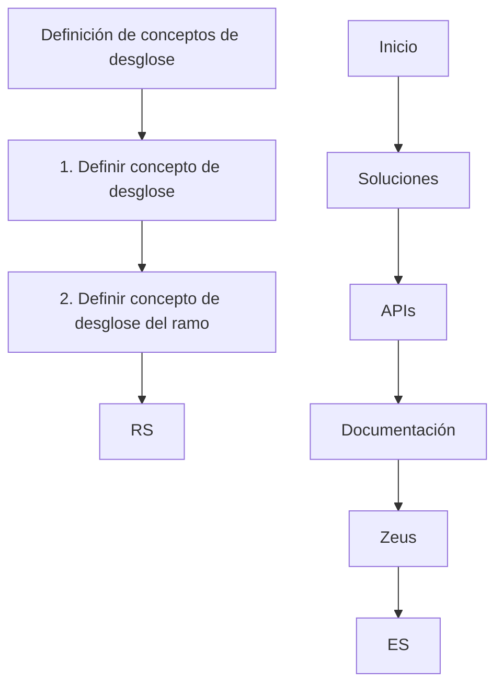

# Documento de Construção: Definição de Conceitos de Desglose

## 1. Metadados do Documento
- **Arquivo de Origem:** Não identificado
- **Tipo de Documento:** Apresentação Executiva
- **Domínio / Sistema:** Soluciones APIs / Zeus
- **Público-Alvo:** Não identificado
- **Data/Versão Identificada:** Não identificada

---

## 2. Resumo Executivo & Contexto de Negócio

O documento apresenta uma iniciativa em construção denominada “Definición de conceptos de desglose”. O objetivo explícito é definir conceitos de desglose, incluindo uma definição específica relacionada ao ramo.

A apresentação organiza o tema em tópicos de objetivo, escopo (“¿En qué consiste?”), características gerais e processo a seguir. Entretanto, o conteúdo fornecido não detalha esses tópicos, nem descreve critérios, responsabilidades, regras operacionais ou resultados esperados.

O fluxo conceitual identificado começa pela definição do conceito de desglose e evolui para a definição do conceito de desglose do ramo. A sigla “RS” aparece associada a essa estrutura, sem expansão ou explicação no material.

O rodapé ou navegação apresentada referencia “Soluciones”, “APIs”, “Documentación”, “Zeus” e “ES”. O documento não explica a relação técnica, funcional ou organizacional entre esses termos.

---

## 3. Arquitetura, Componentes & Tecnologias Envolvidas

O material não descreve arquitetura de software, integrações, tecnologias, protocolos, APIs, ambientes ou contratos de dados. Os únicos elementos nomeados são “Soluciones”, “APIs”, “Documentación” e “Zeus”.



> **Nota de Análise:** O documento cita “APIs” e “Zeus”, mas não detalha endpoints, métodos HTTP, contratos, tecnologias, ambientes ou responsabilidades técnicas.

---

## 4. Regras de Negócio, Especificações Funcionais & Processos

O processo apresentado contém duas etapas nomeadas:

1. Definir conceito de desglose.
2. Definir conceito de desglose do ramo.

O documento também apresenta os tópicos “Objetivo”, “¿En qué consiste?”, “Características generales” e “Proceso a seguir”, mas não contém conteúdo adicional que especifique regras de negócio, validações, entradas, saídas, exceções, responsáveis ou critérios de conclusão.

A expressão “/ RS” aparece após as duas etapas, porém o documento não define o significado de “RS” nem sua função no processo.

---

## 5. Tabelas de Parâmetros, Ambientes e Estruturas de Dados

| Item / Parâmetro | Descrição / Função | Tipo / Valores / Formato | Ambiente / Observações |
| :--- | :--- | :--- | :--- |
| Definición de conceptos de desglose | Tema central do documento. | Conceito/processo em construção. | Não detalhado. |
| Definir concepto de desglose | Primeira etapa indicada. | Etapa de processo. | Sem critérios ou resultados descritos. |
| Definir concepto de desglose del ramo | Segunda etapa indicada. | Etapa de processo. | “Ramo” não é definido no documento. |
| RS | Termo associado às etapas de definição. | Sigla não expandida. | Não detalhado. |
| Soluciones | Item exibido na navegação. | Nome/termo citado. | Relação com o processo não especificada. |
| APIs | Item exibido na navegação. | Termo técnico citado. | Nenhuma API ou interface foi especificada. |
| Documentación | Item exibido na navegação. | Termo citado. | Sem referência a documentos ou repositórios. |
| Zeus | Item exibido na navegação. | Sistema ou domínio potencialmente citado. | Não detalhado. |
| ES | Item exibido na navegação. | Sigla ou indicador não definido. | Não detalhado. |

---

## 6. Bateria de Perguntas & Respostas para RAG (FAQ Sintético)

### P1: Qual é o objetivo central do documento?
**R:** O documento tem como objetivo apresentar a definição de conceitos de desglose. O conteúdo não descreve resultados esperados, indicadores ou escopo detalhado.

### P2: Quais etapas do processo são explicitamente apresentadas?
**R:** O processo apresenta duas etapas: “Definir concepto de desglose” e “Definir concepto de desglose del ramo”.

### P3: O que significa “desglose” no contexto do documento?
**R:** O documento usa “desglose” como conceito central, mas não fornece uma definição textual do termo.

### P4: O que é o “concepto de desglose del ramo”?
**R:** O “concepto de desglose del ramo” é apresentado como a segunda etapa do processo. O documento não explica o significado de “ramo” nem os critérios dessa definição.

### P5: Quais características gerais do processo são informadas?
**R:** O documento contém o título “Características generales”, mas não apresenta características adicionais no conteúdo disponibilizado.

### P6: O documento define regras de negócio ou validações?
**R:** Não. Não há regras, condições de validação, cálculos, exceções ou restrições operacionais descritas.

### P7: O documento especifica APIs ou integrações com Zeus?
**R:** Não. “APIs” e “Zeus” são citados na navegação, mas não há detalhes sobre integrações, endpoints, métodos ou contratos.

### P8: O que significa a sigla RS?
**R:** A sigla “RS” aparece após as duas etapas de definição, mas o documento não informa sua expansão ou significado.

### P9: Existem informações de ambiente, URL, servidor ou rota de logs?
**R:** Não. O documento não apresenta URLs, ambientes, servidores, parâmetros de infraestrutura ou rotas de logs.

### P10: O documento está concluído?
**R:** O título “EN CONSTRUCCIÓN” indica que o conteúdo está em construção. O material não informa data de conclusão, versão ou próximos responsáveis.

---

## 7. Glossário de Termos, Siglas & Conceitos-Chave

- **APIs:** Termo citado na navegação do documento; não detalhado.
- **Desglose:** Conceito central a ser definido; sem definição apresentada.
- **ES:** Sigla ou indicador citado na navegação; não definido.
- **RS:** Sigla citada após as etapas do processo; não definida.
- **Zeus:** Termo citado na navegação; sem descrição funcional ou técnica.

---

## 8. Notas Críticas, Riscos & Limitações

- O documento está identificado como “EN CONSTRUCCIÓN”.
- Não há definição explícita para “desglose”, “ramo”, “RS” ou “ES”.
- Não há detalhamento para os tópicos objetivo, escopo, características gerais e processo.
- Não há arquitetura técnica, especificação de APIs, contratos, ambientes ou dados operacionais.
- Não há indicação de versão, data, autoria, responsáveis ou público-alvo.
- A relação entre “Soluciones”, “APIs”, “Documentación” e “Zeus” não é explicada.

---

## 9. Conteúdo Bruto Estruturado (Referência Fiel)

```text
--- [PÁGINA 1 DE 1] ---

EN CONSTRUCCIÓN
DEFINICIÓN de conceptos de desglose
Objetivo
¿En qué consiste?
Características generales
Proceso a seguir
DEFINIR concepto
de desglose
(1)
DEFINIR concepto
de desglose
del ramo
(2)
1. DEFINIR concepto de desglose
2. DEFINIR concepto de desglose del ramo
 / 
 RS
Inicio Soluciones APIs Documentación Zeus
ES
```
