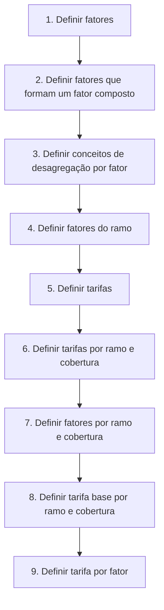

# Definição de Tarifa Multivariável — Processo de Configuração

## 1. Metadados do Documento
- **Arquivo de Origem:** Não identificado
- **Tipo de Documento:** Apresentação Executiva
- **Domínio / Sistema:** Definição de tarifa multivariável
- **Público-Alvo:** Negócio, Analistas Funcionais e Operação
- **Data/Versão Identificada:** Não identificada

---

## 2. Resumo Executivo & Contexto de Negócio

O documento apresenta um processo denominado **“Definición de tarifa multivariable”**, relacionado à construção e definição de tarifas. O conteúdo está identificado como “EN CONSTRUCCIÓN”, indicando que a apresentação ou o processo ainda está em elaboração.

A estrutura apresentada organiza a configuração de uma tarifa multivariável em nove etapas sequenciais. O fluxo inicia pela definição de fatores e avança pela composição de fatores, conceitos de desagregação, associação de fatores a ramos, definição de tarifas, coberturas, tarifa base e tarifa por fator.

O documento cita os conceitos de **ramo** e **cobertura** como dimensões utilizadas para definir tarifas e fatores. A tarifa base é igualmente definida por ramo e cobertura, antes da etapa final de definição da tarifa por fator.

Não há detalhamento adicional sobre fórmulas de cálculo, regras de validação, sistemas responsáveis, contratos de API, persistência de dados, papéis de aprovação ou critérios para composição dos fatores. A apresentação lista o processo, mas não especifica a implementação operacional ou técnica de cada etapa.

---

## 3. Arquitetura, Componentes & Tecnologias Envolvidas

O conteúdo não descreve arquitetura de software, servidores, bancos de dados, microsserviços, tecnologias ou integrações. Os únicos elementos adicionais identificados são referências de navegação ou interface: **Inicio**, **Soluciones**, **APIs**, **Documentación**, **Zeus**, **ES** e **RS**.

O processo funcional extraído pode ser representado pelo fluxo abaixo:



> **Nota de Análise:** O documento não detalha componentes tecnológicos, métodos HTTP, contratos JSON, URLs, bancos de dados ou responsáveis por cada fase do processo de tarifa multivariável.

---

## 4. Regras de Negócio, Especificações Funcionais & Processos

O processo de definição de tarifa multivariável contém as seguintes etapas:

1. **Definir fatores**  
   O processo começa com a definição dos fatores que participam da tarifa multivariável.

2. **Definir fatores que formam um fator composto**  
   Após a definição inicial dos fatores, são definidos os fatores que compõem um fator composto.

3. **Definir conceitos de desagregação por fator**  
   Para cada fator, são definidos conceitos de desagregação.

4. **Definir fatores do ramo**  
   Os fatores são relacionados ao ramo.

5. **Definir tarifas**  
   As tarifas são definidas como parte do processo de configuração.

6. **Definir tarifas por ramo e cobertura**  
   As tarifas são configuradas segundo as dimensões de ramo e cobertura.

7. **Definir fatores por ramo e cobertura**  
   Os fatores também são definidos conforme ramo e cobertura.

8. **Definir tarifa base por ramo e cobertura**  
   Uma tarifa base é definida para cada combinação de ramo e cobertura.

9. **Definir tarifa por fator**  
   A etapa final define a tarifa associada a cada fator.

> **Nota de Análise:** O documento não informa se as nove etapas são obrigatórias, se podem ser executadas em paralelo, quais são as dependências formais entre registros ou quais condições determinam a aprovação de uma tarifa.

---

## 5. Tabelas de Parâmetros, Ambientes e Estruturas de Dados

| Item / Parâmetro | Descrição / Função | Tipo / Valores / Formato | Ambiente / Observações |
| :--- | :--- | :--- | :--- |
| Fatores | Elementos definidos na primeira etapa do processo de tarifa multivariável. | Não especificado | Não há critérios, valores ou estrutura informados. |
| Fator composto | Fator formado por outros fatores. | Não especificado | O documento não define composição, fórmula ou hierarquia. |
| Conceitos de desagregação por fator | Conceitos associados ao desagregamento de um fator. | Não especificado | Não são apresentados exemplos ou regras de uso. |
| Fatores do ramo | Fatores definidos no contexto de um ramo. | Não especificado | O significado operacional de ramo não é detalhado. |
| Tarifas | Tarifas definidas no processo. | Não especificado | Não há fórmula, moeda, periodicidade ou critério de cálculo. |
| Tarifas por ramo e cobertura | Tarifas associadas a ramo e cobertura. | Não especificado | Não são informados valores, chaves ou regras de precedência. |
| Fatores por ramo e cobertura | Fatores associados a ramo e cobertura. | Não especificado | Não há mapeamento de fatores para ramos ou coberturas. |
| Tarifa base por ramo e cobertura | Tarifa base definida para ramo e cobertura. | Não especificado | Não há definição de cálculo ou manutenção da tarifa base. |
| Tarifa por fator | Tarifa definida para cada fator. | Não especificado | Etapa 9 do processo apresentado. |
| Inicio | Item textual de navegação identificado no documento. | Texto | Sem detalhamento adicional. |
| Soluciones | Item textual de navegação identificado no documento. | Texto | Sem detalhamento adicional. |
| APIs | Item textual de navegação identificado no documento. | Texto | O documento não descreve APIs. |
| Documentación | Item textual de navegação identificado no documento. | Texto | Sem detalhamento adicional. |
| Zeus | Termo exibido no documento. | Texto | Não há definição do papel de Zeus. |
| ES | Código textual exibido no documento. | Texto | Possível indicação de idioma, sem confirmação no conteúdo. |
| RS | Código textual exibido no documento. | Texto | Sem definição no conteúdo. |

---

## 6. Bateria de Perguntas & Respostas para RAG (FAQ Sintético)

### P1: Qual é o objetivo central do documento sobre tarifa multivariável?
**R:** O documento apresenta um processo para a definição de uma tarifa multivariável. O processo é estruturado em nove etapas, desde a definição de fatores até a definição da tarifa por fator.

### P2: Quantas etapas compõem o processo de definição de tarifa multivariável?
**R:** O processo contém nove etapas: definir fatores; definir fatores de um fator composto; definir conceitos de desagregação por fator; definir fatores do ramo; definir tarifas; definir tarifas por ramo e cobertura; definir fatores por ramo e cobertura; definir tarifa base por ramo e cobertura; e definir tarifa por fator.

### P3: Qual é a primeira etapa da definição de tarifa multivariável?
**R:** A primeira etapa é **definir fatores**. O documento não detalha quais atributos, valores, categorias ou regras devem ser usados para cadastrar esses fatores.

### P4: O que o documento informa sobre fator composto?
**R:** O documento inclui como segunda etapa a definição dos fatores que formam um fator composto. Entretanto, não informa como esses fatores são combinados, se possuem pesos ou se existe uma fórmula de composição.

### P5: Em que momento são definidos os conceitos de desagregação?
**R:** Os conceitos de desagregação por fator são definidos na terceira etapa do processo, depois da definição dos fatores e dos fatores que compõem um fator composto.

### P6: Como ramo e cobertura participam da configuração de tarifas?
**R:** O documento determina a definição de tarifas por ramo e cobertura na sexta etapa. Também determina a definição de fatores por ramo e cobertura na sétima etapa e da tarifa base por ramo e cobertura na oitava etapa.

### P7: O documento apresenta uma fórmula para calcular a tarifa base?
**R:** Não. O documento apenas estabelece que a tarifa base deve ser definida por ramo e cobertura. Não há fórmula, valor, moeda, frequência, unidade de cálculo ou regra de atualização descrita.

### P8: Qual é a última etapa do processo?
**R:** A última etapa é **definir tarifa por fator**. O documento não explica como essa tarifa se relaciona com a tarifa base, com o fator composto ou com a tarifa definida por ramo e cobertura.

### P9: Existem APIs ou contratos de integração descritos no documento?
**R:** Não. Embora o texto apresente o item “APIs” como parte de uma navegação ou interface, não há descrição de endpoints, métodos HTTP, autenticação, payloads, contratos JSON ou integrações.

### P10: O documento está finalizado?
**R:** Não é possível afirmar que esteja finalizado. A expressão “EN CONSTRUCCIÓN” aparece no conteúdo e indica que o material ou processo está em construção.

---

## 7. Glossário de Termos, Siglas & Conceitos-Chave

- **Tarifa multivariável:** Tarifa cuja definição é apresentada por meio de um processo com fatores, fatores compostos, ramo e cobertura. O documento não fornece uma fórmula formal.
- **Fator:** Elemento definido na primeira etapa e utilizado posteriormente na definição de fatores compostos, fatores do ramo, fatores por ramo e cobertura e tarifa por fator.
- **Fator composto:** Fator formado por outros fatores, conforme a segunda etapa do processo.
- **Conceito de desagregação por fator:** Conceito definido para um fator na terceira etapa do processo.
- **Ramo:** Dimensão usada para definir fatores, tarifas, tarifas por ramo e cobertura, fatores por ramo e cobertura e tarifa base por ramo e cobertura.
- **Cobertura:** Dimensão usada em conjunto com ramo para definir tarifas, fatores e tarifa base.
- **Tarifa base:** Tarifa definida por ramo e cobertura na oitava etapa.
- **Tarifa por fator:** Tarifa definida para um fator na nona etapa.
- **APIs:** Termo exibido na navegação do documento; não possui detalhamento técnico.
- **Zeus:** Termo exibido no documento; não possui definição contextual.
- **ES:** Código textual exibido no documento; o significado não é definido.
- **RS:** Código textual exibido no documento; o significado não é definido.

---

## 8. Notas Críticas, Riscos & Limitações

- O documento está marcado como **“EN CONSTRUCCIÓN”**.
- Não há identificação do arquivo de origem, data, versão, autor, equipe responsável ou sistema proprietário.
- Não há fórmula de cálculo para a tarifa multivariável, tarifa base ou tarifa por fator.
- Não há definição dos atributos, tipos, valores permitidos, regras de validação ou relacionamento entre fatores.
- Não há explicação formal dos conceitos de ramo, cobertura, fator composto ou conceitos de desagregação.
- Não são apresentados ambientes, URLs, servidores, credenciais, logs, integrações, APIs ou contratos técnicos.
- Não há critérios de aprovação, publicação, vigência, auditoria ou manutenção de tarifas.
- O termo **Zeus** é citado sem função ou contexto funcional/técnico associado.

---

## 9. Conteúdo Bruto Estruturado (Referência Fiel)

```text
--- [PÁGINA 1 DE 2] ---

EN CONSTRUCCIÓN
DEFINICIÓN de tarifa multivariable
Objetivo
¿En qué consiste?
Características generales
Proceso a seguir
DEFINIR factores
(1)
DEFINIR factores
que forman un
factor compuesto
(2)
DEFINIR conceptos de
desglose por factor
(3)
DEFINIR factores
del ramo
(4)
DEFINIR tarifas
(5)
DEFINIR tarifas por
ramo y cobertura
(6)
DEFINIR factores por
ramo y cobertura
(7)
DEFINIR tarifa base
por ramo y cobertura
(8)
DEFINIR tarifa por factor
(9)
1. DEFINIR factores
2. DEFINIR factores que forman un factor compuesto
3. DEFINIR conceptos de desglose por factor
4. DEFINIR factores del ramo
5. DEFINIR tarifas
6. DEFINIR tarifas por ramo y cobertura
7. DEFINIR factores por ramo y cobertura
8. DEFINIR tarifa base por ramo y cobertura
 /
 RS
Inicio Soluciones APIs Documentación Zeus
ES


--- [PÁGINA 2 DE 2] ---

9. DEFINIR tarifa por factor
```
