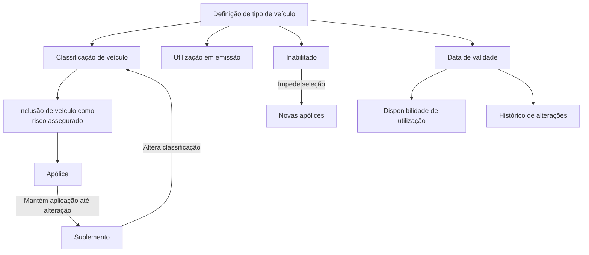

# Definição de Tipo de Veículo

## 1. Metadados do Documento
- **Arquivo de Origem:** `Não identificado`
- **Tipo de Documento:** `Especificação Técnica`
- **Domínio / Sistema:** `Classificação de veículos para inclusão em apólices`
- **Público-Alvo:** `Negócio, Operação e Desenvolvimento`
- **Data/Versão Identificada:** `Não identificada`

---

## 2. Resumo Executivo & Contexto de Negócio

O documento define o conceito de **tipo de veículo**, uma classificação utilizada para identificar veículos que poderão ser incluídos em apólices como risco assegurado.

A definição de tipo de veículo possui propriedades de identificação, denominação, abreviação, uso em emissão, situação de inabilitação e período de validade. Essas propriedades permitem controlar a disponibilidade e a identificação da classificação em operações que necessitam reconhecer o tipo de veículo.

A inabilitação impede que a classificação seja selecionada para novas apólices. Entretanto, a inabilitação não remove a aplicação da classificação em apólices existentes: a classificação continua sendo aplicada até que um suplemento altere o tipo de veículo associado.

A data de validade controla quando a definição fica disponível para utilização e permite manter histórico das alterações realizadas na definição.

---

## 3. Arquitetura, Componentes & Tecnologias Envolvidas

O conteúdo não descreve arquitetura de software, tecnologias, integrações, APIs, contratos JSON, métodos HTTP, servidores ou ambientes técnicos.

Os elementos funcionais identificados são:

- Definição de tipo de veículo.
- Classificação de veículo.
- Veículo incluído como risco assegurado.
- Apólice.
- Operações de emissão.
- Suplemento.
- Data de validade.
- Estado de inabilitação.



> **Nota de Análise:** O documento apresenta uma referência a “Soluciones APIs”, “Documentación” e “Zeus”, mas não detalha a função desses termos, integrações, endpoints, métodos HTTP ou contratos técnicos.

---

## 4. Regras de Negócio, Especificações Funcionais & Processos

### 4.1 Objetivo da classificação

A classificação de tipo de veículo identifica os veículos que podem ser incluídos nas apólices como risco assegurado.

### 4.2 Propriedades gerais da definição

A definição de tipo de veículo contém:

1. Uma chave que identifica a classificação de veículo.
2. Uma denominação que descreve o tipo de veículo.
3. Uma abreviação correspondente ao nome abreviado do tipo de veículo.
4. Uma indicação de utilização em emissão.
5. Um estado de inabilitação.
6. Uma data de validade.

### 4.3 Utilização em emissão

A propriedade de utilização em emissão indica se a classificação definida pode ser utilizada em operações nas quais seja necessário identificar o tipo de veículo.

O documento apresenta o exemplo `RS`, sem fornecer explicação adicional sobre o significado, formato ou valores possíveis dessa referência.

### 4.4 Regra de inabilitação

Quando uma definição de tipo de veículo é marcada como inabilitada:

- A definição deixa de poder ser incluída em uma nova apólice.
- A definição não deixa de ser aplicada automaticamente às apólices já existentes que a utilizam.
- A definição permanece aplicada à apólice existente até que um suplemento altere essa classificação.
- Após a alteração por suplemento, a definição inabilitada não poderá ser novamente selecionada.

### 4.5 Regra de validade e histórico

A data de validade determina quando a definição de tipo de veículo estará disponível para utilização.

O uso correto da data de validade permite registrar o histórico das alterações efetuadas na definição de tipo de veículo.

---

## 5. Tabelas de Parâmetros, Ambientes e Estruturas de Dados

| Item / Parâmetro | Descrição / Função | Tipo / Valores / Formato | Ambiente / Observações |
| :--- | :--- | :--- | :--- |
| Tipo de veículo | Classificação utilizada para identificar veículos incluídos em apólices como risco assegurado. | Não detalhado. | Aplicável à definição de classificação de veículos. |
| Chave do tipo de veículo | Identifica a classificação de veículo. | Não detalhado. | O documento não informa formato, tamanho ou regra de unicidade. |
| Denominação do tipo de veículo | Nome que descreve o tipo de veículo. | Texto; formato não detalhado. | Não são fornecidos exemplos de denominações. |
| Abreviação do tipo de veículo | Nome abreviado do tipo de veículo. | Texto; formato não detalhado. | O documento cita o exemplo `RS`, sem explicar seu significado. |
| Utilização em emissão | Indica se a classificação pode ser utilizada em operações que exigem identificar o tipo de veículo. | Indicador; valores não detalhados. | Relacionado a operações de emissão. |
| Inabilitado | Determina se a classificação está ativa ou se não pode mais ser incluída em uma nova apólice. | Indicador; valores não detalhados. | Não remove a classificação de apólices existentes. |
| Data de validade | Determina quando a definição estará disponível para uso. | Data; formato não detalhado. | Permite manter histórico de alterações. |
| Apólice | Registro que pode incluir um veículo como risco assegurado. | Não detalhado. | Uma apólice existente mantém a classificação inabilitada até alteração por suplemento. |
| Suplemento | Mecanismo mencionado para alterar a classificação aplicada a uma apólice. | Não detalhado. | Após a mudança, uma classificação inabilitada não pode ser selecionada. |
| Zeus | Termo presente na extração. | Não detalhado. | O documento não explica a função de Zeus. |
| Soluciones APIs | Termo presente na extração. | Não detalhado. | Não há descrição de APIs, URLs, métodos ou contratos. |
| Documentación | Termo presente na extração. | Não detalhado. | Não há detalhamento adicional. |

---

## 6. Bateria de Perguntas & Respostas para RAG (FAQ Sintético)

### P1: Qual é o objetivo da definição de tipo de veículo?
**R:** A definição de tipo de veículo tem o objetivo de classificar e identificar os veículos que podem ser incluídos em apólices como risco assegurado.

### P2: Qual propriedade identifica a classificação de veículo?
**R:** A chave do tipo de veículo identifica a classificação de veículo. O documento não especifica o formato, o tamanho ou as regras de unicidade dessa chave.

### P3: O que representa a denominação do tipo de veículo?
**R:** A denominação do tipo de veículo é o nome que descreve o tipo de veículo classificado.

### P4: Para que serve a abreviação do tipo de veículo?
**R:** A abreviação representa o nome abreviado do tipo de veículo. O documento apresenta `RS` como exemplo, mas não informa o significado da sigla nem as regras de preenchimento.

### P5: O que a utilização em emissão controla?
**R:** A utilização em emissão indica se uma classificação de tipo de veículo pode ser usada em operações nas quais é necessário identificar o tipo de veículo.

### P6: O que acontece quando um tipo de veículo é inabilitado?
**R:** Um tipo de veículo inabilitado não pode ser incluído em uma nova apólice. Contudo, a inabilitação não remove automaticamente a classificação das apólices existentes.

### P7: Uma apólice existente perde automaticamente o tipo de veículo quando ele é inabilitado?
**R:** Não. A classificação continua sendo aplicada às apólices que já a possuem até que um suplemento altere a classificação associada.

### P8: O que acontece após um suplemento alterar uma classificação inabilitada?
**R:** Depois que um suplemento altera a classificação de uma apólice, a classificação que está inabilitada não poderá ser novamente selecionada.

### P9: Qual é a finalidade da data de validade?
**R:** A data de validade determina quando a definição de tipo de veículo estará disponível para ser utilizada.

### P10: Como a data de validade contribui para o controle da definição?
**R:** O uso correto da data de validade permite manter um registro histórico das alterações efetuadas na definição de tipo de veículo.

### P11: O documento descreve APIs ou contratos técnicos para o tipo de veículo?
**R:** Não. Embora a extração mencione “Soluciones APIs”, “Documentación” e “Zeus”, não há detalhamento de endpoints, métodos HTTP, contratos JSON, tecnologias ou fluxos de integração.

---

## 7. Glossário de Termos, Siglas & Conceitos-Chave

- **Tipo de veículo:** Classificação que identifica veículos passíveis de inclusão em apólices como risco assegurado.
- **Risco assegurado:** Veículo que pode ser incluído em uma apólice conforme a classificação definida.
- **Apólice:** Entidade mencionada como portadora da classificação de tipo de veículo.
- **Emissão:** Operação na qual pode ser necessário identificar o tipo de veículo.
- **Inabilitado:** Estado que impede a inclusão da classificação em uma nova apólice, sem remover a classificação de apólices existentes.
- **Suplemento:** Mecanismo mencionado para alterar a classificação aplicada a uma apólice.
- **Data de validade:** Data que determina a disponibilidade da definição para utilização e apoia o histórico de alterações.
- **RS:** Exemplo apresentado para utilização em emissão; o significado não é detalhado.
- **Zeus:** Termo citado no conteúdo bruto, sem definição funcional ou técnica.
- **Soluciones APIs:** Termo citado no conteúdo bruto, sem detalhamento de interfaces ou integrações.

---

## 8. Notas Críticas, Riscos & Limitações

- O documento não identifica o arquivo de origem, a data, a versão, o autor ou a área responsável.
- Não há detalhamento de campos obrigatórios, formatos, domínios de valores, regras de unicidade ou validações técnicas.
- O exemplo `RS` não possui definição contextual no conteúdo fornecido.
- O documento não detalha como a inabilitação é operacionalizada, nem informa se existe validação automática em tela, serviço ou processo de emissão.
- Não há informação sobre o comportamento da data de validade antes, durante ou após o período de disponibilidade.
- Não são descritos contratos de API, integração entre sistemas, URLs, ambientes, logs, permissões ou mecanismos de auditoria.
- Os termos “Soluciones APIs”, “Documentación” e “Zeus” aparecem sem detalhamento adicional.

---

## 9. Conteúdo Bruto Estruturado (Referência Fiel)

```text
--- [PÁGINA 1 DE 2] ---

DEFINICIÓN de tipo de vehículo
Objetivo
Definir la clasificación que identifica los vehículos que se podrán incluir en las pólizas, como riesgo
asegurado.
Propiedades generales
Propiedades generales
Tipo de vehículo
Clave que identifica la clasificación de vehículo.
Denominación del tipo de vehículo
Nombre que describe el tipo de vehículo.
Abreviatura del tipo de vehículo
Nombre abreviado del tipo de vehículo.
Utilización en emisión
Ejemplo:
 /
 RS
Inicio Soluciones APIs Documentación Zeus
ES


--- [PÁGINA 2 DE 2] ---

Indica si la clasificación definida se puede utilizar en las operaciones en las que sea necesario
identificar el tipo de vehículo.
Inhabilitado
En este punto se determina si está activo o por el contrario ya no puede ser incluido en una nueva
póliza. Es importante destacar que, aunque se inhabilite, todas las pólizas que dispongan de ello,
seguirá aplicándose hasta que mediante un suplemento se cambie. En ese momento, al estar
inhabilitado ya no será posible seleccionarlo.
Fecha de validez
Determina cuando la definición estará disponible para ser utilizada.
Su correcto uso permite tener un registro histórico de los cambios efectuados en la definición.
```
