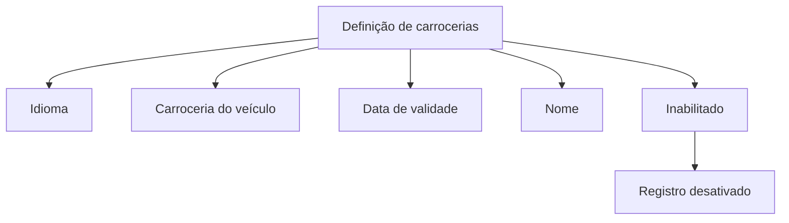

# Definição de Carrocerias — Documento em Construção

## 1. Metadados do Documento
- **Arquivo de Origem:** Não identificado
- **Tipo de Documento:** Especificação Técnica
- **Domínio / Sistema:** Definição de carrocerias de veículos
- **Público-Alvo:** Desenvolvedores, Arquitetos, Operação e Negócio
- **Data/Versão Identificada:** Não identificada

---

## 2. Resumo Executivo & Contexto de Negócio

O conteúdo disponível descreve um artefato em construção sobre a definição de carrocerias de veículos. O foco apresentado é o cadastro ou a manutenção de propriedades associadas à carroceria de um veículo.

As propriedades explicitamente identificadas são idioma, carroceria, data de validade, nome e situação de inabilitação. Cada propriedade possui uma descrição textual em espanhol que indica sua finalidade no contexto da definição de carrocerias.

O documento também contém as expressões “CF”, “Home Solutions APIs Documentation” e “Zeus”. Contudo, o trecho não explica se tais termos representam sistemas, módulos, ambientes, marcas, referências de navegação ou integrações.

Não há detalhamento sobre fluxos operacionais, contratos de API, regras de validação, persistência, responsabilidades de sistemas ou comportamento para registros desativados.

---

## 3. Arquitetura, Componentes & Tecnologias Envolvidas

Os seguintes termos são citados:

- **Definición de carrocerías:** tema funcional relacionado à definição de carrocerias.
- **CF:** termo apresentado sem expansão ou contexto.
- **Home Solutions APIs Documentation:** referência textual apresentada sem detalhamento.
- **Zeus:** termo apresentado sem detalhamento.
- **EN:** indicação textual possivelmente relacionada a idioma ou interface, sem confirmação no conteúdo.



> **Nota de Análise:** O documento não descreve arquitetura de software, tecnologias, protocolos, endpoints, banco de dados ou fluxos de integração. O diagrama representa exclusivamente a relação conceitual entre a definição de carrocerias e as propriedades listadas.

---

## 4. Regras de Negócio, Especificações Funcionais & Processos

O conteúdo identifica as seguintes propriedades da definição de carrocerias:

1. **Idioma**
   - Apresentado como “Idioma” e “idioma”.
   - O documento não especifica valores permitidos, obrigatoriedade ou impacto funcional.

2. **Carroceria**
   - Descrita como “carrocería del vehículo”.
   - Representa a carroceria associada ao veículo.
   - O documento não informa catálogo de carrocerias, códigos, validações ou regras de classificação.

3. **Data de validade**
   - Descrita como “fecha entrada en vigor”.
   - Indica a data de entrada em vigor da definição de carroceria.
   - O documento não especifica formato de data, fuso horário, comportamento para datas futuras ou critérios de expiração.

4. **Nome**
   - Descrito como “denominación de la carrocería del vehículo”.
   - Representa a denominação da carroceria do veículo.
   - O documento não informa regras de unicidade, tamanho máximo, idioma associado ou normalização do valor.

5. **Inabilitado**
   - Relacionado ao texto “registro desactivado”.
   - Indica que um registro pode estar desativado.
   - O documento não detalha como um registro é inabilitado, quem pode executar essa ação ou se o registro desativado pode ser reativado.

> **Nota de Análise:** Não há processos passo a passo, cálculos, critérios condicionais, matrizes de permissão ou regras de transição de estado além da indicação de que um registro pode estar desativado.

---

## 5. Tabelas de Parâmetros, Ambientes e Estruturas de Dados

| Item / Parâmetro | Descrição / Função | Tipo / Valores / Formato | Ambiente / Observações |
| :--- | :--- | :--- | :--- |
| Idioma | Propriedade identificada na definição de carrocerias. | Não especificado. | Apresentado como “Idioma” e “idioma”. |
| Carroceria | Carroceria do veículo. | Não especificado. | Texto original: “carrocería del vehículo”. |
| Data de validade | Data de entrada em vigor da definição. | Não especificado. | Texto original: “fecha entrada en vigor”. |
| Nome | Denominação da carroceria do veículo. | Não especificado. | Texto original: “denominación de la carrocería del vehículo”. |
| Inabilitado | Situação relacionada a registro desativado. | Não especificado. | Texto original relacionado: “registro desactivado”. |
| CF | Termo citado no documento. | Não especificado. | Sem definição contextual. |
| Home Solutions APIs Documentation | Termo citado no documento. | Não especificado. | Sem definição de integração, API ou ambiente. |
| Zeus | Termo citado no documento. | Não especificado. | Sem definição contextual. |
| EN | Termo citado no documento. | Não especificado. | Pode indicar idioma ou interface; não confirmado. |

---

## 6. Bateria de Perguntas & Respostas para RAG (FAQ Sintético)

### P1: Qual é o tema central do documento?
**R:** O documento trata da definição de carrocerias de veículos e lista propriedades associadas a essa definição, incluindo idioma, carroceria, data de validade, nome e situação de inabilitação.

### P2: O que representa o campo Carroceria?
**R:** O campo Carroceria é descrito como “carrocería del vehículo”, ou seja, representa a carroceria associada ao veículo. O documento não fornece valores possíveis, códigos ou critérios de validação.

### P3: Qual é o significado da data de validade na definição de carrocerias?
**R:** A data de validade é descrita como “fecha entrada en vigor”, indicando a data de entrada em vigor da definição de carroceria. O formato e as regras de aplicação da data não são detalhados.

### P4: Para que serve o campo Nome?
**R:** O campo Nome corresponde à “denominación de la carrocería del vehículo”. Portanto, ele identifica a denominação da carroceria do veículo. O documento não especifica regras de preenchimento ou unicidade.

### P5: O que significa uma carroceria estar inabilitada?
**R:** O documento relaciona “Inhabilitado” ao texto “registro desactivado”, indicando que uma definição de carroceria pode possuir estado de registro desativado. Não há detalhamento sobre reativação, autorização ou efeitos operacionais.

### P6: Quais propriedades são apresentadas para uma definição de carroceria?
**R:** As propriedades apresentadas são Idioma, Carroceria, Data de validade, Nome e Inabilitado.

### P7: O documento especifica métodos HTTP ou contratos de API?
**R:** Não. Apesar de citar “Home Solutions APIs Documentation”, o conteúdo não apresenta endpoints, métodos HTTP, parâmetros de requisição, contratos JSON, autenticação ou respostas de API.

### P8: O documento informa quais tecnologias compõem a solução?
**R:** Não. Os termos “CF”, “Home Solutions APIs Documentation” e “Zeus” são exibidos, mas não há explicação que permita classificá-los como tecnologias, aplicações, ambientes ou componentes arquiteturais.

### P9: Existe uma regra para validar o idioma da definição de carroceria?
**R:** Não. O documento apenas cita a propriedade “Idioma” ou “idioma”, sem informar idiomas válidos, códigos aceitos, obrigatoriedade ou relação com o nome da carroceria.

### P10: O documento descreve o ciclo de vida de um registro desativado?
**R:** Não. O texto informa somente “registro desactivado” em associação com a propriedade Inabilitado. Não há transições de estado, responsáveis ou regras para exclusão e reativação.

---

## 7. Glossário de Termos, Siglas & Conceitos-Chave

- **Carroceria:** Estrutura ou tipo de carroceria associado a um veículo, conforme o texto “carrocería del vehículo”.
- **Data de validade:** Data de entrada em vigor da definição de carroceria, conforme o texto “fecha entrada en vigor”.
- **Inabilitado:** Situação associada a um “registro desactivado”.
- **CF:** Termo citado sem significado definido no conteúdo disponível.
- **Home Solutions APIs Documentation:** Termo citado sem descrição funcional ou técnica no conteúdo disponível.
- **Zeus:** Termo citado sem definição contextual no conteúdo disponível.
- **EN:** Termo citado sem definição; pode representar uma indicação textual de idioma, mas isso não é confirmado pelo documento.

---

## 8. Notas Críticas, Riscos & Limitações

- O conteúdo inicia com “EN CONSTRUCCIÓN”, indicando que o documento está em construção.
- Não há identificação do arquivo de origem, autoria, versão ou data.
- Não há detalhamento de arquitetura, integrações, APIs, ambientes, logs, segurança ou permissões.
- Não há definição de tipos de dados, valores permitidos, obrigatoriedade ou validações para as propriedades listadas.
- Os termos “CF”, “Home Solutions APIs Documentation”, “Zeus” e “EN” não possuem explicação contextual suficiente.
- O documento cita um registro desativado, mas não descreve regras de inativação, reativação, auditoria ou impacto em processos dependentes.

---

## 9. Conteúdo Bruto Estruturado (Referência Fiel)

```text
--- [PÁGINA 1 DE 2] ---

EN CONSTRUCCIÓN
DEFINICIÓN de carrocerías
Objetivo
Propiedades de definición
Propiedades de definición
Idioma
idioma
Carrocería
carrocería del vehículo
Fecha de validez
fecha entrada en vigor
Nombre
denominación de la carrocería del vehículo
Inhabilitado
 /
 CF
Home Solutions APIs Documentation Zeus
EN


--- [PÁGINA 2 DE 2] ---

registro desactivado
```
