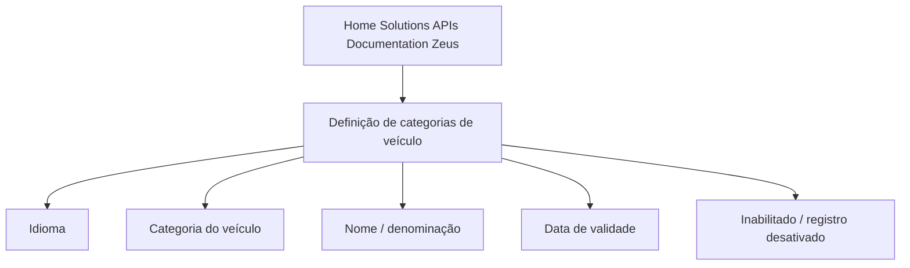

# Definição de Categorias de Veículo — Conteúdo em Construção

## 1. Metadados do Documento
- **Arquivo de Origem:** Não identificado
- **Tipo de Documento:** Não identificado
- **Domínio / Sistema:** Home Solutions APIs Documentation Zeus
- **Público-Alvo:** Não identificado
- **Data/Versão Identificada:** Não identificada

---

## 2. Resumo Executivo & Contexto de Negócio

O conteúdo extraído apresenta um material marcado como **“EN CONSTRUCCIÓN”**, indicando que a documentação está em elaboração. O tema central identificado é a **definição de categorias de veículo**.

O documento relaciona propriedades associadas à definição de uma categoria de veículo: idioma, categoria, nome, data de validade e estado de inabilitação. A extração também contém as expressões “registro desactivado” e “CF”.

O texto menciona **Home Solutions APIs Documentation Zeus**, mas não descreve a arquitetura, os contratos de API, os métodos HTTP, os endpoints, os formatos de mensagens ou as responsabilidades dos componentes envolvidos.

> **Nota de Análise:** O conteúdo disponível é extremamente resumido. Não há detalhamento adicional sobre regras funcionais, validações, persistência, integrações ou comportamento operacional das categorias de veículo.

---

## 3. Arquitetura, Componentes & Tecnologias Envolvidas

| Componente / Termo | Evidência no conteúdo | Detalhamento disponível |
| :--- | :--- | :--- |
| Home Solutions APIs Documentation Zeus | Texto da página 1 | Não detalhado |
| Definição de categorias de veículo | Título/tema principal | Não detalhada |
| CF | Texto da página 1 | Significado não informado |



> **Nota de Análise:** O diagrama representa apenas a associação textual entre o tema “definição de categorias de veículo” e as propriedades listadas. O conteúdo não descreve fluxo de integração, dependências técnicas, APIs ou comunicação entre sistemas.

---

## 4. Regras de Negócio, Especificações Funcionais & Processos

O documento apresenta as seguintes propriedades para a definição de categorias de veículo:

1. **Idioma**
   - O conteúdo cita “Idioma” e “idioma”.
   - Não há indicação dos idiomas permitidos, códigos, formato ou regra de preenchimento.

2. **Categoria**
   - O documento associa “Categoría” à expressão “categoría del vehículo”.
   - Não há catálogo de categorias, identificadores, regras de classificação ou critérios de elegibilidade.

3. **Nome**
   - O conteúdo descreve “Nombre” como “denominación categoría del vehículo”.
   - Não há definição de tamanho, unicidade, idioma aplicável ou padrão de nomenclatura.

4. **Data de validade**
   - O conteúdo cita “Fecha de validez” e “fecha entrada en vigor”.
   - O texto sugere uma relação com a data de entrada em vigor, mas não informa formato, timezone, data final, regra de ativação ou validação temporal.

5. **Inabilitado**
   - O material cita “Inhabilitado” e, em outra página, “registro desactivado”.
   - Não há detalhamento sobre o processo de desativação, permissões necessárias, impacto da inabilitação ou possibilidade de reativação.

> **Nota de Análise:** Não foram identificadas regras explícitas de validação, sequência de processo, critérios de aprovação, integrações, cálculos ou exceções operacionais.

---

## 5. Tabelas de Parâmetros, Ambientes e Estruturas de Dados

| Item / Parâmetro | Descrição / Função | Tipo / Valores / Formato | Ambiente / Observações |
| :--- | :--- | :--- | :--- |
| Idioma | Propriedade citada na definição de categoria de veículo | Não informado | Aparece como “Idioma” e “idioma” |
| Categoria | Categoria do veículo | Não informado | Aparece como “Categoría” e “categoría del vehículo” |
| Nome | Denominação da categoria do veículo | Não informado | Aparece como “Nombre” e “denominación categoría del vehículo” |
| Data de validade | Data de entrada em vigor | Não informado | Aparece como “Fecha de validez” e “fecha entrada en vigor” |
| Inabilitado | Estado associado ao registro | Não informado | Relacionado textualmente a “registro desactivado” |
| CF | Termo isolado | Não informado | Significado não detalhado |
| Home Solutions APIs Documentation Zeus | Referência documental ou de sistema | Não informado | Não há URLs, endpoints ou ambientes identificados |

---

## 6. Bateria de Perguntas & Respostas para RAG (FAQ Sintético)

### P1: Qual é o tema principal do documento?
**R:** O tema principal do documento é a definição de categorias de veículo.

### P2: O documento está finalizado?
**R:** Não. A página inicial contém a expressão “EN CONSTRUCCIÓN”, indicando que o conteúdo está em construção.

### P3: Quais propriedades são citadas para a definição de uma categoria de veículo?
**R:** O documento cita idioma, categoria do veículo, nome ou denominação da categoria do veículo, data de validade ou data de entrada em vigor e estado de inabilitação.

### P4: O que representa o campo Nome na definição de categorias de veículo?
**R:** O campo “Nombre” é descrito no texto como “denominación categoría del vehículo”, isto é, a denominação da categoria do veículo.

### P5: Qual informação temporal é mencionada no documento?
**R:** O documento menciona “Fecha de validez” e “fecha entrada en vigor”. Não há detalhamento sobre formato, data final de validade ou regras temporais adicionais.

### P6: O documento descreve como uma categoria de veículo é desativada?
**R:** Não. O texto menciona “Inhabilitado” e “registro desactivado”, mas não descreve o procedimento, as permissões, as condições ou os efeitos da desativação.

### P7: Quais APIs ou endpoints são documentados?
**R:** Nenhum endpoint, método HTTP, contrato JSON, URL ou operação de API é apresentado no conteúdo extraído.

### P8: O que é Home Solutions APIs Documentation Zeus no contexto do documento?
**R:** “Home Solutions APIs Documentation Zeus” é uma referência textual presente no material. O conteúdo não informa se representa uma plataforma, sistema, produto, repositório ou ambiente.

### P9: O que significa a sigla ou termo CF?
**R:** O termo “CF” aparece isoladamente no conteúdo, sem definição ou contexto suficiente para determinar seu significado.

### P10: Existem regras de validação para idioma, categoria, nome ou data de validade?
**R:** Não. O documento apenas lista essas propriedades; não apresenta valores permitidos, obrigatoriedade, formatos, limites ou regras de validação.

---

## 7. Glossário de Termos, Siglas & Conceitos-Chave

- **Categoria do veículo:** Propriedade mencionada como “Categoría” ou “categoría del vehículo”; critérios e valores não são especificados.
- **CF:** Termo citado sem definição no conteúdo disponível.
- **Data de validade:** Propriedade citada como “Fecha de validez”, associada textualmente à “fecha entrada en vigor”.
- **Home Solutions APIs Documentation Zeus:** Referência presente no documento sem detalhamento funcional ou técnico.
- **Idioma:** Propriedade citada para a definição de categoria de veículo; valores suportados não informados.
- **Inabilitado:** Estado citado para um registro; o documento também usa a expressão “registro desactivado”.
- **Nome:** Propriedade descrita como a denominação da categoria do veículo.

---

## 8. Notas Críticas, Riscos & Limitações

- O documento está explicitamente marcado como **“EN CONSTRUCCIÓN”**.
- Não foi identificado o nome do arquivo de origem, versão, data, autor ou público-alvo.
- Não há especificação de APIs, endpoints, métodos HTTP, autenticação, payloads ou contratos de integração.
- Não há regras explícitas para criação, alteração, ativação, inabilitação ou exclusão de categorias de veículo.
- Não há definição de domínio para os campos idioma, categoria, nome e data de validade.
- O termo **CF** não possui definição no conteúdo fornecido.
- A referência a **Home Solutions APIs Documentation Zeus** não contém contexto técnico adicional.

---

## 9. Conteúdo Bruto Estruturado (Referência Fiel)

```text
--- [PÁGINA 1 DE 2] ---

EN CONSTRUCCIÓN
DEFINICIÓN de categorías de vehículo
Objetivo
Propiedades de definición
Propiedades de definición
Idioma
idioma
Categoría
categoría del vehículo
Nombre
denominación categoría del vehículo
Fecha de validez
fecha entrada en vigor
Inhabilitado
 / 
 CF
Home Solutions APIs Documentation Zeus
EN


--- [PÁGINA 2 DE 2] ---

registro desactivado
```
