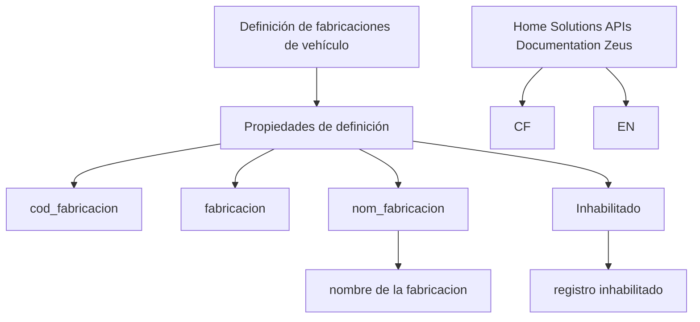

# Definição de Fabricações de Veículo — Conteúdo em Construção

## 1. Metadados do Documento
- **Arquivo de Origem:** Não identificado
- **Tipo de Documento:** Especificação Técnica
- **Domínio / Sistema:** Definição de fabricações de veículo; Home Solutions APIs Documentation Zeus
- **Público-Alvo:** Desenvolvedores, Arquitetos, Negócio
- **Data/Versão Identificada:** Não identificada

---

## 2. Resumo Executivo & Contexto de Negócio

O conteúdo apresenta uma seção intitulada **“DEFINICIÓN de fabricaciones de vehículo”**, referente à definição de fabricações de veículo. O material está explicitamente marcado como **“EN CONSTRUCCIÓN”**, indicando que o detalhamento documental não está concluído.

O objetivo é mencionado somente pelo cabeçalho **“Objetivo”**, sem descrição associada. O documento também relaciona propriedades de definição que aparentam representar atributos de uma fabricação de veículo.

As propriedades identificadas são `cod_fabricacion`, `fabricacion`, `nom_fabricacion` e `Inhabilitado`. O texto vincula `nom_fabricacion` a “nombre de la fabricacion” e `Inhabilitado` a “registro inhabilitado”.

O conteúdo cita **CF**, **Home Solutions APIs Documentation**, **Zeus** e **EN**, mas não informa a natureza dessas referências, relações entre sistemas, contratos de API, métodos HTTP, formatos de mensagens, ambientes ou regras de integração.

---

## 3. Arquitetura, Componentes & Tecnologias Envolvidas

Os únicos componentes ou referências identificados são:

- Definição de fabricações de veículo.
- Propriedades de definição.
- CF.
- Home Solutions APIs Documentation.
- Zeus.
- EN.

O documento não descreve arquitetura de software, componentes técnicos, comunicação entre sistemas ou fluxo de dados. O diagrama abaixo representa exclusivamente a associação textual observada.



> **Nota de Análise:** O documento não detalha se `CF`, `Zeus`, `Home Solutions APIs Documentation` e `EN` são sistemas, módulos, ambientes, idiomas, domínios ou classificações.

---

## 4. Regras de Negócio, Especificações Funcionais & Processos

1. O documento trata da **definição de fabricações de veículo**.
2. A definição contém propriedades identificadas como `cod_fabricacion`, `fabricacion`, `nom_fabricacion` e `Inhabilitado`.
3. A propriedade `nom_fabricacion` é descrita como **“nombre de la fabricacion”**.
4. A propriedade `Inhabilitado` é descrita como **“registro inhabilitado”**.
5. Não há critérios de validação, obrigatoriedade, tipos de dados, valores permitidos, regras de cálculo, fluxos operacionais ou condições de habilitação/desabilitação documentados.
6. Não há definição explícita da finalidade da propriedade `fabricacion`.
7. Não há detalhamento funcional adicional para `cod_fabricacion`.

> **Nota de Análise:** Não é possível inferir, com base no conteúdo, se `Inhabilitado` é um indicador booleano, status, data ou outro tipo de campo.

---

## 5. Tabelas de Parâmetros, Ambientes e Estruturas de Dados

| Item / Parâmetro | Descrição / Função | Tipo / Valores / Formato | Ambiente / Observações |
| :--- | :--- | :--- | :--- |
| `cod_fabricacion` | Propriedade de definição de fabricação de veículo. | Não identificado. | Sem detalhamento adicional. |
| `fabricacion` | Propriedade de definição de fabricação de veículo. | Não identificado. | Sem detalhamento adicional. |
| `nom_fabricacion` | “nombre de la fabricacion”. | Não identificado. | Sem detalhamento adicional. |
| `Inhabilitado` | “registro inhabilitado”. | Não identificado. | Sem detalhamento adicional. |
| CF | Referência textual presente no documento. | Não identificado. | Relação com as propriedades não especificada. |
| Home Solutions APIs Documentation Zeus | Referência textual presente no documento. | Não identificado. | Não há URL, contrato de API ou ambiente informado. |
| EN | Referência textual presente no documento. | Não identificado. | Significado não detalhado. |

---

## 6. Bateria de Perguntas & Respostas para RAG (FAQ Sintético)

### P1: Qual é o tema principal do documento?
**R:** O documento trata da **definição de fabricações de veículo**, conforme o título “DEFINICIÓN de fabricaciones de vehículo”.

### P2: O documento está concluído?
**R:** Não. O conteúdo contém a indicação “EN CONSTRUCCIÓN”, que sinaliza que o material está em construção.

### P3: Qual é o objetivo da definição de fabricações de veículo?
**R:** O documento apresenta o cabeçalho “Objetivo”, mas não fornece uma descrição do objetivo.

### P4: Quais propriedades de definição de fabricação de veículo são listadas?
**R:** As propriedades listadas são `cod_fabricacion`, `fabricacion`, `nom_fabricacion` e `Inhabilitado`.

### P5: O que significa a propriedade `nom_fabricacion`?
**R:** A propriedade `nom_fabricacion` é associada no documento ao texto “nombre de la fabricacion”.

### P6: O que significa a propriedade `Inhabilitado`?
**R:** A propriedade `Inhabilitado` é associada ao texto “registro inhabilitado”. O documento não especifica seu tipo, comportamento ou critérios de uso.

### P7: Qual é o tipo de dado de `cod_fabricacion`?
**R:** O tipo de dado de `cod_fabricacion` não é informado no conteúdo fornecido.

### P8: O documento define regras para habilitar ou inabilitar uma fabricação?
**R:** Não. O documento apenas cita `Inhabilitado` e “registro inhabilitado”, sem apresentar regras, permissões, condições ou fluxo de alteração de status.

### P9: O documento descreve endpoints ou métodos da API Zeus?
**R:** Não. O conteúdo cita “Home Solutions APIs Documentation Zeus”, mas não detalha URLs, endpoints, métodos HTTP, contratos JSON, autenticação ou respostas.

### P10: O que é CF no contexto do documento?
**R:** O documento contém a referência “CF”, mas não explica seu significado ou relação com a definição de fabricações de veículo.

### P11: Existem ambientes identificados, como desenvolvimento, homologação ou produção?
**R:** Não. Nenhum ambiente técnico é identificado no conteúdo fornecido.

### P12: Há um fluxo de integração entre sistemas documentado?
**R:** Não. O documento não descreve integrações, origem ou destino de dados, componentes intermediários ou protocolos de comunicação.

---

## 7. Glossário de Termos, Siglas & Conceitos-Chave

- **CF:** Referência presente no documento sem expansão ou definição.
- **cod_fabricacion:** Propriedade listada na definição de fabricação de veículo; significado detalhado não informado.
- **fabricacion:** Propriedade listada na definição de fabricação de veículo; significado detalhado não informado.
- **Inhabilitado:** Propriedade associada a “registro inhabilitado”.
- **nom_fabricacion:** Propriedade associada a “nombre de la fabricacion”.
- **Zeus:** Termo citado em “Home Solutions APIs Documentation Zeus”; significado e papel técnico não detalhados.

---

## 8. Notas Críticas, Riscos & Limitações

- O documento está marcado como **“EN CONSTRUCCIÓN”**.
- O objetivo da definição não foi descrito.
- Não há tipos de dados, cardinalidades, obrigatoriedade ou exemplos de valores para as propriedades.
- Não há regras de negócio para a propriedade `Inhabilitado`.
- Não há especificação de API, endpoints, métodos HTTP, autenticação, payloads ou códigos de resposta.
- Não há arquitetura, diagrama original, ambientes, URLs, logs ou instruções operacionais.
- As referências **CF**, **Home Solutions APIs Documentation Zeus** e **EN** não possuem definição contextual suficiente.
- Qualquer interpretação adicional sobre campos, integrações ou tecnologias não seria sustentada pelo conteúdo original.

---

## 9. Conteúdo Bruto Estruturado (Referência Fiel)

```text
--- [PÁGINA 1 DE 1] ---

EN CONSTRUCCIÓN
DEFINICIÓN de fabricaciones de vehículo
Objetivo
Propiedades de definición
Propiedades de definición
cod_fabricacion
fabricacion
nom_fabricacion
nombre de la fabricacion
Inhabilitado
registro inhabilitado
 / 
 CF
Home Solutions APIs Documentation Zeus
EN
```
