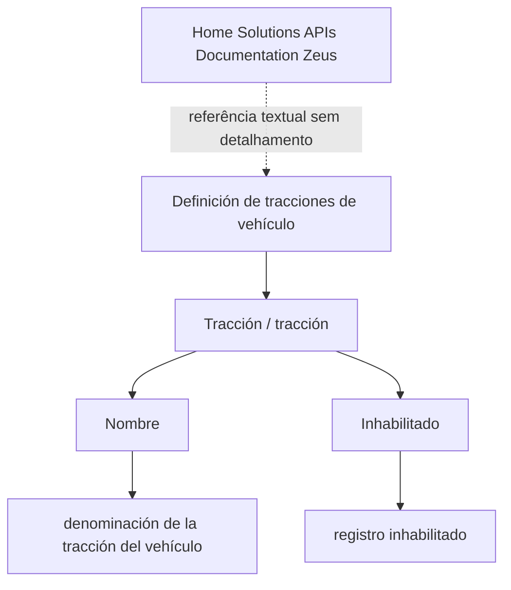

# Definição de Trações de Veículo — Conteúdo em Construção

## 1. Metadados do Documento
- **Arquivo de Origem:** `Não identificado`
- **Tipo de Documento:** `Especificação Técnica`
- **Domínio / Sistema:** `Definição de tração de veículo; Home Solutions APIs Documentation Zeus`
- **Público-Alvo:** `Não identificado`
- **Data/Versão Identificada:** `Não identificada`

---

## 2. Resumo Executivo & Contexto de Negócio

O conteúdo apresenta uma definição em construção para o conceito de **tração de veículo**. O texto indica como objetivo a definição das propriedades associadas à tração de um veículo, sem fornecer contexto adicional sobre regras de negócio, integrações ou processos operacionais.

A entidade ou conceito principal identificado é **Tracción / tracción**. Para essa definição, o documento explicita as propriedades **Nombre** e **Inhabilitado**, acompanhadas de descrições funcionais curtas.

A propriedade **Nombre** representa a denominação da tração do veículo. A propriedade **Inhabilitado** representa a condição de registro inabilitado, sugerindo a existência de controle de disponibilidade ou desativação de registros de tração.

O documento também contém as referências textuais `CF`, `Home Solutions APIs Documentation Zeus` e `EN`. Contudo, o conteúdo fornecido não detalha o significado de `CF`, a relação entre a definição de tração e a documentação Zeus, nem os contratos ou métodos de APIs associados.

---

## 3. Arquitetura, Componentes & Tecnologias Envolvidas

Os componentes e termos identificados no conteúdo são:

| Componente / Termo | Descrição sustentada pelo conteúdo |
| :--- | :--- |
| Definición de tracciones de vehículo | Tema central do documento: definição de trações de veículo. |
| Tracción / tracción | Conceito ou entidade cuja definição é apresentada. |
| Nombre | Propriedade que representa a denominação da tração do veículo. |
| Inhabilitado | Propriedade que representa um registro inabilitado. |
| Home Solutions APIs Documentation Zeus | Referência textual presente no conteúdo. Não há detalhes sobre arquitetura, endpoints ou contratos. |
| CF | Sigla ou referência textual sem definição fornecida. |
| EN | Indicador textual presente no conteúdo, sem explicação adicional. |

Não há um fluxo de integração, arquitetura de camadas, relação entre microsserviços ou pipeline técnico detalhado no conteúdo original. O diagrama abaixo representa somente a associação explícita entre o conceito de tração e suas propriedades.



> **Nota de Análise:** O conteúdo menciona `Home Solutions APIs Documentation Zeus`, porém não detalha APIs, métodos HTTP, URLs, contratos JSON, autenticação, ambientes ou integrações.

---

## 4. Regras de Negócio, Especificações Funcionais & Processos

### 4.1 Objetivo identificado
O objetivo declarado é a **definição de trações de veículo**.

### 4.2 Propriedades da definição de tração

A definição de tração de veículo possui as seguintes propriedades explicitamente apresentadas:

1. **Nombre**
   - Descrição original: `denominación de la tracción del vehículo`.
   - Interpretação estritamente textual: identifica a denominação associada à tração do veículo.

2. **Inhabilitado**
   - Descrição original: `registro inhabilitado`.
   - Interpretação estritamente textual: identifica que o registro pode estar inabilitado.

### 4.3 Restrições e detalhamento ausente

O conteúdo não informa:

- Valores permitidos para a propriedade `Nombre`.
- Formato, tamanho, obrigatoriedade ou unicidade de `Nombre`.
- Tipo de dado da propriedade `Inhabilitado`.
- Valores possíveis ou regra de ativação/desativação de `Inhabilitado`.
- Lista de tipos de tração de veículo.
- Critérios para criação, alteração, consulta ou exclusão de registros de tração.
- Métodos HTTP, rotas, payloads ou respostas de APIs.
- Relação entre `CF`, `EN` e a definição de tração.
- Dependências entre a definição de tração e outros cadastros de veículos.

> **Nota de Análise:** O documento contém somente um nível resumido de especificação. Não existem regras adicionais que permitam definir validações, contratos de integração ou comportamentos operacionais sem extrapolar o conteúdo original.

---

## 5. Tabelas de Parâmetros, Ambientes e Estruturas de Dados

| Item / Parâmetro | Descrição / Função | Tipo / Valores / Formato | Ambiente / Observações |
| :--- | :--- | :--- | :--- |
| Tracción / tracción | Conceito referente à tração do veículo. | Não especificado. | Apresentado na definição de trações de veículo. |
| Nombre | Denominação da tração do veículo. | Não especificado. | Propriedade da definição de tração. |
| Inhabilitado | Registro inabilitado. | Não especificado. | Propriedade da definição de tração. |
| CF | Referência textual. | Não especificado. | Não há definição no conteúdo. |
| Home Solutions APIs Documentation Zeus | Referência a documentação de APIs. | Não especificado. | Não há detalhes técnicos ou funcionais adicionais. |
| EN | Indicador textual. | Não especificado. | Não há explicação no conteúdo. |

---

## 6. Bateria de Perguntas & Respostas para RAG (FAQ Sintético)

### P1: Qual é o objetivo principal do documento sobre tração de veículo?
**R:** O objetivo declarado é a definição de trações de veículo. O conteúdo apresenta o conceito de `Tracción / tracción` e duas propriedades associadas: `Nombre` e `Inhabilitado`.

### P2: O que significa a propriedade `Nombre` na definição de tração?
**R:** A propriedade `Nombre` é descrita como `denominación de la tracción del vehículo`. Portanto, `Nombre` representa a denominação da tração do veículo.

### P3: O que representa a propriedade `Inhabilitado`?
**R:** A propriedade `Inhabilitado` é descrita como `registro inhabilitado`. O documento indica que essa propriedade está associada à condição de um registro inabilitado, mas não define seu tipo de dado ou valores permitidos.

### P4: Quais propriedades são apresentadas para a entidade de tração?
**R:** O conteúdo apresenta duas propriedades para `Tracción / tracción`: `Nombre`, referente à denominação da tração do veículo, e `Inhabilitado`, referente a registro inabilitado.

### P5: O documento informa quais tipos de tração de veículo podem ser cadastrados?
**R:** Não. O documento somente informa que existe uma definição de trações de veículo e descreve as propriedades `Nombre` e `Inhabilitado`. Não há uma lista de categorias ou tipos de tração.

### P6: Existem regras de validação para o campo `Nombre`?
**R:** Não. O texto define `Nombre` como a denominação da tração do veículo, mas não informa obrigatoriedade, tamanho máximo, formato, unicidade ou valores aceitos.

### P7: O documento define valores possíveis para `Inhabilitado`?
**R:** Não. O conteúdo apenas associa `Inhabilitado` a `registro inhabilitado`. Não há indicação de valores possíveis, como verdadeiro/falso, ativo/inativo ou outro formato.

### P8: Há APIs ou endpoints documentados para a definição de tração?
**R:** Não há endpoints, métodos HTTP, URLs, parâmetros de requisição, payloads JSON ou respostas de API no conteúdo fornecido. O texto contém a referência `Home Solutions APIs Documentation Zeus`, mas não a detalha.

### P9: Qual é a relação entre `Home Solutions APIs Documentation Zeus` e a definição de tração?
**R:** A relação não é detalhada. `Home Solutions APIs Documentation Zeus` aparece como referência textual no conteúdo, sem explicar como essa documentação se conecta à definição de tração de veículo.

### P10: O que significa a sigla `CF` no documento?
**R:** O significado de `CF` não é informado. A sigla aparece isoladamente no conteúdo e não possui definição contextual adicional.

### P11: Existe informação sobre ambientes, servidores ou URLs?
**R:** Não. O conteúdo não apresenta ambientes, servidores, URLs, portas, credenciais, rotas de logs ou configurações de implantação.

### P12: O documento está completo para implementar um cadastro de trações de veículo?
**R:** Não integralmente. O conteúdo fornece as propriedades `Nombre` e `Inhabilitado`, mas não especifica modelo de dados completo, tipos, validações, operações de cadastro, regras de acesso ou contratos de integração necessários para uma implementação completa.

---

## 7. Glossário de Termos, Siglas & Conceitos-Chave

- **Definición de tracciones de vehículo:** Definição de trações de veículo; tema central do conteúdo.
- **Tracción / tracción:** Conceito ou entidade de tração associado a um veículo.
- **Nombre:** Propriedade que representa a denominação da tração do veículo.
- **Inhabilitado:** Propriedade descrita como registro inabilitado.
- **CF:** Sigla ou referência presente no conteúdo, sem significado definido.
- **Home Solutions APIs Documentation Zeus:** Referência textual a documentação de APIs Zeus, sem detalhamento adicional.
- **EN:** Indicador textual presente no conteúdo, sem significado explicitado.

---

## 8. Notas Críticas, Riscos & Limitações

- O conteúdo começa com `EN CONSTRUCCIÓN`, indicando que a definição está em construção.
- Não há identificação de arquivo, autoria, data, versão ou público-alvo.
- Não há tipos de dados, obrigatoriedade, cardinalidade ou restrições para `Nombre` e `Inhabilitado`.
- Não há detalhamento de regras para inabilitar ou reabilitar um registro de tração.
- Não há enumeração de categorias de tração de veículo.
- Não há endpoints, métodos HTTP, contratos de API, exemplos de payloads ou códigos de resposta.
- A referência `Home Solutions APIs Documentation Zeus` não possui contexto técnico suficiente para estabelecer uma integração.
- As siglas ou marcadores `CF` e `EN` não são definidos.
- Qualquer detalhamento sobre modelos de dados, autenticação, ambientes, fluxos de negócio ou integração seria especulativo e, portanto, não foi incluído.

---

## 9. Conteúdo Bruto Estruturado (Referência Fiel)

```text
--- [PÁGINA 1 DE 1] ---

EN CONSTRUCCIÓN
DEFINICIÓN de tracciones de vehículo
Objetivo
Propiedades de definición
Propiedades de definición
Tracción
tracción
Nombre
denominación de la tracción del vehículo
Inhabilitado
registro inhabilitado
 /
 CF
Home Solutions APIs Documentation Zeus
EN
```
