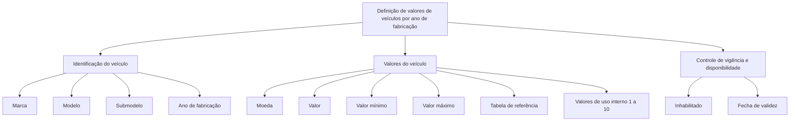

# Definição de Valores de Veículos por Ano de Fabricação

## 1. Metadados do Documento
- **Arquivo de Origem:** Não identificado
- **Tipo de Documento:** Apresentação Executiva
- **Domínio / Sistema:** Definição de valores de veículos
- **Público-Alvo:** Negócio, analistas funcionais e desenvolvedores
- **Data/Versão Identificada:** Não identificada

---

## 2. Resumo Executivo & Contexto de Negócio

O documento descreve uma estrutura em construção para a **definição de valores de veículos por ano de fabricação**. O objetivo explícito é organizar propriedades associadas à identificação de um veículo e aos seus valores monetários ou de uso interno.

A estrutura de definição utiliza atributos de classificação do veículo: marca, modelo, submodelo e ano de fabricação. O documento também relaciona a definição do veículo a uma moeda, a um valor principal, valores mínimo e máximo e uma tabela de referência para obtenção do valor dos veículos.

Além do valor principal, a estrutura prevê dez campos denominados **“Valor uso interno”**, associados a valores do submodelo. Esses campos são numerados de 1 a 10 e não possuem finalidade funcional detalhada no conteúdo extraído.

O documento também inclui campos de controle de vigência e disponibilidade do registro: **Inhabilitado**, descrito como registro inabilitado, e **Fecha de validez**, descrita como data de entrada em vigor.

---

## 3. Arquitetura, Componentes & Tecnologias Envolvidas

O conteúdo não descreve arquitetura de software, integrações, APIs, bancos de dados, ambientes técnicos, protocolos, métodos HTTP ou contratos JSON. As menções a “Home Solutions APIs Documentation Zeus” aparecem no conteúdo, mas sem detalhamento técnico adicional.

A estrutura apresentada pode ser representada como um modelo conceitual de definição de valor de veículo:



> **Nota de Análise:** O documento apresenta propriedades de uma definição de valor de veículo, mas não detalha relacionamentos de persistência, regras de cálculo, formatos de campo, APIs ou responsabilidades de sistemas.

---

## 4. Regras de Negócio, Especificações Funcionais & Processos

1. A definição é destinada a registrar ou organizar valores de veículos por **ano de fabricação**.
2. A identificação do veículo inclui os atributos:
   - Marca do veículo.
   - Modelo do veículo.
   - Submodelo do veículo.
   - Ano do submodelo, apresentado como “Año de fabricación”.
3. A definição inclui uma propriedade de **moeda**.
4. A definição inclui um campo de **valor**, descrito como valor do submodelo.
5. A definição inclui um **valor mínimo** do submodelo.
6. A definição inclui um **valor máximo** do submodelo.
7. A definição inclui uma **tabela de referência para obter o valor dos veículos**.
8. A definição inclui dez campos de valores de uso interno:
   - Valor uso interno 1.
   - Valor uso interno 2.
   - Valor uso interno 3.
   - Valor uso interno 4.
   - Valor uso interno 5.
   - Valor uso interno 6.
   - Valor uso interno 7.
   - Valor uso interno 8.
   - Valor uso interno 9.
   - Valor uso interno 10.
9. A definição inclui o campo **Inhabilitado**, descrito como indicador de registro inabilitado.
10. A definição inclui **Fecha de validez**, descrita como data de entrada em vigor.

> **Nota de Análise:** O documento não especifica condições de validação entre valor mínimo, valor máximo e valor principal. Também não define se “Inhabilitado” é um valor booleano, código de status ou outro formato.

---

## 5. Tabelas de Parâmetros, Ambientes e Estruturas de Dados

| Item / Parâmetro | Descrição / Função | Tipo / Valores / Formato | Ambiente / Observações |
| :--- | :--- | :--- | :--- |
| Marca | Marca do veículo | Não especificado | Propriedade de definição |
| Modelo | Modelo do veículo | Não especificado | Propriedade de definição |
| Submodelo | Submodelo do veículo | Não especificado | Propriedade de definição |
| Año de fabricación | Ano do submodelo | Não especificado | Associado à definição de valores por ano de fabricação |
| Moneda | Moeda | Não especificado | Campo relacionado ao valor do submodelo |
| Valor | Valor do submodelo | Não especificado | Valor principal |
| Valor mínimo | Valor mínimo do submodelo | Não especificado | Não há regra de comparação detalhada |
| Valor máximo | Valor máximo do submodelo | Não especificado | Não há regra de comparação detalhada |
| Tabla de referencia para obtener el valor | Tabela de referência para obter o valor dos veículos | Não especificado | Fonte de referência de valor |
| Valor uso interno 1 | Valor do submodelo 1 | Não especificado | Uso interno; finalidade não detalhada |
| Valor uso interno 2 | Valor do submodelo 2 | Não especificado | Uso interno; finalidade não detalhada |
| Valor uso interno 3 | Valor do submodelo 3 | Não especificado | Uso interno; finalidade não detalhada |
| Valor uso interno 4 | Valor do submodelo 4 | Não especificado | Uso interno; finalidade não detalhada |
| Valor uso interno 5 | Valor do submodelo 5 | Não especificado | Uso interno; finalidade não detalhada |
| Valor uso interno 6 | Valor do submodelo 6 | Não especificado | Uso interno; finalidade não detalhada |
| Valor uso interno 7 | Valor do submodelo 7 | Não especificado | Uso interno; finalidade não detalhada |
| Valor uso interno 8 | Valor do submodelo 8 | Não especificado | Uso interno; finalidade não detalhada |
| Valor uso interno 9 | Valor do submodelo 9 | Não especificado | Uso interno; finalidade não detalhada |
| Valor uso interno 10 | Valor do submodelo 10 | Não especificado | Uso interno; finalidade não detalhada |
| Inhabilitado | Registro inabilitado | Não especificado | Controle de disponibilidade do registro |
| Fecha de validez | Data de entrada em vigor | Não especificado | Controle de vigência |

---

## 6. Bateria de Perguntas & Respostas para RAG (FAQ Sintético)

### P1: Qual é o objetivo da definição apresentada no documento?
**R:** O objetivo é definir valores de veículos por ano de fabricação, usando propriedades de identificação do veículo, valores monetários, valores de uso interno e controles de vigência e disponibilidade.

### P2: Quais propriedades identificam o veículo na definição de valor?
**R:** A definição inclui marca, modelo, submodelo e ano de fabricação. O documento descreve o ano de fabricação como o ano do submodelo.

### P3: Quais campos de valor são apresentados para o submodelo?
**R:** O documento apresenta valor, valor mínimo e valor máximo do submodelo. Também apresenta uma tabela de referência para obter o valor dos veículos.

### P4: O documento informa como calcular o valor de um veículo?
**R:** Não. O documento menciona uma tabela de referência para obter o valor dos veículos, mas não descreve fórmulas, critérios de cálculo, fonte da tabela nem regras de priorização entre valores.

### P5: O que representa o campo “Moneda”?
**R:** “Moneda” representa a moeda associada à definição de valor do veículo ou do submodelo. O documento não informa formato, códigos de moeda aceitos ou regras de obrigatoriedade.

### P6: Quantos campos de valor de uso interno existem?
**R:** Existem dez campos: Valor uso interno 1 até Valor uso interno 10. Cada campo é descrito como um valor do submodelo numerado de 1 a 10.

### P7: Qual é a finalidade dos campos “Valor uso interno”?
**R:** O documento identifica os campos como valores de uso interno associados ao submodelo, mas não detalha o propósito de negócio, regras de preenchimento, cálculo ou consumo desses valores.

### P8: O que significa “Inhabilitado” na definição de valor do veículo?
**R:** “Inhabilitado” é descrito como “registro inhabilitado”. O documento indica que o campo está relacionado à disponibilidade do registro, mas não define seus valores possíveis ou comportamento operacional.

### P9: Qual é a função de “Fecha de validez”?
**R:** “Fecha de validez” é descrita como a data de entrada em vigor. O documento não especifica formato de data, data de término de vigência ou regras para sobreposição de registros.

### P10: Há informações sobre APIs, métodos HTTP ou contratos de integração?
**R:** Não. Embora o conteúdo mencione “Home Solutions APIs Documentation Zeus”, não há especificações de endpoints, métodos HTTP, payloads, autenticação, respostas ou integrações.

---

## 7. Glossário de Termos, Siglas & Conceitos-Chave

- **Marca:** Marca do veículo.
- **Modelo:** Modelo do veículo.
- **Submodelo:** Submodelo do veículo.
- **Año de fabricación:** Ano de fabricação; no documento, descrito como ano do submodelo.
- **Moneda:** Moeda associada ao valor.
- **Valor:** Valor do submodelo.
- **Valor mínimo:** Limite mínimo de valor do submodelo.
- **Valor máximo:** Limite máximo de valor do submodelo.
- **Tabla de referencia:** Tabela de referência para obtenção do valor dos veículos.
- **Valor uso interno:** Campo de valor associado ao submodelo para uso interno.
- **Inhabilitado:** Registro inabilitado.
- **Fecha de validez:** Data de entrada em vigor.
- **Home Solutions APIs Documentation Zeus:** Texto presente no documento; não há explicação adicional sobre significado, sistema ou função.

---

## 8. Notas Críticas, Riscos & Limitações

- O conteúdo declara que a definição está **“EN CONSTRUCCIÓN”**, indicando que o material pode estar incompleto.
- Não são informados tipos de dados, formatos, obrigatoriedade ou valores permitidos para os campos.
- Não há regras explícitas para validar a relação entre valor, valor mínimo e valor máximo.
- Não há detalhamento sobre o uso funcional dos dez campos de valor de uso interno.
- Não há informações sobre fontes, atualização, governança ou qualidade da tabela de referência de valores.
- Não há especificação de APIs, endpoints, integrações, persistência, segurança, ambientes ou mecanismos operacionais.
- Não há versão, data, autoria ou nome de arquivo identificados no conteúdo extraído.

---

## 9. Conteúdo Bruto Estruturado (Referência Fiel)

```text
--- [PÁGINA 1 DE 3] ---

EN CONSTRUCCIÓN
DEFINICIÓN de valores de vehículo por año de
fabricación
Objetivo
Propiedades de definición
Propiedades de definición
Marca
marca del vehiculo
Modelo
modelo del vehiculo
Submodelo
submodelo del vehiculo
Año de fabricación
año del submodelo
Moneda
 /
 CF
Home Solutions APIs Documentation Zeus
EN


--- [PÁGINA 2 DE 3] ---

moneda
Valor
valor del submodelo
Valor mínimo
valor mínimo del submodelo
Valor máximo
valor máximo del submodelo
Tabla de referencia para obtener el valor
tabla de rfª para obtener el valor de los vehículos
Valor uso interno 1
valor del submodelo 1
Valor uso interno 2
valor del submodelo 2
Valor uso interno 3
valor del submodelo 3
Valor uso interno 4
valor del submodelo 4
Valor uso interno 5
valor del submodelo 5
Valor uso interno 6
valor del submodelo 6
Valor uso interno 7
valor del submodelo 7
Valor uso interno 8


--- [PÁGINA 3 DE 3] ---

valor del submodelo 8
Valor uso interno 9
valor del submodelo 9
Valor uso interno 10
valor del submodelo 10
Inhabilitado
registro inhabilitado
Fecha de validez
fecha de entrada en vigor
```
