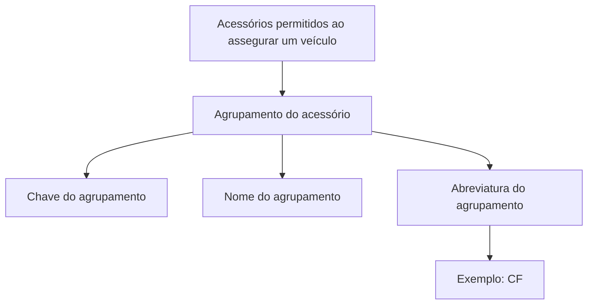

# Definição de Agrupamento de Acessórios para Seguro de Veículos

## 1. Metadados do Documento
- **Arquivo de Origem:** Não identificado
- **Tipo de Documento:** Especificação Técnica
- **Domínio / Sistema:** Agrupamento de acessórios permitidos no seguro de veículos
- **Público-Alvo:** Negócio, analistas funcionais e desenvolvedores
- **Data/Versão Identificada:** Não identificada

---

## 2. Resumo Executivo & Contexto de Negócio

O documento define a classificação usada para agrupar acessórios permitidos durante o processo de assegurar um veículo. O objetivo declarado é estabelecer o critério de agrupamento desses acessórios.

A especificação apresenta três propriedades gerais para a entidade de agrupamento: uma chave identificadora, um nome e uma abreviatura. Essas propriedades permitem identificar e nomear cada agrupamento de acessórios de forma completa e abreviada.

O texto fornece o exemplo `CF` como abreviatura de agrupamento. Não há detalhamento adicional sobre os valores possíveis, regras de validação, persistência, interfaces, métodos de integração ou comportamento operacional.

---

## 3. Arquitetura, Componentes & Tecnologias Envolvidas

O conteúdo não descreve arquitetura de software, sistemas integrados, microsserviços, tecnologias, ambientes ou componentes técnicos. O fluxo conceitual explicitamente apresentado relaciona acessórios permitidos, agrupamento de acessórios e suas propriedades gerais.



> **Nota de Análise:** O documento não informa como o agrupamento de acessórios é criado, mantido, consultado ou associado a veículos e apólices.

---

## 4. Regras de Negócio, Especificações Funcionais & Processos

1. Os acessórios permitidos ao assegurar um veículo podem ser agrupados segundo uma classificação definida.
2. O agrupamento de acessórios possui propriedades gerais.
3. A propriedade **Agrupamento do acessório** é uma chave que identifica o agrupamento do acessório.
4. A propriedade **Nome do agrupamento** representa o nome atribuído ao agrupamento do acessório.
5. A propriedade **Abreviatura do agrupamento** representa o nome abreviado atribuído ao agrupamento do acessório.
6. O documento apresenta `CF` como exemplo de abreviatura de agrupamento.

> **Nota de Análise:** Não são especificadas regras de unicidade para a chave, tamanho ou formato dos campos, catálogo de agrupamentos válidos, obrigatoriedade das propriedades ou condições para um acessório ser permitido.

---

## 5. Tabelas de Parâmetros, Ambientes e Estruturas de Dados

| Item / Parâmetro | Descrição / Função | Tipo / Valores / Formato | Ambiente / Observações |
| :--- | :--- | :--- | :--- |
| Agrupamento do acessório | Chave que identifica o agrupamento do acessório. | Não especificado. | Propriedade geral do agrupamento. |
| Nome do agrupamento | Nome atribuído ao agrupamento do acessório. | Não especificado. | Propriedade geral do agrupamento. |
| Abreviatura do agrupamento | Nome abreviado atribuído ao agrupamento do acessório. | Exemplo informado: `CF`. | Propriedade geral do agrupamento. |
| Acessórios permitidos | Acessórios que podem ser agrupados ao assegurar um veículo. | Não especificado. | O documento não lista acessórios ou critérios de permissão. |

---

## 6. Bateria de Perguntas & Respostas para RAG (FAQ Sintético)

### P1: Qual é o objetivo da definição de agrupamento de acessórios?
**R:** O objetivo é definir a classificação pela qual podem ser agrupados os acessórios permitidos ao assegurar um veículo.

### P2: Quais propriedades gerais formam um agrupamento de acessórios?
**R:** O agrupamento possui três propriedades gerais: agrupamento do acessório, nome do agrupamento e abreviatura do agrupamento.

### P3: O que identifica um agrupamento de acessório?
**R:** A propriedade denominada **Agrupamento do acessório** é a chave que identifica o agrupamento do acessório.

### P4: Qual é a finalidade do nome do agrupamento?
**R:** O nome do agrupamento representa o nome que será atribuído ao agrupamento do acessório.

### P5: O que representa a abreviatura do agrupamento?
**R:** A abreviatura do agrupamento representa o nome abreviado que será atribuído ao agrupamento do acessório.

### P6: Qual exemplo de abreviatura é apresentado?
**R:** O documento apresenta `CF` como exemplo de abreviatura de agrupamento.

### P7: O documento informa quais acessórios são permitidos no seguro de veículos?
**R:** Não. O documento menciona acessórios permitidos ao assegurar um veículo, mas não fornece uma lista desses acessórios.

### P8: O documento define o formato técnico da chave de agrupamento?
**R:** Não. A chave é descrita apenas como identificadora do agrupamento do acessório; o formato, tamanho e regras de validação não são detalhados.

### P9: Existem ambientes, URLs ou servidores definidos para o agrupamento de acessórios?
**R:** Não. O conteúdo não apresenta ambientes, URLs, servidores, rotas de integração ou parâmetros de infraestrutura.

### P10: O documento descreve APIs, métodos HTTP ou contratos JSON para agrupamentos?
**R:** Não. O documento não detalha APIs, métodos HTTP, contratos JSON ou integrações técnicas relacionadas ao agrupamento de acessórios.

---

## 7. Glossário de Termos, Siglas & Conceitos-Chave

- **Agrupamento do acessório:** Chave que identifica o agrupamento do acessório.
- **Nome do agrupamento:** Nome atribuído ao agrupamento do acessório.
- **Abreviatura do agrupamento:** Nome abreviado atribuído ao agrupamento do acessório.
- **CF:** Exemplo de abreviatura do agrupamento apresentado no documento.

---

## 8. Notas Críticas, Riscos & Limitações

- O documento não identifica arquivo de origem, data, versão, autor ou sistema proprietário.
- Não há detalhamento de campos obrigatórios, tipos de dados, formatos, limites ou validações.
- Não são informados critérios que definam quais acessórios são permitidos ao assegurar um veículo.
- Não há catálogo de agrupamentos, nem relação entre acessórios específicos e seus agrupamentos.
- Não há especificação de integrações, APIs, telas, banco de dados, auditoria, logs ou permissões.
- O texto inclui elementos de navegação — `Search Home Solutions Architectures APIs Events Components Cloud Documentation Zeus Reef Help News EN` — sem contexto funcional adicional.

---

## 9. Conteúdo Bruto Estruturado (Referência Fiel)

```text
--- [PÁGINA 1 DE 1] ---

DEFINICIÓN de agrupamiento de accesorios
Objetivo
Definir la clasificación por la que se podrán agrupar los accesorios permitidos al asegurar un vehículo.
Propiedades generales
Propiedades generales
Agrupamiento del accesorio
Clave que identifica el agrupamiento del accesorio.
Nombre del agrupamiento
Nombre que tendrá el agrupamiento del accesorio.
Abreviatura del agrupamiento
Nombre abreviado del agrupamiento del accesorio.
Ejemplo:
 / 
 CF
Search Home Solutions Architectures APIs Events Components Cloud Documentation Zeus Reef Help News
EN
```
