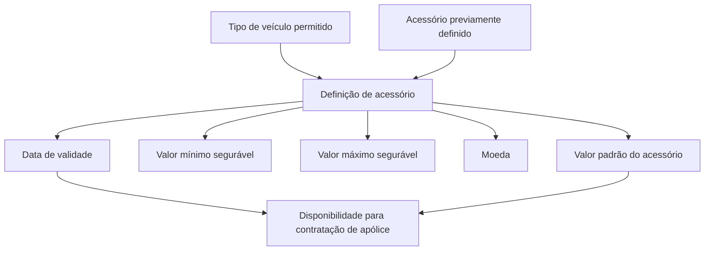
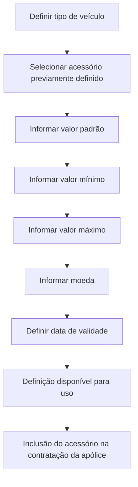

# Definição de Acessório por Tipo de Veículo para Contratação de Apólice

## 1. Metadados do Documento
- **Arquivo de Origem:** Não identificado
- **Tipo de Documento:** Especificação Funcional
- **Domínio / Sistema:** Definição de acessórios por tipo de veículo e contratação de apólice
- **Público-Alvo:** Negócio, Desenvolvedores, Analistas Funcionais
- **Data/Versão Identificada:** Não identificada

---

## 2. Resumo Executivo & Contexto de Negócio

O documento descreve a funcionalidade de definição de acessórios por tipo de veículo. O objetivo é registrar acessórios previamente definidos que podem ser incluídos durante a contratação de uma apólice para tipos de veículos permitidos.

A definição associa um tipo de veículo a um acessório e estabelece o valor padrão pelo qual o acessório será apresentado na contratação da apólice. A funcionalidade também suporta limites mínimo e máximo para o valor segurado do acessório.

Os valores financeiros da definição de acessório são expressos em uma moeda identificada por uma chave de moeda. Dessa forma, o cadastro mantém a referência monetária dos valores padrão, mínimo e máximo do acessório.

A data de validade controla quando uma definição pode ser utilizada. O documento afirma que o uso correto da data de validade permite manter um histórico das alterações realizadas na definição do acessório por tipo de veículo.

---

## 3. Arquitetura, Componentes & Tecnologias Envolvidas

O conteúdo não descreve arquitetura de software, integrações, APIs, microsserviços, tecnologias, URLs de ambiente, protocolos ou contratos técnicos.

Os componentes funcionais identificados são:

| Componente | Descrição |
| :--- | :--- |
| Tipo de veículo | Chave que identifica o tipo de veículo para o qual o acessório está sendo definido. |
| Acessório | Chave do acessório permitido durante a contratação. |
| Valor do acessório | Valor padrão exibido ao incluir o acessório na contratação de uma apólice. |
| Valor mínimo do acessório | Menor valor pelo qual o acessório pode ser segurado. |
| Valor máximo do acessório | Maior valor pelo qual o acessório pode ser segurado. |
| Moeda | Chave da moeda em que os valores do acessório são expressos. |
| Data de validade | Data que determina quando a definição está disponível para utilização. |



> **Nota de Análise:** O documento não detalha banco de dados, interfaces, métodos HTTP, contratos JSON, regras de validação entre valor mínimo e valor máximo, nem o mecanismo técnico de aplicação da data de validade.

---

## 4. Regras de Negócio, Especificações Funcionais & Processos

1. A definição de acessório deve ser registrada para tipos de veículos permitidos.
2. O acessório associado à definição deve ter sido definido previamente.
3. Cada definição identifica o tipo de veículo por uma chave de tipo de veículo.
4. Cada definição identifica o acessório permitido por uma chave de acessório.
5. O valor do acessório corresponde ao valor padrão apresentado quando o acessório for incluído durante a contratação de uma apólice.
6. O valor mínimo do acessório registra o menor valor pelo qual o acessório pode ser segurado.
7. O valor máximo do acessório registra o maior valor pelo qual o acessório pode ser segurado.
8. Os valores do acessório são expressos em uma moeda identificada por uma chave de moeda.
9. A data de validade determina quando a definição de acessório estará disponível para utilização.
10. A utilização correta da data de validade permite manter registro histórico das alterações efetuadas na definição.

Fluxo funcional identificado:



---

## 5. Tabelas de Parâmetros, Ambientes e Estruturas de Dados

| Item / Parâmetro | Descrição / Função | Tipo / Valores / Formato | Ambiente / Observações |
| :--- | :--- | :--- | :--- |
| Tipo de veículo | Identifica o tipo de veículo para o qual o acessório está sendo definido. | Chave de identificação. | Aplicável a tipos de veículos permitidos. |
| Acessório | Identifica o acessório permitido na contratação. | Chave de acessório. | O acessório deve ser previamente definido. |
| Valor do acessório | Define o valor padrão exibido quando o acessório é incluído na contratação da apólice. | Valor monetário. | Expresso na moeda informada na definição. |
| Valor mínimo do acessório | Define o menor valor pelo qual o acessório pode ser segurado. | Valor monetário. | Expresso na moeda informada na definição. |
| Valor máximo do acessório | Define o maior valor pelo qual o acessório pode ser segurado. | Valor monetário. | Expresso na moeda informada na definição. |
| Moeda | Identifica a moeda dos valores do acessório. | Chave de moeda. | Aplica-se aos valores padrão, mínimo e máximo. |
| Data de validade | Controla quando a definição estará disponível para utilização. | Data. | Permite manter histórico de alterações na definição. |

> **Nota de Análise:** O documento não informa formato de data, códigos de moeda aceitos, precisão decimal, obrigatoriedade dos campos ou regras de consistência entre os valores mínimo, padrão e máximo.

---

## 6. Bateria de Perguntas & Respostas para RAG (FAQ Sintético)

### P1: Qual é o objetivo da definição de acessório por tipo de veículo?
**R:** O objetivo é registrar, para os tipos de veículos permitidos, acessórios previamente definidos que podem ser incluídos na contratação de uma apólice, além de estabelecer os valores pelos quais esses acessórios podem ser segurados.

### P2: Como o tipo de veículo é identificado na definição de acessório?
**R:** O tipo de veículo é identificado por uma chave que representa o tipo de veículo para o qual o acessório está sendo definido.

### P3: O que representa o campo Acessório?
**R:** O campo Acessório contém a chave do acessório que será permitido durante a contratação da apólice. O documento afirma que os acessórios devem ter sido definidos previamente.

### P4: Qual valor é mostrado quando um acessório é incluído em uma apólice?
**R:** O valor mostrado é o valor padrão do acessório definido no campo “Valor do acessório”, quando esse acessório for incluído durante a contratação de uma apólice.

### P5: Para que servem os valores mínimo e máximo do acessório?
**R:** O valor mínimo registra o menor valor pelo qual o acessório pode ser segurado. O valor máximo contém o maior valor pelo qual o acessório pode ser segurado.

### P6: Como a moeda é aplicada aos valores do acessório?
**R:** A moeda é identificada por uma chave de moeda e determina a moeda na qual os importes dos valores do acessório são expressos.

### P7: Qual é a função da data de validade na definição de acessório?
**R:** A data de validade determina quando a definição de acessório estará disponível para ser utilizada.

### P8: Como a data de validade contribui para o histórico de alterações?
**R:** Segundo o documento, o uso correto da data de validade permite manter um registro histórico das alterações efetuadas na definição de acessórios.

### P9: O documento especifica como validar o valor padrão contra os valores mínimo e máximo?
**R:** Não. O documento descreve as finalidades dos valores padrão, mínimo e máximo, mas não apresenta regras de validação ou relacionamento numérico entre esses campos.

### P10: O documento define APIs, métodos HTTP ou contratos JSON para a funcionalidade?
**R:** Não. O conteúdo apresenta propriedades funcionais da definição de acessório, mas não detalha APIs, métodos HTTP, contratos JSON, persistência ou integrações técnicas.

---

## 7. Glossário de Termos, Siglas & Conceitos-Chave

- **Apólice:** Contratação na qual um acessório pode ser incluído, conforme descrito no documento.
- **Acessório:** Item previamente definido que pode ser permitido na contratação de uma apólice para determinado tipo de veículo.
- **Tipo de veículo:** Categoria identificada por uma chave para a qual a definição de acessório é configurada.
- **Valor do acessório:** Valor padrão apresentado quando o acessório é incluído durante a contratação de uma apólice.
- **Valor mínimo do acessório:** Menor valor pelo qual o acessório pode ser segurado.
- **Valor máximo do acessório:** Maior valor pelo qual o acessório pode ser segurado.
- **Moeda:** Chave que identifica a moeda na qual os valores do acessório são expressos.
- **Data de validade:** Data que define a disponibilidade da definição para uso e viabiliza o histórico de alterações.

---

## 8. Notas Críticas, Riscos & Limitações

- O documento não apresenta uma arquitetura técnica, componentes de infraestrutura, bancos de dados, ambientes, servidores ou mecanismos de integração.
- Não há detalhamento sobre regras de validação entre valor mínimo, valor padrão e valor máximo.
- Não são especificados formatos para data de validade, moeda ou valores monetários.
- O documento não informa se uma mesma combinação de tipo de veículo e acessório pode possuir múltiplas definições simultaneamente.
- Não são apresentados critérios para determinar quais tipos de veículos são permitidos.
- Não há detalhamento adicional associado à seção “Ejemplo”.
- O texto menciona elementos de navegação como “Search”, “Home”, “Solutions”, “Architectures”, “APIs”, “Events”, “Components”, “Cloud”, “Documentation”, “Zeus”, “Reef”, “Help” e “News”, mas não explica sua relação com a definição de acessórios.

---

## 9. Conteúdo Bruto Estruturado (Referência Fiel)

```text
--- [PÁGINA 1 DE 1] ---

DEFINICIÓN de accesorio por tipo de vehículo
Objetivo
Registrar, para los tipos de vehículos permitidos, los accesorios definidos previamente, que pueden incluirse en la contratación de la póliza. Además de
establecer el valor por el que se pueden asegurar dichos accesorios.
Propiedades generales
Propiedades generales
Tipo de vehículo
Clave que identifica el tipo de vehículo para el que se está definiendo el accesorio.
Accesorio
Clave del accesorio que se permitirá en la contratación.
Valor del accesorio
Valor estándar del accesorio que se está definiendo, que será el que se muestre cuando este accesorio se incluya en la contratación de una póliza.
Valor mínimo del accesorio
Registra el valor mínimo por el que se puede asegurar el accesorio que se está definiendo.
Valor máximo del accesorio
Contiene el valor máximo por el que se puede asegurar el accesorio que se está definiendo.
Moneda
Clave de la moneda en la que están expresados los importes de valores del accesorio.
Fecha de validez
Determina cuando la definición estará disponible para ser utilizada. Su correcto uso permite tener un registro histórico de los cambios efectuados en la
definición.
Ejemplo:
Ejemplo:
Ejemplo:
Ejemplo:
 / 
 CF
Search Home Solutions Architectures APIs Events Components Cloud Documentation Zeus Reef Help News
EN
```
