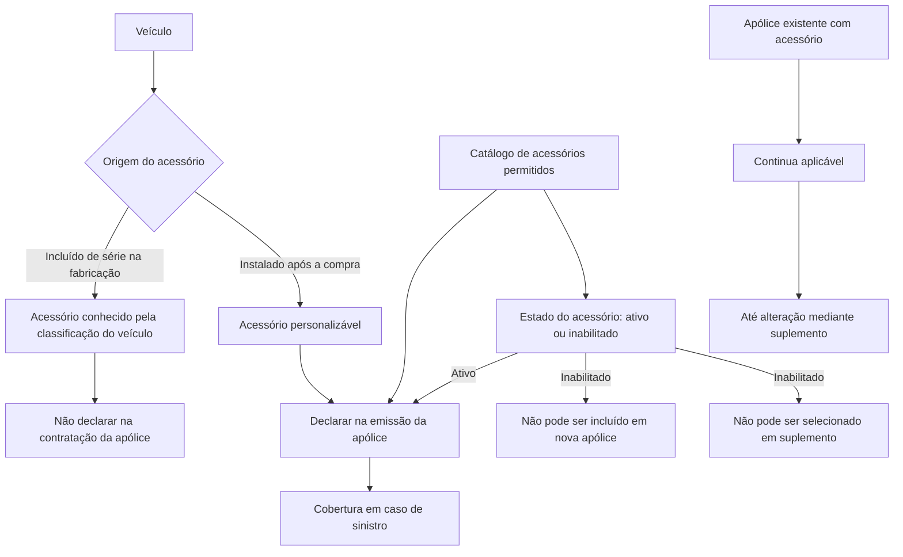

# Definição e Catalogação de Acessórios para Apólices de Veículos

## 1. Metadados do Documento
- **Arquivo de Origem:** `Não identificado`
- **Tipo de Documento:** `Especificação Funcional`
- **Domínio / Sistema:** `Acessórios de veículos e emissão de apólices`
- **Público-Alvo:** `Negócio, analistas funcionais, desenvolvedores e operação`
- **Data/Versão Identificada:** `Não identificada`

---

## 2. Resumo Executivo & Contexto de Negócio

O documento define acessórios como elementos adicionais incorporados a veículos para melhorar funcionalidade, conforto, segurança, desempenho ou aparência. A definição abrange tanto acessórios de fábrica quanto acessórios instalados após a aquisição do veículo.

Acessórios incluídos de série durante a fabricação do veículo não precisam ser declarados na contratação de uma apólice. Segundo o documento, esses acessórios já são conhecidos previamente por meio da classificação do veículo.

Acessórios instalados posteriormente à compra permitem a personalização do veículo conforme as preferências de cada usuário. Esses acessórios precisam ser declarados durante a emissão da apólice para que tenham cobertura em caso de sinistro.

Antes da emissão de uma apólice, é necessário catalogar os acessórios permitidos. O catálogo contém propriedades de identificação, classificação, agrupamento, descrições e estado de habilitação do acessório.

A inabilitação de um acessório impede sua seleção em novas apólices e em suplementos futuros. Entretanto, a inabilitação não remove automaticamente o acessório de apólices já existentes: a cobertura continua aplicável até que um suplemento modifique a apólice.

---

## 3. Arquitetura, Componentes & Tecnologias Envolvidas

O conteúdo descreve um processo funcional de catalogação e seleção de acessórios no contexto de emissão de apólices de veículos. Não há detalhamento técnico sobre sistemas, APIs, microsserviços, métodos HTTP, bancos de dados, contratos JSON, ambientes ou tecnologias de implementação.

Os componentes conceituais identificados são:

| Componente / Conceito | Papel identificado no documento |
| :--- | :--- |
| Veículo | Objeto ao qual acessórios podem ser associados. |
| Acessório de fábrica | Acessório incluído na fabricação e conhecido pela classificação do veículo. |
| Acessório pós-compra | Acessório instalado depois da compra e que deve ser declarado na emissão da apólice. |
| Catálogo de acessórios | Estrutura que contém os acessórios permitidos antes da emissão da apólice. |
| Emissão de apólice | Momento no qual acessórios pós-compra devem ser declarados para cobertura em sinistro. |
| Apólice | Contrato que pode conter acessórios declarados e cobertos. |
| Suplemento | Mecanismo citado para alterar uma apólice existente. |
| Estado de inabilitação | Condição que impede a inclusão do acessório em nova apólice ou em suplemento posterior. |



> **Nota de Análise:** O texto extraído menciona “CF”, “Home Solutions APIs Documentation” e “Zeus”, mas não fornece contexto suficiente para definir se esses termos correspondem a sistemas, navegação, ferramentas, módulos ou metadados de extração. Portanto, não é possível atribuir uma função técnica a esses termos com segurança.

---

## 4. Regras de Negócio, Especificações Funcionais & Processos

### 4.1 Definição funcional de acessório

Um acessório é um elemento adicional agregado a um veículo com uma ou mais das seguintes finalidades:

- Melhorar a funcionalidade do veículo.
- Melhorar o conforto do veículo.
- Melhorar a segurança do veículo.
- Melhorar o desempenho do veículo.
- Melhorar a aparência do veículo.

### 4.2 Classificação por momento de instalação

O documento diferencia dois grupos funcionais de acessórios:

1. **Acessórios incluídos de série na fabricação**
   - São incluídos durante a fabricação do veículo.
   - Não devem ser declarados na contratação de uma apólice.
   - São conhecidos antecipadamente por meio da classificação do veículo.

2. **Acessórios instalados após a compra**
   - Podem ser instalados após a compra do veículo.
   - Permitem personalização conforme as preferências de cada usuário.
   - Devem ser declarados no momento da emissão da apólice.
   - A declaração é necessária para que exista cobertura em caso de sinistro.

### 4.3 Regra de catalogação prévia

Antes da emissão de uma apólice, devem ser catalogados os acessórios que serão permitidos. O documento não informa critérios adicionais para aprovação, exclusão ou classificação de acessórios no catálogo.

### 4.4 Propriedades gerais do acessório

Cada acessório possui as seguintes propriedades funcionais:

- **Acessório:** chave usada para identificar o acessório.
- **Tipo de acessório:** chave da tipologia na qual o acessório é classificado.
- **Agrupamento do acessório:** chave do grupo no qual o acessório está localizado.
- **Descrição do acessório:** nome que identifica o acessório.
- **Descrição curta:** abreviação do nome do acessório.
- **Inabilitado:** indicador que determina se o acessório está ativo ou se não pode mais ser incluído em uma nova apólice.

### 4.5 Regra de inabilitação de acessórios

Quando um acessório é inabilitado:

1. O acessório deixa de poder ser incluído em uma nova apólice.
2. Apólices existentes que já possuam o acessório continuam com a aplicação do acessório.
3. A manutenção do acessório em apólices existentes persiste até que ocorra uma alteração por suplemento.
4. Quando um suplemento altera a apólice e o acessório está inabilitado, o acessório não poderá ser selecionado novamente.

> **Nota de Análise:** O documento não detalha o formato do indicador “Inabilitado”, como valores booleanos, códigos de estado, datas de vigência ou responsáveis pela inabilitação.

---

## 5. Tabelas de Parâmetros, Ambientes e Estruturas de Dados

| Item / Parâmetro | Descrição / Função | Tipo / Valores / Formato | Ambiente / Observações |
| :--- | :--- | :--- | :--- |
| Acessório | Chave utilizada para identificar o acessório. | Chave; formato não detalhado. | Propriedade geral do acessório. |
| Tipo de acessório | Chave da tipologia em que o acessório é classificado. | Chave; valores não detalhados. | Propriedade geral do acessório. |
| Agrupamento do acessório | Chave do grupo em que o acessório se encontra. | Chave; valores não detalhados. | Propriedade geral do acessório. |
| Descrição do acessório | Nome que identifica o acessório. | Texto; formato não detalhado. | Propriedade geral do acessório. |
| Descrição curta | Abreviação do nome do acessório. | Texto; formato não detalhado. | Propriedade geral do acessório. |
| Inabilitado | Define se o acessório está ativo ou se não pode ser incluído em nova apólice. | Estado; representação técnica não detalhada. | Não remove automaticamente o acessório de apólices existentes. |
| Acessório de série | Acessório incluído na fabricação do veículo. | Classificação funcional. | Não precisa ser declarado na contratação da apólice. |
| Acessório pós-compra | Acessório instalado depois da compra do veículo. | Classificação funcional. | Deve ser declarado na emissão para cobertura em sinistro. |
| Suplemento | Alteração aplicada a uma apólice existente. | Processo / operação; formato não detalhado. | Após alteração, acessório inabilitado não pode ser selecionado. |

---

## 6. Bateria de Perguntas & Respostas para RAG (FAQ Sintético)

### P1: O que é considerado um acessório de veículo neste documento?
**R:** Um acessório é um elemento adicional agregado a um veículo para melhorar funcionalidade, conforto, segurança, desempenho ou aparência.

### P2: Acessórios instalados de fábrica precisam ser declarados na contratação da apólice?
**R:** Não. Acessórios incluídos de série durante a fabricação não precisam ser declarados na contratação da apólice, pois são conhecidos antecipadamente pela classificação do veículo.

### P3: Quando um acessório instalado após a compra do veículo deve ser declarado?
**R:** Um acessório instalado após a compra do veículo deve ser declarado no momento da emissão da apólice para que esteja coberto em caso de sinistro.

### P4: Qual é a consequência de não declarar um acessório pós-compra na emissão da apólice?
**R:** O documento estabelece que acessórios instalados após a compra devem ser declarados na emissão para serem cobertos em caso de sinistro. O texto não detalha regras adicionais para acessórios não declarados.

### P5: O que deve acontecer antes da emissão de uma apólice em relação aos acessórios?
**R:** Antes da emissão da apólice, os acessórios que serão permitidos devem ser catalogados.

### P6: Quais informações identificam um acessório no catálogo?
**R:** O catálogo prevê chave do acessório, chave do tipo de acessório, chave do agrupamento, descrição do acessório, descrição curta e indicação de inabilitação.

### P7: O que significa o campo “Tipo de acessório”?
**R:** “Tipo de acessório” é a chave da tipologia na qual o acessório está classificado. O documento não apresenta as tipologias disponíveis nem o formato da chave.

### P8: O que significa o campo “Agrupamento do acessório”?
**R:** “Agrupamento do acessório” é a chave do grupo em que o acessório se encontra. O documento não especifica os grupos existentes ou regras de associação.

### P9: O que acontece quando um acessório é inabilitado?
**R:** Um acessório inabilitado não pode ser incluído em uma nova apólice. A inabilitação também impede a seleção posterior do acessório quando uma apólice for alterada por suplemento.

### P10: A inabilitação remove um acessório de apólices existentes?
**R:** Não. Mesmo inabilitado, o acessório continua aplicável nas apólices que já o possuem, até que uma alteração seja realizada mediante suplemento.

### P11: O que ocorre se uma apólice com acessório inabilitado for modificada por suplemento?
**R:** No momento da alteração por suplemento, o acessório inabilitado não poderá ser selecionado novamente.

### P12: O documento define APIs, métodos HTTP ou contratos JSON para gerenciamento de acessórios?
**R:** Não. O documento extraído não detalha APIs, métodos HTTP, contratos JSON, persistência de dados, autenticação ou integrações técnicas para o gerenciamento de acessórios.

---

## 7. Glossário de Termos, Siglas & Conceitos-Chave

- **Acessório:** Elemento adicional agregado a um veículo para melhorar funcionalidade, conforto, segurança, desempenho ou aparência.
- **Acessório de série:** Acessório incluído durante a fabricação do veículo e conhecido pela classificação do veículo.
- **Acessório pós-compra:** Acessório instalado após a compra do veículo e que precisa ser declarado na emissão da apólice para cobertura em sinistro.
- **Agrupamento do acessório:** Grupo no qual o acessório se encontra, identificado por uma chave.
- **Apólice:** Contrato de seguro no qual acessórios podem ser declarados.
- **Cobertura em sinistro:** Cobertura aplicável a um acessório declarado no momento da emissão da apólice.
- **Descrição curta:** Abreviação do nome que identifica o acessório.
- **Emissão da apólice:** Momento no qual acessórios pós-compra devem ser declarados.
- **Inabilitado:** Estado que impede o acessório de ser incluído em novas apólices ou selecionado após alteração por suplemento.
- **Suplemento:** Alteração de uma apólice existente; após essa alteração, um acessório inabilitado não pode ser selecionado.
- **Tipologia:** Classificação funcional associada ao tipo de acessório.
- **CF:** Termo presente no texto bruto sem definição contextual.
- **Zeus:** Termo presente no texto bruto sem definição contextual.

---

## 8. Notas Críticas, Riscos & Limitações

- O documento não identifica o arquivo de origem, autor, data, versão, organização responsável ou domínio corporativo específico.
- O documento não especifica o formato técnico das chaves de acessório, tipo de acessório ou agrupamento do acessório.
- O documento não define valores aceitos pelo indicador de inabilitação, como `true/false`, códigos de estado ou datas de vigência.
- O documento não apresenta critérios para catalogar, aprovar ou rejeitar acessórios permitidos antes da emissão da apólice.
- O documento não detalha o processo operacional de emissão, alteração por suplemento ou validação de acessórios.
- Não há especificação de APIs, contratos JSON, modelos de dados, integrações, ambientes, URLs, logs ou tecnologias de implementação.
- O trecho “Ejemplo:” é seguido por um bloco de código aberto sem conteúdo extraído. Portanto, não é possível recuperar o exemplo mencionado.
- Os termos “CF”, “Home Solutions APIs Documentation” e “Zeus” aparecem no conteúdo bruto, mas não possuem explicação suficiente para serem interpretados de forma confiável.

---

## 9. Conteúdo Bruto Estruturado (Referência Fiel)

```text
--- [PÁGINA 1 DE 2] ---

DEFINICIÓN de accesorios
Objetivo
Son elementos adicionales que se agregan a un vehículo para mejorar su funcionalidad, comodidad,
seguridad, rendimiento o apariencia.
Existen accesorios que se incluyen de serie desde la fabricación del vehículo, este tipo de accesorios
no se declaran al contratar una póliza, ya que se conocen de antemano por la clasificación del
vehículo.
Pero también hay accesorios que pueden ser instalados después de la compra del vehículo y
personalizarse según las preferencias de cada usuario. Estos accesorios se deben declarar en la
emisión de la póliza para que estén cubiertos en caso de siniestro.
Previo a la emisión de la póliza se deben catalogar los accesorios que se van a permitir.
Propiedades generales
Propiedades generales
Accesorio
Clave con la que se identifica el accesorio.
Tipo de accesorio
Clave de la tipología en la que se clasifica el accesorio.
 / 
 CF
Home Solutions APIs Documentation Zeus
EN


--- [PÁGINA 2 DE 2] ---

Agrupamiento del accesorio
Clave del grupo en el que se encuentra el accesorio.
Descripción del accesorio
Nombre que identifica el accesorio.
Descripción corta
Abreviatura del nombre del accesorio.
Inhabilitado
En este punto se determina si está activo o por el contrario ya no puede ser incluido en una nueva
póliza. Es importante destacar que, aunque se inhabilite, todas las pólizas que dispongan de ello,
seguirá aplicándose hasta que mediante un suplemento se cambie. En ese momento, al estar
inhabilitado ya no será posible seleccionarlo.
Ejemplo:
```
