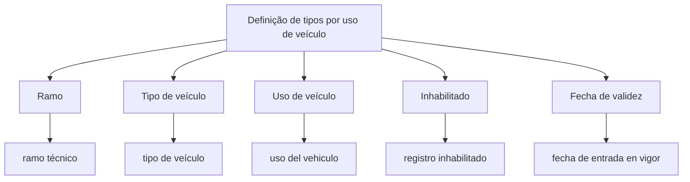

# Definição de Tipos por Uso de Veículo — Documento em Construção

## 1. Metadados do Documento
- **Arquivo de Origem:** `Não identificado`
- **Tipo de Documento:** `Apresentação Executiva`
- **Domínio / Sistema:** Definição de tipos por uso de veículo
- **Público-Alvo:** Não identificado
- **Data/Versão Identificada:** Não identificada

---

## 2. Resumo Executivo & Contexto de Negócio

O documento apresenta, em estado indicado como **“EN CONSTRUCCIÓN”**, o tema de definição de tipos por uso de veículo. O conteúdo disponível associa propriedades de definição a campos de classificação e controle de vigência.

As propriedades explicitamente citadas são **Ramo**, **Tipo de veículo**, **Uso de veículo**, **Inhabilitado** e **Fecha de validez**. Cada propriedade possui uma descrição curta, respectivamente: ramo técnico, tipo de veículo, uso do veículo, registro inabilitado e data de entrada em vigor.

O documento também contém a referência textual **“Home Solutions APIs Documentation Zeus”**. Entretanto, o conteúdo extraído não detalha a relação entre essa referência e a definição de tipos por uso de veículo.

Não há especificação de regras de cálculo, contratos de API, métodos HTTP, campos obrigatórios, valores permitidos, integrações, ambientes ou responsabilidades operacionais.

---

## 3. Arquitetura, Componentes & Tecnologias Envolvidas

O material não descreve uma arquitetura de software, componentes técnicos, microsserviços, bancos de dados ou tecnologias. O fluxo abaixo representa apenas a relação conceitual entre o tema principal e as propriedades listadas.



**Nota de Análise:** O documento menciona “Home Solutions APIs Documentation Zeus”, mas não detalha APIs, endpoints, métodos HTTP, autenticação, contratos JSON, integrações ou responsabilidades desse elemento.

---

## 4. Regras de Negócio, Especificações Funcionais & Processos

O documento disponível apresenta apenas as propriedades associadas à definição de tipos por uso de veículo:

1. **Ramo**
   - Descrito como **“ramo técnico”**.
   - Não há detalhamento sobre valores válidos, obrigatoriedade ou relação com outros campos.

2. **Tipo de veículo**
   - Descrito como **“tipo de veículo”**.
   - Não há catálogo de tipos, regras de classificação ou critérios de validação.

3. **Uso de veículo**
   - Descrito como **“uso del vehiculo”**.
   - Não há lista de usos permitidos, regras de elegibilidade ou efeitos operacionais associados.

4. **Inhabilitado**
   - Descrito como **“registro inhabilitado”**.
   - O documento não esclarece se o atributo é booleano, quais condições inabilitam um registro ou quais operações são bloqueadas.

5. **Fecha de validez**
   - Descrita como **“fecha de entrada en vigor”**.
   - O documento indica relação com a entrada em vigor, mas não define formato, timezone, data final de vigência ou comportamento para registros expirados.

**Nota de Análise:** Não foram identificados fluxos operacionais detalhados, validações condicionais, precedências de regras ou critérios de exceção.

---

## 5. Tabelas de Parâmetros, Ambientes e Estruturas de Dados

| Item / Parâmetro | Descrição / Função | Tipo / Valores / Formato | Ambiente / Observações |
| :--- | :--- | :--- | :--- |
| Ramo | Ramo técnico | Não informado | Propriedade de definição |
| Tipo de veículo | Classificação do tipo de veículo | Não informado | Propriedade de definição |
| Uso de veículo | Uso do veículo | Não informado | O texto original usa “uso del vehiculo” |
| Inhabilitado | Indica registro inabilitado | Não informado | O texto original usa “registro inhabilitado” |
| Fecha de validez | Data de entrada em vigor | Não informado | O texto original usa “fecha de entrada en vigor” |
| Home Solutions APIs Documentation Zeus | Referência textual presente no documento | Não informado | Relação com os demais itens não detalhada |

---

## 6. Bateria de Perguntas & Respostas para RAG (FAQ Sintético)

### P1: Qual é o objetivo principal do documento?
**R:** O documento trata da definição de tipos por uso de veículo. O conteúdo extraído não apresenta uma declaração de objetivo mais detalhada além do título e das propriedades associadas.

### P2: Quais propriedades são apresentadas para a definição de tipos por uso de veículo?
**R:** As propriedades apresentadas são Ramo, Tipo de veículo, Uso de veículo, Inhabilitado e Fecha de validez.

### P3: O que significa a propriedade “Ramo” no documento?
**R:** A propriedade “Ramo” é descrita literalmente como “ramo técnico”. O documento não fornece valores possíveis, critérios de seleção ou regras adicionais.

### P4: Qual informação é representada por “Tipo de veículo”?
**R:** “Tipo de veículo” é uma propriedade da definição de tipos por uso de veículo. O conteúdo não detalha categorias, códigos ou regras de classificação para tipos de veículo.

### P5: O documento informa quais usos de veículo são aceitos?
**R:** Não. O documento lista a propriedade “Uso de veículo”, descrita como “uso del vehiculo”, mas não apresenta uma lista de usos aceitos ou restrições associadas.

### P6: Como o atributo “Inhabilitado” deve ser interpretado?
**R:** O atributo “Inhabilitado” é descrito como “registro inhabilitado”. O documento não especifica o tipo do campo, as condições de inabilitação ou o impacto da inabilitação nas operações.

### P7: O que representa “Fecha de validez”?
**R:** “Fecha de validez” é descrita como “fecha de entrada en vigor”, indicando uma data relacionada ao início de vigência. O formato da data e as regras de validade não são informados.

### P8: O documento especifica APIs ou endpoints para a definição de tipos por uso de veículo?
**R:** Não. Embora o texto contenha a referência “Home Solutions APIs Documentation Zeus”, não há endpoints, URLs, métodos HTTP, payloads, autenticação ou contratos de integração detalhados.

### P9: O documento identifica ambientes técnicos, servidores ou rotas de log?
**R:** Não. Não foram identificados ambientes, servidores, URLs, portas, rotas de log ou parâmetros de infraestrutura no conteúdo extraído.

### P10: O material está finalizado?
**R:** Não há confirmação formal de status de aprovação ou publicação. Contudo, o texto contém a expressão “EN CONSTRUCCIÓN”, indicando que o material ou a funcionalidade é apresentado como estando em construção.

---

## 7. Glossário de Termos, Siglas & Conceitos-Chave

- **Ramo:** Propriedade descrita como “ramo técnico”.
- **Tipo de veículo:** Propriedade destinada à classificação do tipo de veículo; sem detalhamento adicional.
- **Uso de veículo:** Propriedade destinada a representar o uso do veículo.
- **Inhabilitado:** Propriedade descrita como “registro inhabilitado”.
- **Fecha de validez:** Propriedade descrita como “fecha de entrada en vigor”.
- **Home Solutions APIs Documentation Zeus:** Referência textual presente no documento; significado e integração não detalhados.

---

## 8. Notas Críticas, Riscos & Limitações

- O documento está sinalizado com a expressão **“EN CONSTRUCCIÓN”**.
- Não foram identificados valores permitidos, tipos de dados, obrigatoriedade ou validações para as propriedades listadas.
- Não há detalhamento de fluxos de negócio, critérios de inabilitação ou gestão de vigência.
- A referência a **“Home Solutions APIs Documentation Zeus”** não possui contexto técnico suficiente para estabelecer dependências ou integrações.
- A segunda página não contém conteúdo textual adicional além de elementos visuais ou imagem.
- Não foram identificadas informações sobre versões, datas, autores, ambientes, segurança, observabilidade ou suporte operacional.

---

## 9. Conteúdo Bruto Estruturado (Referência Fiel)

```text
--- [PÁGINA 1 DE 2] ---

Imagen LOGO
EN CONSTRUCCIÓN
DEFINICIÓN de tipos por uso de vehículo
Objetivo
Propiedades de definición
Propiedades de definición
Ramo
ramo técnico
Tipo de vehículo
tipo de vehículo
Uso de vehículo
uso del vehiculo
Inhabilitado
registro inhabilitado
Fecha de validez
fecha de entrada en vigor
 /
 CF
Home Solutions APIs Documentation Zeus
EN


--- [PÁGINA 2 DE 2] ---

[Página em branco ou apenas elementos visuais/imagem]
```
