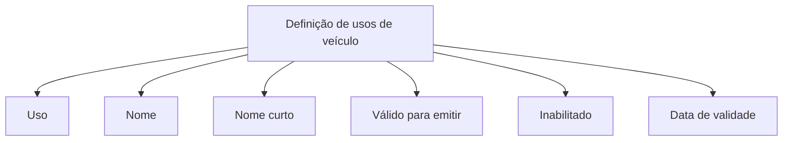

# Definição de Usos de Veículo — Documento em Construção

## 1. Metadados do Documento
- **Arquivo de Origem:** `Não informado`
- **Tipo de Documento:** `Não identificado; conteúdo indica documentação de definição funcional`
- **Domínio / Sistema:** `Definição de usos de veículo; Home Solutions APIs Documentation Zeus`
- **Público-Alvo:** `Não identificado`
- **Data/Versão Identificada:** `Não identificada`

---

## 2. Resumo Executivo & Contexto de Negócio

O conteúdo descreve uma definição de usos de veículo, identificada como “DEFINICIÓN de usos de vehículo”. O material está marcado como “EN CONSTRUCCIÓN”, indicando que a documentação não está concluída.

A definição de uso de veículo apresenta propriedades para identificar e caracterizar cada uso. As propriedades explicitamente listadas são: uso, nome, nome curto, válido para emitir, inabilitado e data de validade.

O documento associa o campo “Uso” ao uso do veículo, “Nombre” à denominação do uso do veículo e “Nombre corto” à abreviação do uso do veículo. O campo “Válido para emitir” é relacionado à utilização em emissão, enquanto “Inhabilitado” identifica um registro inabilitado.

O texto também cita “CF” e “Home Solutions APIs Documentation Zeus”, mas não detalha o significado da sigla CF, a integração entre esses elementos, métodos de API, contratos JSON, URLs, ambientes ou responsabilidades operacionais.

---

## 3. Arquitetura, Componentes & Tecnologias Envolvidas

Os únicos elementos técnicos ou sistêmicos identificados são:

| Componente / Termo | Descrição sustentada pelo conteúdo |
| :--- | :--- |
| Definição de usos de veículo | Tema principal do documento; organiza propriedades de um uso de veículo. |
| CF | Termo citado sem detalhamento. |
| Home Solutions APIs Documentation Zeus | Texto citado no conteúdo, sem descrição de função, integração ou tecnologia. |



**Nota de Análise:** o conteúdo não descreve arquitetura de software, integrações, microsserviços, protocolos, APIs, bancos de dados ou fluxos entre sistemas. O diagrama representa somente a organização conceitual das propriedades listadas.

---

## 4. Regras de Negócio, Especificações Funcionais & Processos

1. A documentação trata da definição de usos de veículo.
2. Cada definição de uso de veículo possui uma propriedade denominada **Uso**, associada ao “uso del vehiculo”.
3. Cada definição de uso de veículo possui uma propriedade denominada **Nombre**, associada à “denominación del uso del vehiculo”.
4. Cada definição de uso de veículo possui uma propriedade denominada **Nombre corto**, associada à “abreviatura del uso del vehículo”.
5. A propriedade **Válido para emitir** está associada à “utilización en emision”.
6. A propriedade **Inhabilitado** representa um “registro inhabilitado”.
7. A propriedade **Fecha de validez** corresponde à “fecha de entrada en vigor”.
8. O documento não informa tipos de dados, obrigatoriedade, valores permitidos, critérios de emissão, regras de inabilitação, datas de término de vigência ou fluxo operacional de manutenção dos usos de veículo.

---

## 5. Tabelas de Parâmetros, Ambientes e Estruturas de Dados

| Item / Parâmetro | Descrição / Função | Tipo / Valores / Formato | Ambiente / Observações |
| :--- | :--- | :--- | :--- |
| Uso | Uso do veículo. | Não informado. | Propriedade da definição de usos de veículo. |
| Nombre | Denominação do uso do veículo. | Não informado. | Termo apresentado em espanhol. |
| Nombre corto | Abreviação do uso do veículo. | Não informado. | Termo apresentado em espanhol. |
| Válido para emitir | Utilização em emissão. | Não informado. | O documento não define as condições de validade. |
| Inhabilitado | Indica registro inabilitado. | Não informado. | O documento não informa comportamento ou efeitos da inabilitação. |
| Fecha de validez | Data de entrada em vigor. | Não informado. | O documento não informa formato nem data de término. |
| CF | Termo citado. | Não informado. | Sem definição no conteúdo. |
| Home Solutions APIs Documentation Zeus | Texto citado. | Não informado. | Sem detalhamento de produto, API ou ambiente. |

---

## 6. Bateria de Perguntas & Respostas para RAG (FAQ Sintético)

### P1: Qual é o objetivo do documento sobre definição de usos de veículo?
**R:** O documento apresenta propriedades usadas para definir usos de veículo, incluindo uso, nome, nome curto, validade para emissão, inabilitação e data de validade.

### P2: O que representa a propriedade “Uso” na definição de usos de veículo?
**R:** A propriedade “Uso” representa o uso do veículo, conforme descrito pelo texto “uso del vehiculo”.

### P3: Qual é a finalidade do campo “Nombre”?
**R:** O campo “Nombre” representa a denominação do uso do veículo, conforme indicado pela expressão “denominación del uso del vehiculo”.

### P4: Para que serve o campo “Nombre corto”?
**R:** O campo “Nombre corto” representa a abreviação do uso do veículo, conforme a descrição “abreviatura del uso del vehículo”.

### P5: O que significa “Válido para emitir”?
**R:** O documento associa “Válido para emitir” à “utilización en emision”. Entretanto, o conteúdo não especifica regras, critérios ou valores que determinem quando um uso de veículo é válido para emissão.

### P6: O que significa um registro “Inhabilitado”?
**R:** “Inhabilitado” identifica um registro inabilitado. O documento não detalha as consequências funcionais, operacionais ou técnicas dessa condição.

### P7: O que representa a “Fecha de validez”?
**R:** A “Fecha de validez” representa a data de entrada em vigor de uma definição de uso de veículo.

### P8: O documento informa o formato da data de validade?
**R:** Não. O documento somente informa que a “Fecha de validez” corresponde à data de entrada em vigor, sem definir formato, precisão, fuso horário ou data de término da vigência.

### P9: Há detalhes sobre APIs ou contratos de integração no documento?
**R:** Não. Embora o texto cite “Home Solutions APIs Documentation Zeus”, não há detalhamento de endpoints, métodos HTTP, contratos JSON, autenticação, URLs ou ambientes.

### P10: O que significa a sigla CF no documento?
**R:** O termo “CF” é citado no conteúdo, mas não recebe definição ou contexto adicional.

### P11: O documento está finalizado?
**R:** Não. O conteúdo contém a indicação “EN CONSTRUCCIÓN”, sinalizando que o material está em construção.

### P12: Quais propriedades da definição de uso de veículo são explicitamente citadas?
**R:** As propriedades citadas são: Uso, Nombre, Nombre corto, Válido para emitir, Inhabilitado e Fecha de validez.

---

## 7. Glossário de Termos, Siglas & Conceitos-Chave

- **CF:** Termo citado no documento sem significado definido.
- **Fecha de validez:** Data de entrada em vigor.
- **Inhabilitado:** Registro inabilitado.
- **Nombre:** Denominação do uso do veículo.
- **Nombre corto:** Abreviação do uso do veículo.
- **Uso:** Uso do veículo.
- **Válido para emitir:** Utilização em emissão.
- **Home Solutions APIs Documentation Zeus:** Texto citado sem descrição funcional ou técnica.

---

## 8. Notas Críticas, Riscos & Limitações

- O documento está explicitamente identificado como “EN CONSTRUCCIÓN”.
- Não há arquivo de origem, autor, versão, data ou público-alvo identificados.
- Não são informados tipos de dados, obrigatoriedade, valores válidos ou validações para as propriedades.
- Não há regras detalhadas para determinar a validade para emissão.
- Não há descrição do processo para inabilitar ou reabilitar registros.
- Não são fornecidos contratos de API, métodos HTTP, URLs, ambientes, tecnologias ou fluxos de integração.
- A sigla “CF” não é definida.
- “Home Solutions APIs Documentation Zeus” é citado sem contexto adicional.

---

## 9. Conteúdo Bruto Estruturado (Referência Fiel)

```text
--- [PÁGINA 1 DE 2] ---

Imagen LOGO
EN CONSTRUCCIÓN
DEFINICIÓN de usos de vehículo
Objetivo
Propiedades de definición
Propiedades de definición
Uso
uso del vehiculo
Nombre
denominación del uso del vehiculo
Nombre corto
abreviatura del uso del vehículo
Válido para emitir
utilización en emision
Inhabilitado
registro inhabilitado
 /
 CF
Home Solutions APIs Documentation Zeus
EN


--- [PÁGINA 2 DE 2] ---

Fecha de validez
fecha de entrada en vigor
```
